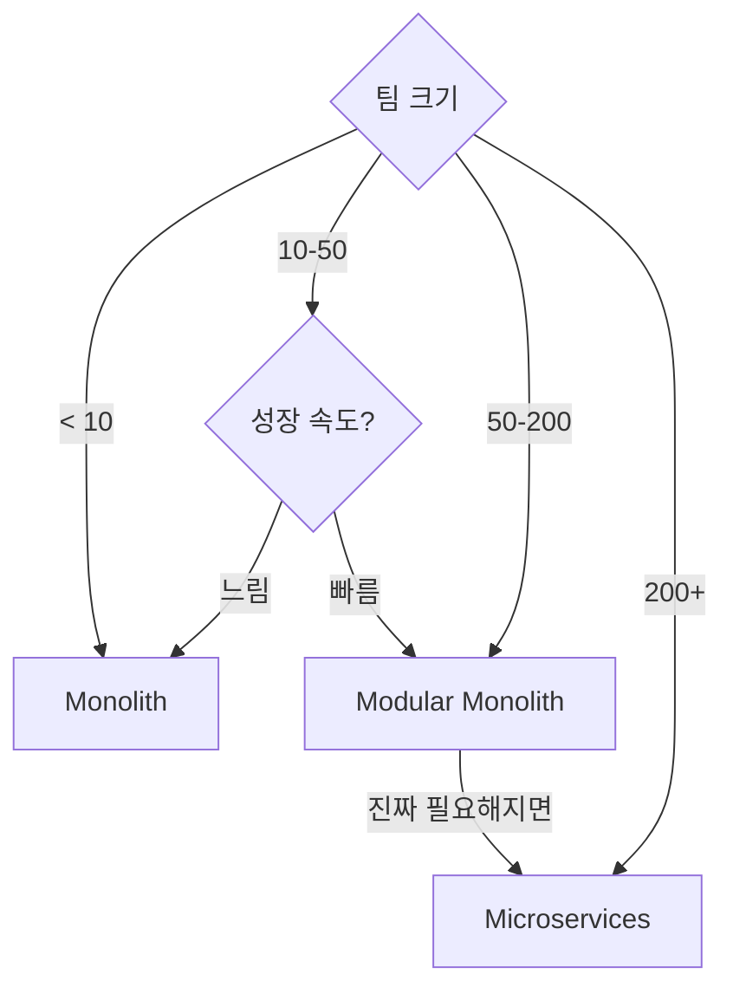
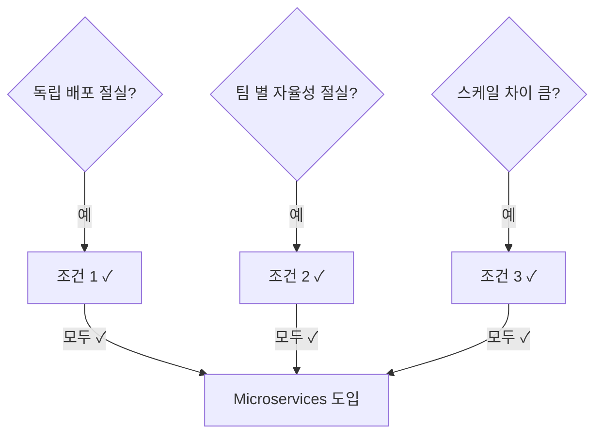
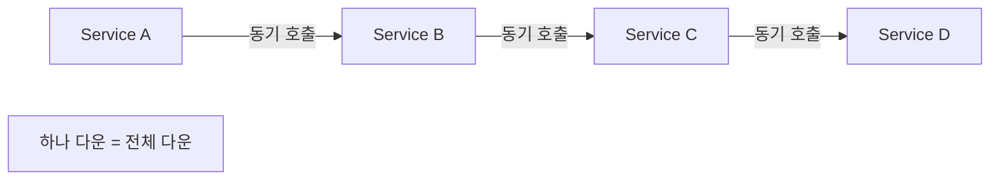
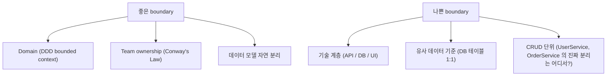
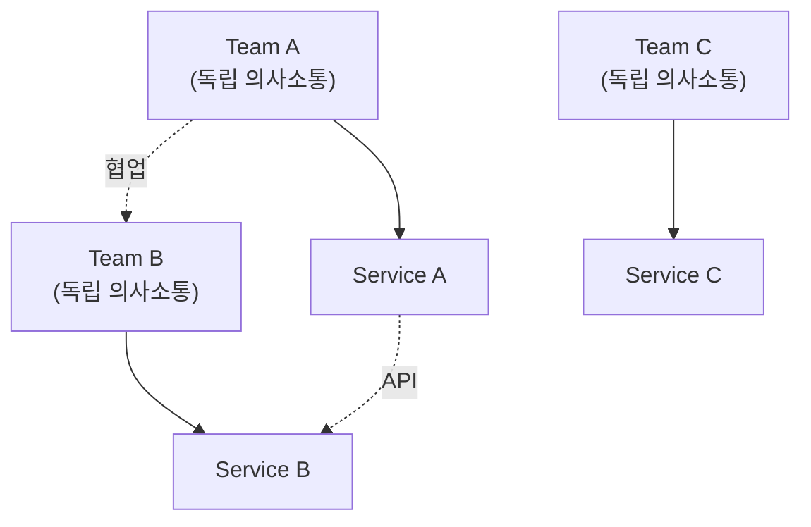
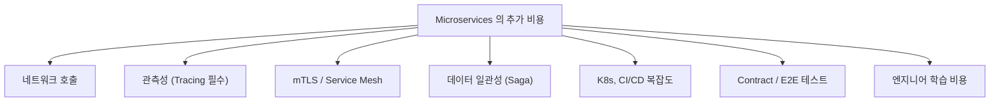
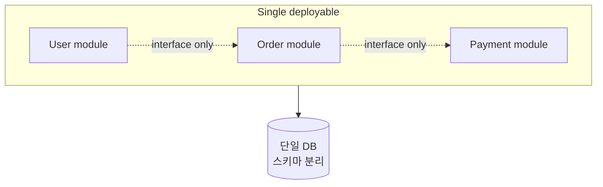

## 정의

| | Monolith | Modular Monolith | Microservices |
|---|---|---|---|
| 배포 단위 | 1개 | 1개 (모듈 명확) | N개 |
| 데이터 | 단일 DB | 단일 DB (스키마 분리) | DB per service |
| 통신 | 함수 호출 | 함수 호출 | 네트워크 (HTTP/gRPC) |
| 운영 복잡도 | *낮음* | 낮음 | *높음* |
| 스케일링 | 전체 함께 | 전체 함께 | service 별 독립 |
| 장애 격리 | 약함 | 약함 | 강함 (이상적) |
| 적합 팀 | < 30 | < 100 | 100+ |

## 결정 트리

## 시작은 Monolith (Fowler 의 "Monolith First")

> [!IMPORTANT]
> *대부분의 새 프로젝트는 monolith 로 시작* 이 정답. *마이크로서비스로 시작* 한 팀이 *2년 후 distributed monolith* 가 되는 사례가 *압도적*.

## Microservices 가 *진짜* 도움될 때

## Distributed Monolith (안티 패턴)

증상:

- 여러 service 가 *함께 배포* 되어야 함 (calling contract 변경 시)
- 한 service 다운 = *전체 다운*
- *분산의 비용 + monolith 의 결합* 동시
- *코드 변경 영향이 service 경계 넘김*

> [!CAUTION]
> **마이크로서비스의 최악의 결과**. *monolith 보다 모든 면에서 나쁨*.

## Service Boundary 가르는 기준

## Conway's Law

> *"시스템 구조는 그것을 만든 조직의 의사소통 구조를 닮는다"*

> *팀 경계와 service 경계의 일치* 가 *Conway's Law 의 실용적 활용*. 한 service 가 *두 팀에 걸치면* 운영 사고.

## Inverse Conway Maneuver

*반대로 service 구조부터 정해 → 팀 구조 맞추기*. *큰 조직 재편* 에서 사용.

## 분리 비용 카탈로그

## 모듈 모놀리스 (Modular Monolith)

- *모듈 간 직접 호출 금지*. *interface만*.
- 같은 DB, *다른 스키마*.
- *나중에 service 분리 쉬움*.
- **대부분의 회사가 결국 여기서 멈춤** (충분).

## 흔한 함정

> [!WARNING]
> 1. **너무 일찍 분리** = 도메인 잘못 잡고 *분리 후 재경계*. 가장 큰 후회.
> 2. **DB 공유** = "Service 단위 분리" 가 *DB 결합* 으로 *무의미*. 각 service 자기 DB.
> 3. **분산 트랜잭션 (2PC)** = 마이크로서비스의 *영혼*. Saga 패턴으로 대체.
> 4. **shared library 의 *영원한 결합*** = service A 가 라이브러리 v2 로 못 올라가면 *모든 service* 정체.

## 관련 위키

- [[api-gateway]]
- [[saga-pattern]]
- [[cqrs]], [[event-sourcing]]
- [[Service Mesh]]
- [[distributed-systems-distributed-transaction]]
