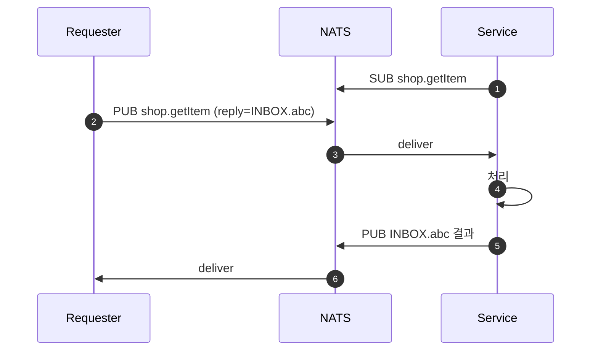
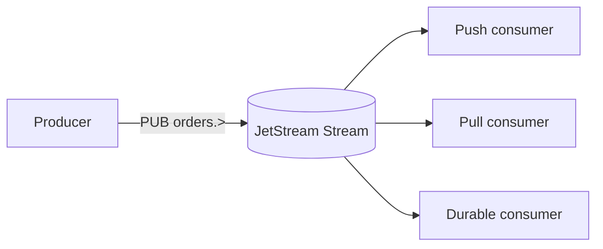
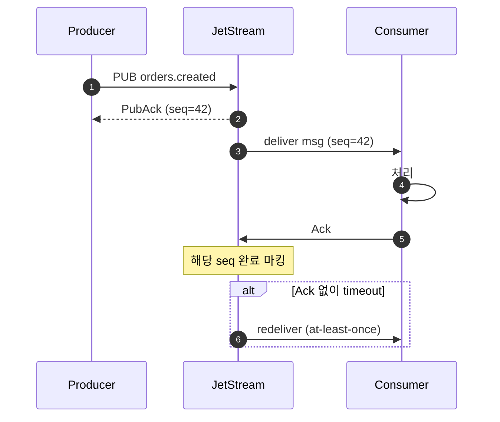
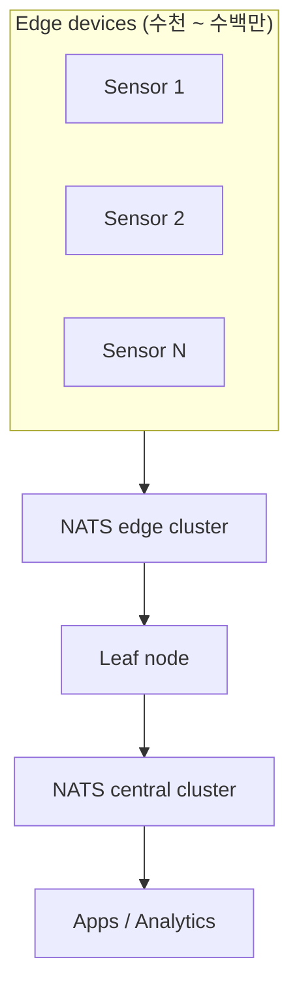
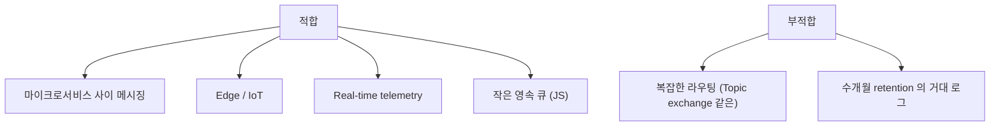

## 정의

**NATS** = *극도로 가벼운 메시징 시스템*. core NATS = *at-most-once Pub/Sub + request-reply*. JetStream = *영속 / at-least-once / exactly-once* 까지.

특징:

- **1 바이너리** (Go), 메모리 ~10MB.
- *마이크로초 latency*.
- *수백만 msg/s/노드*.
- *edge / IoT / 마이크로서비스* 친화.

## 두 모드: Core vs JetStream

| - | Core NATS | JetStream |
|---|---|---|
| 영속 | 없음 (in-memory) | *있음* |
| 신뢰성 | at-most-once | at-least-once / exactly-once |
| Latency | 매우 낮음 | 낮음 |
| 사용 | telemetry, signal | event log, queue |

## Subject 계층

```
orders.created
orders.paid
orders.shipped.us
orders.shipped.eu
inventory.low.warehouse-a
```

| 와일드카드 | 의미 |
|---|---|
| `*` | 단어 1개 |
| `>` | 나머지 모두 |

```
subscribe orders.*    → orders.created, orders.paid (1단 차이만)
subscribe orders.>    → orders.created, orders.paid, orders.shipped.us, ...
```

## Request-Reply (Core NATS 의 강점)



- *RPC* 가 *Pub/Sub 위에 자연스럽게*.
- *load balancing* = 같은 subject 의 *queue group* 으로.

```js
// Queue group: 여러 service 가 같은 subject 구독, 한 명에게 전달
nats.subscribe('shop.getItem', { queue: 'shop' }, (msg) => { ... });
```

## JetStream 개요

JetStream 은 NATS 에 내장된 *영속 스트리밍 레이어*:



| Consumer 타입 | 의미 |
|---|---|
| Push | broker 가 능동 push |
| Pull | consumer 가 poll |
| Ephemeral | 임시 (재접속 시 처음부터) |
| Durable | 진행 상태 영속 |

## JetStream Stream 설정

```yaml
# nats CLI 또는 API 로 Stream 생성
stream:
  name: ORDERS
  subjects:
    - orders.>
  storage: file          # file (영속) / memory (빠름)
  retention: limits      # limits / workqueue / interest
  max_age: 24h           # 메시지 보존 기간
  replicas: 3            # 노드 수 (HA 필수)
  max_bytes: 10GB
  discard: old           # 한계 초과 시 오래된 것 삭제
```

## JetStream 메시지 흐름 (Ack)



## Consumer Ack 정책

| AckPolicy | 동작 |
|---|---|
| `explicit` | 각 메시지 개별 Ack. 가장 안전 |
| `all` | N번 Ack = 1~N 모두 확인 (배치 처리 효율) |
| `none` | Ack 불필요. fire-and-forget |

```js
// Durable Consumer: 재연결 후 마지막 위치부터
const consumer = await js.consumers.get('ORDERS', 'order-processor');
for await (const msg of await consumer.consume()) {
  await processOrder(msg.json());
  msg.ack();   // explicit ack
}
```

## NATS KV / Object Store

JetStream 위 *추가 추상*:

```js
// KV
const kv = await jsm.views.kv('config');
await kv.put('feature.x', 'enabled');
const val = await kv.get('feature.x');

// Object Store
const os = await jsm.views.os('images');
await os.put('logo.png', readableStream);
```

> *Redis 같은 KV*, *S3 같은 object store* 가 NATS 안에 통합. *작은 인프라* 친화.

## NATS Cluster 구성

```yaml
# nats.conf (3-node cluster)
cluster {
  name: my-cluster
  listen: 0.0.0.0:6222
  routes: [
    nats-route://nats-0:6222
    nats-route://nats-1:6222
    nats-route://nats-2:6222
  ]
}
jetstream {
  store_dir: /data/jetstream
  max_memory_store: 4GB
  max_file_store: 100GB
}
```

- *3 노드 이상* 권장 (Raft 합의)
- JetStream replica = *노드 수 이하* 로 설정 (보통 3)

## Edge / IoT 패턴



- *Leaf node* = *edge → central* 의 경량 게이트웨이.
- *bandwidth 최적*: 같은 메시지 한 번만 전송.
- *오프라인 buffer* + *재연결 시 sync*.

## NATS vs Kafka vs RabbitMQ

| 항목 | NATS | Kafka | RabbitMQ |
|---|---|---|---|
| 바이너리 크기 | *10 MB* | 수백 MB | 수십 MB |
| 운영 복잡도 | *낮음* | 높음 | 중간 |
| 처리량 | 매우 높음 | 매우 높음 | 중간 |
| Latency | *최저* | 중간 | 낮음 |
| 영속 | 옵션 (JS) | 항상 | 옵션 |
| Replication | 빌트인 (JS) | 빌트인 | mirror queue |
| 학습 곡선 | *낮음* | 높음 | 중간 |
| Request-Reply | *네이티브 지원* | 어색 | 가능 |
| Edge/IoT | *최적* | 부적합 | 가능 |

Kafka 와 NATS 의 *핵심 차이*:

| - | NATS JetStream | Kafka |
|---|---|---|
| 설계 목적 | 빠른 메시징 + 선택적 영속 | 대용량 영속 로그 |
| 장기 retention | 가능하지만 Kafka 만큼 최적화 안 됨 | 최적 (수개월) |
| Offset 관리 | consumer 별 server-side | consumer 가 broker 에 commit |
| Subject 라우팅 | 와일드카드 (`*`, `>`) | 없음 (topic = exact match) |

## 적합 / 부적합



## 흔한 함정

> [!WARNING]
> 1. **Core NATS 의 손실 가능성 무시** = subscriber 없으면 *조용히 사라짐*. JS 로 가야.
> 2. **JS replica 1** = 노드 다운 시 손실. RF 3 권장.
> 3. **Wildcard 과도 사용** = `>` 가 *모든 메시지* 받음 → 클라이언트 부하.
> 4. **Subject 표준화 없음** = 작은 팀에서는 OK, 큰 팀에서는 *충돌 / 중복*. 네임스페이스 가이드 필요.
> 5. **JetStream max_age 미설정** = 디스크 무한 증가. retention 정책 명시 필수.

## 관련 위키

- [[kafka]], [[rabbitmq]]
- [[Redis Pub Sub vs Streams]]
- [[grpc]]
