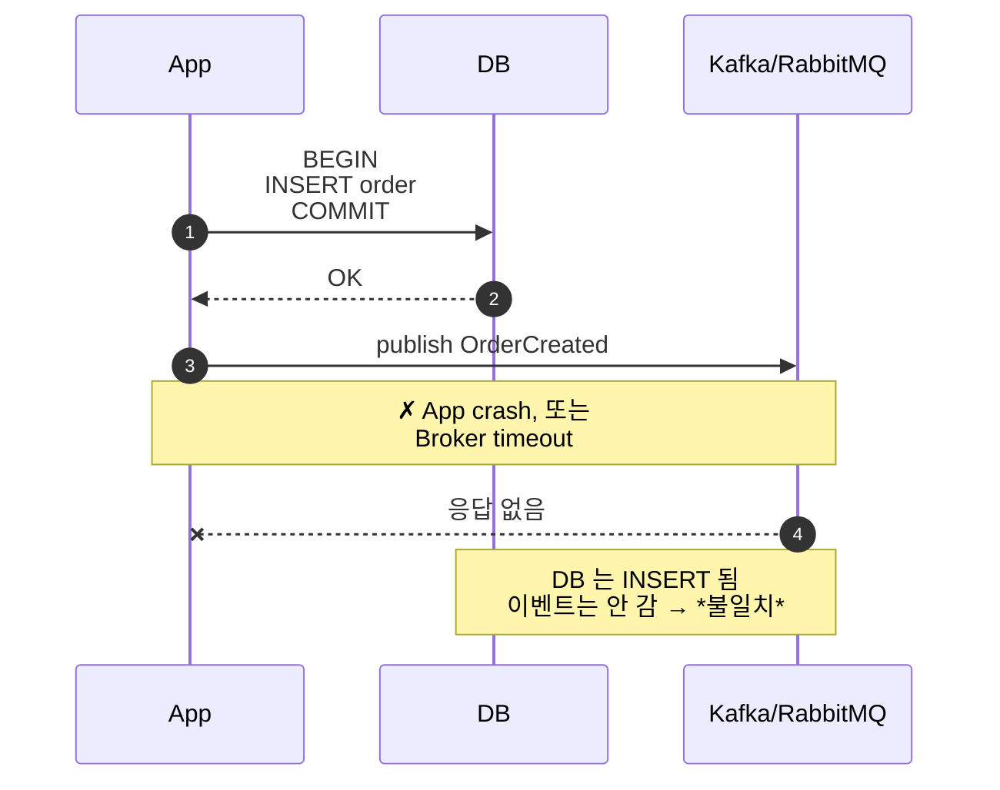
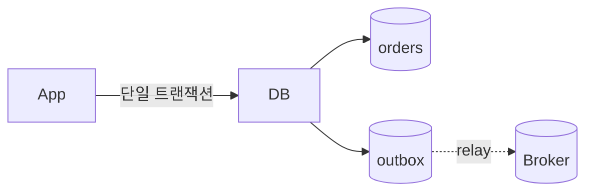
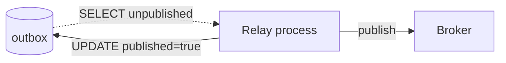
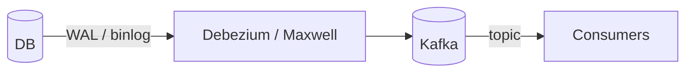
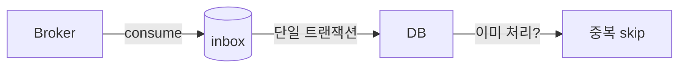

## 정의

**Outbox Pattern** = *DB 변경 + 메시지 발행* 의 *원자성 보장*. *이중 쓰기 (dual write) 문제* 의 표준 해결.

## 문제: Dual Write



| 시나리오 | 결과 |
|---|---|
| DB OK + Publish OK | 일관성 |
| DB OK + Publish fail | *불일치* (DB 만 변경) |
| DB fail + Publish OK | *불일치* (이벤트만 갔음) |
| 둘 다 fail | OK (취소) |

→ *두 시스템을 한 번에 일관* 시키는 건 *불가능*. *2PC* 는 *비현실적*.

## 해결: Outbox 테이블



```sql
BEGIN;
  INSERT INTO orders (id, ...) VALUES (?, ...);
  INSERT INTO outbox (event_type, payload, aggregate_id)
    VALUES ('OrderCreated', ?, ?);
COMMIT;
-- 한 트랜잭션 = 원자성!
```

이후 *별도 프로세스* 가 outbox 를 읽고 *broker 로 publish*.

## 2가지 Relay 방식

### 1. Polling Publisher



```python
while True:
    rows = db.query("SELECT * FROM outbox WHERE published=false LIMIT 100")
    for row in rows:
        broker.publish(row.event)
        db.execute("UPDATE outbox SET published=true WHERE id=?", row.id)
    time.sleep(0.1)
```

- 구현 간단.
- DB 부담 (polling).
- Latency ≈ polling 주기.

### 2. CDC (Change Data Capture)



DB 의 *transaction log (PostgreSQL WAL / MySQL binlog)* 를 *실시간 캡처*.

| 도구 | DB |
|---|---|
| Debezium | PG, MySQL, MongoDB, Oracle 등 |
| Maxwell | MySQL |
| AWS DMS | 다양 |
| Striim | 다양 |

> [!IMPORTANT]
> *Outbox + CDC* 는 *2026 시점 마이크로서비스 메시징의 표준*. 더 이상 *애플리케이션 코드에서 publish* 하지 않는다.

## Outbox 테이블 디자인

```sql
CREATE TABLE outbox (
  id BIGSERIAL PRIMARY KEY,
  aggregate_type TEXT NOT NULL,        -- 'Order'
  aggregate_id TEXT NOT NULL,           -- 'order_42'
  event_type TEXT NOT NULL,             -- 'OrderCreated'
  payload JSONB NOT NULL,
  occurred_at TIMESTAMPTZ DEFAULT NOW(),
  published BOOLEAN DEFAULT false,
  published_at TIMESTAMPTZ
);

CREATE INDEX idx_outbox_unpublished
  ON outbox(id) WHERE published = false;
```

> [!TIP]
> *partial index* 로 *unpublished 만 빠른 SELECT*.

## 처리 후 정리

```mermaid
flowchart TD
    P[Outbox 너무 큼?]
    P --> O1[옵션 1: published row 즉시 DELETE]
    P --> O2[옵션 2: 별도 archive 테이블]
    P --> O3[옵션 3: TTL (며칠 보관)]
```

CDC 가 *binlog stream 위주* 라 *published 컬럼 자체 필요 없음*. Debezium 이 *INSERT 이벤트 그대로* 전송.

## 메시지 순서 보장

```mermaid
flowchart LR
    Tx1[Tx 1: INSERT outbox id=100] --> Order
    Tx2[Tx 2: INSERT outbox id=99 (먼저 시작했지만 commit 늦음)]
    Tx2 --> Order
    Note["DB ID 순 ≠ commit 순"]
```

> [!CAUTION]
> *concurrent transaction* 때문에 `id` 순서 ≠ *commit 순서*. *strict 순서 보장* 이 필요하면 *aggregate ID 별 partition* 으로.

## At-least-once + Idempotency

Outbox + relay 는 *at-least-once*. *중복 발행* 가능 (relay 가 publish 후 update 전 crash).

→ *consumer 가 idempotent 처리*. 자세한 건 [[idempotency-keys]].

## Inbox Pattern (반대 방향)



수신 측의 *멱등 보장*. Outbox 와 *대칭*.

## 흔한 함정

> [!WARNING]
> 1. **`UPDATE published=true` 와 *publish 가 *별도 transaction*** = relay crash 시 중복 발행. *at-least-once 인정* + consumer idempotent.
> 2. **Outbox 의 *순서 무시*** = 다운스트림이 순서 가정. partition / sequence 명시.
> 3. **Outbox 가 *너무 큼*** = 정리 필요. 보관 정책.
> 4. **`SELECT FOR UPDATE SKIP LOCKED`** 없이 *multi worker* = *같은 row 동시 처리* → 중복.

## 관련 위키

- [[kafka]], [[rabbitmq]]
- [[saga-pattern]]
- [[idempotency-keys]]
- [[event-sourcing]]
- [[Redis Pub Sub vs Streams]]
