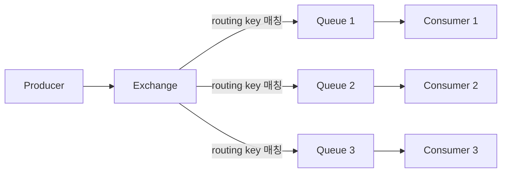
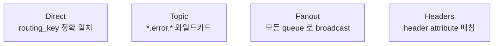
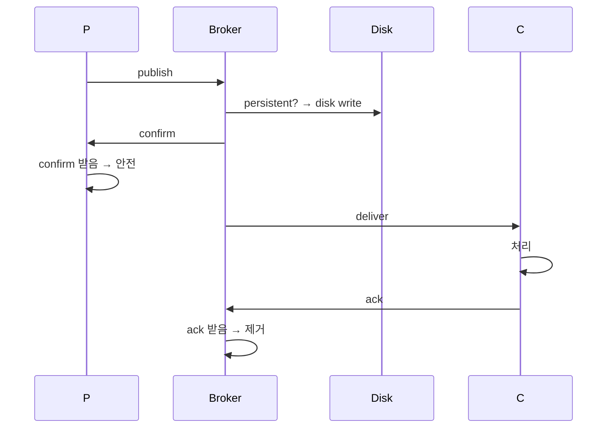
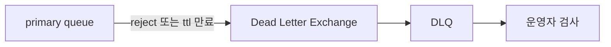
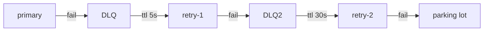

## 정의

**RabbitMQ** = *AMQP 0.9.1* 기반 *traditional message broker*. *exchange → queue 라우팅*, *workload distribution*, *publish-subscribe*. Kafka 보다 *작은 단위 메시지 라우팅에 강함*.

## 구조



| 컴포넌트 | 의미 |
|---|---|
| Producer | 메시지 발행자 |
| Exchange | *routing 규칙*. 4 종류 |
| Queue | 메시지 저장소 |
| Binding | exchange ↔ queue 연결 + key |
| Consumer | 소비자 |

## Exchange 4 종류



### 1. Direct

```
publish key=ORDER.PAID → queue:paid (binding key=ORDER.PAID)
publish key=ORDER.SHIPPED → queue:shipped (binding key=ORDER.SHIPPED)
```

### 2. Topic

```
publish key=order.paid.us → matches "order.*.us", "order.paid.*", "#"
```

| 와일드카드 | 의미 |
|---|---|
| `*` | 단어 1개 |
| `#` | 0+ 단어 |

### 3. Fanout

```
모든 binding 된 queue 로 무조건 복사
```

*Pub/Sub fan-out* 의 정통.

### 4. Headers

```
header { type: "order", region: "us" } 매칭
```

## 메시지 보장



| 설정 | 의미 |
|---|---|
| `persistent` 메시지 | broker 재시작 후에도 보존 |
| `durable` queue | broker 재시작 후 queue 유지 |
| `publisher confirms` | broker 의 *받음* 확인 |
| `consumer ack` | 처리 완료 확인 |
| `mandatory` flag | routing 안 되면 *unroutable* 반환 |

> [!IMPORTANT]
> 모든 *4가지 켜야* 실제 *at-least-once* 보장. 하나라도 빠지면 *손실 가능*.

## DLQ (Dead Letter Queue)



| trigger | 동작 |
|---|---|
| reject (requeue=false) | DLQ 로 |
| TTL 만료 | DLQ 로 |
| queue 길이 한도 초과 | DLQ 로 |

자동 retry 패턴:



## RabbitMQ vs Kafka

| 항목 | RabbitMQ | Kafka |
|---|---|---|
| 모델 | 큐 + exchange 라우팅 | append-only log |
| 처리량 | *수만 ~ 수십만/s* | *수백만/s* |
| Latency | *낮음* (ms) | 좀 더 큼 |
| 영속 | 옵션 | 항상 |
| 재처리 | 한 번 소비 후 *사라짐* | offset 으로 *임의 재생* |
| 라우팅 | *유연* (exchange 패턴) | 단순 (topic + partition) |
| 사용 | task queue, request-reply | event log, stream |

## RabbitMQ Streams (Kafka 흉내)

3.9+ 의 *Stream* 큐 타입. *append-only log* + replica + 재생 가능.

```bash
# 또는 declare 시
queue.declare("my-stream", arguments={ "x-queue-type": "stream" })
```

*Kafka 와 비슷한 흐름*. RabbitMQ 안에서 *durable log + fan-out 임의 시점*.

## 흔한 함정

> [!WARNING]
> 1. **`persistent` 없이 신뢰** = broker 재시작 시 모든 메시지 손실.
> 2. **prefetch 너무 큼** = 한 consumer 가 *수천 메시지 lock* → 다른 consumer 가 굶음. `prefetch=10~100` 권장.
> 3. **DLQ 없이 reject** = 메시지 영구 손실 또는 무한 재시도.
> 4. **`auto_ack=true`** = consumer 다운 시 처리 안 한 메시지가 *ack 됨* (손실).

## 관련 위키

- [[kafka]] (event log)
- [[nats]] (가벼움)
- [[Redis Pub Sub vs Streams]]
- [[outbox-pattern]]
- [[idempotency-keys]]
