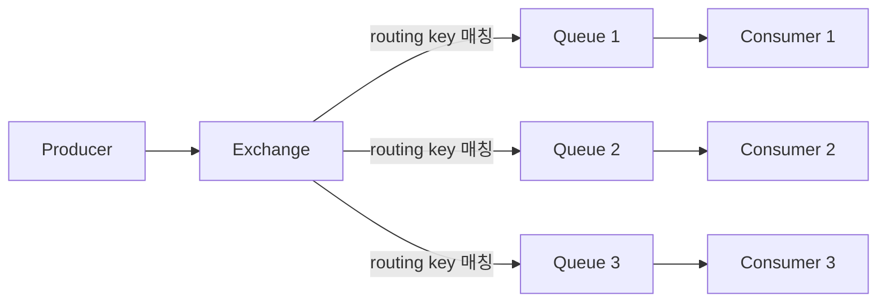
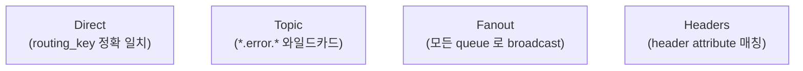
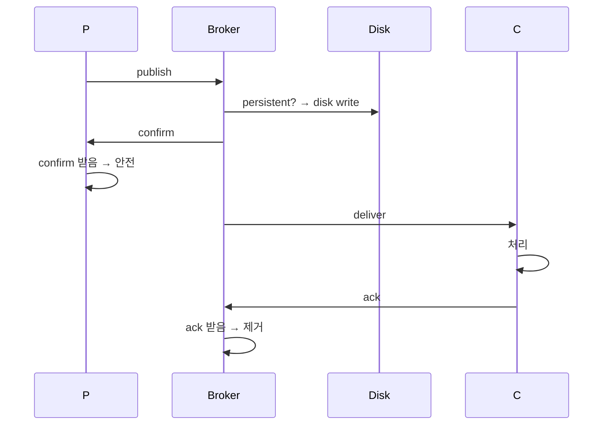
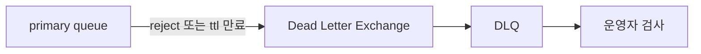
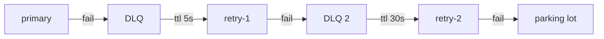

## 정의

**RabbitMQ** = *AMQP 0.9.1* 기반 *traditional message broker*. *exchange → queue 라우팅*, *workload distribution*, *publish-subscribe*. Kafka 보다 *작은 단위 메시지 라우팅에 강함*.

메시지는 반드시 *exchange* 를 경유해 *binding* 규칙에 따라 *queue* 로 전달된다. Producer 는 queue 를 직접 알지 못하고 exchange 에만 발행한다.

## 언제 쓰이나

- **Task queue**: 백그라운드 작업 배포 (이메일 발송, 이미지 처리)
- **Request-Reply**: RPC 패턴 (`reply_to` + `correlation_id`)
- **복잡한 라우팅**: topic/headers exchange 로 세밀한 메시지 필터링
- **마이크로서비스 이벤트**: 서비스 간 비동기 통신
- **작은 메시지, 낮은 지연**: Kafka 보다 단순하고 빠른 설정

## 구조



| 컴포넌트 | 의미 |
|---|---|
| Producer | 메시지 발행자 |
| Exchange | *routing 규칙*. 4 종류 |
| Queue | 메시지 저장소 |
| Binding | exchange ↔ queue 연결 + key |
| Consumer | 소비자 |

## Exchange 4 종류



### 1. Direct

```
publish key=ORDER.PAID → queue:paid (binding key=ORDER.PAID)
publish key=ORDER.SHIPPED → queue:shipped (binding key=ORDER.SHIPPED)
```

하나의 exchange 에 여러 binding key 를 달아 다른 queue 로 보낼 수 있다. 같은 key 에 여러 queue 를 binding 하면 round-robin 분배.

### 2. Topic

```
publish key=order.paid.us → matches "order.*.us", "order.paid.*", "#"
```

| 와일드카드 | 의미 |
|---|---|
| `*` | 단어 1개 |
| `#` | 0+ 단어 |

### 3. Fanout

```
모든 binding 된 queue 로 무조건 복사
```

*Pub/Sub fan-out* 의 정통. routing key 를 무시한다.

### 4. Headers

```
header { type: "order", region: "us" } 매칭
```

routing key 대신 메시지 헤더 attribute 로 라우팅. `x-match: all` (AND) 또는 `x-match: any` (OR).

## 실전: Python pika 로 Topic Exchange

```python
import pika
import json

connection = pika.BlockingConnection(pika.ConnectionParameters('localhost'))
channel = connection.channel()

# Exchange 선언
channel.exchange_declare(exchange='orders', exchange_type='topic', durable=True)

# Queue 선언 (DLX 포함)
channel.queue_declare(
    queue='orders.paid',
    durable=True,
    arguments={
        'x-dead-letter-exchange': 'orders.dlx',
        'x-message-ttl': 60000,   # 60초 미처리 시 DLQ
        'x-max-length': 10000,
    }
)

# Binding: order.*.paid 패턴
channel.queue_bind(exchange='orders', queue='orders.paid', routing_key='order.*.paid')

# Publish (persistent 메시지)
channel.basic_publish(
    exchange='orders',
    routing_key='order.kr.paid',
    body=json.dumps({"order_id": 42, "amount": 9900}).encode(),
    properties=pika.BasicProperties(
        delivery_mode=pika.DeliveryMode.Persistent,  # 디스크 저장
        content_type='application/json',
    )
)

print("Published order.kr.paid")
connection.close()
```

### Consumer: ack / nack

```python
def on_message(channel, method, properties, body):
    try:
        data = json.loads(body)
        process_order(data)
        channel.basic_ack(delivery_tag=method.delivery_tag)
    except Exception as e:
        # requeue=False → DLQ 로 라우팅
        channel.basic_nack(delivery_tag=method.delivery_tag, requeue=False)

channel.basic_qos(prefetch_count=10)  # 한 번에 10개만 가져옴
channel.basic_consume(queue='orders.paid', on_message_callback=on_message)
channel.start_consuming()
```

## 메시지 보장



| 설정 | 의미 |
|---|---|
| `persistent` 메시지 | broker 재시작 후에도 보존 |
| `durable` queue | broker 재시작 후 queue 유지 |
| `publisher confirms` | broker 의 *받음* 확인 |
| `consumer ack` | 처리 완료 확인 |
| `mandatory` flag | routing 안 되면 *unroutable* 반환 |

> [!IMPORTANT]
> 모든 *4가지 켜야* 실제 *at-least-once* 보장. 하나라도 빠지면 *손실 가능*.

## Queue 속성 (x-arguments)

| 속성 | 의미 | 예시 값 |
|---|---|---|
| `x-message-ttl` | 큐 내 메시지 최대 대기 시간 (ms) | `60000` (60초) |
| `x-max-length` | 큐 최대 메시지 수 | `10000` |
| `x-max-length-bytes` | 큐 최대 바이트 | `104857600` (100MB) |
| `x-dead-letter-exchange` | TTL/reject 시 라우팅할 DLX | `"orders.dlx"` |
| `x-dead-letter-routing-key` | DLX 로 보낼 때 routing key | `"failed"` |
| `x-queue-type` | 큐 타입 | `"quorum"`, `"stream"` |
| `x-priority` | Priority Queue 최대 우선순위 | `10` |

## DLQ (Dead Letter Queue)



| trigger | 동작 |
|---|---|
| reject (requeue=false) | DLQ 로 |
| TTL 만료 | DLQ 로 |
| queue 길이 한도 초과 | DLQ 로 |

자동 retry 패턴:



## Quorum Queue (HA)

RabbitMQ 3.8+ 의 **고가용성 큐 타입**. Raft 합의 알고리즘으로 데이터 복제.

```python
# Quorum Queue 선언
channel.queue_declare(
    queue='orders.quorum',
    durable=True,
    arguments={'x-queue-type': 'quorum'}
)
```

| 항목 | Classic Queue | Quorum Queue |
|---|---|---|
| 고가용성 | Mirrored (구식) | Raft 기반 |
| 메시지 보장 | 브로커 장애 시 손실 가능 | 과반 노드 생존 시 보장 |
| 성능 | 빠름 | 약간 느림 (consensus overhead) |
| 권장 | 비중요 로컬 | 프로덕션 중요 메시지 |

> [!CAUTION]
> Classic mirrored queue 는 RabbitMQ 3.12+ 에서 deprecated. 새 프로젝트는 Quorum Queue 를 사용하세요.

## RabbitMQ vs Kafka

| 항목 | RabbitMQ | Kafka |
|---|---|---|
| 모델 | 큐 + exchange 라우팅 | append-only log |
| 처리량 | *수만 ~ 수십만/s* | *수백만/s* |
| Latency | *낮음 (ms)* | 좀 더 큼 |
| 영속 | 옵션 | 항상 |
| 재처리 | 한 번 소비 후 *사라짐* | offset 으로 *임의 재생* |
| 라우팅 | *유연 (exchange 패턴)* | 단순 (topic + partition) |
| 사용 | task queue, request-reply | event log, stream |

## RabbitMQ Streams (Kafka 흉내)

3.9+ 의 *Stream* 큐 타입. *append-only log* + replica + 재생 가능.

```bash
# declare 시
queue.declare("my-stream", arguments={ "x-queue-type": "stream" })
```

*Kafka 와 비슷한 흐름*. RabbitMQ 안에서 *durable log + fan-out 임의 시점*.

## 흔한 함정

> [!WARNING]
> 1. **`persistent` 없이 신뢰** = broker 재시작 시 모든 메시지 손실.
> 2. **prefetch 너무 큼** = 한 consumer 가 *수천 메시지 lock* → 다른 consumer 가 굶음. `prefetch=10~100` 권장.
> 3. **DLQ 없이 reject** = 메시지 영구 손실 또는 무한 재시도.
> 4. **`auto_ack=true`** = consumer 다운 시 처리 안 한 메시지가 *ack 됨* (손실).
> 5. **Classic mirrored queue 신규 사용** = deprecated. Quorum Queue 로 전환.

## 관련 위키

- [[kafka]] (event log)
- [[nats]] (가벼움)
- [[Redis Pub Sub vs Streams]]
- [[outbox-pattern]]
- [[idempotency-keys]]
