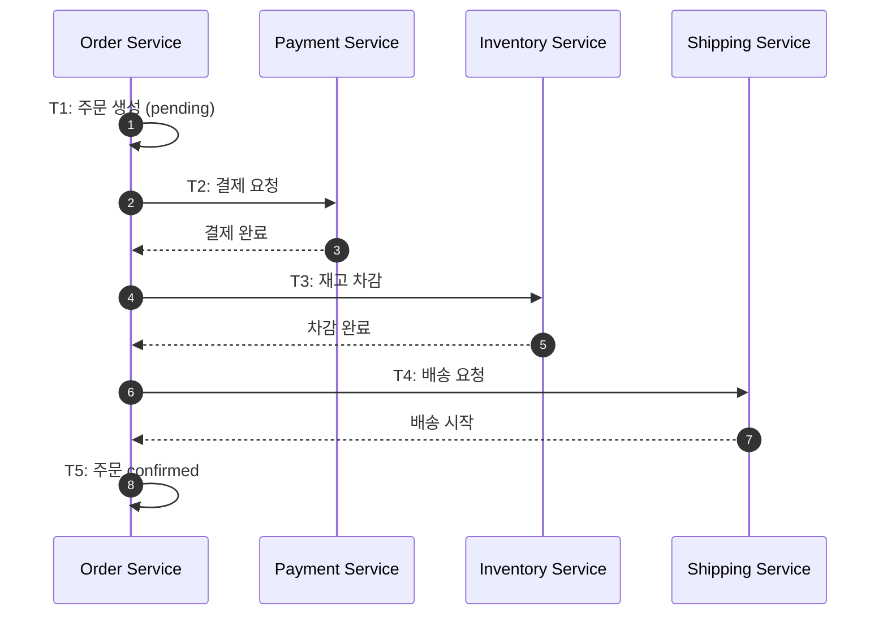
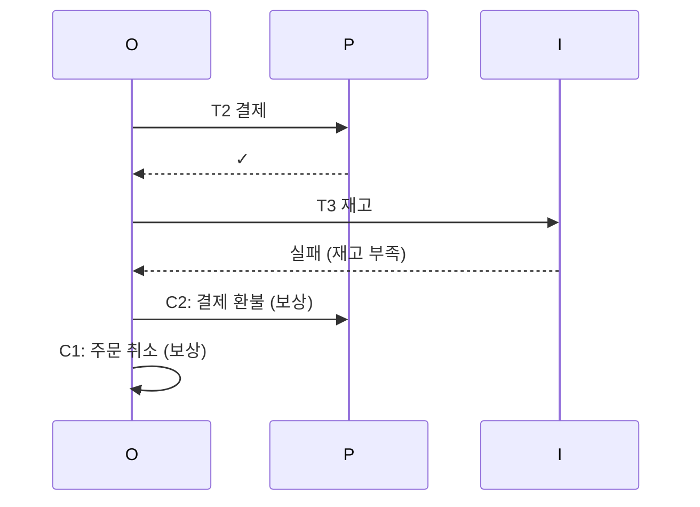
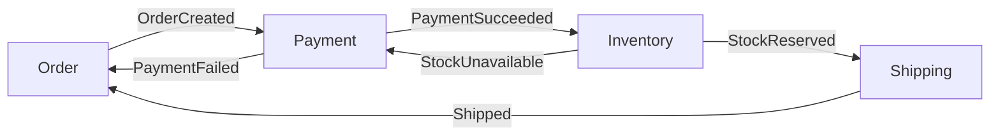
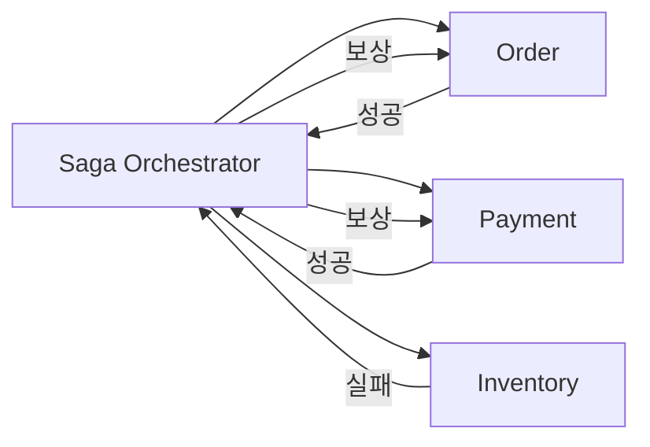
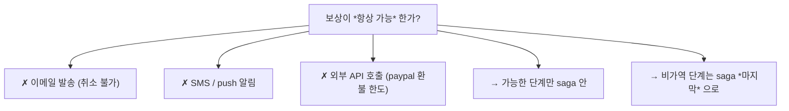
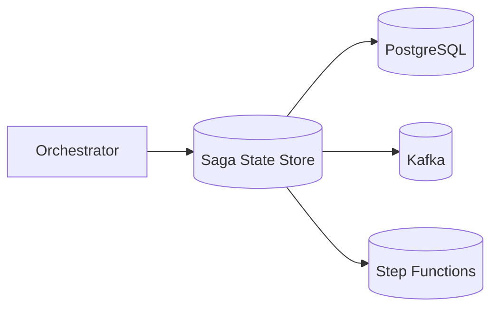
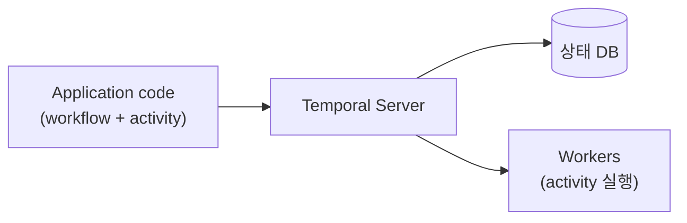

## 정의

**Saga** = *여러 service 의 로컬 트랜잭션* 을 *연결한 긴 흐름*. 한 단계 실패 시 *이전 단계의 보상 (compensating) 트랜잭션* 으로 *논리적 롤백*.

> [!IMPORTANT]
> Saga 는 *ACID 트랜잭션이 아니다*. 분산 환경에서 *2PC (XA)* 가 비현실적이라 *eventually consistent + 보상* 으로 대체.

## 시나리오: 주문



실패 시 보상:



| 단계 | Compensating |
|---|---|
| T1 주문 생성 | C1 주문 취소 |
| T2 결제 | C2 환불 |
| T3 재고 차감 | C3 재고 복원 |
| T4 배송 | C4 배송 취소 |

## 두 스타일: Choreography vs Orchestration

### 1. Choreography (이벤트 기반)



- 각 service 가 *event 듣고 자기 일*.
- 중앙 제어자 없음.
- *유연*, *낮은 결합*.
- *흐름 추적 어려움* (어디까지 갔는지).

### 2. Orchestration (중앙 코디네이터)



- *중앙 상태 기계*.
- 흐름 *명확*.
- *결합도 약간 높음* (orchestrator 가 모든 service 안)
- *문제 추적 쉬움*.

| 항목 | Choreography | Orchestration |
|---|---|---|
| 결합도 | 낮음 | 약간 높음 |
| 흐름 추적 | *어려움* | *쉬움* |
| 디버깅 | 어려움 | 쉬움 |
| 적합 | 단순 흐름 (3-4 단계) | 복잡 흐름 (5+ 단계) |
| 운영 도구 | event tracer | 상태 기계 시각화 |

> [!TIP]
> *3-4 단계까지는 choreography*, *그 이상은 orchestration* 이 일반 권장. Netflix 도 *Conductor* 라는 orchestrator 사용.

## 보상 트랜잭션의 함정



> [!CAUTION]
> *비가역 작업* (이메일, push, 외부 API) 은 *saga 가 commit 결정 후* 실행. 그 전에 실행하면 *보상 불가*.

## 멱등성 + Idempotency Key

각 단계 / 보상은 *멱등 (idempotent)* 해야 한다. 자세한 건 [[idempotency-keys]].

```python
# 보상 시
async def compensate_payment(saga_id, payment_id):
    if already_refunded(saga_id):
        return                       # 멱등
    await payment_service.refund(payment_id, key=saga_id)
```

## Saga 상태 저장



| Store | 특징 |
|---|---|
| PostgreSQL (DB) | 트랜잭션 친화 |
| Kafka topic | event log 자연 통합 |
| AWS Step Functions | managed orchestrator |
| Temporal | 워크플로 엔진 |
| Camunda | BPMN 표준 |

## Temporal / Step Functions (워크플로 엔진)



- *워크플로 코드* 가 *durable execution*.
- *retry / timeout / sleep* 이 *언어 native* 처럼.
- 마치 *함수 호출 같은데 분산 + 영속*.

## 흔한 함정

> [!WARNING]
> 1. **모든 분산 흐름 = saga** = 단순 *async event* 가 충분한데도 복잡한 saga. *진짜 보상 필요한 흐름에만*.
> 2. **보상 *없거나 미구현*** = "*해피 패스만 만들고 실패는 운영자 처리*". 1년 뒤 *데이터 불일치 폭증*.
> 3. **Choreography 의 *순환 의존성*** = A → B → C → A 같은 흐름. 디버깅 지옥.
> 4. **상태 저장 안 함** = orchestrator 다운 시 *진행 잃음*. event log 또는 DB 필수.

## 관련 위키

- [[distributed-systems-distributed-transaction]] (2PC)
- [[outbox-pattern]] (event publishing 보장)
- [[idempotency-keys]]
- [[event-sourcing]]
- [[microservices-vs-monolith]]
