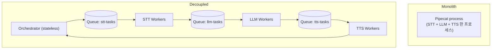
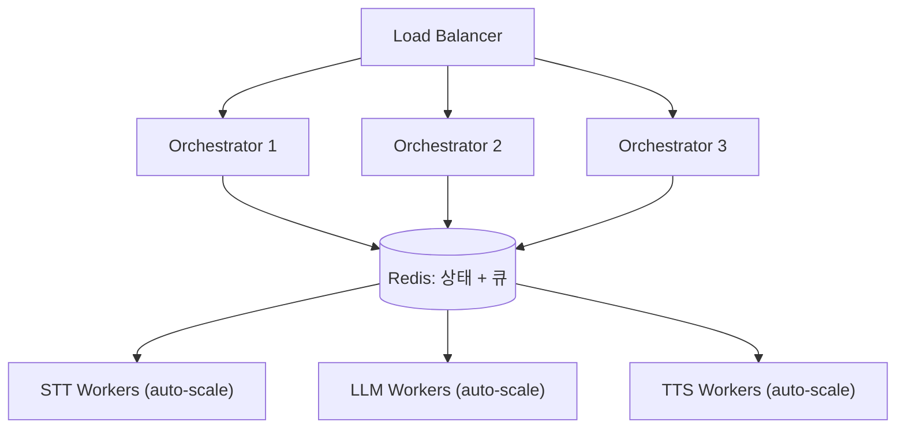
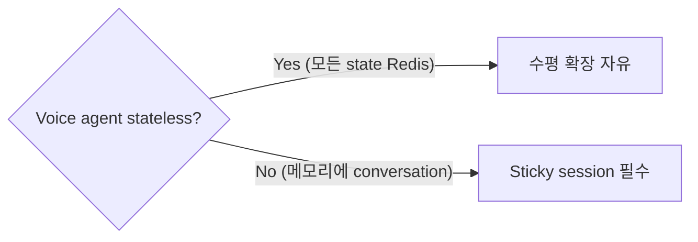
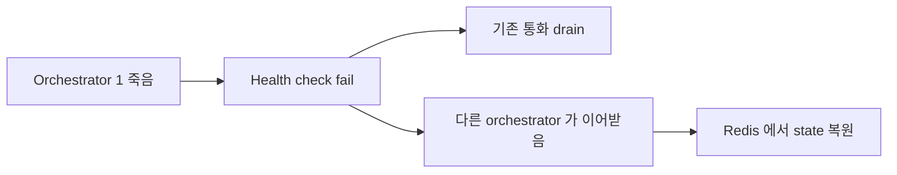
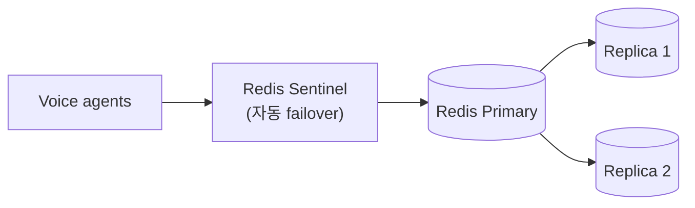
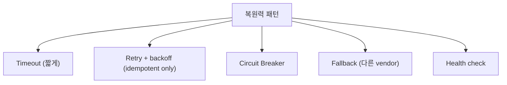

## 정의

대규모 음성 에이전트 = *STT/LLM/TTS 를 분리 배포 + 메시지 큐로 디커플링*. 수평 확장 + 독립 실패.

> [!NOTE]
> *소규모 (수십 동시 통화)* 는 *monolith pipeline (Pipecat 한 프로세스)* 으로 충분. *수백 ~ 수천 동시* 부터 디커플링 의미.

## Monolith vs Decoupled



| | Monolith | Decoupled |
|---|---|---|
| 운영 복잡도 | 낮음 | 높음 |
| 수평 확장 | 동일 비율 | *단계별 독립* |
| 독립 실패 | 전체 다운 | *단계별 격리* |
| 지연 | *최저* | + queue hop (~10ms) |
| 동시 통화 | 수십 | *수천+* |

## 큐 선택

| 큐 | 적합 |
|---|---|
| **Redis Streams** | 가장 단순, < 수만 RPS |
| **Redis Pub/Sub** | 손실 OK, 알림만 |
| **Kafka** | 큰 throughput, 영속, replay |
| **NATS JetStream** | 가벼움, edge |
| **AWS SQS** | managed, AWS only |

> 음성 에이전트 = *Redis Streams* 가 가장 흔함 (latency 낮음, 운영 단순).

## Redis Streams 패턴

```python
# Producer (STT worker)
async def stt_worker():
    while True:
        # stt-tasks 에서 받음
        msgs = await redis.xreadgroup(
            "stt-group", "stt-worker-1",
            {"stt-tasks": ">"},
            count=10, block=100,
        )
        for stream, items in msgs:
            for msg_id, data in items:
                audio_url = data["audio_url"]
                transcript = await deepgram.transcribe(audio_url)

                # 다음 단계로 전달
                await redis.xadd("llm-tasks", {
                    "session_id": data["session_id"],
                    "transcript": transcript,
                })
                await redis.xack("stt-tasks", "stt-group", msg_id)
```

자세한 Streams 는 [[Redis Streams]].

## Orchestrator (stateless)

```python
class VoiceOrchestrator:
    """Session 만 관리. 실제 처리는 worker."""

    async def on_call_start(self, call_id: str):
        # Session 을 Redis 에 저장 (stateless 의 외부 상태)
        await redis.hset(f"call:{call_id}", mapping={
            "started_at": time.time(),
            "status": "active",
        })

    async def on_audio_chunk(self, call_id: str, audio: bytes):
        # 큐에 던지고 끝
        await redis.xadd("stt-tasks", {
            "call_id": call_id,
            "audio": audio,
        })

    async def on_llm_result(self, call_id: str, text: str):
        # TTS 큐로
        await redis.xadd("tts-tasks", {
            "call_id": call_id,
            "text": text,
        })

    async def on_tts_audio(self, call_id: str, audio_chunk: bytes):
        # 사용자에게 stream
        await self.send_to_user(call_id, audio_chunk)
```

> Orchestrator 인스턴스 자체는 *상태 없음*. *모든 상태 Redis*. 수평 확장 + 무중단 배포 자유.

## 수평 확장



| 컴포넌트 | 스케일링 기준 |
|---|---|
| Orchestrator | 동시 connection 수 |
| STT Worker | stt-tasks lag |
| LLM Worker | llm-tasks lag, GPU |
| TTS Worker | tts-tasks lag |

> *각자 다른 자원*. STT 는 CPU, LLM 은 GPU, TTS 는 GPU 또는 API. 분리 = 효율적 자원.

## Sticky vs Stateless



> *Sticky* = 같은 통화 = 같은 orchestrator. SFU + WebRTC 환경에서 *불가피할 때 있음*.

## Failure Recovery



```python
async def take_over_call(call_id: str):
    state = await redis.hgetall(f"call:{call_id}")
    if not state:
        return False

    # 이미 다른 orchestrator 처리 중?
    owner = await redis.set(
        f"call:{call_id}:owner",
        self.instance_id,
        nx=True, ex=30,
    )
    if not owner:
        return False

    # 이어받음
    await self.resume_call(call_id, state)
    return True
```

자세한 *상태 관리* 는 [[Redis Sorted Sets]] 의 session 패턴.

## Sentinel + Cluster



> 음성 = *Redis 단일 장애 = 모든 통화 끊김*. Sentinel 또는 Cluster + sticky session 보호 필수.

## 외부 API 복원력



| 단계 | timeout | fallback |
|---|---|---|
| STT | 5초 | Deepgram → AssemblyAI |
| LLM | 30초 | GPT-4o-mini → Claude Haiku |
| TTS | 10초 | Cartesia → Azure |

자세한 건 [[retry-with-backoff]], [[circuit-breaker]].

## 흔한 함정

> [!WARNING]
> 1. **Monolith → Decouple 전환 너무 일찍** = 운영 복잡도 폭증. 수십 동시 통화는 monolith.
> 2. **상태 메모리 보관** = orchestrator restart = 통화 끊김. Redis 외부 상태.
> 3. **Redis Streams MAXLEN 무제한** = 메모리 폭증. MAXLEN ~ 100K 권장.
> 4. **Queue lag 모니터링 없음** = 어디서 병목인지 모름. Prometheus + alert.

## 관련 위키

- [[voice-agent-architecture]]
- [[Redis Streams]]
- [[Redis Pub Sub vs Streams]]
- [[kafka]]
- [[circuit-breaker]]
- [[retry-with-backoff]]
