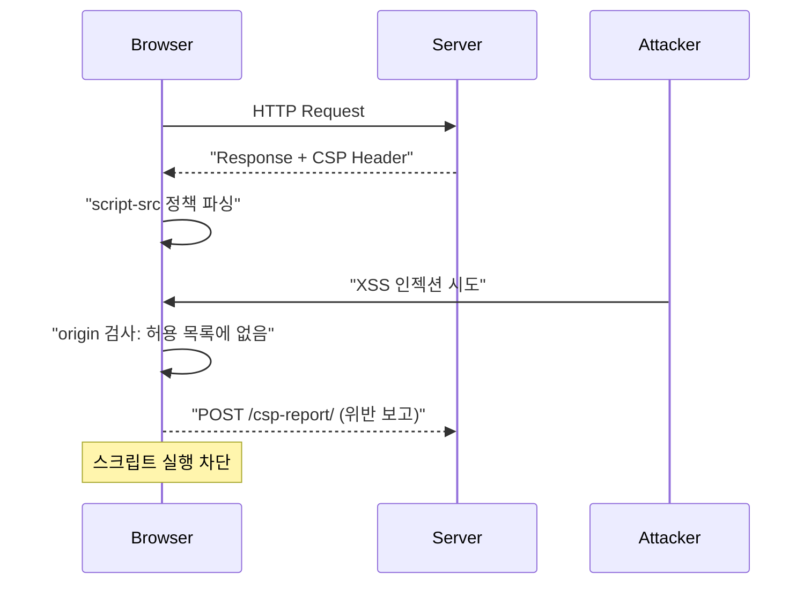

## 정의

**Content Security Policy (CSP)** = 브라우저에게 *어떤 스크립트/스타일/이미지 만 허용* 할지 선언. XSS 공격의 마지막 방어선.

Django 6.0 부터 **CSP 지원이 내장** (옛 `django-csp` 서드파티 → Django 표준). 자세한 XSS 는 [[django-security]] 참고.

## 목적 + 대안

| 접근 | 의미 |
|---|---|
| **입력 필터링** | 사용자 입력에서 `<script>` 제거 (완벽하지 않음) |
| **출력 escape** | `` 로 HTML escape (Django 기본) |
| **CSP** | *브라우저에게 인라인 스크립트 실행 금지 지시* |

> [!IMPORTANT]
> **CSP 는 *다중 방어* 의 하나**. Escape + Sanitize + CSP 3중 방어가 정통.

## CSP Header 구조

```http
Content-Security-Policy:
  default-src 'self';
  script-src 'self' https://cdn.example.com;
  style-src 'self' 'unsafe-inline';
  img-src 'self' data: https:;
  connect-src 'self' https://api.example.com;
  frame-ancestors 'none';
  report-uri /csp-report/
```

| Directive | 의미 |
|---|---|
| `default-src` | 기본값 |
| `script-src` | JavaScript 허용 원본 |
| `style-src` | CSS |
| `img-src` | 이미지 |
| `connect-src` | fetch, XHR, WebSocket |
| `font-src` | 폰트 |
| `frame-src` / `frame-ancestors` | iframe |
| `form-action` | form action target |
| `report-uri` | 위반 리포트 |

## CSP 동작 흐름



## Django 6.0 CSP 설정

```python
# settings.py
MIDDLEWARE = [
    ...
    'django.middleware.csp.ContentSecurityPolicyMiddleware',
]

SECURE_CSP = {
    'default-src': ["'self'"],
    'script-src': ["'self'", 'https://cdn.example.com'],
    'style-src': ["'self'", "'unsafe-inline'"],
    'img-src': ["'self'", 'data:', 'https:'],
    'connect-src': ["'self'", 'https://api.example.com'],
    'frame-ancestors': ["'none'"],
    'report-uri': ['/csp-report/'],
}
```

## Report-Only 모드 (안전한 배포)

```python
# 처음 도입 시 report-only 로 시작
SECURE_CSP_REPORT_ONLY = {
    'default-src': ["'self'"],
    'script-src': ["'self'"],
    'report-uri': ['/csp-report/'],
}
```

브라우저가 *위반 감지 시 report 만 전송, 실제 차단 안 함*. 로그 분석 후 정식 정책으로 전환.

## Nonce 로 인라인 스크립트 허용

```python
# views.py
from django.middleware.csp import get_csp_nonce

def home(request):
    return render(request, 'home.html', {
        'csp_nonce': get_csp_nonce(request),
    })
```

```html
<script nonce="{{ csp_nonce }}">
  console.log('inline script allowed');
</script>
```

Header:
```
Content-Security-Policy: script-src 'self' 'nonce-xyz123abc';
```

> [!TIP]
> *동적 인라인 스크립트* 를 안전하게. `'unsafe-inline'` 보다 훨씬 안전.

## Hash (정적 인라인)

```python
SECURE_CSP = {
    'script-src': [
        "'self'",
        "'sha256-B2yPHKaXnvFWtRChIbabYmUBFZdVfKKXHbWtWidDVF8='",
    ],
}
```

특정 인라인 스크립트 hash 계산 후 허용. Nonce 와 달리 *정적 스크립트만*.

## 위반 리포트 처리

```python
# views.py
import json
from django.http import HttpResponse
from django.views.decorators.csrf import csrf_exempt

@csrf_exempt
def csp_report(request):
    if request.method == 'POST':
        report = json.loads(request.body)
        logger.warning('CSP violation: %s', report)
        return HttpResponse(status=204)
```

```json
{
  "csp-report": {
    "document-uri": "https://example.com/page/",
    "referrer": "",
    "violated-directive": "script-src 'self'",
    "blocked-uri": "https://evil.com/xss.js",
    "line-number": 42
  }
}
```

## Strict CSP (현대 권장)

Google 이 권장하는 *strict CSP*:

```python
SECURE_CSP = {
    'script-src': ["'strict-dynamic'", "'nonce-{{nonce}}'"],
    'object-src': ["'none'"],
    'base-uri': ["'none'"],
}
```

- `strict-dynamic`: nonce 통과한 스크립트가 로드한 자원은 자동 허용.
- `object-src 'none'`: Flash/plugin 완전 차단.

## 흔한 함정

> [!WARNING]
> 1. **`unsafe-inline` 남발** = CSP 의 의미 없음. Nonce 또는 hash 사용.
> 2. **CDN URL 하드코딩** = CDN 변경 시 앱 다운. 설정 관리.
> 3. **report-uri 없이 시작** = 위반 파악 못함. 반드시 report 먼저.
> 4. **`'unsafe-eval'` 필요** = React 개발 mode 등. Production 은 build 후 제거.

## 다른 프레임워크

| Framework | CSP 지원 |
|---|---|
| **Django 6.0+** | *내장* |
| **Django 5.x 이하** | django-csp 서드파티 |
| **Rails** | *Rails 5.2+ 내장* (`config.content_security_policy`) |
| **Spring** | Spring Security header |
| **Express** | helmet.js |
| **Next.js** | `next.config.js` headers |

## CSP 배포 전략

1. **Report-Only 모드로 시작** : 실제 차단 없이 위반 로그 수집
2. **로그 분석** : 허용해야 할 원본 파악
3. **정책 정제** : 불필요한 `'unsafe-inline'` 제거, nonce/hash 도입
4. **강화 모드로 전환** : `SECURE_CSP` 로 실제 차단 활성화
5. **지속 모니터링** : 새 기능 배포 때마다 위반 로그 점검

> [!TIP]
> 배포 직전에는 항상 Report-Only 를 먼저 적용하고 위반 없음을 확인한 뒤 강화.

## SPA 환경에서 CSP

React / Vue 같은 SPA 는 번들러가 생성하는 인라인 스크립트가 많아 처리가 까다롭다:

```python
# 방법 1: nonce 주입 (SSR 환경)
SECURE_CSP = {
    'script-src': ["'self'", "'nonce-{nonce}'"],
}

# 방법 2: hash 허용 (정적 인라인만)
SECURE_CSP = {
    'script-src': [
        "'self'",
        "'sha256-xxxxx='",   # 번들러가 계산한 hash
    ],
}

# 방법 3: strict-dynamic (nonce 통과 스크립트 체인 허용)
SECURE_CSP = {
    'script-src': ["'strict-dynamic'", "'nonce-{nonce}'"],
    'object-src': ["'none'"],
    'base-uri': ["'none'"],
}
```

개발 환경에서는 `SECURE_CSP_REPORT_ONLY` 로만 운영하고, CI 에서 E2E 테스트 통과 후 프로덕션 강화.

## CSP 테스트

```python
# tests/test_csp.py
def test_csp_header_present(client):
    response = client.get('/')
    assert 'Content-Security-Policy' in response
    csp = response['Content-Security-Policy']
    assert "'unsafe-eval'" not in csp      # eval 차단 확인
    assert "default-src 'self'" in csp

def test_csp_report_endpoint(client):
    payload = {
        'csp-report': {
            'document-uri': 'http://testserver/',
            'violated-directive': 'script-src',
            'blocked-uri': 'http://evil.com/x.js',
        }
    }
    import json
    resp = client.post(
        '/csp-report/',
        data=json.dumps(payload),
        content_type='application/csp-report',
    )
    assert resp.status_code == 204
```

## 관련 위키

- [[django-security]]
- [[django-middleware]]
- [[CORS]]
- [[CSRF]]
