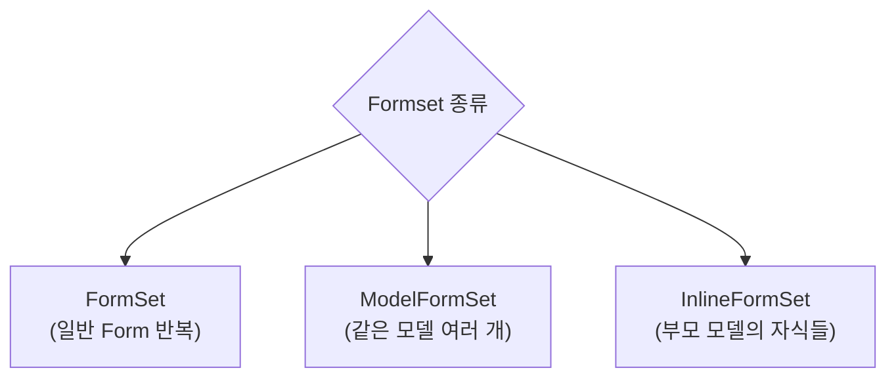

## 정의

**Formset** = *여러 폼을 한 페이지에서 동시* 처리. "상품 3개 한 번에 등록", "주문 상세 여러 줄 편집" 같은 시나리오.

## 3가지 종류



## 1. 기본 FormSet

```python
from django import forms
from django.forms import formset_factory

class ContactForm(forms.Form):
    name = forms.CharField()
    email = forms.EmailField()

ContactFormSet = formset_factory(
    ContactForm,
    extra=2,        # 빈 폼 개수
    max_num=10,     # 최대 개수
    can_delete=True,
)

def contacts_view(request):
    if request.method == 'POST':
        formset = ContactFormSet(request.POST)
        if formset.is_valid():
            for form in formset:
                if form.cleaned_data.get('DELETE'):
                    continue
                name = form.cleaned_data['name']
                email = form.cleaned_data['email']
                # 저장 로직
    else:
        formset = ContactFormSet()
    return render(request, 'contacts.html', {'formset': formset})
```

## Template + Management Form

```html
<form method="post">
  
  {{ formset.management_form }}   <!-- 필수! -->
  
    <div class="form-row">
      {{ form.as_p }}
    </div>
  
  <button type="submit">저장</button>
</form>
```

> [!CAUTION]
> **`{{ formset.management_form }}` 필수** - 폼 개수 등 메타데이터. 안 넣으면 `ValidationError`.

Management form 이 렌더링:

```html
<input type="hidden" name="form-TOTAL_FORMS" value="2">
<input type="hidden" name="form-INITIAL_FORMS" value="0">
<input type="hidden" name="form-MIN_NUM_FORMS" value="0">
<input type="hidden" name="form-MAX_NUM_FORMS" value="10">
```

## 2. ModelFormSet

```python
from django.forms import modelformset_factory

ProductFormSet = modelformset_factory(
    Product,
    fields=('name', 'price', 'stock'),
    extra=1,
    can_delete=True,
)

def products_admin(request):
    if request.method == 'POST':
        formset = ProductFormSet(request.POST, queryset=Product.objects.filter(active=True))
        if formset.is_valid():
            formset.save()
    else:
        formset = ProductFormSet(queryset=Product.objects.filter(active=True))
    return render(request, 'products.html', {'formset': formset})
```

## 3. InlineFormSet (부모-자식)

```python
from django.forms import inlineformset_factory

# Author 하나에 여러 Book
BookFormSet = inlineformset_factory(
    Author,          # 부모
    Book,            # 자식
    fields=('title', 'published_at'),
    extra=1,
    can_delete=True,
)

def edit_author(request, author_id):
    author = Author.objects.get(pk=author_id)
    if request.method == 'POST':
        formset = BookFormSet(request.POST, instance=author)
        if formset.is_valid():
            formset.save()   # 자동으로 author 지정!
    else:
        formset = BookFormSet(instance=author)
    return render(request, 'author_books.html', {'author': author, 'formset': formset})
```

## 동적 formset (JavaScript)

```html
<form method="post">
  
  {{ formset.management_form }}

  <div id="forms-container">
    
      <div class="form-row">
        {{ form.as_p }}
      </div>
    
  </div>

  <button type="button" onclick="addForm()">폼 추가</button>
  <button type="submit">저장</button>
</form>

<script>
function addForm() {
  const container = document.getElementById('forms-container');
  const totalForms = document.getElementById('id_form-TOTAL_FORMS');
  const idx = parseInt(totalForms.value);

  const template = container.children[0].outerHTML;
  const newForm = template.replaceAll(`form-0-`, `form-${idx}-`);
  container.insertAdjacentHTML('beforeend', newForm);

  totalForms.value = idx + 1;
}
</script>
```

## Validation

```python
class BaseContactFormSet(forms.BaseFormSet):
    def clean(self):
        """폼셋 전체 검증"""
        if any(self.errors):
            return

        emails = []
        for form in self.forms:
            if form.cleaned_data.get('DELETE'):
                continue
            email = form.cleaned_data.get('email')
            if email in emails:
                raise forms.ValidationError('이메일 중복 금지')
            emails.append(email)

ContactFormSet = formset_factory(
    ContactForm,
    formset=BaseContactFormSet,
    extra=2,
)
```

## Ordering (순서 변경)

```python
ContactFormSet = formset_factory(
    ContactForm,
    extra=2,
    can_order=True,   # ← 순서 변경 UI
)
```

## Django 6.0 개선

- `{{ formset.non_form_errors }}` 렌더링 개선
- HTMX 통합 예시 문서 추가
- Type hints 강화

## 다른 프레임워크

| Framework | 여러 폼 처리 |
|---|---|
| **Django** | `formset_factory`, `inlineformset_factory` |
| **Rails** | `accepts_nested_attributes_for` + `fields_for` |
| **Spring** | List binding + `@Valid` |
| **HTMX + Alpine** | 동적 추가 |

## 흔한 함정

> [!WARNING]
> 1. **management form 누락** = `ValidationError`.
> 2. **DELETE 무시하고 저장** = 삭제 안 됨. `if form.cleaned_data.get('DELETE'): continue`.
> 3. **동적 추가 시 form index 잘못** = server side 검증 실패.
> 4. **max_num 무시** = 무한 폼 추가 → DoS.

## 관련 위키

- [[django-forms]]
- [[django-modelforms]]
- [[django-views]]
