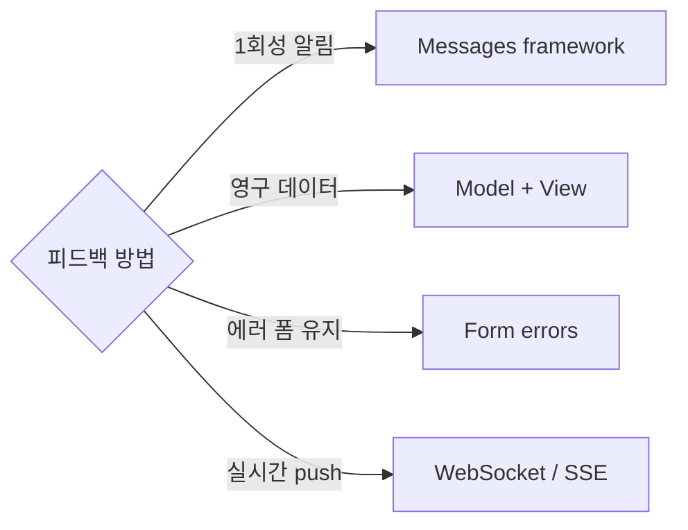
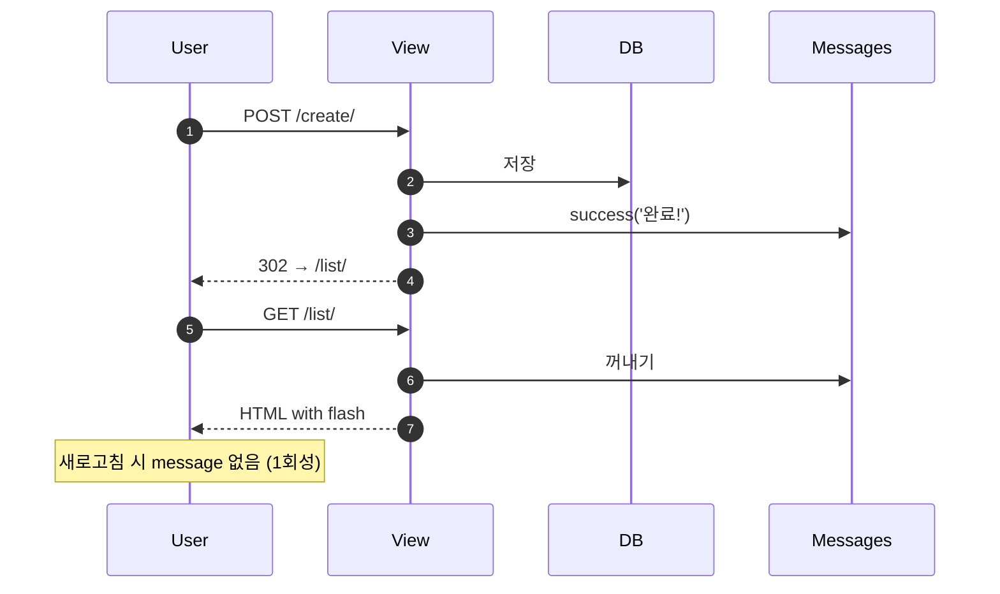

## 정의

**Messages Framework** = *1회성 flash 메시지* (성공, 오류 등) 를 사용자에게 표시. Post/Redirect/Get 패턴에서 필수.

## 목적 + 대안



## 기본 설정

```python
# settings.py
INSTALLED_APPS = [
    ...
    'django.contrib.messages',
    ...
]

MIDDLEWARE = [
    'django.contrib.sessions.middleware.SessionMiddleware',
    ...
    'django.contrib.messages.middleware.MessageMiddleware',
]

TEMPLATES = [{
    'OPTIONS': {
        'context_processors': [
            ...
            'django.contrib.messages.context_processors.messages',
        ],
    },
}]
```

## 사용

```python
# views.py
from django.contrib import messages

def create_article(request):
    if request.method == 'POST':
        form = ArticleForm(request.POST)
        if form.is_valid():
            form.save()
            messages.success(request, '게시글이 등록되었어요.')
            return redirect('article_list')
        else:
            messages.error(request, '입력을 확인해주세요.')
    else:
        form = ArticleForm()
    return render(request, 'form.html', {'form': form})
```

## 5가지 레벨

| 함수 | 레벨 |
|---|---|
| `messages.debug(request, ...)` | DEBUG (10) |
| `messages.info(request, ...)` | INFO (20) |
| `messages.success(request, ...)` | SUCCESS (25) |
| `messages.warning(request, ...)` | WARNING (30) |
| `messages.error(request, ...)` | ERROR (40) |
| `messages.add_message(request, level, ...)` | 커스텀 |

## Template 표시

```html
<!-- base.html -->

<div class="messages">
  
    <div class="alert alert-{{ message.tags }}" role="alert">
      {{ message }}
      <button type="button" class="close" data-dismiss="alert">&times;</button>
    </div>
  
</div>

```

`message.tags` = `success`, `error`, `warning` 등 CSS 클래스 그대로.

## 옵션 (Extra tags)

```python
messages.success(
    request,
    '완료!',
    extra_tags='animate-bounce',
    fail_silently=False,
)
```

```html
{{ message.tags }}  <!-- "success animate-bounce" -->
```

## Level 설정

```python
# settings.py
from django.contrib.messages import constants as message_constants

MESSAGE_LEVEL = message_constants.WARNING   # 이 레벨 이상만 저장
```

```python
# 특정 request 만
messages.set_level(request, messages.DEBUG)
```

## Storage Backend

| Backend | 의미 |
|---|---|
| `SessionStorage` (기본) | Django session 에 저장 |
| `CookieStorage` | 브라우저 cookie 에 (session-less) |
| `FallbackStorage` (기본) | Cookie 우선, 크면 session |

```python
MESSAGE_STORAGE = 'django.contrib.messages.storage.cookie.CookieStorage'
```

## HTMX 통합 예시

```python
from django.http import HttpResponse

def htmx_action(request):
    do_something()
    messages.success(request, '완료됨')

    if request.htmx:
        response = HttpResponse('OK')
        response['HX-Trigger'] = json.dumps({'showMessages': True})
        return response
    return redirect('home')
```

```html
<div hx-get="" hx-trigger="showMessages from:body"></div>
```

## Class-Based View 통합

```python
from django.contrib.messages.views import SuccessMessageMixin

class ArticleCreateView(SuccessMessageMixin, CreateView):
    model = Article
    fields = ['title', 'body']
    success_message = '게시글 "%(title)s" 이 등록되었습니다.'
    success_url = '/articles/'
```

## PRG (Post/Redirect/Get) 패턴



Rails 의 `flash` 와 정확히 동일한 패턴.

## 다른 프레임워크

| Framework | Flash message |
|---|---|
| **Django** | `messages.success()` |
| **Rails** | `flash[:notice]` |
| **Spring** | `RedirectAttributes.addFlashAttribute()` |
| **Laravel** | `session()->flash()` |
| **Express** | `connect-flash` middleware |

## 흔한 함정

> [!WARNING]
> 1. **AJAX 응답에 messages** = redirect 없이 API 응답 → 다음 요청까지 남음. 명시적 처리.
> 2. **messages 후 render** = redirect 안 하면 template 에서 소비됨 (다음 request 에 안 보임). PRG.
> 3. **Cookie storage 크기 초과** = 4KB 넘으면 잘림. 짧게.
> 4. **XSS** = 사용자 입력을 `messages` 로 그대로 → escape 안 됨. `{{ message|safe }}` 절대 금지.

## 관련 위키

- [[django-sessions]]
- [[django-views]]
- [[django-mixins]]
- [[django-mvc-model-bindingresult]] (Spring 의 PRG)
