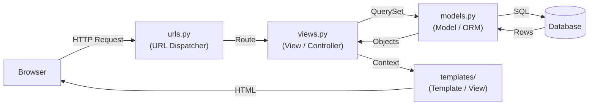
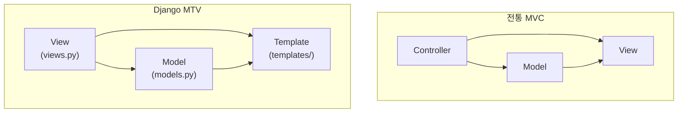

## 정의

Django 는 **MTV (Model, Template, View)** 패턴 사용. 다른 프레임워크의 MVC 와 이름만 다르고 개념은 유사.

| MVC | Django MTV | 역할 |
|:---|:---|:---|
| Model | Model (ORM) | 데이터 구조 + DB 접근 |
| View | Template | 표현 (HTML 렌더링) |
| Controller | View (function/class) | 요청 처리 + 비즈니스 로직 |

> [!IMPORTANT]
> Django 의 "View" 는 MVC 의 "Controller" 에 해당한다. 이름이 역전되어 있어 혼동 주의.

## MTV 흐름



URL Dispatcher 가 정규식/경로 패턴으로 View 를 찾고, View 가 Model 에 쿼리 후 Template 에 렌더링을 위임한다.

## MVC vs MTV 비교

전통 MVC 와 Django MTV 는 동일 아키텍처지만 용어가 다르다.



## Model 정의

```python
from django.db import models

class Post(models.Model):
    title = models.CharField(max_length=200)
    body = models.TextField()
    author = models.ForeignKey('auth.User', on_delete=models.CASCADE, related_name='posts')
    created = models.DateTimeField(auto_now_add=True)
    updated = models.DateTimeField(auto_now=True)
    published = models.BooleanField(default=False)
    slug = models.SlugField(unique=True)

    class Meta:
        ordering = ['-created']
        verbose_name = 'post'
        verbose_name_plural = 'posts'
        indexes = [
            models.Index(fields=['slug']),
            models.Index(fields=['author', '-created']),
        ]

    def __str__(self):
        return self.title

    def get_absolute_url(self):
        from django.urls import reverse
        return reverse('post_detail', kwargs={'slug': self.slug})
```

## 관계 필드

### ForeignKey (N:1)

```python
class Comment(models.Model):
    post = models.ForeignKey(Post, on_delete=models.CASCADE, related_name='comments')
    author = models.ForeignKey('auth.User', on_delete=models.SET_NULL, null=True)
    body = models.TextField()
```

`on_delete` 옵션:
| 값 | 동작 |
|:---|:---|
| `CASCADE` | 부모 삭제 시 자식도 삭제 |
| `PROTECT` | 자식 존재 시 부모 삭제 차단 (ProtectedError) |
| `SET_NULL` | NULL 로 설정 (null=True 필요) |
| `SET_DEFAULT` | 기본값으로 설정 |
| `DO_NOTHING` | DB 에 맡김 (외래 키 제약 위반 가능) |

### OneToOneField (1:1)

```python
class Profile(models.Model):
    user = models.OneToOneField('auth.User', on_delete=models.CASCADE, related_name='profile')
    bio = models.TextField(blank=True)
    avatar = models.ImageField(upload_to='avatars/', null=True, blank=True)
```

`user.profile` 으로 역참조. 상속 대신 프로필 확장에 자주 쓰임.

### ManyToManyField (N:M)

```python
class Tag(models.Model):
    name = models.CharField(max_length=50, unique=True)

class Post(models.Model):
    ...
    tags = models.ManyToManyField(Tag, blank=True, related_name='posts')
```

중간 테이블 자동 생성. 추가 필드가 필요하면 `through=` 사용:

```python
class PostTag(models.Model):
    post = models.ForeignKey(Post, on_delete=models.CASCADE)
    tag = models.ForeignKey(Tag, on_delete=models.CASCADE)
    added_by = models.ForeignKey('auth.User', on_delete=models.SET_NULL, null=True)
    added_at = models.DateTimeField(auto_now_add=True)

class Post(models.Model):
    tags = models.ManyToManyField(Tag, through=PostTag, related_name='posts')
```

## 주요 필드 타입

| 필드 | 설명 | 예시 |
|:---|:---|:---|
| `CharField` | 짧은 문자열 | `max_length=200` |
| `TextField` | 긴 텍스트 | 블로그 본문 |
| `IntegerField` | 정수 | 조회수 |
| `FloatField` / `DecimalField` | 실수 / 고정소수점 | 가격, 평점 |
| `BooleanField` | True/False | `default=False` |
| `DateField` / `DateTimeField` | 날짜/시각 | `auto_now_add`, `auto_now` |
| `SlugField` | URL-friendly 문자열 | `unique=True` |
| `EmailField` | 이메일 검증 포함 | |
| `URLField` | URL 검증 포함 | |
| `FileField` / `ImageField` | 파일/이미지 | `upload_to='photos/'` |
| `JSONField` | JSON 저장 (PostgreSQL 최적화) | |
| `UUIDField` | UUID | `default=uuid.uuid4` |

## 마이그레이션

```bash
python manage.py makemigrations
python manage.py migrate
```

자세히: [[django-migrations]]

## CRUD

```python
# Create
post = Post.objects.create(title="Hello", body="...", author=user, slug="hello")

# Read
post = Post.objects.get(pk=1)                             # 없으면 DoesNotExist
post = Post.objects.get(slug="hello")
posts = Post.objects.filter(published=True).order_by('-created')[:10]
posts = Post.objects.select_related('author').prefetch_related('tags')   # N+1 방지

# Update
Post.objects.filter(author=user).update(published=True)   # 한 번의 SQL
post.title = "Updated"
post.save()
post.save(update_fields=['title'])    # 지정 필드만

# Delete
post.delete()
Post.objects.filter(published=False).delete()
```

## related_name 과 역참조

```python
# ForeignKey 정의: author = models.ForeignKey('auth.User', related_name='posts')
user.posts.all()                     # User 의 모든 Post
user.posts.filter(published=True)

# related_name 미지정 시 기본: post_set
# user.post_set.all()

# M2M 역참조
tag.posts.all()                      # 태그에 달린 모든 포스트
```

## select_related / prefetch_related

N+1 쿼리 방지.

```python
# ForeignKey, OneToOne → SQL JOIN (1 쿼리)
Post.objects.select_related('author', 'author__profile')

# ManyToMany, 역참조 ForeignKey → 별도 IN 쿼리 (2 쿼리)
Post.objects.prefetch_related('tags', 'comments__author')

# 조합
Post.objects.select_related('author').prefetch_related('tags')
```

자세히: [[django-orm-advanced]]

## View + Form + Template 흐름

```python
# views.py
from django.shortcuts import render, redirect
from .forms import PostForm
from .models import Post

def post_create(request):
    if request.method == 'POST':
        form = PostForm(request.POST)
        if form.is_valid():
            post = form.save(commit=False)
            post.author = request.user
            post.save()
            return redirect('post_detail', pk=post.pk)
    else:
        form = PostForm()
    return render(request, 'post_form.html', {'form': form})
```

Form 이 검증 (validation) + 정제 (cleaning) 담당. `form.is_valid()` 는 Django 의 binding + validation 관용구.

## Model Manager

```python
class PublishedManager(models.Manager):
    def get_queryset(self):
        return super().get_queryset().filter(published=True)

class Post(models.Model):
    objects = models.Manager()          # 기본
    published = PublishedManager()      # 커스텀

# 사용
Post.published.all()                    # published=True 만
Post.published.order_by('-created')[:5]
```

## 함정

> [!WARNING]
> **`auto_now` vs `auto_now_add`**: `auto_now` 는 저장할 때마다 갱신, `auto_now_add` 는 생성 시 1회만. `editable=False` 이므로 form 에서 직접 설정 불가.

> [!WARNING]
> **N+1 쿼리**: `for post in Post.objects.all(): post.author.username` 은 Post 수만큼 추가 쿼리 발생. `select_related('author')` 로 해결.

> [!CAUTION]
> **`get()` 예외**: 결과가 0개면 `DoesNotExist`, 2개 이상이면 `MultipleObjectsReturned`. `filter().first()` 를 쓰거나 `get_object_or_404()` 활용.

```python
from django.shortcuts import get_object_or_404
post = get_object_or_404(Post, slug='hello')
```

## 관련 위키

- [[django-models-fields]] - 필드 타입 심화
- [[django-queryset]] - 쿼리 심화
- [[django-orm-advanced]] - N+1, Subquery, Window
- [[django-migrations]] - 스키마 변경 관리
- [[django-forms]] - ModelForm, 검증
- [[django-views]] - FBV vs CBV
- [[django-testing]] - 테스트 (factory_boy)
- [[django-overview]] - 프로젝트 구조 전체
- [[django]] - Django 전체 색인
