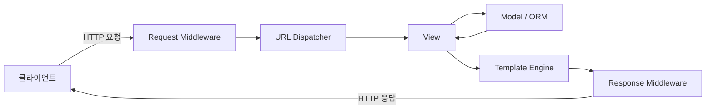

## 정의

**Django**는 2003년 시작된 Python 풀스택 웹 프레임워크. "Web framework for perfectionists with deadlines"라는 모토대로 **batteries-included**(ORM, 관리자, 인증, 폼, 마이그레이션, 캐싱 등 기본 내장). MTV(Model-Template-View) 아키텍처. Instagram, Pinterest, Mozilla 등 대규모 운영 사례.

## MTV 패턴

전통적인 MVC와 약간 다른 명명.

| Django | 전통 MVC | 역할 |
|--------|---------|------|
| Model | Model | DB 스키마와 비즈니스 로직 |
| Template | View | HTML 렌더링 |
| View | Controller | HTTP 요청 처리 |
| URL Dispatcher | Router | URL → View 매핑 |

요청 흐름: URL → View → (Model 조회/변경) → Template 렌더링 → Response

## 요청 처리 흐름



미들웨어는 요청/응답 양방향을 모두 가로챌 수 있다. 인증, 세션, CSRF, 캐싱 등이 여기 위치한다.

## 프로젝트 구조

```bash
django-admin startproject myproject
cd myproject
python manage.py startapp blog
```

```
myproject/
├── manage.py              # CLI 진입점
├── myproject/             # 프로젝트 설정 패키지
│   ├── __init__.py
│   ├── settings.py        # 설정
│   ├── urls.py            # 루트 URL conf
│   ├── asgi.py            # ASGI 진입점
│   └── wsgi.py            # WSGI 진입점
├── blog/                  # 앱
│   ├── __init__.py
│   ├── admin.py           # 관리자 등록
│   ├── apps.py            # 앱 설정
│   ├── models.py          # 데이터 모델
│   ├── views.py           # 뷰
│   ├── urls.py            # 앱별 URL (관례)
│   ├── tests.py
│   └── migrations/        # DB 마이그레이션
└── templates/             # 템플릿 (관례)
```

**프로젝트 = 사이트, 앱 = 기능 단위**. 한 프로젝트에 여러 앱. 앱은 독립적이고 재사용 가능하도록 작성.

## 첫 모델

```python
# blog/models.py
from django.db import models

class Post(models.Model):
    title = models.CharField(max_length=200)
    body = models.TextField()
    created_at = models.DateTimeField(auto_now_add=True)

    def __str__(self):
        return self.title
```

마이그레이션 생성과 적용:

```bash
python manage.py makemigrations
python manage.py migrate
```

## 첫 뷰와 URL

```python
# blog/views.py
from django.shortcuts import render
from .models import Post

def post_list(request):
    posts = Post.objects.all()
    return render(request, "blog/post_list.html", {"posts": posts})

# blog/urls.py
from django.urls import path
from . import views

urlpatterns = [
    path("", views.post_list, name="post-list"),
]

# myproject/urls.py
from django.urls import include, path

urlpatterns = [
    path("blog/", include("blog.urls")),
]
```

## 템플릿

```html
{# templates/blog/post_list.html #}

    <h2>{{ post.title }}</h2>
    <p>{{ post.body|truncatewords:30 }}</p>

    <p>No posts.</p>

```

## 개발 서버

```bash
python manage.py runserver        # localhost:8000
python manage.py runserver 8080
python manage.py runserver 0.0.0.0:8000    # 외부 접속
```

프로덕션엔 절대 사용 X. Gunicorn/Uvicorn + nginx.

## settings.py 핵심

```python
INSTALLED_APPS = [
    "django.contrib.admin",
    "django.contrib.auth",
    "django.contrib.contenttypes",
    "django.contrib.sessions",
    "django.contrib.messages",
    "django.contrib.staticfiles",
    "blog",          # 우리 앱
]

DATABASES = {
    "default": {
        "ENGINE": "django.db.backends.postgresql",
        "NAME": "mydb",
        "USER": "myuser",
        "PASSWORD": "...",
        "HOST": "localhost",
        "PORT": "5432",
    }
}

MIDDLEWARE = [
    "django.middleware.security.SecurityMiddleware",
    "django.contrib.sessions.middleware.SessionMiddleware",
    "django.middleware.common.CommonMiddleware",
    "django.middleware.csrf.CsrfViewMiddleware",
    "django.contrib.auth.middleware.AuthenticationMiddleware",
    "django.contrib.messages.middleware.MessageMiddleware",
    "django.middleware.clickjacking.XFrameOptionsMiddleware",
]

DEBUG = True       # 프로덕션에선 반드시 False
SECRET_KEY = "..."  # 절대 커밋 X
ALLOWED_HOSTS = ["example.com"]
```

## manage.py 자주 쓰는 명령

```bash
python manage.py startapp blog          # 앱 생성
python manage.py makemigrations         # 마이그레이션 파일 생성
python manage.py migrate                # DB에 적용
python manage.py createsuperuser        # 관리자 계정
python manage.py shell                  # IPython/REPL
python manage.py dbshell                # DB CLI
python manage.py collectstatic          # 정적 파일 수집
python manage.py test                   # 테스트
python manage.py runserver
```

## Django vs Flask vs FastAPI

| | Django | Flask | FastAPI |
|---|--------|-------|---------|
| 스타일 | 배터리 포함 | 마이크로 | API 우선 |
| ORM | 내장 | SQLAlchemy 등 | 외부 |
| 관리자 | 내장 | X | X |
| 비동기 | 부분 (3.1+) | 부분 | 네이티브 |
| 학습 곡선 | 중 | 낮 | 중 |
| 적합 | 일반 웹앱, CMS | 작은 API/앱 | API, 마이크로서비스 |

## 버전과 LTS

| 버전 | 출시 | 지원 종료 | 비고 |
|------|------|----------|------|
| 4.2 LTS | 2023-04 | 2026-04 | 이전 LTS |
| 5.0 | 2023-12 | 2025-04 | |
| 5.1 | 2024-08 | 2025-12 | |
| 5.2 LTS | 2025-04 | 2028-04 | **현재 LTS** |

LTS는 3년 지원. 프로덕션은 LTS 권장.

## 함정

### 1. DEBUG = True 를 프로덕션에 두면 안 된다

에러 발생 시 스택 트레이스, 로컬 변수, settings 값까지 브라우저에 노출된다. `SECRET_KEY` 도 유출 위험이 있다. 프로덕션에서는 반드시 `DEBUG = False` 와 `ALLOWED_HOSTS` 설정.

### 2. N+1 쿼리

```python
# ✗ 루프마다 쿼리 발생 (FK 마다 SELECT)
for post in Post.objects.all():
    print(post.author.name)

# ✓ select_related 로 JOIN 한 번에
for post in Post.objects.select_related("author"):
    print(post.author.name)
```

ORM 이 편리하지만 쿼리 수를 놓치기 쉽다. `django-debug-toolbar` 나 [[django-orm-advanced|ORM 고급]] 를 통해 쿼리 수를 확인해야 한다.

### 3. 마이그레이션 충돌

팀 개발 시 두 브랜치가 동시에 `makemigrations` 를 실행하면 번호가 충돌한다. `squashmigrations` 또는 충돌 파일 수동 정리로 해소. 자세히는 [[django-migrations|Django Migrations]] 참조.

### 4. SECRET_KEY 노출

`.env` 또는 환경 변수로 관리해야 한다. 실수로 `git commit` 에 포함되면 레포가 public 이 되는 순간 키 탈취 가능. `django-environ` / `python-decouple` 로 환경 변수 분리를 권장.

### 5. ALLOWED_HOSTS 미설정

`DEBUG = False` 일 때 `ALLOWED_HOSTS = []` 면 모든 요청이 400 응답. 도메인/IP 를 정확히 나열해야 한다.

## 관련 위키

- [[django-views|Django View]]
- [[django-models-fields|Django Model 필드]]
- [[django-templates|Django Template]]
- [[django-urls|Django URL 라우팅]]
- [[django-migrations|Django Migrations]]
- [[django-admin|Django Admin]]
- [[django-auth|Django 인증]]
- [[django-rest-framework|Django REST Framework]]
- [[django-settings|Django Settings]]
- [[django-deployment|Django 배포]]
- [[django-testing|Django 테스트]]
- [[django-orm-advanced|Django ORM 고급]]
