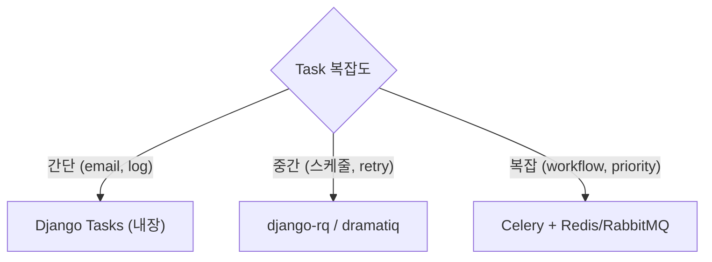
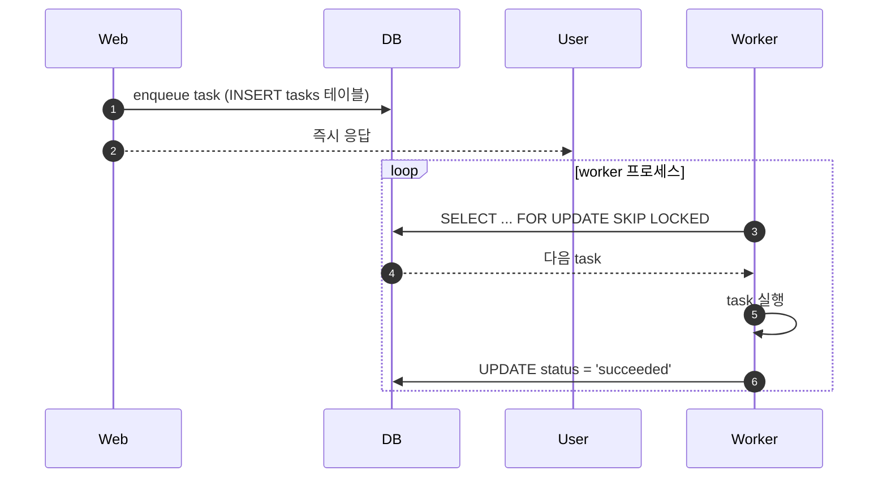
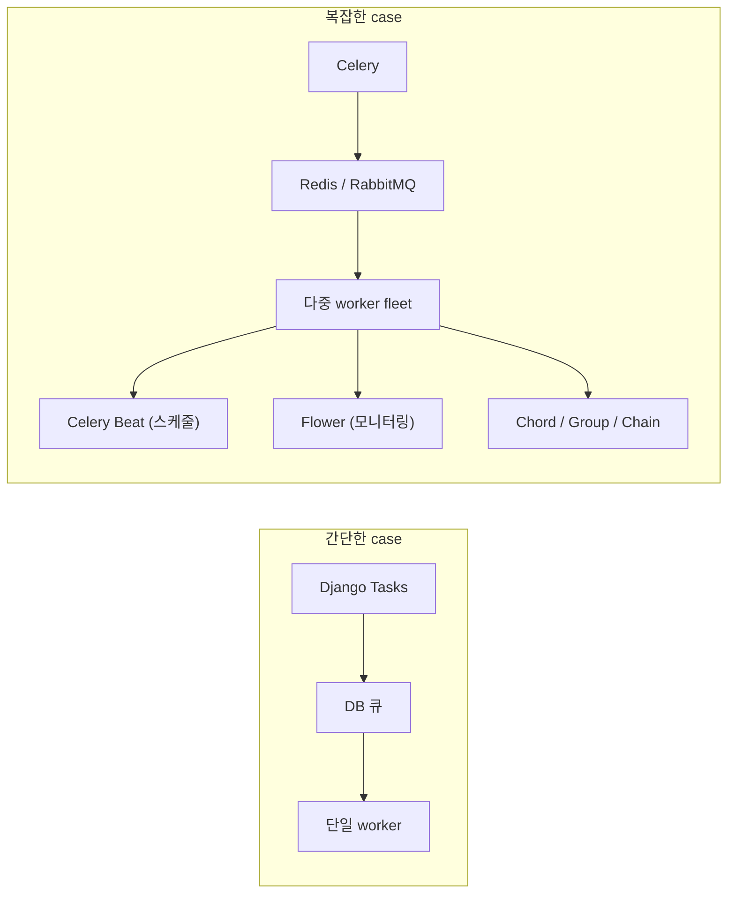

## 정의

**Django Tasks Framework** = Django 6.0 (2025) 도입된 *내장 백그라운드 작업 실행 표준*. Celery 없이 *간단한 async task* 를 표준 방식으로.

> [!IMPORTANT]
> Django 진영의 *가장 큰 최신 변화*. Celery 를 대체하려는 것이 아니라 *간단한 task 는 내장, 복잡한 것은 여전히 Celery* 라는 layer 분리.

## 목적 + 대안



| Option | 장점 | 단점 |
|---|---|---|
| **Django Tasks** (6.0+) | *표준, zero setup, DB backend* | 기본 기능만 |
| **django-rq** | 간단, Redis 기반 | 배포 별도 |
| **dramatiq** | 빠름, retry 강력 | 옛 |
| **Celery** | 최강, 전체 기능 | *설정 복잡, 무거움* |

## 기본 사용

```python
# tasks.py
from django.tasks import task

@task()
def send_welcome_email(user_id: int):
    from django.core.mail import send_mail
    from myapp.models import User

    user = User.objects.get(pk=user_id)
    send_mail(
        subject='환영합니다!',
        message=f'{user.name}님 가입해주셔서 감사합니다.',
        from_email='noreply@example.com',
        recipient_list=[user.email],
    )
```

```python
# views.py
from django.contrib.auth import login
from .tasks import send_welcome_email

def signup(request):
    user = User.objects.create_user(...)
    send_welcome_email.enqueue(user.pk)   # 백그라운드로!
    login(request, user)
    return redirect('home')
```

## Backend 설정

```python
# settings.py
TASKS = {
    'default': {
        'BACKEND': 'django.tasks.backends.database.DatabaseBackend',
    },
}
```

Backend 종류:

| Backend | 의미 |
|---|---|
| `ImmediateBackend` | *동기 실행* (개발) |
| `DummyBackend` | 실행 안 함 (테스트) |
| `DatabaseBackend` | *DB 큐* (기본, 프로덕션 OK) |
| `RedisBackend` (contrib) | Redis 큐 |

## Worker 실행

```bash
# 별도 프로세스로 worker 실행
python manage.py db_worker
```



## 옵션

```python
@task(
    queue='email',              # 큐 이름
    priority=5,                 # 우선순위 (높을수록 먼저)
    backend='default',
)
def send_email(user_id): ...

# enqueue 시 우선순위 override
send_email.using(priority=10, queue='urgent').enqueue(user_id)

# 지연 실행
from datetime import timedelta
send_email.enqueue(user_id, run_after=timedelta(hours=1))
```

## Retry + Error

```python
@task()
def flaky_api_call(url: str):
    response = requests.get(url, timeout=5)
    response.raise_for_status()
    return response.json()

# 실패 시 재시도
result = flaky_api_call.using(
    max_retries=3,
    retry_backoff=True,     # 지수 백오프
).enqueue('https://api.example.com')
```

## 결과 확인

```python
result = send_email.enqueue(user.pk)

# 상태 조회
result.refresh()
print(result.status)   # 'ready', 'running', 'succeeded', 'failed'
print(result.enqueued_at)
print(result.started_at)
print(result.finished_at)

# 결과값 (return value)
if result.status == 'succeeded':
    print(result.return_value)
elif result.status == 'failed':
    print(result.errors)
```

## Django Tasks vs Celery



| Feature | Django Tasks | Celery |
|---|---|---|
| 설정 | *3줄* | 여러 파일 |
| Broker | DB 또는 Redis | Redis/RabbitMQ/SQS |
| 스케줄 | 지연 실행만 | *Celery Beat* |
| Workflow (chain, group) | 아니오 | *예* |
| Priority queue | 예 | 예 |
| Rate limiting | 아니오 | 예 |
| Monitoring | 기본 | *Flower + Prometheus* |
| 학습 곡선 | 매우 낮음 | 가파름 |

> [!TIP]
> *새 Django 프로젝트 (6.0+)* = 간단한 task 는 Django Tasks. *스케줄, workflow, 대량 처리* 는 Celery.

## 다른 프레임워크 비교

| Framework | Task 시스템 |
|---|---|
| **Django 6.0+** | *django.tasks* (내장) |
| **Rails** | *Active Job* (내장 표준) |
| **Spring** | `@Async`, `@Scheduled` |
| **Laravel** | *Queue* (내장) |
| **FastAPI** | `BackgroundTasks` (간단) 또는 Celery |
| **Express** | 별도 (Bull, agenda) |

> Rails / Laravel / Django 모두 *공통 태스크 API + 여러 backend* 패턴. Ruby 진영이 먼저 (2015) → Django 는 10년 뒤 (2025).

## Test

```python
# settings 에서 DummyBackend 로 전환
TASKS = {'default': {'BACKEND': 'django.tasks.backends.dummy.DummyBackend'}}

from django.test import TestCase
from django.tasks import default_task_backend

class TaskTest(TestCase):
    def test_signup_enqueues_welcome_email(self):
        response = self.client.post('/signup/', {...})

        # 큐에 들어갔는지 확인
        self.assertEqual(default_task_backend.queue.qsize(), 1)
        task = default_task_backend.queue[0]
        self.assertEqual(task.task_func.__name__, 'send_welcome_email')
```

## 흔한 함정

> [!WARNING]
> 1. **Worker 안 띄움** = task 가 *DB 에 쌓이지만 실행 안 됨*. `db_worker` 확인.
> 2. **Task 안에서 request/response 참조** = worker 프로세스에는 request 없음. 필요한 값 인자로 전달.
> 3. **Serialization 어려운 인자** = model instance 통째로 전달 → pickle 실패. *`.pk` 만 전달* 하고 worker 에서 조회.
> 4. **Transaction 안에서 enqueue** = commit 전에 worker 가 조회 → race. `transaction.on_commit(lambda: task.enqueue(...))`.

## 관련 위키

- [[django-celery]] (더 복잡한 대안)
- [[django-async-views]] (async 함수)
- [[django-email]]
- [[Redis Streams]] (backend 대안)
