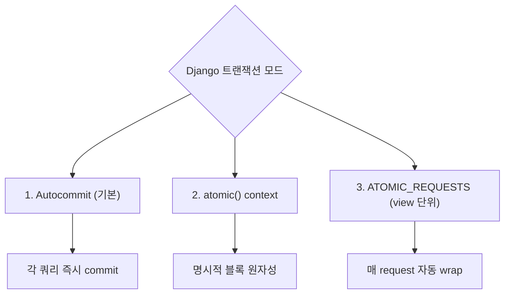
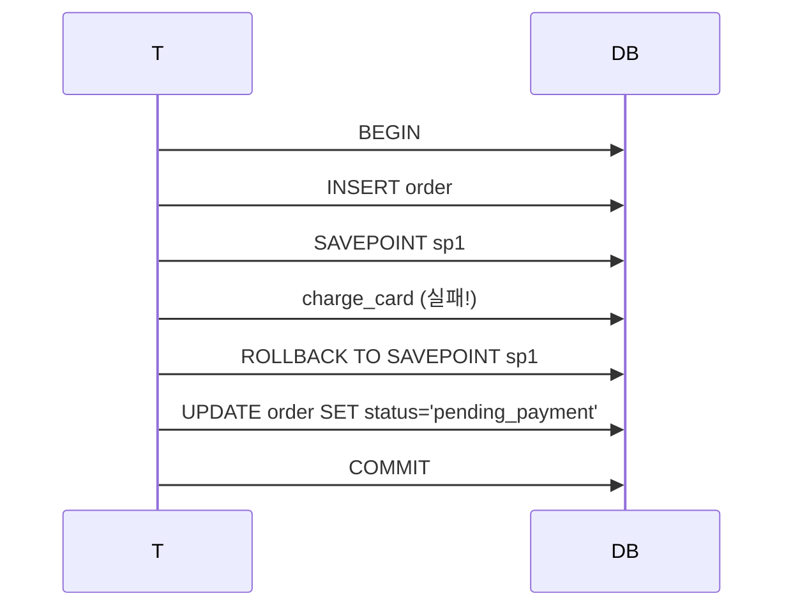
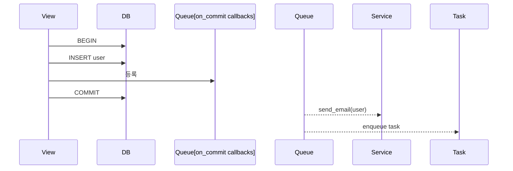

## 정의

**Transaction** = *여러 SQL 문을 원자적 (all-or-nothing) 으로 실행*. Django 는 자동 커밋 (autocommit) 모드가 기본, `transaction.atomic()` 으로 명시적 트랜잭션.

일반 트랜잭션 개념은 [[transaction-isolation-levels]] 참고.

## 3가지 트랜잭션 모드



## 1. `transaction.atomic()` (권장)

```python
from django.db import transaction

@transaction.atomic
def transfer_money(from_user_id, to_user_id, amount):
    from_account = Account.objects.select_for_update().get(user_id=from_user_id)
    to_account = Account.objects.select_for_update().get(user_id=to_user_id)

    if from_account.balance < amount:
        raise ValidationError('잔액 부족')

    from_account.balance -= amount
    to_account.balance += amount
    from_account.save()
    to_account.save()
```

Context manager 형태:

```python
def signup(request):
    with transaction.atomic():
        user = User.objects.create_user(...)
        Profile.objects.create(user=user, ...)
        # 예외 발생 시 둘 다 rollback
```

## 2. Nested atomic (savepoint)

```python
with transaction.atomic():
    order = Order.objects.create(...)
    try:
        with transaction.atomic():        # ← savepoint
            payment = charge_card(order)
    except PaymentError:
        # 결제만 rollback, 주문은 유지
        order.status = 'pending_payment'
        order.save()
```



## 3. ATOMIC_REQUESTS

```python
# settings.py
DATABASES = {
    'default': {
        ...
        'ATOMIC_REQUESTS': True,
    },
}
```

각 view = 자동으로 `atomic()` 로 감쌈. 예외 시 자동 rollback.

> [!CAUTION]
> **성능 영향**: 모든 요청이 트랜잭션 → *DB connection 오래 점유*. 대량 트래픽 시 명시적 `atomic()` 권장.

## `on_commit` (커밋 후 실행)

```python
from django.db import transaction

def signup(request):
    with transaction.atomic():
        user = User.objects.create_user(...)
        # 즉시 실행 (트랜잭션 안!)
        # send_email(user)   # ← ROLLBACK 시 이미 전송됨!

        # commit 후 실행
        transaction.on_commit(lambda: send_email(user))
        transaction.on_commit(lambda: send_welcome_task.enqueue(user.pk))
```



> [!IMPORTANT]
> **외부 시스템 호출은 항상 `on_commit`** - 이메일, 결제, task, webhook 등. rollback 시 부수효과 없어야 함.

## `select_for_update` (비관적 락)

```python
@transaction.atomic
def reserve_seat(seat_id):
    seat = Seat.objects.select_for_update().get(pk=seat_id)
    if seat.is_reserved:
        raise AlreadyReservedError()
    seat.is_reserved = True
    seat.save()
```

SQL: `SELECT ... FROM seats WHERE id = ? FOR UPDATE;`

다른 트랜잭션이 같은 row 를 *lock 잡을 때까지 대기*. Race condition 방지.

옵션:

```python
Seat.objects.select_for_update(
    skip_locked=True,       # 잠긴 행 skip (큐 pattern)
    nowait=True,            # 즉시 실패 (대기 X)
    of=('self',),           # 특정 테이블만 lock (JOIN 시)
).filter(...)
```

## Isolation Level

```python
# settings.py
DATABASES = {
    'default': {
        'ENGINE': 'django.db.backends.postgresql',
        'OPTIONS': {
            'isolation_level': psycopg.IsolationLevel.SERIALIZABLE,
        },
    }
}
```

자세한 건 [[transaction-isolation-levels]].

## 성능 - Bulk operations

```python
# ❌ N번 트랜잭션
for user in users:
    Profile.objects.create(user=user)

# ✓ 1번 트랜잭션 (bulk_create)
profiles = [Profile(user=u) for u in users]
Profile.objects.bulk_create(profiles)

# ✓ 명시적 트랜잭션
with transaction.atomic():
    for user in users:
        Profile.objects.create(user=user)
```

## Test 에서 transaction

```python
from django.test import TestCase, TransactionTestCase

class MyTest(TestCase):
    # 모든 테스트가 트랜잭션 안에서 실행 → rollback 으로 격리
    pass

class TransactionTest(TransactionTestCase):
    # 실제 commit/rollback 테스트 (on_commit 등)
    def test_signup_sends_email(self):
        with self.captureOnCommitCallbacks(execute=True):
            self.client.post('/signup/', {...})
```

## 흔한 함정

> [!WARNING]
> 1. **`atomic()` 안에서 외부 API 호출** = 트랜잭션 오래 점유. `on_commit` 으로.
> 2. **`select_for_update` 를 `atomic()` 밖에서** = `TransactionManagementError`.
> 3. **`ATOMIC_REQUESTS=True + long request`** = connection pool 고갈.
> 4. **savepoint 남발** = 성능 저하. 필요한 곳만.

## 다른 프레임워크

| Framework | Transaction |
|---|---|
| **Django** | `transaction.atomic()` |
| **Rails** | `ActiveRecord::Base.transaction` |
| **Spring** | `@Transactional` |
| **SQLAlchemy** | `session.begin()` |

## 관련 위키

- [[django-orm-advanced]]
- [[django-queryset]]
- [[transaction-isolation-levels]]
- [[postgresql]]
- [[outbox-pattern]]
