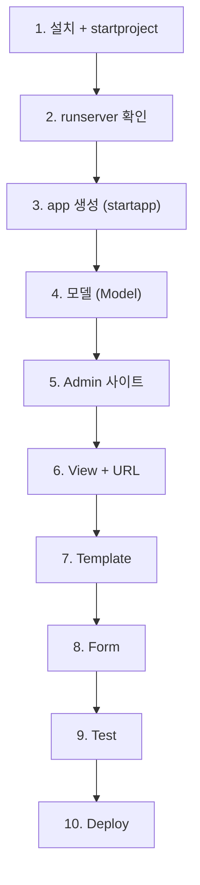

## 정의

Django 를 *처음 접하는 사람* 을 위한 순차 학습 페이지. *투표 앱 (polls)* 을 만들며 Django 의 핵심 개념을 익힌다.

먼저 [[django-overview]] 로 MTV 패턴과 프로젝트 구조를 파악한 후 이 페이지로.

## 학습 순서 (전체 지도)



이 순서로 페이지를 따라가면 *Django 의 90% 를 이해*.

## 사전 준비

```bash
# Python 3.12+ 권장 (Django 6.0 최소 3.12)
python --version

# 가상환경
python -m venv .venv
source .venv/bin/activate       # macOS/Linux
# .venv\Scripts\activate         # Windows

# Django 6.0 설치
pip install django
python -m django --version
```

## Step 1. 프로젝트 시작

```bash
django-admin startproject mysite
cd mysite
```

```
mysite/
├── manage.py           # CLI 진입점
└── mysite/
    ├── __init__.py
    ├── settings.py     # 설정 파일
    ├── urls.py         # 루트 URL 설정
    ├── asgi.py         # ASGI 서버
    └── wsgi.py         # WSGI 서버
```

```bash
python manage.py runserver
# → http://127.0.0.1:8000/ 접속
```

> [!TIP]
> `manage.py` 는 *프로젝트 마다 하나*. `django-admin` 은 *전역 명령*. 실제로 프로젝트 안에서는 `manage.py` 를 쓴다.

## Step 2. App 생성

Django 의 *app* = 재사용 가능한 *모듈*. 프로젝트는 *여러 app 의 조립*.

```bash
python manage.py startapp polls
```

```
polls/
├── __init__.py
├── admin.py           # Admin 등록
├── apps.py            # App 설정
├── models.py          # 모델
├── views.py           # 뷰
├── tests.py           # 테스트
└── migrations/        # 마이그레이션 파일
```

`mysite/settings.py` 에 app 등록:

```python
INSTALLED_APPS = [
    'django.contrib.admin',
    'django.contrib.auth',
    'django.contrib.contenttypes',
    'django.contrib.sessions',
    'django.contrib.messages',
    'django.contrib.staticfiles',
    'polls.apps.PollsConfig',   # ← 추가
]
```

## Step 3. 모델 정의

`polls/models.py`:

```python
from django.db import models

class Question(models.Model):
    question_text = models.CharField(max_length=200)
    pub_date = models.DateTimeField('date published')

    def __str__(self):
        return self.question_text

class Choice(models.Model):
    question = models.ForeignKey(Question, on_delete=models.CASCADE, related_name='choices')
    choice_text = models.CharField(max_length=200)
    votes = models.IntegerField(default=0)

    def __str__(self):
        return self.choice_text
```

Migration 생성 + DB 반영:

```bash
python manage.py makemigrations polls
python manage.py migrate
```

자세한 필드 종류는 [[django-models-fields]], migrations 는 [[django-migrations]].

## Step 4. Admin 사이트

```bash
python manage.py createsuperuser
# 이름, 이메일, 비밀번호 입력
```

`polls/admin.py`:

```python
from django.contrib import admin
from .models import Question, Choice

@admin.register(Question)
class QuestionAdmin(admin.ModelAdmin):
    list_display = ('question_text', 'pub_date')
    list_filter = ('pub_date',)
    search_fields = ('question_text',)

@admin.register(Choice)
class ChoiceAdmin(admin.ModelAdmin):
    list_display = ('choice_text', 'question', 'votes')
```

```bash
python manage.py runserver
# http://127.0.0.1:8000/admin/ 접속 → 위 계정으로 로그인
```

자세한 건 [[django-admin]].

## Step 5. View + URL

`polls/views.py`:

```python
from django.http import HttpResponse
from django.shortcuts import render, get_object_or_404
from .models import Question

def index(request):
    latest_questions = Question.objects.order_by('-pub_date')[:5]
    return render(request, 'polls/index.html', {
        'latest_questions': latest_questions,
    })

def detail(request, question_id):
    question = get_object_or_404(Question, pk=question_id)
    return render(request, 'polls/detail.html', {'question': question})
```

`polls/urls.py`:

```python
from django.urls import path
from . import views

app_name = 'polls'
urlpatterns = [
    path('', views.index, name='index'),
    path('<int:question_id>/', views.detail, name='detail'),
]
```

`mysite/urls.py`:

```python
from django.urls import path, include

urlpatterns = [
    path('admin/', admin.site.urls),
    path('polls/', include('polls.urls')),
]
```

자세한 건 [[django-urls]], [[django-views]], [[django-shortcuts-decorators]].

## Step 6. Template

`polls/templates/polls/index.html`:

```html



<h1>최근 질문</h1>

    <ul>
    
        <li>
            <a href="">{{ q.question_text }}</a>
        </li>
    
    </ul>

    <p>질문이 없습니다.</p>


```

자세한 건 [[django-templates]].

## Step 7. Form

`polls/forms.py`:

```python
from django import forms
from .models import Question

class QuestionForm(forms.ModelForm):
    class Meta:
        model = Question
        fields = ['question_text', 'pub_date']
        widgets = {
            'pub_date': forms.DateTimeInput(attrs={'type': 'datetime-local'}),
        }
```

자세한 건 [[django-forms]], [[django-modelforms]], [[django-formsets]].

## Step 8. Test

```python
# polls/tests.py
from django.test import TestCase
from django.utils import timezone
from .models import Question

class QuestionModelTests(TestCase):
    def test_str(self):
        q = Question.objects.create(question_text='Test?', pub_date=timezone.now())
        self.assertEqual(str(q), 'Test?')

    def test_recent_questions(self):
        Question.objects.create(question_text='Old', pub_date=timezone.now() - timezone.timedelta(days=10))
        Question.objects.create(question_text='New', pub_date=timezone.now())
        recent = Question.objects.order_by('-pub_date').first()
        self.assertEqual(recent.question_text, 'New')
```

```bash
python manage.py test polls
```

자세한 건 [[django-testing]].

## Step 9. Deploy

```bash
# 1. 정적 파일 collect
python manage.py collectstatic

# 2. WSGI 서버 (gunicorn)
pip install gunicorn
gunicorn mysite.wsgi:application

# 3. 환경변수
export DJANGO_SETTINGS_MODULE=mysite.settings.production
export DATABASE_URL=postgres://...

# 4. 필수 체크
python manage.py check --deploy
```

자세한 건 [[django-deployment]], [[django-settings]].

## Django vs 다른 프레임워크

| Feature | Django | Rails | Spring Boot | FastAPI | Express |
|---|---|---|---|---|---|
| 언어 | Python | Ruby | Java | Python | Node.js |
| Batteries | *포함* | *포함* | starter | *최소* | 최소 |
| ORM | ORM 내장 | ActiveRecord | JPA/Hibernate | SQLAlchemy | 없음 (선택) |
| Admin UI | *내장* | 없음 (gem) | 없음 | 없음 | 없음 |
| Migrations | 내장 | Active Record | Flyway | Alembic | 별도 |
| Template | DTL | ERB | Thymeleaf | Jinja2 | EJS/Pug |
| Forms | 내장 | Form helpers | Spring MVC | Pydantic | 없음 |
| 학습 곡선 | 완만 | 완만 | 가파름 | 매우 완만 | 매우 완만 |
| 규모 | 대형 | 대형 | 대형 | 소-중 | 자유 |

> Django 는 *"완벽주의자를 위한 프레임워크"* - 컨벤션이 많아 *처음에는 답답할 수 있지만* 대규모 프로젝트에서는 *일관성 + 안전* 이 큰 장점.

## 다음 단계

이 튜토리얼 후 학습 순서 권장:

1. [[django-models-fields]] - 필드 종류
2. [[django-queryset]] - ORM 쿼리
3. [[django-urls]] - URL routing
4. [[django-views]] - View 상세
5. [[django-templates]] - 템플릿 문법
6. [[django-forms]] - 폼 처리
7. [[django-admin]] - 관리자 커스터마이즈
8. [[django-auth]] - 인증
9. [[django-cache]] - 캐싱
10. [[django-testing]] - 테스트

## 관련 위키

- [[django-overview]] (전체 개요)
- [[django-settings]] (설정 관리)
- [[django-management-commands]] (manage.py)
- [[python-asyncio]] (async views 이해)
