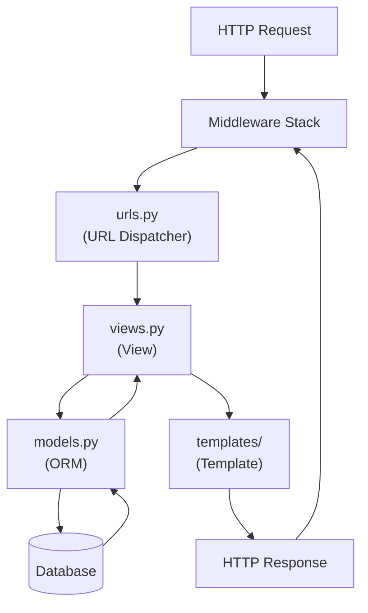
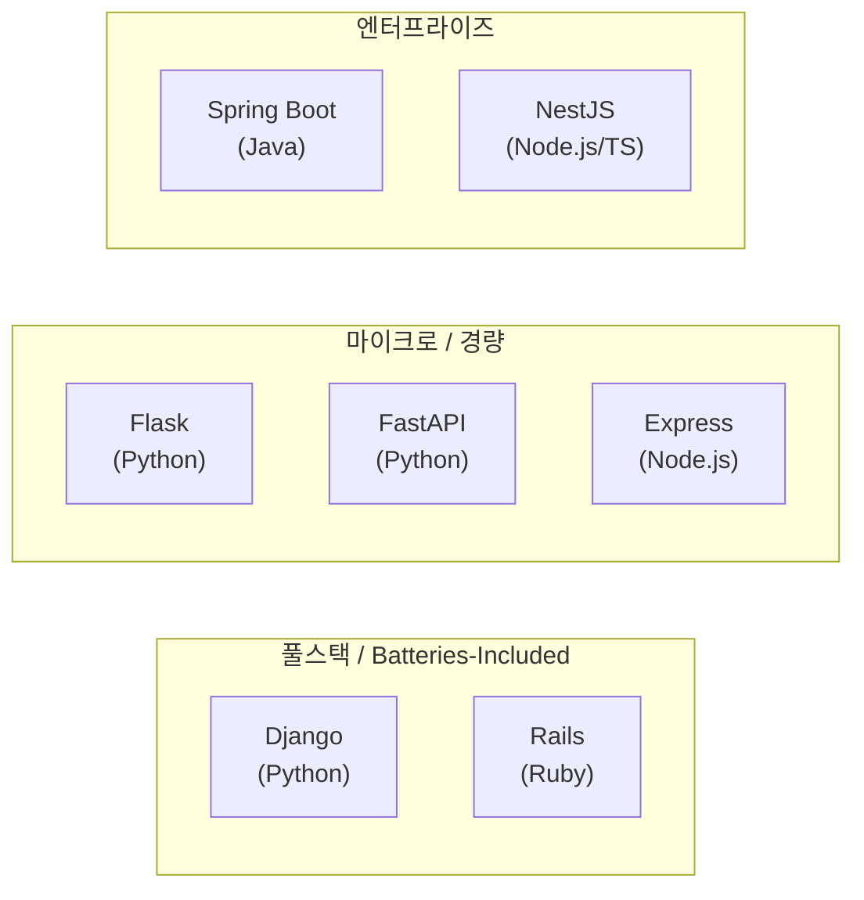

## 정의

**Django** 는 2003년 시작된 Python 풀스택 웹 프레임워크. **batteries-included** (ORM, 관리자, 인증, 폼, 마이그레이션, 캐싱 등 기본 내장)와 MTV (Model-Template-View) 패턴이 특징. Instagram, Pinterest, Mozilla 등 대규모 운영 사례. 현재 LTS 5.2 (2025-04).

이 페이지는 Django 전체 위키의 색인이다. 각 영역은 별도 페이지에서 자세히 다룬다.

## 역사

| 연도 | 사건 |
|:---|:---|
| 2003 | Adrian Holovaty, Simon Willison 이 Lawrence Journal-World 신문사 내부 도구로 개발 시작 |
| 2005 | BSD 라이선스로 오픈소스 공개. "Django" 이름은 기타리스트 Django Reinhardt 에서 유래 |
| 2008 | Django Software Foundation 설립 |
| 2013 | 1.5 에서 Python 3 지원 시작 |
| 2022 | Python 2 완전 드롭 (4.0) |
| 2023 | 4.2 LTS, 5.0 출시 |
| 2025 | 5.2 LTS (현재). 비동기 ORM 지원 강화 |

## 핵심 아키텍처

요청은 **URL Dispatcher → View → Model → Template** 순서로 처리된다.



- [[django-overview]] - 프로젝트 구조, MTV 패턴, manage.py
- [[django-urls]] - path/re_path/include, namespace, reverse
- [[django-views]] - FBV vs CBV, generic views, decorator
- [[django-templates]] - DTL, 태그, 필터, 상속
- [[django-mixins]] - LoginRequired, UserPasses, custom mixin
- [[django-pagination]] - Paginator, ListView, cursor

## Batteries Included (내장 기능)

Django 의 핵심 철학은 "웹 개발에 필요한 것을 다 들고 온다". 주요 내장 기능:

| 기능 | 설명 |
|:---|:---|
| **ORM** | 모델 정의 → SQL 자동 생성, QuerySet API |
| **마이그레이션** | 모델 변경을 DB 스키마 변경으로 추적 |
| **관리자 (Admin)** | 모델 기반 CRUD UI 자동 생성 (`/admin/`) |
| **인증 (Auth)** | User, Group, Permission, 세션, 로그인/로그아웃 |
| **폼 (Forms)** | HTML 폼 렌더링 + 검증 + 정제 |
| **URL Dispatcher** | 정규식/경로 패턴으로 뷰 라우팅 |
| **템플릿 엔진 (DTL)** | 파이썬 객체 → HTML 렌더링 |
| **미들웨어** | 요청/응답 가로채기 스택 |
| **캐싱** | per-view, fragment, low-level, Redis/Memcached 백엔드 |
| **이메일** | `send_mail`, SMTP/파일/콘솔 백엔드 |
| **정적/미디어 파일** | `collectstatic`, `MEDIA_ROOT` |
| **국제화 (i18n)** | gettext, 번역, 시간대 처리 |
| **보안** | CSRF 방지, XSS 이스케이프, SQL injection 방지, 클릭재킹 방어 |
| **시그널** | 모델 이벤트(pre_save, post_delete 등) 훅 |

## ORM / Model

데이터 접근 추상화. Active Record 패턴이 아닌 Data Mapper 에 가깝다 (manager 패턴).

- [[django-models-fields]] - Field 타입, Meta, 관계
- [[django-queryset]] - 기본 쿼리, F/Q, lazy
- [[django-orm-advanced]] - N+1, Subquery, Window
- [[django-aggregations]] - annotate, aggregate, Case/When
- [[django-migrations]] - makemigrations, RunPython, squash
- [[django-content-types]] - GenericForeignKey, polymorphic
- [[django-mvc-model]] - MTV 패턴, 관계 필드 개요

## 폼과 검증

- [[django-forms]] - Form, ModelForm, formset, widget

## 인증과 권한

- [[django-auth]] - User, AbstractUser, login_required
- [[django-sessions]] - 세션 백엔드, signed cookies

## 미들웨어와 신호

- [[django-middleware]] - 요청/응답 가로채기
- [[django-signals]] - 모델 이벤트 hook (사용)
- [[django-signals-internal]] - 옵저버 패턴 내부 구현 심층 분석

## 관리자

- [[django-admin]] - ModelAdmin, inline, 액션

## 정적/미디어 파일

- [[django-static-media]] - STATIC/MEDIA, whitenoise, S3

## 캐싱과 성능

- [[django-cache]] - per-view, fragment, low-level, Redis

## 비동기와 실시간

- [[django-async-views]] - async view, ASGI, sync_to_async
- [[django-channels]] - WebSocket, Consumer, Group
- [[django-celery]] - 백그라운드 작업, Beat, retry

## REST API (DRF)

- [[django-rest-framework]] - Serializer, ViewSet, Router 개요
- [[django-drf-serializers]] - 심화: nested, projection, validation
- [[django-drf-viewset]] - 심화: action, mixin, nested router
- [[django-drf-permissions]] - permission, throttle, filter

## 국제화 / 이메일 / 로깅

- [[django-i18n]] - gettext, 다국어, 시간대
- [[django-email]] - send_mail, anymail, Celery 통합
- [[django-logging]] - LOGGING 설정, JSON 로그, Sentry

## 보안

- [[django-security]] - CSRF, XSS, SQL injection, header

## 테스팅과 배포

- [[django-testing]] - TestCase, factory_boy, pytest-django
- [[django-management-commands]] - 커스텀 manage.py 명령
- [[django-settings]] - 환경 분리, secrets, 12-factor
- [[django-deployment]] - Gunicorn, Uvicorn, whitenoise, Docker

## 버전 정책

| 버전 | 출시 | 지원 종료 | 비고 |
|:---|:---|:---|:---|
| 4.2 LTS | 2023-04 | 2026-04 | 이전 LTS |
| 5.0 | 2023-12 | 2025-04 | EOL |
| 5.1 | 2024-08 | 2025-12 | EOL |
| 5.2 LTS | 2025-04 | 2028-04 | **현재 LTS** |

LTS 는 3년 지원. 프로덕션은 LTS 권장. LTS 가 아닌 버전은 약 8개월 지원.

## Django vs 대안



| | Django | Flask | FastAPI |
|:---|:---|:---|:---|
| 스타일 | 배터리 포함 | 마이크로 | API 우선 |
| ORM | 내장 | SQLAlchemy 등 | 외부 |
| 관리자 | 내장 | X | X |
| 비동기 | 부분 (3.1+) | 부분 | 네이티브 |
| 학습 곡선 | 중 | 낮 | 중 |
| 타입 힌트 | 선택적 | 선택적 | 필수 (Pydantic) |
| 문서화 | 별도 설정 | 별도 설정 | 자동 (OpenAPI) |
| 적합 | 일반 웹앱, CMS | 작은 API/앱 | API, 마이크로서비스 |

다른 언어 비교: [[ruby-on-rails]] (Ruby), [[spring-overview]] (Java).

## Django 에서 비동기 사용

3.1+ 에서 `async view` 지원, 4.1+ 에서 async ORM 지원 (일부):

```python
# async view
async def post_list(request):
    posts = [p async for p in Post.objects.filter(published=True)]
    return JsonResponse({'posts': [str(p) for p in posts]})
```

완전한 async 가 필요하면 FastAPI/Starlette 또는 [[django-channels]] 활용.

## 빠른 시작

```bash
pip install django
django-admin startproject myproject
cd myproject
python manage.py startapp blog

python manage.py runserver    # http://127.0.0.1:8000/
```

```python
# blog/models.py
from django.db import models

class Post(models.Model):
    title = models.CharField(max_length=200)
    body = models.TextField()
    created = models.DateTimeField(auto_now_add=True)

    def __str__(self):
        return self.title
```

```bash
python manage.py makemigrations blog
python manage.py migrate
python manage.py createsuperuser
```

## 학습 경로

1. [[django-overview]] - 프로젝트 시작
2. [[django-models-fields]] + [[django-queryset]] - 데이터 접근
3. [[django-views]] + [[django-urls]] + [[django-templates]] - MTV
4. [[django-forms]] - 사용자 입력
5. [[django-auth]] - 인증
6. [[django-rest-framework]] - REST API
7. [[django-testing]] - 테스트
8. [[django-deployment]] - 배포

## 관련 위키

- [[django-overview]] - 프로젝트 구조 전체
- [[django-mvc-model]] - MTV 패턴 + Model 기본
- [[django-models-fields]] - 필드 타입 심화
- [[django-queryset]] - QuerySet API
- [[django-rest-framework]] - DRF 개요
- [[django-testing]] - 테스트 전략
- [[django-deployment]] - 배포 가이드
- [[ruby-on-rails]] - Rails 비교
- [[spring-overview]] - Spring 비교
