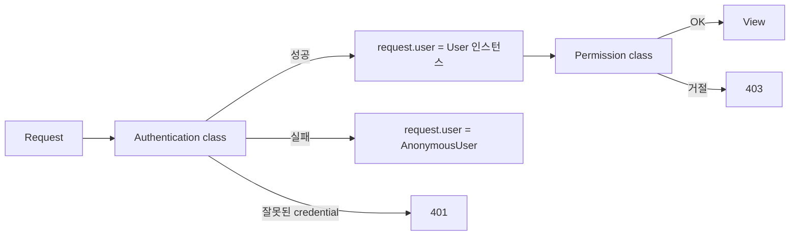
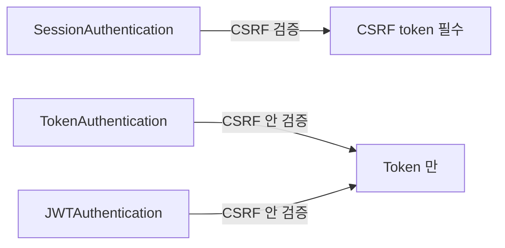

## 정의

**Authentication** = *누가 요청했는지* 식별. Authorization ([[django-drf-permissions]]) 과 별개.

## 흐름



자세한 permission 은 [[django-drf-permissions]].

## 내장 Authentication Classes

| Class | 방식 |
|---|---|
| `BasicAuthentication` | HTTP Basic Auth |
| `SessionAuthentication` | Django session (쿠키) |
| `TokenAuthentication` | Django token (내장) |
| `RemoteUserAuthentication` | 웹 서버 인증 |

## 설정

```python
# 전역
REST_FRAMEWORK = {
    'DEFAULT_AUTHENTICATION_CLASSES': [
        'rest_framework.authentication.SessionAuthentication',
        'rest_framework.authentication.TokenAuthentication',
    ]
}

# View 별
class MyView(APIView):
    authentication_classes = [TokenAuthentication]
```

## 1. SessionAuthentication (Django 기본)

브라우저 세션 사용. Browsable API 에 필수.

```python
authentication_classes = [SessionAuthentication]
```

- **장점**: Django 인증 시스템 그대로.
- **단점**: *CSRF token 필요*. 모바일/외부 앱 부적합.

## 2. TokenAuthentication (내장 토큰)

```bash
INSTALLED_APPS = [
    ...,
    'rest_framework.authtoken',
]
```

```bash
python manage.py migrate
```

```python
# 토큰 발급 endpoint 등록
from rest_framework.authtoken.views import obtain_auth_token

urlpatterns = [
    path('api-token-auth/', obtain_auth_token),
]
```

```bash
# 사용
curl -X POST http://localhost:8000/api-token-auth/ \
  -d '{"username": "koa", "password": "secret"}' \
  -H 'Content-Type: application/json'
# → {"token": "abc123..."}

# 이후 요청
curl -H 'Authorization: Token abc123...' http://localhost:8000/api/users/
```

- **장점**: 단순.
- **단점**: *영구 토큰* (rotation 없음), *revoke 어려움*.

## 3. JWT (Simple JWT) - 사실상 표준

```bash
pip install djangorestframework-simplejwt
```

```python
REST_FRAMEWORK = {
    'DEFAULT_AUTHENTICATION_CLASSES': [
        'rest_framework_simplejwt.authentication.JWTAuthentication',
    ],
}

SIMPLE_JWT = {
    'ACCESS_TOKEN_LIFETIME': timedelta(minutes=15),
    'REFRESH_TOKEN_LIFETIME': timedelta(days=7),
    'ROTATE_REFRESH_TOKENS': True,
    'BLACKLIST_AFTER_ROTATION': True,
    'ALGORITHM': 'HS256',
    'SIGNING_KEY': SECRET_KEY,
    'AUTH_HEADER_TYPES': ('Bearer',),
}
```

```python
# urls.py
from rest_framework_simplejwt.views import (
    TokenObtainPairView, TokenRefreshView, TokenVerifyView,
)

urlpatterns = [
    path('api/token/', TokenObtainPairView.as_view()),
    path('api/token/refresh/', TokenRefreshView.as_view()),
    path('api/token/verify/', TokenVerifyView.as_view()),
]
```

```bash
# 로그인
POST /api/token/ {"username": "koa", "password": "..."}
→ { "access": "eyJ...", "refresh": "eyJ..." }

# 요청
GET /api/users/ Authorization: Bearer eyJ...

# 갱신
POST /api/token/refresh/ {"refresh": "eyJ..."}
→ { "access": "eyJ...", "refresh": "eyJ..." }  ← rotation

# 검증
POST /api/token/verify/ {"token": "eyJ..."}
```

자세한 JWT 원리는 [[JWT]].

### Custom Claim

```python
from rest_framework_simplejwt.serializers import TokenObtainPairSerializer

class MyTokenObtainPairSerializer(TokenObtainPairSerializer):
    @classmethod
    def get_token(cls, user):
        token = super().get_token(user)
        token['name'] = user.get_full_name()
        token['role'] = 'admin' if user.is_staff else 'user'
        return token

class MyTokenObtainPairView(TokenObtainPairView):
    serializer_class = MyTokenObtainPairSerializer
```

## 4. OAuth2 (django-oauth-toolkit)

```bash
pip install django-oauth-toolkit
```

```python
INSTALLED_APPS = [..., 'oauth2_provider']

REST_FRAMEWORK = {
    'DEFAULT_AUTHENTICATION_CLASSES': [
        'oauth2_provider.contrib.rest_framework.OAuth2Authentication',
    ],
}
```

자세한 OAuth2 는 [[OAuth2]].

## 5. Custom Authentication

```python
from rest_framework import authentication, exceptions

class ApiKeyAuthentication(authentication.BaseAuthentication):
    def authenticate(self, request):
        api_key = request.headers.get('X-API-Key')
        if not api_key:
            return None                # authentication 시도 안 함

        try:
            user = User.objects.get(api_key=api_key)
        except User.DoesNotExist:
            raise exceptions.AuthenticationFailed('Invalid API key')

        return (user, None)             # (user, auth) 튜플

    def authenticate_header(self, request):
        return 'X-API-Key'
```

## 비교 매트릭스

| | Session | Token (built-in) | JWT | OAuth2 |
|---|---|---|---|---|
| 설정 | 최소 | 간단 | 중간 | 복잡 |
| Stateless | ❌ | ❌ | *✓* | 하이브리드 |
| Mobile | 부적합 | 적합 | *최적* | 적합 |
| Revoke | 즉시 | DB 삭제 | *어려움* (blacklist) | refresh revoke |
| Rotation | - | ❌ | *✓* | ✓ |
| 제3자 통합 | ❌ | ❌ | 표준 | *표준* |
| 사용처 | Browsable API | 간단 API | *현대 API* | SSO, 3rd party |

## 다중 Authentication

```python
# 첫 성공한 것 사용
authentication_classes = [
    JWTAuthentication,          # 1순위
    SessionAuthentication,       # fallback
    TokenAuthentication,         # fallback
]
```

## CSRF 처리



- Session = CSRF token 필요.
- Token/JWT = CSRF 없음 (stateless).

## HTTPS 필수

> [!IMPORTANT]
> Token / JWT / Session cookie 는 *반드시 HTTPS*. HTTP 는 탈취.

## 다른 프레임워크

| Framework | 인증 |
|---|---|
| **DRF** | Session, Token, JWT (simple-jwt) |
| **Spring Security** | Session, JWT, OAuth2 (내장) |
| **Rails** | Devise |
| **Express** | passport.js |
| **FastAPI** | OAuth2 helpers |

## 흔한 함정

> [!WARNING]
> 1. **SECRET_KEY 노출** = JWT 위조. `.env` 관리.
> 2. **Token 무한 저장** = 유출 시 영구 침입. JWT + short expire.
> 3. **JWT payload 민감 정보** = 누구나 decode 가능. `sub` (user_id) 만.
> 4. **CSRF 켜져있는 상태에서 SPA** = fetch 실패. `csrfmiddlewaretoken` 첨부.

## 관련 위키

- [[django-drf-permissions]] (권한, 다음 단계)
- [[JWT]] (JWT 원리)
- [[OAuth2]]
- [[Session Cookie]]
- [[django-auth]] (Django 인증 시스템)
