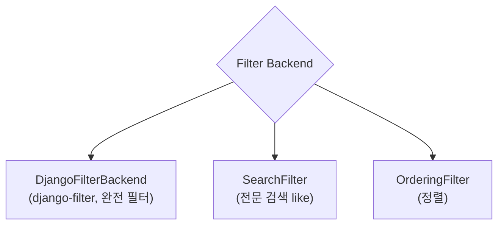

## 정의

**Filtering** = 쿼리 파라미터로 *결과 제한*. 3가지 backend + custom.

## 3가지 내장 Backend



## 설치 + 설정

```bash
pip install django-filter
```

```python
INSTALLED_APPS = [..., 'django_filters']

REST_FRAMEWORK = {
    'DEFAULT_FILTER_BACKENDS': [
        'django_filters.rest_framework.DjangoFilterBackend',
        'rest_framework.filters.SearchFilter',
        'rest_framework.filters.OrderingFilter',
    ]
}
```

## 1. DjangoFilterBackend

### 간단한 필드 매칭

```python
class ArticleList(generics.ListAPIView):
    queryset = Article.objects.all()
    serializer_class = ArticleSerializer
    filterset_fields = ['author', 'category', 'is_published']
```

```bash
GET /articles/?author=1&category=tech&is_published=true
```

### 상세 FilterSet

```python
import django_filters

class ArticleFilter(django_filters.FilterSet):
    title = django_filters.CharFilter(lookup_expr='icontains')
    min_views = django_filters.NumberFilter(field_name='views', lookup_expr='gte')
    max_views = django_filters.NumberFilter(field_name='views', lookup_expr='lte')
    published_after = django_filters.DateFilter(field_name='published_at', lookup_expr='gte')
    tag = django_filters.CharFilter(method='filter_tag')
    ordering = django_filters.OrderingFilter(
        fields=(
            ('title', 'title'),
            ('views', 'views'),
            ('published_at', 'published_at'),
        )
    )

    class Meta:
        model = Article
        fields = ['author', 'category']

    def filter_tag(self, queryset, name, value):
        return queryset.filter(tags__name__iexact=value)


class ArticleList(generics.ListAPIView):
    queryset = Article.objects.all()
    serializer_class = ArticleSerializer
    filterset_class = ArticleFilter
```

```bash
GET /articles/?title=django&min_views=100&published_after=2026-01-01&tag=python
```

## Lookup expressions

| Lookup | 의미 |
|---|---|
| `exact` (기본) | `field=x` → WHERE field = x |
| `iexact` | 대소문자 무시 |
| `contains` / `icontains` | LIKE |
| `startswith` / `endswith` | prefix/suffix |
| `gt`, `gte`, `lt`, `lte` | 크기 비교 |
| `in` | field__in |
| `range` | 범위 |
| `date`, `year`, `month`, `week` | 날짜 부분 |
| `isnull` | NULL 여부 |
| `regex` / `iregex` | 정규식 |

## 2. SearchFilter

```python
class ArticleList(generics.ListAPIView):
    queryset = Article.objects.all()
    serializer_class = ArticleSerializer
    filter_backends = [filters.SearchFilter]
    search_fields = ['title', 'body', 'author__username', 'tags__name']
```

```bash
GET /articles/?search=django+rest
```

### Prefix 조정

| Prefix | 의미 |
|---|---|
| 없음 | `icontains` (기본) |
| `^` | `istartswith` |
| `=` | `iexact` |
| `@` | `full text search` (Postgres) |
| `$` | `iregex` |

```python
search_fields = ['=username', '^title', '@body']
```

## 3. OrderingFilter

```python
class ArticleList(generics.ListAPIView):
    queryset = Article.objects.all()
    serializer_class = ArticleSerializer
    filter_backends = [filters.OrderingFilter]
    ordering_fields = ['created_at', 'views', 'title']
    ordering = ['-created_at']       # 기본 정렬
```

```bash
GET /articles/?ordering=-views
GET /articles/?ordering=title,-views    # 다중
```

## 다중 Backend 조합

```python
class ArticleList(generics.ListAPIView):
    queryset = Article.objects.all()
    serializer_class = ArticleSerializer
    filter_backends = [
        DjangoFilterBackend,
        filters.SearchFilter,
        filters.OrderingFilter,
    ]
    filterset_class = ArticleFilter
    search_fields = ['title', 'body']
    ordering_fields = ['created_at', 'views']
```

```bash
GET /articles/?category=tech&search=django&ordering=-views
```

## Custom Filter Backend

```python
from rest_framework import filters

class IsOwnerFilterBackend(filters.BaseFilterBackend):
    def filter_queryset(self, request, queryset, view):
        return queryset.filter(owner=request.user)


class ArticleList(generics.ListAPIView):
    filter_backends = [IsOwnerFilterBackend, ...]
```

## PostgreSQL Full-Text Search

```python
from django.contrib.postgres.search import SearchVector, SearchQuery, SearchRank

class ArticleList(generics.ListAPIView):
    serializer_class = ArticleSerializer

    def get_queryset(self):
        q = self.request.query_params.get('q', '')
        if q:
            vector = SearchVector('title', weight='A') + SearchVector('body', weight='B')
            query = SearchQuery(q)
            return Article.objects.annotate(
                rank=SearchRank(vector, query),
            ).filter(rank__gte=0.1).order_by('-rank')
        return Article.objects.all()
```

자세한 건 [[postgresql]] 의 full-text.

## OpenAPI 문서화

`django-filter` 는 OpenAPI schema 자동:

```python
filterset_class = ArticleFilter
# → OpenAPI 에 파라미터 자동 추가
```

자세한 건 [[drf-schemas-openapi]].

## 다른 프레임워크

| Framework | 필터링 |
|---|---|
| **DRF** | django-filter, SearchFilter |
| **Rails** | ransack, filterrific |
| **Spring Data** | Specification, Querydsl |
| **FastAPI** | 수동 Query params |
| **NestJS** | nestjs-typeorm-crud |

## 흔한 함정

> [!WARNING]
> 1. **filter_fields (옛 이름)** = deprecated. `filterset_fields`.
> 2. **큰 filterset_class + 많은 필드** = OpenAPI schema 폭발.
> 3. **`search_fields` 에 큰 컬럼** = 매 요청 full-table scan. GIN 인덱스.
> 4. **`ordering` 사용자 입력 신뢰** = 임의 필드 정렬 → 성능. `ordering_fields` 화이트리스트.

## 관련 위키

- [[drf-views]]
- [[drf-pagination-throttling]]
- [[postgresql]] (full-text)
- [[gin-index-deep]]
- [[django-queryset]]
