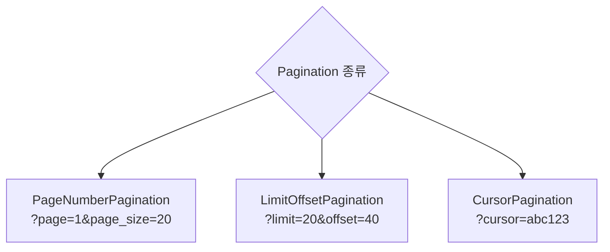
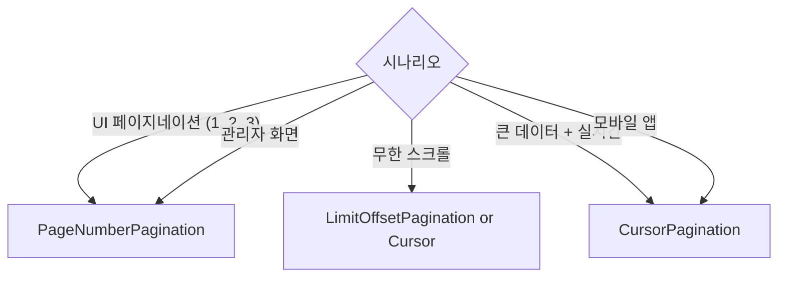
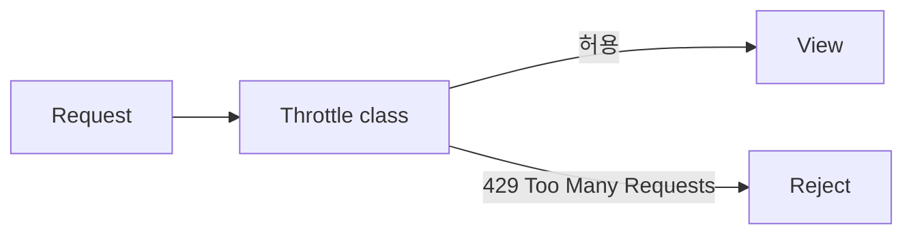
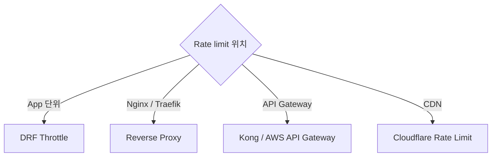

## 정의

**Pagination** = 큰 목록을 *페이지 단위로 나눔*. **Throttling** = *요청 빈도 제한*. 둘 다 API 안정성의 기본.

## Pagination 3종

```anim:drf-pagination-types
{}
```

### 언제 어느 것을 쓸까



| 종류 | 목적 | 장점 | 단점 |
|---|---|---|---|
| **PageNumberPagination** | 특정 페이지 이동 (관리자 UI) | 직관적, "5페이지로 가기" 지원 | 큰 offset 시 *느림*, 실시간 데이터에 중복/누락 |
| **LimitOffsetPagination** | 임의 offset 필요할 때 | 유연 (`?limit=10&offset=137`) | PageNumber와 같은 문제, offset 커지면 여전히 느림 |
| **CursorPagination** | *무한 스크롤, 대규모 실시간 피드* | *일관성*, offset 무관 O(log N) | 임의 페이지 이동 불가, 정렬 필드 필수 |

### 왜 큰 offset은 느린가?

```sql
SELECT * FROM users ORDER BY id LIMIT 20 OFFSET 100000;
```

DB는 `OFFSET 100000` 을 무시하는 게 아니라 *100000개 row 를 실제로 훑고 버린다*. 페이지가 뒤로 갈수록 응답 시간 선형 증가.

CursorPagination 은 `WHERE id > last_seen_id ORDER BY id LIMIT 20` 로 인덱스만 타므로 어느 페이지든 O(log N).

### PageNumberPagination

```python
# settings.py
REST_FRAMEWORK = {
    'DEFAULT_PAGINATION_CLASS': 'rest_framework.pagination.PageNumberPagination',
    'PAGE_SIZE': 20,
}
```

```bash
GET /api/users/?page=2
```

응답:
```json
{
  "count": 100,
  "next": "http://api/users/?page=3",
  "previous": "http://api/users/?page=1",
  "results": [{...}, ...]
}
```

Custom:

```python
class MyPagination(PageNumberPagination):
    page_size = 20
    page_size_query_param = 'page_size'   # ?page_size=50
    max_page_size = 100
```

### LimitOffsetPagination

```python
class MyPagination(LimitOffsetPagination):
    default_limit = 20
    max_limit = 100
```

```bash
GET /api/users/?limit=20&offset=40
```

### CursorPagination (대규모 권장)

```python
class MyPagination(CursorPagination):
    page_size = 20
    ordering = '-created_at'   # 정렬 필드 (필수)
```

```bash
GET /api/users/?cursor=cD0yMDI2LTA2LTI1
```

응답:
```json
{
  "next": "http://api/users/?cursor=cD0yMDI2LTA1LTMx",
  "previous": null,
  "results": [{...}]
}
```

> [!TIP]
> **대규모 데이터** (수십만 row+) = CursorPagination *필수*. LIMIT/OFFSET 은 offset 커질수록 DB 부담.

## View 별 override

```python
class MyView(generics.ListAPIView):
    queryset = User.objects.all()
    serializer_class = UserSerializer
    pagination_class = CursorPagination
    # pagination_class = None   # 비활성
```

## 응답 포맷 커스터마이즈

```python
class CustomPagination(PageNumberPagination):
    page_size = 20

    def get_paginated_response(self, data):
        return Response({
            'meta': {
                'total': self.page.paginator.count,
                'page': self.page.number,
                'per_page': self.page_size,
                'total_pages': self.page.paginator.num_pages,
            },
            'links': {
                'next': self.get_next_link(),
                'previous': self.get_previous_link(),
            },
            'data': data,
        })
```

## 언제 무엇을?



## Throttling



## 내장 Throttle Classes

| Class | Scope |
|---|---|
| `AnonRateThrottle` | 익명 (IP 기반) |
| `UserRateThrottle` | 인증된 user |
| `ScopedRateThrottle` | View 별 커스텀 |

## 설정

```python
REST_FRAMEWORK = {
    'DEFAULT_THROTTLE_CLASSES': [
        'rest_framework.throttling.AnonRateThrottle',
        'rest_framework.throttling.UserRateThrottle',
    ],
    'DEFAULT_THROTTLE_RATES': {
        'anon': '100/hour',
        'user': '1000/hour',
    }
}
```

Rate 형식: `숫자/기간` (`second`, `minute`, `hour`, `day`).

## ScopedRateThrottle

```python
REST_FRAMEWORK = {
    'DEFAULT_THROTTLE_CLASSES': [
        'rest_framework.throttling.ScopedRateThrottle',
    ],
    'DEFAULT_THROTTLE_RATES': {
        'login': '5/min',
        'signup': '10/hour',
        'ai_generate': '30/day',
    }
}

class LoginView(APIView):
    throttle_scope = 'login'
    def post(self, request): ...

class AIGenerateView(APIView):
    throttle_scope = 'ai_generate'
    def post(self, request): ...
```

## Custom Throttle

```python
from rest_framework.throttling import SimpleRateThrottle

class BurstRateThrottle(SimpleRateThrottle):
    scope = 'burst'
    rate = '10/minute'   # 짧은 시간

    def get_cache_key(self, request, view):
        if request.user.is_authenticated:
            ident = request.user.pk
        else:
            ident = self.get_ident(request)
        return f'throttle_burst_{ident}'


class SustainedRateThrottle(SimpleRateThrottle):
    scope = 'sustained'
    rate = '1000/day'

    def get_cache_key(self, request, view):
        return f'throttle_sustained_{request.user.pk}'
```

## 429 응답

```
HTTP/1.1 429 Too Many Requests
Retry-After: 3600

{ "detail": "Request was throttled. Expected available in 3600 seconds." }
```

> [!TIP]
> 클라이언트는 `Retry-After` 확인 후 재시도. 자세한 건 [[retry-with-backoff]].

## Cache Backend

Throttle 은 *Django cache* 사용:

```python
CACHES = {
    'default': {
        'BACKEND': 'django.core.cache.backends.redis.RedisCache',
        'LOCATION': 'redis://localhost:6379/1',
    }
}
```

> Production = Redis 권장. LocMemCache 는 *프로세스 별 개별* → 여러 worker 에서 부정확.

## 대안 (외부 도구)



*여러 계층* 조합 권장. DRF = 앱 로직 기반, CDN = 광범위 DDoS 방어.

자세한 rate limit 알고리즘은 [[rate-limiting]].

## 다른 프레임워크

| Framework | Pagination | Throttling |
|---|---|---|
| **DRF** | 3종 | Class based |
| **FastAPI** | 없음 | slowapi |
| **Spring** | Pageable | bucket4j |
| **Express** | 없음 | express-rate-limit |
| **Rails** | kaminari, will_paginate | rack-attack |

## 흔한 함정

> [!WARNING]
> 1. **PAGE_SIZE 미설정 + PageNumberPagination** = 사용 시 에러.
> 2. **Cursor pagination 정렬 안 정함** = 에러.
> 3. **큰 offset (page=1000)** = DB 부담. Cursor 로 마이그레이션.
> 4. **Throttle LocMemCache** = worker 마다 별개. Redis.

## 관련 위키

- [[drf-views]]
- [[drf-filtering]]
- [[rate-limiting]]
- [[retry-with-backoff]]
- [[Redis Cache Patterns]]
