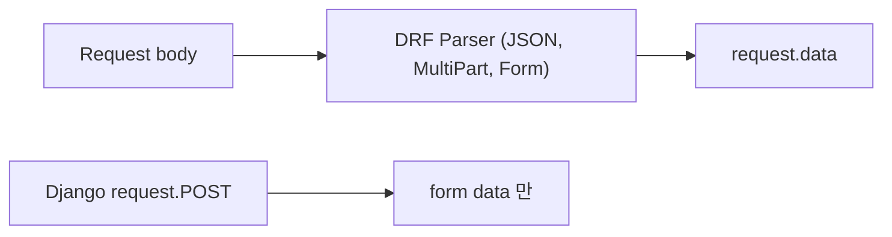
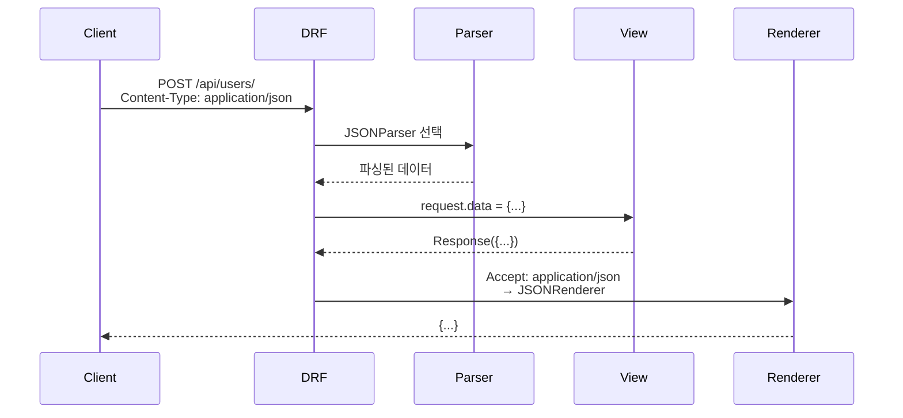

## 정의

DRF 의 `Request` = Django `HttpRequest` 의 *확장*. `Response` = `TemplateResponse` 의 확장. 자동 *content negotiation* + *renderer* 처리.

## 요청이 뷰에 도달하기까지

`request.data` 에 값이 실제로 들어가려면 그 이전에 여러 단계를 거친다.

```anim:drf-request-lifecycle
{}
```

`Request` 객체는 위 파이프라인에서 **2번 (Router 이후)** 에 만들어지고, 파이프라인 내내 확장된다:

| 단계 | Request 에 붙는 것 |
|---|---|
| 초기화 | `request.data` (파서 지연 로딩), `request.query_params` |
| Authentication | `request.user`, `request.auth` |
| Permission | (검사만) |
| Throttle | (검사만) |
| View | 여기서 처음 읽음 |
| Renderer | `Response` 를 실제 bytes 로 |

## Request 객체

```python
from rest_framework.decorators import api_view

@api_view(['POST'])
def create(request):
    request.data          # 파싱된 body (JSON, form 자동)
    request.query_params  # ?key=value
    request.user          # 인증된 User (or AnonymousUser)
    request.auth          # 토큰 등
    request.method        # 'GET', 'POST', ...
    request.META          # HTTP 헤더 등
    return Response(...)
```

## `request.data` vs `request.POST`



| | `request.data` (DRF) | `request.POST` (Django) |
|---|---|---|
| JSON body | *예* | 아니오 |
| Form data | 예 | 예 |
| Multipart | 예 | 예 |
| PUT / PATCH body | *예* | 아니오 |

> [!IMPORTANT]
> **DRF 는 `request.data` 사용**. `request.POST` 는 JSON body 를 못 읽는다.

## Content Negotiation



DRF 가 자동으로 *Content-Type* 보고 파싱 + *Accept* 보고 렌더링. 자세한 건 [[drf-versioning-content-negotiation]].

## Response 객체

```python
from rest_framework.response import Response
from rest_framework import status

@api_view(['GET'])
def user_detail(request, pk):
    user = get_object_or_404(User, pk=pk)
    return Response(
        UserSerializer(user).data,
        status=status.HTTP_200_OK,
        headers={'X-Custom': 'value'},
    )
```

| 파라미터 | 의미 |
|---|---|
| `data` | 응답 데이터 (dict, list, 등) |
| `status` | HTTP status code |
| `template_name` | HTML template (Browsable API) |
| `headers` | 추가 헤더 |
| `content_type` | 강제 지정 (일반적으로 안 함) |

## Status Codes

```python
from rest_framework import status

# 자주 쓰는 것
status.HTTP_200_OK
status.HTTP_201_CREATED
status.HTTP_202_ACCEPTED
status.HTTP_204_NO_CONTENT

status.HTTP_400_BAD_REQUEST
status.HTTP_401_UNAUTHORIZED
status.HTTP_403_FORBIDDEN
status.HTTP_404_NOT_FOUND
status.HTTP_409_CONFLICT
status.HTTP_422_UNPROCESSABLE_ENTITY
status.HTTP_429_TOO_MANY_REQUESTS

status.HTTP_500_INTERNAL_SERVER_ERROR
status.HTTP_502_BAD_GATEWAY
status.HTTP_503_SERVICE_UNAVAILABLE
```

> `HTTP_200_OK` 같은 상수 사용 권장 (magic number 회피).

## Parser 종류

```python
REST_FRAMEWORK = {
    'DEFAULT_PARSER_CLASSES': [
        'rest_framework.parsers.JSONParser',      # 기본
        'rest_framework.parsers.FormParser',       # multipart 이전
        'rest_framework.parsers.MultiPartParser',  # 파일
    ]
}
```

| Parser | Content-Type |
|---|---|
| `JSONParser` | `application/json` |
| `FormParser` | `application/x-www-form-urlencoded` |
| `MultiPartParser` | `multipart/form-data` |
| `FileUploadParser` | binary (파일 stream) |

## View 단위 override

```python
from rest_framework.parsers import MultiPartParser, JSONParser

class FileUploadView(APIView):
    parser_classes = [MultiPartParser]

    def post(self, request):
        file = request.FILES['file']
        return Response({'uploaded': file.name})
```

## Renderer 종류

```python
REST_FRAMEWORK = {
    'DEFAULT_RENDERER_CLASSES': [
        'rest_framework.renderers.JSONRenderer',
        'rest_framework.renderers.BrowsableAPIRenderer',
    ]
}
```

| Renderer | Accept |
|---|---|
| `JSONRenderer` | `application/json` |
| `BrowsableAPIRenderer` | `text/html` |
| `AdminRenderer` | HTML admin |
| `TemplateHTMLRenderer` | HTML 지정 |
| `HTMLFormRenderer` | HTML form |

## Format Suffix

```python
# URL: /users.json 또는 /users.api
from rest_framework.urlpatterns import format_suffix_patterns

urlpatterns = format_suffix_patterns([
    path('users/', UserList.as_view()),
    path('users/<int:pk>/', UserDetail.as_view()),
])
```

> URL 확장자로 format 지정. RESTful 이라기보다 옛 패턴, *Accept 헤더* 권장.

## 파일 업로드

```python
class FileUploadView(APIView):
    parser_classes = [MultiPartParser, FormParser]

    def post(self, request):
        file = request.data.get('file')
        # 저장
        return Response({'name': file.name, 'size': file.size})
```

자세한 건 [[django-file-uploads]].

## Query Params vs Data

```python
@api_view(['GET'])
def search(request):
    q = request.query_params.get('q', '')       # URL query
    page = int(request.query_params.get('page', 1))
    ...
    return Response(...)


@api_view(['POST'])
def create(request):
    title = request.data.get('title')            # body
    ...
```

## Custom Parser / Renderer

```python
from rest_framework import renderers

class CSVRenderer(renderers.BaseRenderer):
    media_type = 'text/csv'
    format = 'csv'

    def render(self, data, accepted_media_type=None, renderer_context=None):
        import csv, io
        buf = io.StringIO()
        writer = csv.writer(buf)
        for row in data:
            writer.writerow(row.values())
        return buf.getvalue()


class MyView(APIView):
    renderer_classes = [renderers.JSONRenderer, CSVRenderer]

    def get(self, request):
        return Response([{'a': 1, 'b': 2}])
        # GET /myview.csv → CSV 응답
```

## Exception 자동 처리

```python
from rest_framework.exceptions import NotFound, PermissionDenied, ValidationError

@api_view(['GET'])
def item(request, pk):
    try:
        item = Item.objects.get(pk=pk)
    except Item.DoesNotExist:
        raise NotFound('Item not found')

    if not item.can_view(request.user):
        raise PermissionDenied()

    return Response(ItemSerializer(item).data)
```

DRF 가 자동으로 *ProblemDetail 유사* JSON 응답:

```json
{ "detail": "Item not found" }
```

## `HttpResponse` vs `Response`

```python
# ❌ Django HttpResponse
from django.http import JsonResponse
return JsonResponse({'ok': True})

# ✓ DRF Response
return Response({'ok': True})
```

DRF `Response` = *content negotiation + renderer 자동*. HTML/JSON 자유롭게 응답.

## 다른 프레임워크 비교

| Framework | Body 접근 |
|---|---|
| **DRF** | `request.data` |
| **FastAPI** | Pydantic model 자동 |
| **Flask** | `request.get_json()` |
| **Spring** | `@RequestBody DTO` |
| **Express** | `req.body` (body-parser) |
| **Rails** | `params` (모든 것 통합) |

## 흔한 함정

> [!WARNING]
> 1. **`request.POST` 사용** = JSON body 못 읽음. `request.data`.
> 2. **`status_code` 매직 넘버 400** = 가독성 낮음. `status.HTTP_400_BAD_REQUEST`.
> 3. **`JsonResponse` 사용** = content negotiation 무시. `Response`.
> 4. **`request.data` 를 `dict()` 로 변환** = QueryDict/OrderedDict 를 그대로 두는 게 안전.

## 관련 위키

- [[drf-tutorial-quickstart]]
- [[drf-views]]
- [[drf-versioning-content-negotiation]]
- [[django-drf-serializers]]
- [[REST API Design]]
