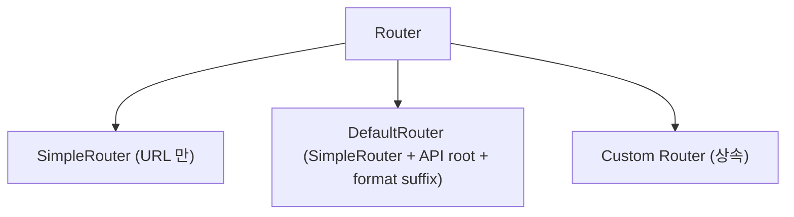
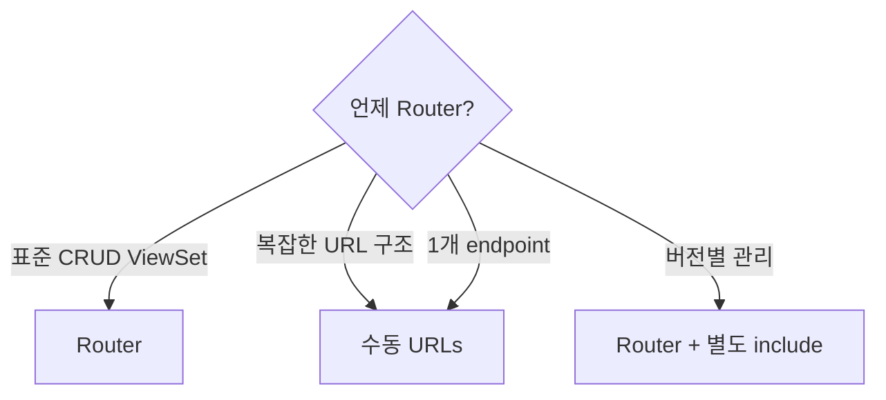

## 정의

**Router** = ViewSet 에 대한 *URL 자동 생성*. Rails 의 `resources :users` 와 유사.

## 왜 Router?

```python
# ✗ 수동 URL 등록 (ViewSet 마다 6-7 라인)
urlpatterns = [
    path('users/', UserViewSet.as_view({'get': 'list', 'post': 'create'})),
    path('users/<int:pk>/', UserViewSet.as_view({
        'get': 'retrieve',
        'put': 'update',
        'patch': 'partial_update',
        'delete': 'destroy',
    })),
]

# ✓ Router 자동
router = DefaultRouter()
router.register('users', UserViewSet)
urlpatterns = [path('', include(router.urls))]
```

## 종류



### DefaultRouter

```python
from rest_framework import routers

router = routers.DefaultRouter()
router.register('users', UserViewSet)
router.register('groups', GroupViewSet, basename='group')

urlpatterns = [
    path('api/', include(router.urls)),
]
```

생성되는 URL:

| URL | Method | 대응 |
|---|---|---|
| `/api/` | GET | API root (endpoint 목록) |
| `/api/users/` | GET | `list` |
| `/api/users/` | POST | `create` |
| `/api/users/{id}/` | GET | `retrieve` |
| `/api/users/{id}/` | PUT | `update` |
| `/api/users/{id}/` | PATCH | `partial_update` |
| `/api/users/{id}/` | DELETE | `destroy` |
| `/api/users.json` 등 | format suffix | 옵션 |

### SimpleRouter

`DefaultRouter` 에서 *API root + format suffix 제외*. 더 minimal.

```python
router = routers.SimpleRouter()
```

## `basename` (queryset 없을 때 필수)

```python
router.register('users', UserViewSet)
# queryset 있으면 자동 basename='user'

class ArticleViewSet(viewsets.ViewSet):
    def list(self, request):
        return Response(...)

router.register('articles', ArticleViewSet, basename='article')  # ← 필수
```

## Custom Action (`@action`)

Router 는 *표준 CRUD* 외에 커스텀 endpoint 도 자동 등록:

```python
from rest_framework.decorators import action

class UserViewSet(viewsets.ModelViewSet):
    queryset = User.objects.all()
    serializer_class = UserSerializer

    @action(detail=False, methods=['get'])
    def me(self, request):
        """GET /users/me/"""
        return Response(UserSerializer(request.user).data)

    @action(detail=False, methods=['post'])
    def bulk_delete(self, request):
        """POST /users/bulk_delete/"""
        ids = request.data.get('ids', [])
        User.objects.filter(id__in=ids).delete()
        return Response(status=204)

    @action(detail=True, methods=['post'])
    def deactivate(self, request, pk=None):
        """POST /users/{id}/deactivate/"""
        user = self.get_object()
        user.is_active = False
        user.save()
        return Response(UserSerializer(user).data)

    @action(detail=True, methods=['get'], url_path='articles',
            serializer_class=ArticleSerializer)
    def user_articles(self, request, pk=None):
        """GET /users/{id}/articles/"""
        user = self.get_object()
        articles = Article.objects.filter(author=user)
        page = self.paginate_queryset(articles)
        serializer = ArticleSerializer(page or articles, many=True)
        return self.get_paginated_response(serializer.data) if page else Response(serializer.data)
```

| 옵션 | 의미 |
|---|---|
| `detail=True` | `/users/{id}/action/` (인스턴스별) |
| `detail=False` | `/users/action/` (컬렉션) |
| `methods=['post']` | HTTP method |
| `url_path='...'` | URL 이름 (기본: 메서드명) |
| `url_name='...'` | reverse URL 이름 |
| `serializer_class=...` | 해당 action 전용 |
| `permission_classes=[...]` | 해당 action 전용 |

## Nested Router

기본 DRF 는 nested 지원 안 함. `drf-nested-routers` 사용:

```bash
pip install drf-nested-routers
```

```python
from rest_framework_nested import routers

router = routers.DefaultRouter()
router.register('articles', ArticleViewSet)

# Nested
article_router = routers.NestedDefaultRouter(router, 'articles', lookup='article')
article_router.register('comments', CommentViewSet, basename='article-comments')

urlpatterns = [
    path('', include(router.urls)),
    path('', include(article_router.urls)),
]
```

→ `/articles/{id}/comments/`

## URL 확인

```bash
python manage.py show_urls
# 또는 개발 서버 실행 후 API root 확인
```

## Multiple Routers

```python
# 버전별
router_v1 = DefaultRouter()
router_v1.register('users', UserV1ViewSet)

router_v2 = DefaultRouter()
router_v2.register('users', UserV2ViewSet)

urlpatterns = [
    path('api/v1/', include(router_v1.urls)),
    path('api/v2/', include(router_v2.urls)),
]
```

자세한 건 [[drf-versioning-content-negotiation]].

## Custom Router

```python
from rest_framework.routers import DefaultRouter, Route, DynamicRoute

class ReadOnlyRouter(DefaultRouter):
    """GET 만 지원"""
    routes = [
        Route(
            url=r'^{prefix}/$',
            mapping={'get': 'list'},
            name='{basename}-list',
            detail=False,
            initkwargs={'suffix': 'List'},
        ),
        Route(
            url=r'^{prefix}/{lookup}/$',
            mapping={'get': 'retrieve'},
            name='{basename}-detail',
            detail=True,
            initkwargs={'suffix': 'Detail'},
        ),
    ]
```

## Router vs Manual URLs



## 다른 프레임워크

| Framework | 자동 라우팅 |
|---|---|
| **DRF** | `router.register` |
| **Rails** | `resources :users` |
| **NestJS** | `@Controller` decorator |
| **Spring Data REST** | `@RepositoryRestResource` |
| **FastAPI** | 없음 (수동) |
| **Express** | 없음 (수동) |

## 흔한 함정

> [!WARNING]
> 1. **`ViewSet` 없이 register** = ViewSet 아닌 것 넘기면 에러.
> 2. **`basename` 누락 (queryset 없는 ViewSet)** = URL 이름 자동 생성 실패.
> 3. **Nested router 순서** = child router 를 나중에 include.
> 4. **`@action` methods 대소문자** = `['GET']` 대신 `['get']` 사용 실패.

## 관련 위키

- [[django-drf-viewset]]
- [[drf-tutorial-quickstart]]
- [[drf-views]]
- [[drf-versioning-content-negotiation]]
