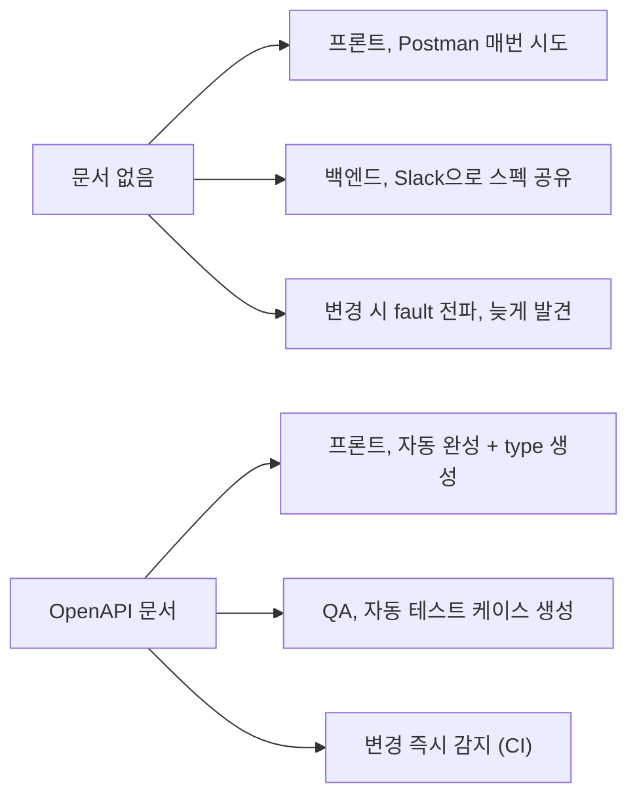
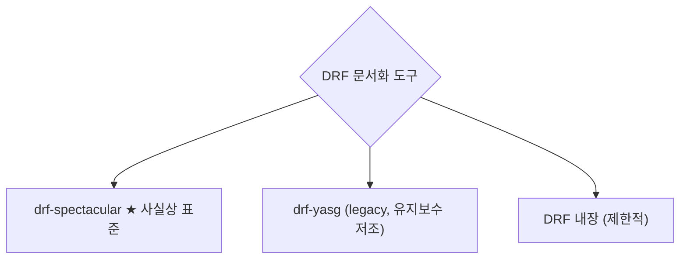
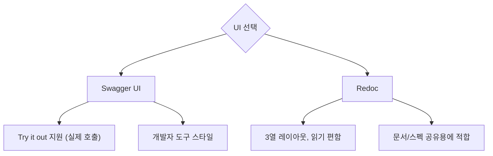

## 정의

**OpenAPI** (전 Swagger) = REST API를 *기계 가독 스펙*으로 기술하는 표준. DRF는 이 스펙을 *ViewSet / Serializer 로부터 자동 추출*할 수 있어, Postman 없이 브라우저에서 API를 탐색 + 실행 가능.

> 이 페이지는 [DRF Documenting your API](https://www.django-rest-framework.org/topics/documenting-your-api/) 를 기반으로, 실무에서 자주 쓰는 **drf-spectacular** 를 중심으로 정리한다.

## 왜 API 문서화가 필요한가



| 목적 | 얻는 것 |
|---|---|
| **탐색** | 브라우저에서 endpoint 목록 + 파라미터 확인 |
| **테스트** | Try it out 으로 즉시 호출 |
| **타입 생성** | TypeScript, Kotlin 등 client SDK 자동 생성 |
| **계약 (Contract)** | 프론트/백 합의된 스펙, breaking change 방지 |
| **온보딩** | 신규 개발자 학습 시간 단축 |

## 도구 선택



| 도구 | 상태 | 특징 |
|---|---|---|
| **drf-spectacular** | *활발* | OpenAPI 3.1, type hint 인식, Sane defaults |
| **drf-yasg** | *deprecated 권장* | OpenAPI 2.0, 여전히 인기 있지만 3.1 미지원 |
| **DRF 내장 SchemaGenerator** | *기본 포함* | OpenAPI 3.0 하지만 커스텀 어려움 |
| **coreapi** (2020 이전) | *사용 금지* | DRF 3.10에서 제거됨 |

> [!TIP]
> 2026년 현재 **`drf-spectacular` 를 기본으로 선택**하는 것이 안전. `drf-yasg` 는 유지보수 프로젝트만.

## drf-spectacular 설치 (5분 완성)

```bash
pip install drf-spectacular
```

```python
# settings.py
INSTALLED_APPS = [
    ...,
    'rest_framework',
    'drf_spectacular',
]

REST_FRAMEWORK = {
    'DEFAULT_SCHEMA_CLASS': 'drf_spectacular.openapi.AutoSchema',
}

SPECTACULAR_SETTINGS = {
    'TITLE': 'My API',
    'DESCRIPTION': '내 서비스 REST API 문서',
    'VERSION': '1.0.0',
    'SERVE_INCLUDE_SCHEMA': False,   # /api/schema/ 자체는 문서에서 숨김
    'COMPONENT_SPLIT_REQUEST': True, # request/response schema 분리
}
```

```python
# urls.py
from drf_spectacular.views import (
    SpectacularAPIView,
    SpectacularSwaggerView,
    SpectacularRedocView,
)

urlpatterns = [
    ...,
    # OpenAPI 3.1 스펙 (JSON/YAML)
    path('api/schema/', SpectacularAPIView.as_view(), name='schema'),

    # 두 종류 UI (원하는 것 하나만 쓰거나 둘 다)
    path('api/docs/', SpectacularSwaggerView.as_view(url_name='schema'), name='swagger-ui'),
    path('api/redoc/', SpectacularRedocView.as_view(url_name='schema'), name='redoc'),
]
```

브라우저에서 `http://localhost:8000/api/docs/` 접속 → Swagger UI 자동 렌더링.

## Swagger UI vs Redoc



| 항목 | Swagger UI | Redoc |
|---|---|---|
| 스타일 | 아코디언 | 3열, 문서 스타일 |
| Try it out | *예* | 아니오 |
| 검색 | 예 | 예 |
| 커스텀 CSS | 부분적 | 자유 |
| 용도 | *개발자 테스트* | *외부 공개 문서* |

## 자동 추출 되는 것

DRF `ViewSet` + `Serializer` 만 잘 짜면 아래가 자동 문서화:

```python
class UserViewSet(viewsets.ModelViewSet):
    """유저 리소스 관리."""      # ← 이 docstring이 태그 description
    queryset = User.objects.all()
    serializer_class = UserSerializer
    permission_classes = [IsAuthenticated]
    filterset_fields = ['is_staff', 'is_active']
    search_fields = ['username', 'email']

    @action(detail=True, methods=['post'])
    def deactivate(self, request, pk=None):
        """유저 비활성화."""      # ← action의 description
        ...
```

자동 추출되는 요소:
- **Endpoint 경로** ← Router URL
- **HTTP method** ← list/create/retrieve/…
- **Request body schema** ← Serializer fields
- **Response schema** ← Serializer fields
- **Query params** ← `filterset_fields`, `search_fields`, `ordering_fields`
- **Path params** ← `<int:pk>` etc.
- **Authentication** ← `authentication_classes`
- **Description** ← docstring

## `@extend_schema` 로 커스터마이즈

```python
from drf_spectacular.utils import extend_schema, OpenApiParameter, OpenApiExample

class UserViewSet(viewsets.ModelViewSet):

    @extend_schema(
        summary='유저 검색',
        description='이름 또는 이메일로 유저를 검색합니다. 최소 2자 이상 필요.',
        parameters=[
            OpenApiParameter(
                name='q',
                type=str,
                location=OpenApiParameter.QUERY,
                description='검색어',
                required=True,
            ),
        ],
        responses={
            200: UserSerializer(many=True),
            400: OpenApiExample(name='잘못된 요청', value={'detail': '검색어 부족'}),
        },
        tags=['users'],
    )
    @action(detail=False, methods=['get'])
    def search(self, request):
        ...
```

주요 인자:
- `summary` = endpoint 한 줄 요약
- `description` = 긴 설명 (Markdown 지원)
- `parameters` = query/header/path param 명시
- `request` = request body serializer
- `responses` = status code별 응답 serializer
- `tags` = 그룹핑
- `deprecated` = 곧 제거 예정 표시
- `exclude` = 문서에서 숨김

## Enum 필드 문서화

```python
from drf_spectacular.utils import extend_schema_field
from drf_spectacular.types import OpenApiTypes

class UserSerializer(serializers.ModelSerializer):
    role = serializers.ChoiceField(
        choices=['admin', 'user', 'guest'],
        help_text='유저 역할',
    )
```

DRF ChoiceField → OpenAPI `enum` 으로 자동 변환.

## Nested Serializer 문서화

```python
class ProfileSerializer(serializers.ModelSerializer):
    class Meta:
        model = Profile
        fields = ['bio', 'avatar_url']

class UserSerializer(serializers.ModelSerializer):
    profile = ProfileSerializer(read_only=True)      # ← nested schema 자동 추론

    class Meta:
        model = User
        fields = ['id', 'username', 'profile']
```

## SerializerMethodField 타입 힌트

```python
class UserSerializer(serializers.ModelSerializer):
    is_online = serializers.SerializerMethodField()

    @extend_schema_field(OpenApiTypes.BOOL)     # ← 타입 힌트 없으면 unknown
    def get_is_online(self, obj):
        return obj.last_seen and (now() - obj.last_seen).seconds < 300
```

> [!WARNING]
> `SerializerMethodField` 는 반환 타입이 문서에 나오지 않는다. `@extend_schema_field` 로 명시.

## 인증 문서화

```python
SPECTACULAR_SETTINGS = {
    ...,
    'SECURITY': [{'jwtAuth': []}],
    'APPEND_COMPONENTS': {
        'securitySchemes': {
            'jwtAuth': {
                'type': 'http',
                'scheme': 'bearer',
                'bearerFormat': 'JWT',
            },
        },
    },
}
```

Swagger UI 우측 상단 "Authorize" 버튼으로 JWT 토큰 입력 → 이후 요청에 자동 헤더 추가.

자세한 인증 방식은 [[drf-authentication]].

## 여러 개 응답 (union)

```python
@extend_schema(
    responses={
        200: UserSerializer,
        202: OpenApiExample(name='pending', value={'status': 'pending'}),
        400: OpenApiExample(name='invalid', value={'detail': 'error'}),
        429: OpenApiExample(name='throttled', value={'detail': 'Rate limit'}),
    }
)
def create(self, request):
    ...
```

## 요청 예시

```python
from drf_spectacular.utils import OpenApiExample, extend_schema

@extend_schema(
    examples=[
        OpenApiExample(
            'Simple case',
            summary='간단한 유저 생성',
            description='기본 필드만 사용',
            value={'username': 'koa', 'email': 'koa@example.com'},
            request_only=True,
        ),
        OpenApiExample(
            'With profile',
            value={'username': 'koa', 'email': 'koa@example.com', 'profile': {'bio': '개발자'}},
            request_only=True,
        ),
    ]
)
def create(self, request):
    ...
```

Swagger UI에서 예시 드롭다운으로 선택 가능.

## Serializer 재사용 (같은 이름 충돌 방지)

```python
class UserCreateSerializer(serializers.ModelSerializer):
    class Meta:
        model = User
        fields = ['username', 'email', 'password']

class UserReadSerializer(serializers.ModelSerializer):
    class Meta:
        model = User
        fields = ['id', 'username', 'email']


class UserViewSet(ModelViewSet):
    queryset = User.objects.all()

    def get_serializer_class(self):
        if self.action == 'create':
            return UserCreateSerializer
        return UserReadSerializer
```

drf-spectacular 는 자동으로 두 스키마를 `UserCreate` / `UserRead` 로 분리 문서화.

## Schema 파일 export

```bash
# YAML로 저장 (버전 관리)
python manage.py spectacular --file schema.yml

# 검증
python manage.py spectacular --validate --file schema.yml
```

CI에 넣어두면 *스펙 breaking change 를 조기 감지*.

## Client SDK 자동 생성

OpenAPI 스펙만 있으면 다양한 언어 client 를 코드 생성:

```bash
# TypeScript
npx openapi-typescript schema.yml -o api-types.ts

# Kotlin
openapi-generator-cli generate -i schema.yml -g kotlin -o ./kotlin-client
```

프론트에서:

```typescript
import type { paths } from './api-types';

type UserResponse = paths['/api/users/{id}/']['get']['responses']['200']['content']['application/json'];
```

*백엔드 스펙과 프론트 타입이 자동 동기화*. Breaking change → 컴파일 에러.

## 다른 프레임워크 문서화 대응

| 도구 | 자동 문서화 |
|---|---|
| **DRF + drf-spectacular** | ViewSet + Serializer 자동 |
| **FastAPI** | *내장* (Pydantic type hint 기반) |
| **Django Ninja** | *내장* (Pydantic type hint 기반) |
| **NestJS** | @nestjs/swagger 데코레이터 명시 |
| **Spring Boot** | springdoc-openapi 자동 |
| **Express** | swagger-jsdoc 주석 명시 |
| **Rails** | rswag, apipie-rails |

> FastAPI/Ninja 는 *type hint 만으로* 자동. DRF는 *Serializer 정의*가 문서 기반.

## 실무 팁

### 1. 태그로 그룹핑

```python
class UserViewSet(ModelViewSet):
    ...
    @extend_schema(tags=['User Management'])
    def list(self, request):
        ...
```

Swagger UI에서 카테고리별 아코디언.

### 2. CORS 문제

Swagger UI 에서 Try it out 시도 → CORS 에러 자주 발생.

```python
INSTALLED_APPS += ['corsheaders']
MIDDLEWARE = [
    'corsheaders.middleware.CorsMiddleware',
    ...,
]
CORS_ALLOWED_ORIGINS = ['http://localhost:8000']
```

### 3. 문서 접근 권한 제한

```python
# 프로덕션은 문서 접근 제한
if not DEBUG:
    urlpatterns = [
        path('api/schema/', permission_required('is_staff')(SpectacularAPIView.as_view())),
    ]
```

### 4. 버전별 문서 분리

```python
# v1 / v2 각각 별도 스키마
SPECTACULAR_SETTINGS = {
    'SERVERS': [
        {'url': '/api/v1', 'description': 'v1'},
        {'url': '/api/v2', 'description': 'v2 (신규 권장)'},
    ],
}
```

자세한 API 버전 관리는 [[drf-versioning-content-negotiation]].

## 흔한 함정

> [!WARNING]
> 1. **Serializer 없는 endpoint** = 문서에 body 안 나옴. `@extend_schema(request=...)` 명시.
> 2. **SerializerMethodField 타입 안 명시** = OpenAPI `type: unknown`. `@extend_schema_field`.
> 3. **`@action` 에 methods 만 명시** = summary/description 없어 문서 초라. docstring 사용.
> 4. **문서 URL 프로덕션 개방** = 내부 endpoint 노출. 접근 제한 필수.
> 5. **`drf-yasg` 를 새 프로젝트에 도입** = OpenAPI 2.0 만 지원. `drf-spectacular` 사용.

## 관련 위키

- [[django-rest-framework]] (DRF 개요)
- [[drf-tutorial-quickstart]]
- [[drf-views]]
- [[django-drf-serializers]]
- [[drf-authentication]]
- [[drf-testing]] (테스트, 다음 단계)
- [[REST API Design]]
