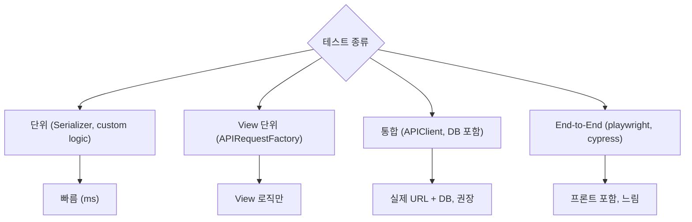

## 정의

DRF의 테스트 도구는 Django `TestCase` 위에 *API 특화 helper* 를 얹은 것. `APIClient` 로 real endpoint 를 호출하거나 `APIRequestFactory` 로 View 단위 테스트가 가능.

## 테스트 도구 계층



| 도구 | 층 | 속도 | DB |
|---|---|---|---|
| `TestCase` + Serializer 직접 | 단위 | *ms* | 아니오 (or 필요 시) |
| `APIRequestFactory` | View | *빠름* | 아니오 (mock) |
| `APIClient` (DRF) | 통합 | *중간* | *예* |
| Django `Client` | 통합 (form only) | 중간 | 예 |

> [!TIP]
> DRF 프로젝트는 `APIClient` 를 기본으로 쓴다. 실제 URL 라우팅 + 인증 + 응답 렌더링 모두 검증.

## 설치

```bash
pip install pytest pytest-django factory-boy freezegun
```

```ini
# pytest.ini
[pytest]
DJANGO_SETTINGS_MODULE = myproject.settings.test
python_files = tests.py test_*.py
```

## 1. APIClient (통합 테스트)

```python
from rest_framework.test import APITestCase
from rest_framework import status

class UserAPITest(APITestCase):
    def setUp(self):
        self.user = User.objects.create_user('koa', password='pw')

    def test_list_users(self):
        self.client.force_authenticate(user=self.user)
        response = self.client.get('/api/users/')
        self.assertEqual(response.status_code, status.HTTP_200_OK)
        self.assertEqual(len(response.data['results']), 1)

    def test_create_requires_auth(self):
        response = self.client.post('/api/users/', {'username': 'new'})
        self.assertEqual(response.status_code, status.HTTP_401_UNAUTHORIZED)
```

`self.client` = `APIClient` 인스턴스.

## `force_authenticate` (권장)

```python
# ★ 가장 자주 쓰는 인증 helper
self.client.force_authenticate(user=self.user)
# → JWT 발급, 헤더 첨부 등 우회. 유닛 테스트에 이상적.

self.client.force_authenticate(user=None)  # 로그아웃
```

DRF 인증 클래스 무시 하고 `request.user` 를 직접 주입. *가장 빠름*.

## 세션 로그인

```python
self.client.login(username='koa', password='pw')
# 또는
self.client.force_login(self.user)   # Django 스타일
```

`SessionAuthentication` 검증까지 하고 싶을 때.

## 토큰 인증

```python
# TokenAuthentication
token = Token.objects.create(user=self.user)
self.client.credentials(HTTP_AUTHORIZATION=f'Token {token.key}')

# JWTAuthentication
from rest_framework_simplejwt.tokens import RefreshToken
refresh = RefreshToken.for_user(self.user)
self.client.credentials(HTTP_AUTHORIZATION=f'Bearer {refresh.access_token}')
```

*실제 인증 파이프라인* 을 통과. E2E 시나리오 검증에 적합.

## HTTP 메서드

```python
# GET
response = self.client.get('/api/users/', {'q': 'koa'})    # ?q=koa 자동

# POST (JSON 자동)
response = self.client.post('/api/users/', {'username': 'new'}, format='json')

# PATCH
response = self.client.patch('/api/users/1/', {'username': 'updated'}, format='json')

# DELETE
response = self.client.delete('/api/users/1/')

# 헤더
response = self.client.get('/api/users/', HTTP_X_CUSTOM='value')
```

> [!IMPORTANT]
> `format='json'` 명시 권장. 안 하면 form-urlencoded 로 보내져 nested 객체 실패.

## 응답 검증

```python
def test_get_user(self):
    response = self.client.get('/api/users/1/')

    self.assertEqual(response.status_code, 200)
    self.assertEqual(response.data['username'], 'koa')
    self.assertIn('email', response.data)
    self.assertIsInstance(response.data['groups'], list)

    # 헤더
    self.assertEqual(response['Content-Type'], 'application/json')

    # JSON 직렬화된 문자열
    self.assertEqual(response.json(), {'id': 1, 'username': 'koa', ...})
```

## 2. APIRequestFactory (View 단위)

```python
from rest_framework.test import APIRequestFactory

class UserViewTest(TestCase):
    def setUp(self):
        self.factory = APIRequestFactory()
        self.user = User.objects.create_user('koa', password='pw')

    def test_view_directly(self):
        view = UserViewSet.as_view({'get': 'list'})
        request = self.factory.get('/api/users/')
        force_authenticate(request, user=self.user)
        response = view(request)

        self.assertEqual(response.status_code, 200)
```

URL 라우팅 없이 *View 직접 호출*. 빠르지만 pipeline 일부만 검증.

## 3. Serializer 단위 테스트

```python
def test_valid_serializer():
    data = {'username': 'koa', 'email': 'koa@example.com'}
    serializer = UserSerializer(data=data)
    assert serializer.is_valid()
    assert serializer.validated_data['username'] == 'koa'


def test_invalid_email():
    data = {'username': 'koa', 'email': 'not-an-email'}
    serializer = UserSerializer(data=data)
    assert not serializer.is_valid()
    assert 'email' in serializer.errors
```

## 4. pytest-django 사용

```python
import pytest

@pytest.fixture
def api_client():
    from rest_framework.test import APIClient
    return APIClient()

@pytest.fixture
def user(db):
    return User.objects.create_user('koa', password='pw')

@pytest.fixture
def auth_client(api_client, user):
    api_client.force_authenticate(user=user)
    return api_client

def test_list_users(auth_client):
    response = auth_client.get('/api/users/')
    assert response.status_code == 200
```

fixture 조합 이 재사용성 극대화. `pytest.ini` 의 `--reuse-db` 로 DB 재생성 없이 반복 실행.

## 5. Factory Boy (테스트 데이터)

```python
# factories.py
import factory
from django.contrib.auth.models import User

class UserFactory(factory.django.DjangoModelFactory):
    class Meta:
        model = User

    username = factory.Sequence(lambda n: f'user{n}')
    email = factory.LazyAttribute(lambda o: f'{o.username}@example.com')
    is_active = True


# 사용
def test_many_users():
    UserFactory.create_batch(50)
    assert User.objects.count() == 50


# 관계
class ArticleFactory(factory.django.DjangoModelFactory):
    class Meta:
        model = Article
    title = factory.Faker('sentence')
    author = factory.SubFactory(UserFactory)
```

`fixtures/*.json` 대신 factory 로 *동적 생성*.

## 응답 status code 매트릭스

```python
@pytest.mark.parametrize('user_type,expected_status', [
    ('anonymous', 401),
    ('regular', 403),
    ('admin', 200),
])
def test_admin_endpoint(api_client, user_type, expected_status):
    if user_type == 'regular':
        api_client.force_authenticate(user=UserFactory())
    elif user_type == 'admin':
        api_client.force_authenticate(user=UserFactory(is_staff=True))

    response = api_client.get('/api/admin/stats/')
    assert response.status_code == expected_status
```

`parametrize` 로 *권한 매트릭스 완전 커버*.

## 권한 테스트 패턴

```python
class PostPermissionTest(APITestCase):
    def setUp(self):
        self.author = UserFactory()
        self.other = UserFactory()
        self.post = Post.objects.create(author=self.author, title='...')

    def test_author_can_delete(self):
        self.client.force_authenticate(self.author)
        response = self.client.delete(f'/api/posts/{self.post.pk}/')
        self.assertEqual(response.status_code, 204)

    def test_other_cannot_delete(self):
        self.client.force_authenticate(self.other)
        response = self.client.delete(f'/api/posts/{self.post.pk}/')
        self.assertEqual(response.status_code, 403)
```

자세한 권한 개념은 [[django-drf-permissions]].

## Throttle 테스트

```python
from django.core.cache import cache

class ThrottleTest(APITestCase):
    def setUp(self):
        cache.clear()   # ★ throttle 카운트 초기화

    def test_burst_limit(self):
        with self.settings(REST_FRAMEWORK={
            'DEFAULT_THROTTLE_RATES': {'login': '2/min'},
        }):
            for _ in range(2):
                self.assertEqual(self.client.post('/api/login/', ...).status_code, 200)
            self.assertEqual(self.client.post('/api/login/', ...).status_code, 429)
```

> [!WARNING]
> `setUp` 에서 `cache.clear()` 필수. 안 하면 이전 테스트 카운트 남음.

## 시간 조작 (freezegun)

```python
from freezegun import freeze_time

@freeze_time('2026-06-25 12:00:00')
def test_expired_token():
    token = RefreshToken.for_user(user)

    with freeze_time('2026-07-25 12:00:00'):    # 30일 후
        response = api_client.get('/api/me/', HTTP_AUTHORIZATION=f'Bearer {token.access_token}')
        assert response.status_code == 401
```

JWT 만료, 세션 timeout 등 *시간 종속 테스트*.

## Mocking 외부 API

```python
from unittest.mock import patch

@patch('myapp.services.send_email')
def test_signup_sends_email(mock_send):
    response = api_client.post('/api/signup/', {'email': 'a@b.c'})
    assert response.status_code == 201
    mock_send.assert_called_once_with('a@b.c', ...)
```

## DB Snapshot

```python
def test_no_extra_queries():
    # N+1 감시
    with self.assertNumQueries(3):
        response = self.client.get('/api/articles/')
```

DRF 응답이 예상보다 많은 쿼리를 하면 실패. Performance regression 방어.

자세한 N+1 개념은 [[django-orm-advanced]].

## Coverage 측정

```bash
pip install coverage
coverage run -m pytest
coverage report
coverage html    # htmlcov/index.html
```

목표: *serializer/view 는 90%+, permission/utility 는 100%.*

## 다른 프레임워크 테스트 도구

| Framework | 테스트 도구 |
|---|---|
| **DRF** | `APIClient`, `APIRequestFactory`, pytest-django |
| **FastAPI** | `TestClient` (Starlette) |
| **Spring** | MockMvc, `@WebMvcTest` |
| **Rails** | ActionDispatch, RSpec, request specs |
| **Express** | supertest |
| **NestJS** | @nestjs/testing + supertest |

## 흔한 함정

> [!WARNING]
> 1. **`format='json'` 누락** = form-urlencoded 로 전송, nested 데이터 실패.
> 2. **`cache.clear()` 안 함 (Throttle 테스트)** = flaky test.
> 3. **`self.client.login()` 을 JWT 라우트에** = 세션이라 401. `force_authenticate` 사용.
> 4. **`setUp` 에서 heavy DB 초기화** = 매 테스트마다 실행. fixture 로 격리.
> 5. **`assertEqual(response.data, dict)`** = OrderedDict 차이로 실패 가능. `json.loads(response.content)` 로 정규화.

## 관련 위키

- [[django-testing]] (Django 기본 테스트)
- [[django-rest-framework]]
- [[drf-tutorial-quickstart]]
- [[drf-authentication]]
- [[django-drf-permissions]]
- [[drf-schemas-openapi]]
