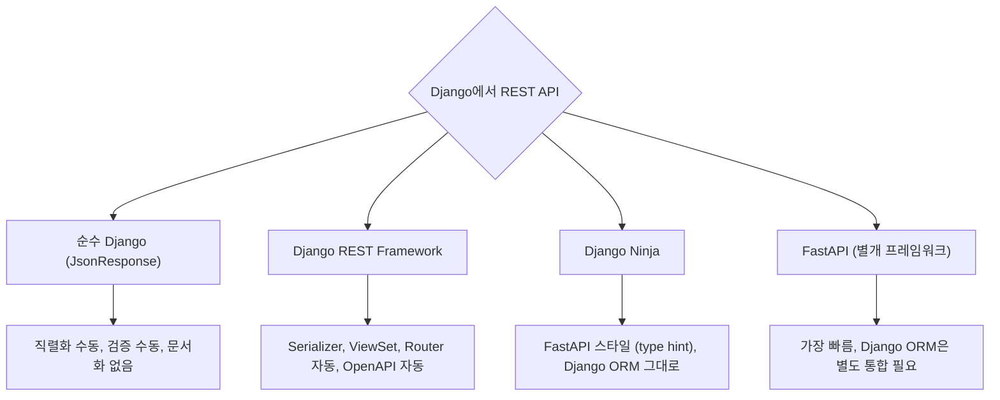
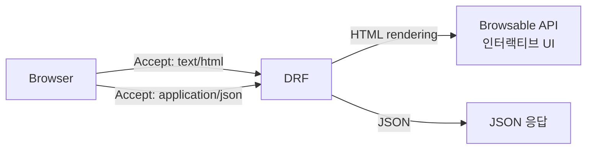
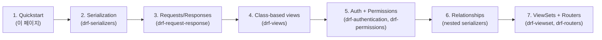
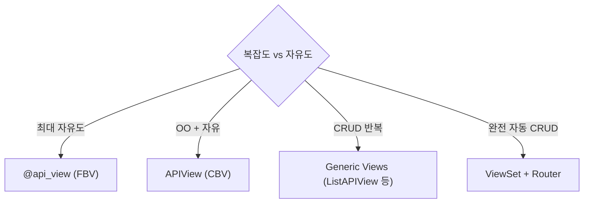

## 정의

**Django REST Framework (DRF)** 를 *처음 사용* 하는 사람을 위한 순차 시작 가이드. 5분 안에 *동작하는 API 서버* 완성.

DRF 개요는 [[django-rest-framework]]. Django 기본은 [[django-tutorial]].

## DRF는 무엇인가

한 줄로: **Django 위에 REST API 를 짜기 위한 배터리 포함 라이브러리.**

Django 자체는 웹앱 (HTML 페이지) 을 잘 만들지만, JSON API 는 손이 많이 간다. DRF 는 그 반복을 자동화한 *사실상 표준* 도구.

### 목적

| 없을 때 (순수 Django) | DRF 사용 시 |
|---|---|
| Model → dict 수동 변환 | `Serializer` 자동 |
| Body JSON 파싱 수동 | `request.data` 자동 |
| CRUD view 6개 손으로 | `ModelViewSet` 한 줄 |
| URL 매핑 손으로 | `Router.register()` 한 줄 |
| 인증 코드 수동 | `authentication_classes` 선언만 |
| API 문서 손으로 | drf-spectacular 자동 |

### 대안 비교



| 옵션 | 장점 | 단점 | 언제? |
|---|---|---|---|
| **DRF** | *성숙, 커뮤니티 최대, 문서/책 많음* | 학습 곡선, 클래스 계층 복잡 | Django 프로젝트에 REST API 얹을 때 *기본 선택* |
| **Django Ninja** | 빠름, FastAPI 스타일, 코드 간결 | 상대적으로 신생, 라이브러리 생태계 작음 | 작은 Django 프로젝트, type hint 선호 |
| **FastAPI** | *가장 빠름*, 비동기 우선, 타입 안전 | Django ORM 통합 별도, ecosystem 다름 | Django 종속성 없을 때 |
| **Plain Django** | 학습 곡선 낮음, 의존성 없음 | 매번 boilerplate 반복 | endpoint 1-2개 짜리 프로토타입 |

> DRF 는 *대규모 Django 프로젝트의 REST API* 표준. 새 프로젝트에 REST 필요 → DRF 기본 선택.

## 요청이 어떻게 흐르는가 (한눈에)

DRF는 다음 파이프라인으로 매 요청을 처리한다. *이 순서* 를 알면 후속 페이지 이해가 쉽다.

```anim:drf-request-lifecycle
{}
```

각 스테이지 상세:

| 단계 | 하는 일 | 다음 페이지 |
|---|---|---|
| 1. URL Router | path 매칭 후 View 선택 | [[drf-routers]] |
| 2. Authentication | `Authorization` 헤더 읽고 `request.user` 세팅 | [[drf-authentication]] |
| 3. Permission | 이 user 가 이 view 접근 가능? | [[django-drf-permissions]] |
| 4. Throttle | 이 user 너무 자주 요청? (429) | [[drf-pagination-throttling]] |
| 5. View | 실제 비즈니스 로직 | [[drf-views]], [[django-drf-viewset]] |
| 6. Serializer | Model ↔ dict 변환, 검증 | [[django-drf-serializers]] |
| 7. Renderer | `Accept` 헤더 보고 JSON/HTML 등 선택 | [[drf-request-response]] |

## 요구사항 (2026)

- Django 4.2, 5.x, **6.0**
- Python 3.10-3.14

## 설치

```bash
pip install djangorestframework
pip install markdown           # Browsable API 마크다운
pip install django-filter      # 필터링
```

```python
# settings.py
INSTALLED_APPS = [
    'django.contrib.admin',
    'django.contrib.auth',
    'django.contrib.contenttypes',
    ...,
    'rest_framework',           # ← 추가
    'rest_framework.authtoken', # Token auth 쓸 때
]

REST_FRAMEWORK = {
    'DEFAULT_AUTHENTICATION_CLASSES': [
        'rest_framework.authentication.SessionAuthentication',
        'rest_framework.authentication.TokenAuthentication',
    ],
    'DEFAULT_PERMISSION_CLASSES': [
        'rest_framework.permissions.IsAuthenticatedOrReadOnly',
    ],
    'DEFAULT_PAGINATION_CLASS': 'rest_framework.pagination.PageNumberPagination',
    'PAGE_SIZE': 20,
}
```

## Quickstart: User API (5분 완성)

### 1. Serializer (Model → JSON)

```python
# quickstart/serializers.py
from django.contrib.auth.models import User, Group
from rest_framework import serializers

class UserSerializer(serializers.HyperlinkedModelSerializer):
    class Meta:
        model = User
        fields = ['url', 'username', 'email', 'groups', 'is_staff']

class GroupSerializer(serializers.HyperlinkedModelSerializer):
    class Meta:
        model = Group
        fields = ['url', 'name']
```

자세한 건 [[django-drf-serializers]].

### 2. ViewSet (Endpoint)

```python
# quickstart/views.py
from django.contrib.auth.models import User, Group
from rest_framework import viewsets, permissions
from .serializers import UserSerializer, GroupSerializer

class UserViewSet(viewsets.ModelViewSet):
    """전체 CRUD 자동!"""
    queryset = User.objects.all().order_by('-date_joined')
    serializer_class = UserSerializer
    permission_classes = [permissions.IsAuthenticated]

class GroupViewSet(viewsets.ModelViewSet):
    queryset = Group.objects.all()
    serializer_class = GroupSerializer
```

자세한 건 [[django-drf-viewset]].

### 3. Router (URL 자동)

```python
# urls.py
from django.urls import path, include
from rest_framework import routers
from quickstart.views import UserViewSet, GroupViewSet

router = routers.DefaultRouter()
router.register(r'users', UserViewSet)
router.register(r'groups', GroupViewSet)

urlpatterns = [
    path('', include(router.urls)),
    path('api-auth/', include('rest_framework.urls', namespace='rest_framework')),
]
```

자세한 건 [[drf-routers]].

### 4. 실행

```bash
python manage.py migrate
python manage.py createsuperuser
python manage.py runserver
```

브라우저에서 `http://127.0.0.1:8000/` 접속 → **Browsable API 자동 렌더링!**

## Browsable API



> [!TIP]
> Browsable API 는 *DRF 만의 큰 장점*. 별도 도구 없이 *브라우저에서 API 탐색 + 테스트*. FastAPI 의 `/docs` 와 유사하지만 *실제 endpoint 이동* 가능.

## API 호출 예시

```bash
# 목록 조회
curl -H 'Accept: application/json' http://127.0.0.1:8000/users/

# 생성 (session auth)
curl -X POST http://127.0.0.1:8000/users/ \
  -H 'Content-Type: application/json' \
  -H 'Accept: application/json' \
  -u admin:admin \
  -d '{"username": "koa", "email": "koa@example.com", "groups": []}'

# 상세
curl http://127.0.0.1:8000/users/1/

# 삭제
curl -X DELETE http://127.0.0.1:8000/users/1/ -u admin:admin
```

## Tutorial 순서 (권장 학습)



## FBV vs APIView vs GenericView vs ViewSet



각 4개 스타일:

```python
# 1. FBV
@api_view(['GET', 'POST'])
def user_list(request):
    if request.method == 'POST':
        serializer = UserSerializer(data=request.data)
        serializer.is_valid(raise_exception=True)
        serializer.save()
        return Response(serializer.data, status=201)
    users = User.objects.all()
    return Response(UserSerializer(users, many=True).data)

# 2. APIView
class UserList(APIView):
    def get(self, request):
        users = User.objects.all()
        return Response(UserSerializer(users, many=True).data)

# 3. Generic Views
class UserList(generics.ListCreateAPIView):
    queryset = User.objects.all()
    serializer_class = UserSerializer

# 4. ViewSet
class UserViewSet(viewsets.ModelViewSet):
    queryset = User.objects.all()
    serializer_class = UserSerializer
```

## 다음 학습 순서

이 튜토리얼 후 순서:

1. [[django-drf-serializers]] - Serializer 심화
2. [[drf-request-response]] - Request/Response 객체
3. [[drf-views]] - Views 종류
4. [[drf-authentication]] - 인증
5. [[django-drf-permissions]] - 권한
6. [[drf-pagination-throttling]] - Pagination + Rate limit
7. [[drf-filtering]] - 필터링
8. [[django-drf-viewset]] - ViewSet 심화
9. [[drf-routers]] - Router 심화
10. [[drf-schemas-openapi]] - OpenAPI 문서화
11. [[drf-testing]] - 테스트

## 다른 프레임워크 비교

| Framework | Serializer | Auto CRUD | Browsable API |
|---|---|---|---|
| **DRF** | Serializer | ViewSet | *예* |
| **FastAPI** | Pydantic | 없음 | Swagger UI |
| **Django Ninja** | Pydantic | 없음 | Swagger UI |
| **Rails** | Active Model Serializers | Scaffold | 없음 |
| **Spring Boot** | Jackson | Spring Data REST | 없음 |
| **NestJS** | class-validator | 없음 | Swagger 통합 |

## 흔한 함정

> [!WARNING]
> 1. **`INSTALLED_APPS` 에 `rest_framework` 안 넣음** = 500 error.
> 2. **`HyperlinkedModelSerializer` 사용 시 basename 없이 register** = URL 생성 실패.
> 3. **CSRF token session 인증에서 안 넣음** = 401. Browsable API 는 session 이라 필요.
> 4. **`DEFAULT_PERMISSION_CLASSES` 미설정** = 기본 모두 접근 가능 (`AllowAny`).

## 관련 위키

- [[django-rest-framework]] (개요)
- [[django-drf-serializers]]
- [[django-drf-viewset]]
- [[django-drf-permissions]]
- [[django-tutorial]] (Django 기본)
