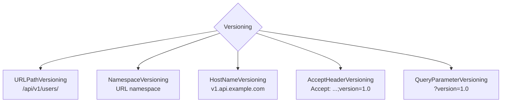
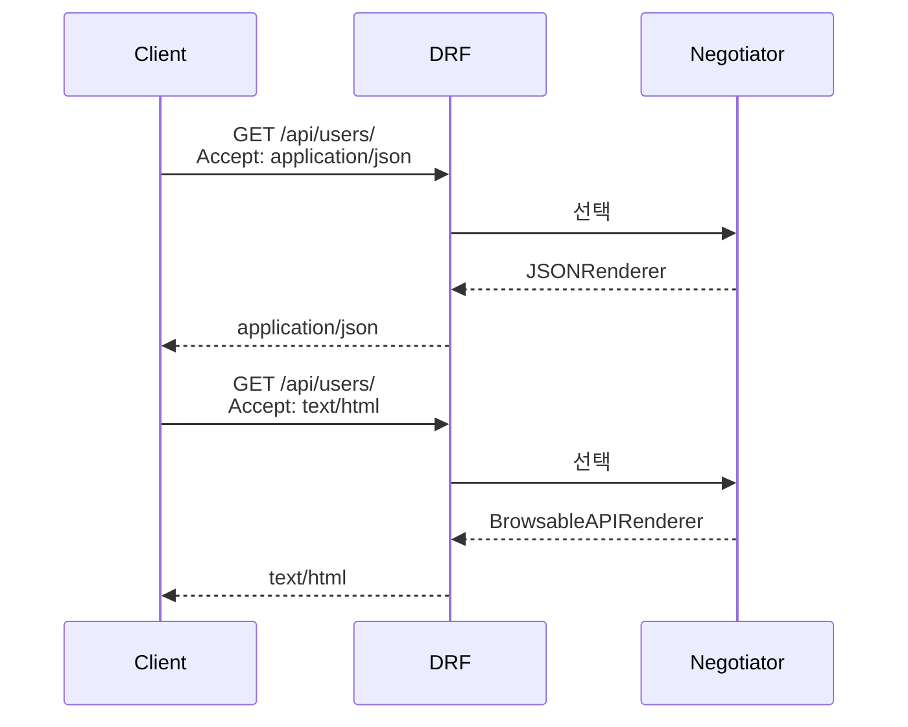

## 정의

**Versioning** = API 의 여러 버전 공존. **Content Negotiation** = *같은 endpoint 가 여러 형식* (JSON, XML, HTML) 응답.

## Versioning 종류



## 설정

```python
REST_FRAMEWORK = {
    'DEFAULT_VERSIONING_CLASS': 'rest_framework.versioning.URLPathVersioning',
    'DEFAULT_VERSION': 'v1',
    'ALLOWED_VERSIONS': ['v1', 'v2'],
    'VERSION_PARAM': 'version',
}
```

## URLPathVersioning (가장 흔함)

```python
# urls.py
urlpatterns = [
    re_path(r'^api/(?P<version>v1|v2)/', include('myapp.urls')),
]
```

```python
class UserList(APIView):
    def get(self, request):
        version = request.version    # 'v1' or 'v2'
        if version == 'v2':
            return Response(UserSerializerV2(User.objects.all(), many=True).data)
        return Response(UserSerializerV1(User.objects.all(), many=True).data)
```

## get_serializer_class 로 분기

```python
class UserViewSet(viewsets.ModelViewSet):
    queryset = User.objects.all()

    def get_serializer_class(self):
        if self.request.version == 'v2':
            return UserSerializerV2
        return UserSerializerV1
```

## 완전 분리 (권장)

```python
# urls.py
urlpatterns = [
    path('api/v1/', include('myapp.v1.urls')),
    path('api/v2/', include('myapp.v2.urls')),
]

# myapp/v1/views.py
class UserViewSet(viewsets.ModelViewSet):
    serializer_class = UserSerializerV1

# myapp/v2/views.py
class UserViewSet(viewsets.ModelViewSet):
    serializer_class = UserSerializerV2
```

> [!TIP]
> **완전 분리** 가 옛 버전 유지 + 신규 자유 개발에 유리. Get_serializer_class 분기 는 *중복 로직 유지* 시.

## AcceptHeaderVersioning

```python
REST_FRAMEWORK = {
    'DEFAULT_VERSIONING_CLASS': 'rest_framework.versioning.AcceptHeaderVersioning',
    'DEFAULT_VERSION': '1.0',
    'ALLOWED_VERSIONS': ['1.0', '2.0'],
}
```

```bash
curl -H 'Accept: application/json; version=2.0' http://localhost:8000/api/users/
```

## Stripe 스타일 (날짜 기반)

```python
class DateVersioning(versioning.BaseVersioning):
    default_version = '2026-06-25'
    allowed_versions = ['2024-01-01', '2025-01-01', '2026-06-25']

    def determine_version(self, request, *args, **kwargs):
        version = request.META.get('HTTP_STRIPE_VERSION', self.default_version)
        if version not in self.allowed_versions:
            raise NotAcceptable(...)
        return version
```

자세한 API versioning 전략은 [[api-versioning]].

## Deprecation

```python
class UserListV1(APIView):
    def get(self, request):
        response = Response(...)
        response['Sunset'] = 'Wed, 31 Dec 2026 23:59:59 GMT'
        response['Deprecation'] = 'true'
        response['Link'] = '</api/v2/users/>; rel="successor-version"'
        return response
```

## Content Negotiation



## Renderer 우선순위

```python
REST_FRAMEWORK = {
    'DEFAULT_RENDERER_CLASSES': [
        'rest_framework.renderers.JSONRenderer',        # 1순위
        'rest_framework.renderers.BrowsableAPIRenderer', # 2순위 (HTML 요청 시)
    ]
}
```

Accept 헤더가 여러 형식 지원 시 → 리스트 순서 대로 선택.

## Quality Value (q)

```
Accept: application/xml;q=0.9, application/json;q=0.8, text/html;q=0.7
```

XML 우선 → 없으면 JSON → 없으면 HTML.

## Custom Content Negotiation

```python
from rest_framework.negotiation import BaseContentNegotiation

class IgnoreClientContentNegotiation(BaseContentNegotiation):
    def select_parser(self, request, parsers):
        return parsers[0]

    def select_renderer(self, request, renderers, format_suffix):
        return (renderers[0], renderers[0].media_type)


class MyView(APIView):
    content_negotiation_class = IgnoreClientContentNegotiation
```

## Format Suffix

```python
from rest_framework.urlpatterns import format_suffix_patterns

urlpatterns = [
    path('users/', UserList.as_view()),
]
urlpatterns = format_suffix_patterns(urlpatterns)
```

```bash
GET /users.json    # → application/json
GET /users.api     # → text/html (Browsable)
```

> [!NOTE]
> Format suffix 는 *옛 패턴*. 현재는 *Accept 헤더* 권장.

## versioned URL reverse

```python
from rest_framework.reverse import reverse

def get(self, request):
    url = reverse('user-list', request=request)   # 버전 자동 포함
    return Response({'url': url})
```

## 다른 프레임워크

| Framework | Versioning | Content Negotiation |
|---|---|---|
| **DRF** | URL/Header/Query | Accept 헤더 |
| **Rails** | scope로 분기 | `respond_to` |
| **Spring** | @RequestMapping produces | `MediaType` |
| **FastAPI** | prefix 분리 | 수동 |
| **Express** | 수동 | `req.accepts` |

## 흔한 함정

> [!WARNING]
> 1. **버전 없이 시작** = breaking change 강요. v1 부터 시작.
> 2. **Sunset 정책 없음** = 옛 버전 영원. 6-12개월 예고.
> 3. **모든 endpoint 에 버전** = 관리 부담. *공통 리소스* 는 unversioned.
> 4. **Accept 헤더 파싱 실수** = `q` 값 무시. DRF 가 자동이지만 custom 시 주의.

## 관련 위키

- [[drf-request-response]]
- [[api-versioning]]
- [[REST API Design]]
- [[spring-mvc-content-negotiation]] (Spring 대응)
