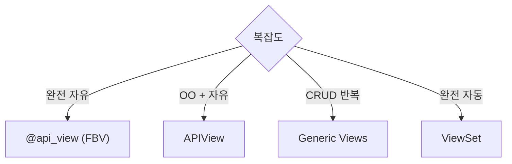
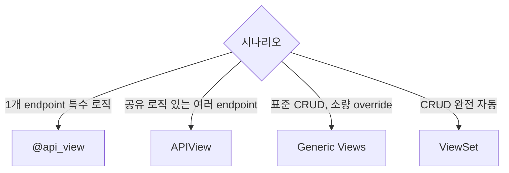

## 정의

DRF View 4가지 스타일. *자유도 vs 자동화* 트레이드오프.

## 4가지 스타일



| 스타일 | 코드량 | 자유도 |
|---|---|---|
| `@api_view` | 유사 Django FBV | *최고* |
| `APIView` | CBV | 높음 |
| `Generic Views` | 몇 줄 | 중간 |
| `ViewSet` | *1줄* | 낮음 (custom action 으로 확장) |

ViewSet 은 [[django-drf-viewset]] 참고.

## 1. FBV (`@api_view`)

```python
from rest_framework.decorators import api_view
from rest_framework.response import Response
from rest_framework import status

@api_view(['GET', 'POST'])
def user_list(request):
    if request.method == 'GET':
        users = User.objects.all()
        serializer = UserSerializer(users, many=True)
        return Response(serializer.data)

    elif request.method == 'POST':
        serializer = UserSerializer(data=request.data)
        if serializer.is_valid():
            serializer.save()
            return Response(serializer.data, status=status.HTTP_201_CREATED)
        return Response(serializer.errors, status=status.HTTP_400_BAD_REQUEST)
```

## Decorator 조합

```python
from rest_framework.decorators import (
    api_view,
    authentication_classes,
    permission_classes,
    throttle_classes,
    renderer_classes,
    parser_classes,
)

@api_view(['GET'])
@authentication_classes([TokenAuthentication])
@permission_classes([IsAuthenticated])
@throttle_classes([UserRateThrottle])
def my_view(request): ...
```

## 2. APIView (CBV)

```python
from rest_framework.views import APIView

class UserList(APIView):
    authentication_classes = [SessionAuthentication, TokenAuthentication]
    permission_classes = [IsAuthenticated]
    throttle_classes = [UserRateThrottle]

    def get(self, request):
        users = User.objects.all()
        return Response(UserSerializer(users, many=True).data)

    def post(self, request):
        serializer = UserSerializer(data=request.data)
        serializer.is_valid(raise_exception=True)
        serializer.save()
        return Response(serializer.data, status=status.HTTP_201_CREATED)
```

`APIView` = Django `View` + DRF 기능 (인증, 권한, throttle, negotiation).

## 3. Generic Views

Django CBV 의 DRF 버전. *CRUD 자동*.

```python
from rest_framework import generics

class UserList(generics.ListCreateAPIView):
    queryset = User.objects.all()
    serializer_class = UserSerializer
    permission_classes = [IsAuthenticated]

class UserDetail(generics.RetrieveUpdateDestroyAPIView):
    queryset = User.objects.all()
    serializer_class = UserSerializer
    permission_classes = [IsAuthenticated]
```

## Generic View 종류

| Class | 메서드 | 의미 |
|---|---|---|
| `ListAPIView` | GET | 목록 |
| `CreateAPIView` | POST | 생성 |
| `RetrieveAPIView` | GET (id) | 상세 |
| `UpdateAPIView` | PUT/PATCH | 갱신 |
| `DestroyAPIView` | DELETE | 삭제 |
| `ListCreateAPIView` | GET + POST | 목록 + 생성 |
| `RetrieveUpdateAPIView` | GET + PUT/PATCH | 상세 + 갱신 |
| `RetrieveDestroyAPIView` | GET + DELETE | 상세 + 삭제 |
| `RetrieveUpdateDestroyAPIView` | GET + PUT + PATCH + DELETE | 전체 |

## Mixin 조합

Generic Views 는 Mixin + `GenericAPIView` 조합:

```python
from rest_framework import mixins, generics

class UserList(
    mixins.ListModelMixin,
    mixins.CreateModelMixin,
    generics.GenericAPIView,
):
    queryset = User.objects.all()
    serializer_class = UserSerializer

    def get(self, request, *args, **kwargs):
        return self.list(request, *args, **kwargs)

    def post(self, request, *args, **kwargs):
        return self.create(request, *args, **kwargs)
```

Mixin 종류:

| Mixin | 메서드 |
|---|---|
| `ListModelMixin` | `list(request)` |
| `CreateModelMixin` | `create(request)` |
| `RetrieveModelMixin` | `retrieve(request)` |
| `UpdateModelMixin` | `update(request)`, `partial_update(request)` |
| `DestroyModelMixin` | `destroy(request)` |

## Override 지점

```python
class ArticleList(generics.ListCreateAPIView):
    serializer_class = ArticleSerializer

    def get_queryset(self):
        """user 별 필터"""
        return Article.objects.filter(author=self.request.user)

    def perform_create(self, serializer):
        """저장 전 커스터마이즈"""
        serializer.save(author=self.request.user)

    def get_serializer_class(self):
        """action 별 다른 serializer"""
        if self.request.method == 'POST':
            return ArticleCreateSerializer
        return ArticleSerializer

    def get_serializer_context(self):
        """context 추가"""
        ctx = super().get_serializer_context()
        ctx['extra'] = 'value'
        return ctx
```

## URL 등록

```python
# urls.py
from django.urls import path

urlpatterns = [
    path('users/', UserList.as_view()),
    path('users/<int:pk>/', UserDetail.as_view()),
]
```

> Class-based view 는 `as_view()` 필수.

## `get_object` (lookup)

```python
class UserDetail(generics.RetrieveAPIView):
    queryset = User.objects.all()
    serializer_class = UserSerializer

    lookup_field = 'username'       # 기본 'pk'
    lookup_url_kwarg = 'username'   # URL 의 인자 이름

# urls.py
path('users/<str:username>/', UserDetail.as_view())
```

## Filter + Pagination

Generic Views 는 *DEFAULT_PAGINATION_CLASS* 와 *FILTER_BACKENDS* 자동 적용:

```python
class UserList(generics.ListAPIView):
    queryset = User.objects.all()
    serializer_class = UserSerializer
    filter_backends = [DjangoFilterBackend, filters.SearchFilter]
    filterset_fields = ['is_staff', 'is_active']
    search_fields = ['username', 'email']
    pagination_class = LimitOffsetPagination
```

자세한 건 [[drf-filtering]], [[drf-pagination-throttling]].

## 언제 무엇을?



| 사용 | 권장 |
|---|---|
| Function 하나 (예: webhook) | `@api_view` |
| 상속으로 공통 로직 | `APIView` |
| 표준 CRUD | `Generic Views` |
| 리소스 완전 자동화 | `ViewSet` |

## 다른 프레임워크 비교

| Framework | List/Detail 자동 |
|---|---|
| **DRF** | `ListAPIView`, `RetrieveUpdateDestroyAPIView` |
| **Spring** | `@RestController` + Spring Data REST |
| **Rails** | Scaffold |
| **FastAPI** | 없음 (수동 dependency injection) |
| **NestJS** | Custom decorator |

## 흔한 함정

> [!WARNING]
> 1. **APIView + as_view() 잊음** = URL 등록 실패.
> 2. **`get_queryset` override 안 함 + 큰 queryset** = 매번 전체 fetch.
> 3. **Mixin 순서 잘못** = *Mixin 이 GenericAPIView 앞*. 순서 중요.
> 4. **`@api_view` 없이 함수** = DRF 기능 (permission, throttle) 안 적용.

## 관련 위키

- [[drf-tutorial-quickstart]]
- [[drf-request-response]]
- [[django-drf-viewset]] (더 자동화)
- [[django-drf-permissions]]
- [[drf-routers]]
