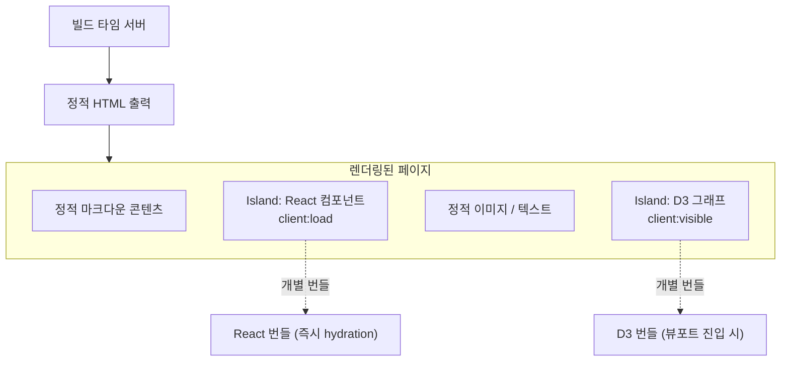

## 정의

**Astro** 는 콘텐츠 중심 사이트를 위한 정적 사이트 프레임워크다. "Islands Architecture"로 필요한 부분만 hydration하기 때문에 기본 JS 전송량이 0에 가깝다.

이 블로그(shinkeonkim.com)가 Astro 6으로 구축됐다.

- 마크다운 / MDX 콘텐츠 렌더링
- 자체 remark 플러그인으로 위키링크 자동 변환 ([[BrainDB]] 참고)
- [[D3]] 기반 그래프 페이지의 React Island 호스팅
- GitHub Actions를 통한 정적 빌드 → GitHub Pages 배포

## 사용 상황

| 상황 | 적합 여부 |
|:---|:---:|
| 블로그, 문서 사이트 | ✅ |
| 콘텐츠 중심 마케팅 페이지 | ✅ |
| SPA (풍부한 인터랙션 위주) | ❌ (Next.js / SvelteKit 추천) |
| 서버 사이드 렌더링 위주 앱 | 부분 적합 (adapter 필요) |
| 다중 프레임워크 혼용 | ✅ (React + Vue + Svelte 공존 가능) |

## Islands Architecture



핵심 개념: 페이지 대부분은 정적 HTML이고, 인터랙션이 필요한 "Island"만 JS 번들을 로드한다. 각 Island는 독립적으로 hydration된다.

### client: 디렉티브

| 디렉티브 | 언제 hydration |
|:---|:---|
| `client:load` | 즉시 (페이지 로드 시) |
| `client:idle` | 브라우저가 idle 상태일 때 |
| `client:visible` | 뷰포트에 진입할 때 |
| `client:media="(max-width: 768px)"` | 미디어 쿼리 충족 시 |
| `client:only="react"` | SSR 없이 클라이언트 전용 |

## 핵심 기능

### Content Collections

타입 안전 콘텐츠 관리. `src/content/` 아래 컬렉션을 `content.config.ts`에 스키마로 정의한다.

```typescript
// src/content.config.ts
import { defineCollection, z } from 'astro:content';

const posts = defineCollection({
  schema: z.object({
    title: z.string(),
    date: z.date(),
    tags: z.array(z.string()).default([]),
  }),
});

export const collections = { posts };
```

```typescript
// 페이지에서 타입 안전 쿼리
const allPosts = await getCollection('posts', ({ data }) => !data.draft);
```

### Component Islands

React, Vue, Svelte 등 여러 프레임워크 컴포넌트를 같은 페이지에서 사용 가능하다:

```astro
---
import ReactCounter from './Counter.tsx';
import VueWidget from './Widget.vue';
---

<ReactCounter client:load />
<VueWidget client:visible />
```

### Adapters (서버 배포)

기본은 정적 출력. 서버 기능 필요 시 adapter 추가:

| Adapter | 플랫폼 |
|:---|:---|
| `@astrojs/vercel` | Vercel Edge / Serverless |
| `@astrojs/netlify` | Netlify Functions |
| `@astrojs/node` | Node.js (자체 서버) |
| `@astrojs/cloudflare` | Cloudflare Workers |

### View Transitions

페이지 전환 시 부드러운 애니메이션. MPA(Multi-Page App)에서 SPA처럼 느껴지는 전환을 제공한다.

```astro
---
import { ViewTransitions } from 'astro:transitions';
---

<head>
  <ViewTransitions />
</head>
```

특정 요소에 이름 부여해 전환 애니메이션 연결:

```astro

```

### Astro DB

내장 SQLite 기반 데이터베이스. 빌드 시 seed 데이터 주입 가능.

```typescript
// db/config.ts
import { defineDb, defineTable, column } from 'astro:db';

const Comments = defineTable({
  columns: {
    id: column.number({ primaryKey: true }),
    postSlug: column.text(),
    body: column.text(),
  },
});

export default defineDb({ tables: { Comments } });
```

### MDX 지원

마크다운에 JSX 컴포넌트를 삽입. `@astrojs/mdx` 통합으로 활성화된다.

```mdx
import Chart from '../components/Chart.tsx';

# 2024년 데이터 분석

<Chart client:visible data={data} />

일반 마크다운과 컴포넌트를 혼용할 수 있다.
```

### Integrations (통합)

공식 + 커뮤니티 통합을 `astro.config.mjs`에 추가한다:

```javascript
import { defineConfig } from 'astro/config';
import mdx from '@astrojs/mdx';
import react from '@astrojs/react';
import sitemap from '@astrojs/sitemap';

export default defineConfig({
  integrations: [mdx(), react(), sitemap()],
  markdown: {
    remarkPlugins: [remarkWikiLink],
    rehypePlugins: [rehypePrettyCode],
  },
});
```

## 프로젝트 구조

```
src/
├── content/        ← Content Collections (posts, wiki, notes)
├── pages/          ← 파일 기반 라우팅 (.astro, .md, .mdx)
├── layouts/        ← 재사용 레이아웃 컴포넌트
├── components/     ← UI 컴포넌트 (Astro + React 혼용)
└── styles/         ← 글로벌 CSS

public/             ← 정적 파일 (이미지, 폰트, favicon)
```

## 실전 예시: 동적 라우팅

```astro
---
// src/pages/posts/[slug].astro
import { getCollection } from 'astro:content';

export async function getStaticPaths() {
  const posts = await getCollection('posts');
  return posts.map(post => ({
    params: { slug: post.slug },
    props: { post },
  }));
}

const { post } = Astro.props;
const { Content } = await post.render();
---

<article>
  <h1>{post.data.title}</h1>
  <Content />
</article>
```

## 대안

| 프레임워크 | 특징 | 선택 기준 |
|:---|:---|:---|
| Next.js | React, SSR/SSG 혼합 | React 앱, 풍부한 인터랙션 |
| Gatsby | React, GraphQL 기반 | CMS 연동, 플러그인 생태계 |
| SvelteKit | Svelte 기반, 경량 | 빠른 개발, 작은 번들 |
| Nuxt.js | Vue 기반, SSR/SSG | Vue 팀 선택 |
| Eleventy | 프레임워크 무관, 순수 정적 | 극단적 단순함 선호 |
| Hugo | Go 기반, 매우 빠른 빌드 | 수천 개 이상 포스트 |

> [!TIP]
> Astro는 콘텐츠 사이트에 강하다. 인터랙션이 핵심인 앱이라면 Next.js 또는 SvelteKit이 더 적합하다.

## 함정

> [!WARNING]
> **Islands 간 상태 공유 어려움**: 각 Island가 독립적이라 Island 간 상태를 공유하려면 nanostore, zustand 같은 클라이언트 상태 라이브러리가 필요하다.

> [!CAUTION]
> **`.astro` 파일에서 async/await**: `getCollection()` 등은 서버 전용이다. 클라이언트에서 `document` 접근은 브라우저 전용 Island 안에서만 가능하다.

> [!WARNING]
> **`client:only` SSR 누락**: `client:only`는 서버에서 렌더링하지 않으므로, SEO가 중요한 콘텐츠에 사용하면 안 된다.

> [!IMPORTANT]
> **remark / rehype 플러그인 순서**: MDX 플러그인 체인에서 순서가 중요하다. 특히 위키링크 변환 플러그인은 다른 플러그인보다 먼저 실행해야 할 수 있다.

> [!WARNING]
> **Content Collections 타입 갱신**: frontmatter 스키마를 변경하면 `.astro/types.d.ts`를 재생성해야 한다. `bun astro sync`로 수동 갱신 가능.

## 관련 위키

- [[BrainDB]] - 마크다운 콘텐츠 그래프 처리 (이 블로그에서 커스텀 구현)
- [[D3]] - 이 블로그 그래프 페이지의 렌더링 엔진
- [[pagefind]] - Astro 정적 사이트 전문 검색
- [[react]] - Astro Island로 통합 가능한 프레임워크
