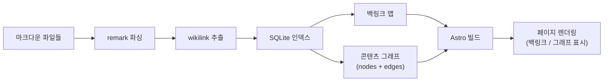
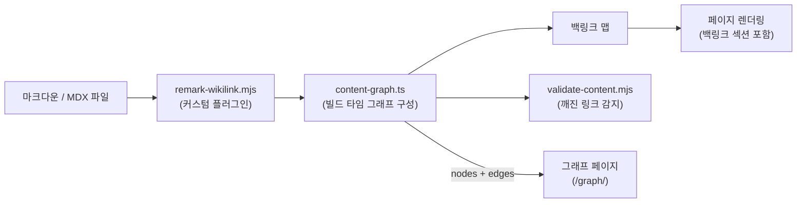

## 정의

**BrainDB** 는 마크다운 파일을 SQLite 기반 데이터베이스로 인덱싱해, 위키링크 처리, 백링크 추출, 콘텐츠 그래프 생성, 깨진 링크 감지를 제공하는 [[Astro]] 통합 라이브러리다. stereobooster가 개발했다.

Obsidian 같은 개인 위키의 "콘텐츠 그래프" 기능을 Astro 정적 사이트에 구현할 수 있게 해주는 게 핵심 목표다.

## 제공 기능

| 기능 | 패키지 / API |
|:---|:---|
| 위키링크 파싱 | `@braindb/remark-wiki-link` |
| 백링크 추출 | `db.documentsTo(path)` |
| 콘텐츠 그래프 | `db.links()`, `db.documents()` |
| 깨진 링크 감지 | 링크 대상 검증 |
| Astro 통합 | `@braindb/astro` |
| 태그 쿼리 | `db.tags()` |

## 처리 흐름



BrainDB는 빌드 타임에 모든 마크다운을 SQLite로 인덱싱하고, 위키링크 관계를 그래프로 만든다. 페이지 렌더링 시 해당 그래프 데이터를 주입해 백링크 목록과 그래프 뷰를 제공한다.

## 설치 및 기본 설정

```bash
bun add @braindb/astro @braindb/remark-wiki-link
```

```javascript
// astro.config.mjs
import { defineConfig } from 'astro/config';
import brainDb from '@braindb/astro';

export default defineConfig({
  integrations: [brainDb()],
});
```

remark 플러그인만 단독으로 사용하는 경우:

```javascript
import remarkWikiLink from '@braindb/remark-wiki-link';

export default defineConfig({
  markdown: {
    remarkPlugins: [
      [remarkWikiLink, {
        aliasDivider: '|',
        wikiLinkClassName: 'wikilink',
        newClassName: 'broken',
      }],
    ],
  },
});
```

## 위키링크 변환

`@braindb/remark-wiki-link`는 이중 대괄호 위키링크 패턴을 HTML `<a>` 태그로 변환한다:

링크 대상이 존재하면 `<a href="/wiki/.../경로/">제목</a>` 로 변환되고, 존재하지 않으면 `<a class="wikilink broken">제목</a>` 로 변환된다. 별칭 문법(`제목|표시텍스트`)으로 화면에 표시되는 텍스트를 별도로 지정할 수 있다.

링크 해석 우선순위: 파일 경로 → 파일명 → frontmatter `title` → frontmatter `aliases`.

지원 위키링크 문법 (이중 대괄호 패턴):
- `제목` 기본 링크: 이중 대괄호로 제목을 감싸면 링크로 변환
- `제목|보여줄 텍스트` 별칭 링크: 파이프로 표시 텍스트 지정
- `제목#앵커` 섹션 링크: 샵으로 앵커 지정 (일부 버전)

## 콘텐츠 그래프 활용 예시

BrainDB의 그래프 데이터를 [[D3]] forceSimulation에 연결하는 패턴:

```javascript
// src/pages/graph.astro
import { getBrainDb } from '@braindb/astro';
import GraphView from '../components/GraphView.tsx';

const db = await getBrainDb();
const nodes = db.documents().map(doc => ({
  id: doc.path(),
  title: doc.frontmatter().title,
  group: doc.frontmatter().category,
}));
const links = db.links().map(link => ({
  source: link.from(),
  target: link.to(),
}));
```

```tsx
// GraphView.tsx (React Island)
import { useEffect, useRef } from 'react';
import * as d3 from 'd3';

export default function GraphView({ nodes, links }) {
  const svgRef = useRef(null);

  useEffect(() => {
    const simulation = d3.forceSimulation(nodes)
      .force('link', d3.forceLink(links).id(d => d.id))
      .force('charge', d3.forceManyBody().strength(-100))
      .force('center', d3.forceCenter(400, 300));
    // ... 렌더링 로직
  }, [nodes, links]);

  return <svg ref={svgRef} width={800} height={600} />;
}
```

## 콘텐츠 그래프 API

```javascript
import { getBrainDb } from '@braindb/astro';

const db = await getBrainDb();

// 특정 페이지를 참조하는 페이지 목록 (백링크)
const backlinks = db.documentsTo('/wiki/network/tcp/');

// 전체 문서 목록
const nodes = db.documents();

// 전체 링크 목록 (edges)
const links = db.links();

// 태그 목록
const tags = db.tags();
```

이 데이터를 [[D3]] `forceSimulation`에 전달하면 인터랙티브 그래프 뷰가 된다.

## 이 블로그에서의 사용 (미사용)

원래 `@braindb/astro`를 `astro.config.mjs` integrations에 추가해서 쓰려고 했으나, 의존 패키지 `better-sqlite3`가 Node.js 26과 호환되지 않아 빌드가 깨졌다.

결국 작은 커스텀 remark 플러그인(`src/plugins/remark-wikilink.mjs`)으로 대체 구현했다:

- 위키링크 처리: `src/plugins/remark-wikilink.mjs`
- 백링크 추출: `src/shared/lib/content/content-graph.ts`
- 그래프 데이터: `src/shared/lib/content/content-graph.ts`

BrainDB가 제공하던 핵심 기능만 추려 보면 양이 많지 않아서, 직접 작성하는 편이 의존성도 가볍고 디버깅도 쉬웠다.

## 이 블로그의 커스텀 구현 아키텍처

BrainDB를 사용하지 않고 직접 구현한 위키링크 처리 흐름:



`remark-wikilink.mjs`는 이중 대괄호 위키링크를 AST 수준에서 `<a>` 태그로 변환하고, `content-graph.ts`는 모든 링크를 수집해 그래프 데이터와 백링크 맵을 생성한다.

## BrainDB vs 커스텀 구현 비교

| 기능 | BrainDB | 커스텀 구현 (이 블로그) |
|:---|:---|:---|
| 위키링크 파싱 | `@braindb/remark-wiki-link` | `remark-wikilink.mjs` |
| 백링크 | `db.documentsTo()` | `content-graph.ts` |
| 그래프 데이터 | `db.links()` | `content-graph.ts` |
| 저장소 | SQLite (better-sqlite3) | 빌드 타임 메모리 |
| 깨진 링크 감지 | 내장 | 커스텀 validate 스크립트 |
| Node 버전 의존성 | 네이티브 바이너리 | 없음 |
| 추가 번들 크기 | better-sqlite3 바이너리 | 없음 |
| 설정 복잡도 | 낮음 (통합 추가만) | 직접 구현 필요 |

## 유사 도구

| 도구 | 특징 |
|:---|:---|
| Obsidian | 데스크톱 마크다운 위키, 그래프 뷰 제공 |
| Foam (VS Code) | VS Code 위키링크 확장 |
| Dendron | 계층 구조 노트 취급 |
| Quartz | Hugo 기반 디지털 정원, 위키링크 지원 |
| Digital Garden (Jekyll) | Jekyll 플러그인, GitHub Pages 배포 |

## 함정

> [!CAUTION]
> **`better-sqlite3` Node 버전 의존성**: `better-sqlite3`는 네이티브 C++ 바인딩을 사용하므로 Node.js 버전이 바뀌면 재빌드가 필요하다. Node 26에서 호환성 문제가 있었다.

> [!WARNING]
> **빌드 타임에만 동작**: BrainDB는 Astro 빌드 타임 통합이다. 런타임에 동적으로 콘텐츠를 추가하거나 위키링크를 갱신하는 기능은 없다.

> [!TIP]
> 콘텐츠 양이 적고 Node 버전이 고정된 환경이라면 BrainDB 사용이 편하다. Node 버전이 자주 바뀌거나 네이티브 바이너리 의존을 피하고 싶다면 커스텀 구현을 고려할 것.

## 커스텀 구현 시 고려 사항

직접 위키링크/백링크 시스템을 구현할 때 알아야 할 사항:

- **링크 해석 우선순위**: slug → 파일명 → frontmatter title → aliases 순으로 매칭
- **NFC 정규화**: 한글 위키링크는 NFC 정규화 후 비교 (macOS와 Linux의 파일시스템 차이)
- **순환 참조**: 그래프 구성 시 순환 링크 처리 필요
- **빌드 캐싱**: 대용량 콘텐츠는 그래프 구성에 시간이 걸리므로 캐싱 고려

## 관련 위키

- [[Astro]] - BrainDB를 통합하는 프레임워크
- [[D3]] - 그래프 데이터를 시각화하는 라이브러리
- [[pagefind]] - Astro 정적 사이트 검색 (BrainDB와 함께 쓸 수 있음)
