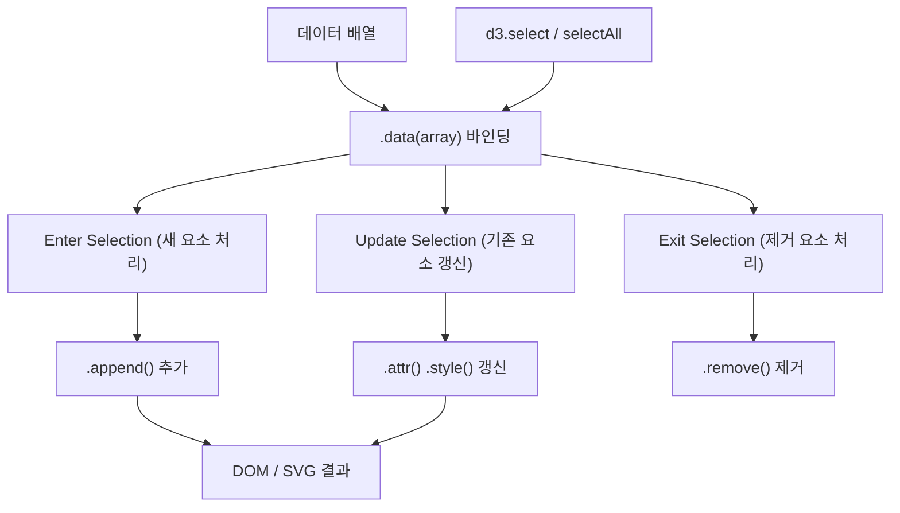

## 정의

**D3** (Data-Driven Documents)는 데이터를 DOM 요소에 바인딩해 SVG, Canvas, HTML 기반 시각화를 만드는 JavaScript 라이브러리다. Mike Bostock이 2011년 발표했고, 현재 v7까지 출시됐다.

이 블로그의 [그래프](/graph/) 페이지는 D3의 `forceSimulation`으로 위키 노드를 배치한다.

"차트 라이브러리"가 아닌 **데이터-DOM 변환 엔진**이다. Chart.js처럼 완성된 차트를 제공하지 않고, scale/selection/transition 등 저수준 빌딩 블록을 제공해 완전한 커스텀이 가능하다.

## 사용 상황

| 상황 | D3 적합 여부 |
|:---|:---:|
| 커스텀 인터랙티브 시각화 | ✅ |
| 단순 바 / 라인 / 파이 차트 | ❌ (Chart.js 추천) |
| 네트워크 그래프 / 트리 레이아웃 | ✅ |
| 지리 시각화 (GeoJSON, 투영법) | ✅ |
| 주식 / 시계열 데이터 분석 | ✅ |
| 빠른 대시보드 구축 | ❌ (ECharts 추천) |

## 데이터 바인딩 흐름



D3의 핵심 패턴: 데이터와 DOM 요소를 key로 매핑하고, 변화에 따라 enter/update/exit를 각각 처리한다.

## 핵심 개념

### Selection

DOM 요소를 감싸는 래퍼. jQuery selector와 유사하지만 데이터 바인딩이 추가된다.

```javascript
const svg = d3.select('#chart')
  .attr('width', 800)
  .attr('height', 400);

// 여러 요소 선택
const circles = svg.selectAll('circle')
  .data([10, 20, 30, 40, 50]);
```

### Enter / Update / Exit 패턴

D3 v7에서는 `.join()` 메서드로 단순화됐다:

```javascript
svg.selectAll('rect')
  .data(data)
  .join(
    enter  => enter.append('rect').attr('fill', 'steelblue'),
    update => update.attr('fill', 'green'),
    exit   => exit.remove()
  );
```

v5 이전 방식 (join 없음):

```javascript
const sel = svg.selectAll('rect').data(data);
sel.enter().append('rect');   // enter
sel.attr('x', d => d.x);     // update
sel.exit().remove();          // exit
```

### Scale (스케일)

데이터 도메인에서 픽셀 범위로 매핑하는 함수다.

```javascript
const xScale = d3.scaleLinear()
  .domain([0, d3.max(data, d => d.value)])
  .range([0, width]);

const colorScale = d3.scaleOrdinal()
  .domain(['A', 'B', 'C'])
  .range(d3.schemeTableau10);

const timeScale = d3.scaleTime()
  .domain([new Date('2024-01-01'), new Date('2024-12-31')])
  .range([0, width]);
```

주요 scale 타입:

| 타입 | 용도 |
|:---|:---|
| `scaleLinear` | 선형 (숫자 → 숫자) |
| `scaleLog` | 로그 스케일 |
| `scaleTime` | 날짜/시간 |
| `scaleBand` | 카테고리 → 픽셀 (바 차트) |
| `scaleOrdinal` | 카테고리 → 색상 |
| `scaleSqrt` | 제곱근 (버블 차트 반지름) |

### Axis (축)

```javascript
const xAxis = d3.axisBottom(xScale)
  .ticks(10)
  .tickFormat(d => `${d}건`);

svg.append('g')
  .attr('transform', `translate(0, ${height})`)
  .call(xAxis);
```

### Transition (애니메이션)

```javascript
svg.selectAll('rect')
  .data(newData)
  .join('rect')
  .transition()
  .duration(750)
  .ease(d3.easeCubicInOut)
  .attr('height', d => height - yScale(d.value));
```

### Force Simulation

네트워크 그래프, 노드 배치에 사용. 이 블로그 그래프 뷰의 기반.

```javascript
const simulation = d3.forceSimulation(nodes)
  .force('link', d3.forceLink(links).id(d => d.id).distance(60))
  .force('charge', d3.forceManyBody().strength(-200))
  .force('center', d3.forceCenter(width / 2, height / 2))
  .force('collision', d3.forceCollide().radius(d => d.radius + 5));

simulation.on('tick', () => {
  link
    .attr('x1', d => d.source.x).attr('y1', d => d.source.y)
    .attr('x2', d => d.target.x).attr('y2', d => d.target.y);
  node
    .attr('cx', d => d.x).attr('cy', d => d.y);
});
```

이 블로그에서 사용한 force:

- `forceLink`: 노드 사이의 연결 거리
- `forceManyBody`: 노드 간 반발력 (음수 strength)
- `forceCenter`: 전체를 화면 중앙으로 끌어당김
- `forceCollide`: 노드끼리 겹치지 않게

## 실전 예시: 바 차트

```javascript
const margin = { top: 20, right: 30, bottom: 40, left: 60 };
const width = 600 - margin.left - margin.right;
const height = 400 - margin.top - margin.bottom;

const svg = d3.select('#chart')
  .append('svg')
  .attr('width', width + margin.left + margin.right)
  .attr('height', height + margin.top + margin.bottom)
  .append('g')
  .attr('transform', `translate(${margin.left},${margin.top})`);

const data = [
  { label: 'A', value: 30 },
  { label: 'B', value: 80 },
  { label: 'C', value: 45 },
];

const x = d3.scaleBand()
  .domain(data.map(d => d.label))
  .range([0, width])
  .padding(0.2);

const y = d3.scaleLinear()
  .domain([0, d3.max(data, d => d.value)])
  .range([height, 0]);

svg.selectAll('rect')
  .data(data)
  .join('rect')
  .attr('x', d => x(d.label))
  .attr('y', d => y(d.value))
  .attr('width', x.bandwidth())
  .attr('height', d => height - y(d.value))
  .attr('fill', 'steelblue');

svg.append('g')
  .attr('transform', `translate(0, ${height})`)
  .call(d3.axisBottom(x));

svg.append('g').call(d3.axisLeft(y));
```

## 실전 예시: 라인 차트 (시계열)

```javascript
const line = d3.line()
  .x(d => xScale(d.date))
  .y(d => yScale(d.value))
  .curve(d3.curveMonotoneX);

const area = d3.area()
  .x(d => xScale(d.date))
  .y0(height)
  .y1(d => yScale(d.value))
  .curve(d3.curveMonotoneX);

// 채워진 영역
svg.append('path')
  .datum(data)
  .attr('fill', 'steelblue')
  .attr('fill-opacity', 0.3)
  .attr('d', area);

// 선
svg.append('path')
  .datum(data)
  .attr('fill', 'none')
  .attr('stroke', 'steelblue')
  .attr('stroke-width', 2)
  .attr('d', line);
```

## v7 모듈 구조

D3 v7부터 완전 ESM으로, 하위 패키지만 선택적으로 가져올 수 있다.

```javascript
// 전체 패키지
import * as d3 from 'd3';

// 필요한 것만 (트리 쉐이킹)
import { select, selectAll } from 'd3-selection';
import { scaleLinear, scaleBand } from 'd3-scale';
import { axisBottom, axisLeft } from 'd3-axis';
import { forceSimulation, forceLink, forceManyBody } from 'd3-force';
```

주요 하위 패키지:

| 패키지 | 역할 |
|:---|:---|
| `d3-selection` | DOM 선택 및 조작 |
| `d3-scale` | 데이터 스케일 매핑 |
| `d3-axis` | 축 렌더링 |
| `d3-shape` | 경로 생성기 (line, area, arc, pie) |
| `d3-force` | 포스 시뮬레이션 |
| `d3-zoom` | 줌 / 팬 |
| `d3-brush` | 범위 선택 |
| `d3-transition` | 트랜지션 |
| `d3-geo` | 지리 투영법 |
| `d3-hierarchy` | 트리, 덴드로그램 |
| `d3-color` | 색상 공간 변환 |

## 대안

| 라이브러리 | 특징 | 적합 상황 |
|:---|:---|:---|
| Chart.js | 완성된 차트 컴포넌트 | 표준 차트 빠른 구현 |
| ECharts | 풍부한 내장 차트 + 고성능 | 대시보드, 한국어 레이블 |
| Observable Plot | D3 위의 고수준 API | 탐색적 데이터 분석 |
| Recharts | React 컴포넌트 기반 | React 앱의 표준 차트 |
| Nivo | React + D3, 다양한 차트 | React 앱 커스텀 차트 |
| Vega-Lite | JSON 선언형 문법 | 빠른 시각화 프로토타입 |

> [!TIP]
> 완성된 차트 유형만 필요하다면 Chart.js 또는 ECharts가 개발 속도가 빠르다. D3는 기존 라이브러리가 지원하지 않는 완전 커스텀 시각화에 특히 강하다.

## 함정

> [!WARNING]
> **Enter/Update/Exit 혼동**: v4 이전 예제는 `.enter().append()` 패턴을 쓴다. v7에서는 `.join()` 패턴이 훨씬 명확하고 권장된다.

> [!CAUTION]
> **SSR 환경**: D3 selection은 `document`, `window`에 의존한다. Next.js, Astro SSR에서는 브라우저 전용으로 처리하거나 `d3-node`를 사용해야 한다.

> [!WARNING]
> **성능**: 수만 개 이상의 SVG 요소는 렌더링 성능이 급격히 떨어진다. Canvas 기반(`d3-canvas`) 또는 WebGL(regl, deck.gl) 전환을 고려한다.

> [!WARNING]
> **React 통합**: D3와 React 모두 DOM을 직접 조작하므로 충돌 가능. `useEffect` + `useRef`로 컨테이너만 React에게 맡기고 내부는 D3가 관리하는 패턴을 사용. 또는 D3의 scale/shape만 계산에 쓰고 렌더링은 React JSX로 처리.

> [!IMPORTANT]
> **key 함수 미지정**: `.data(arr)` 에서 key 함수를 생략하면 배열 인덱스로 매핑된다. 데이터가 추가/삭제되면 잘못된 요소가 업데이트될 수 있다. `.data(arr, d => d.id)` 처럼 key 함수를 항상 지정할 것.

## 관련 위키

- [[BrainDB]] - 이 블로그의 위키 그래프 처리 (BrainDB 미사용, 커스텀 구현)
- [[Astro]] - D3 Island를 호스팅하는 프레임워크
- [[react]] - D3와의 통합 패턴
- [[pagefind]] - 이 블로그에서 Astro + D3와 함께 사용하는 정적 사이트 검색
