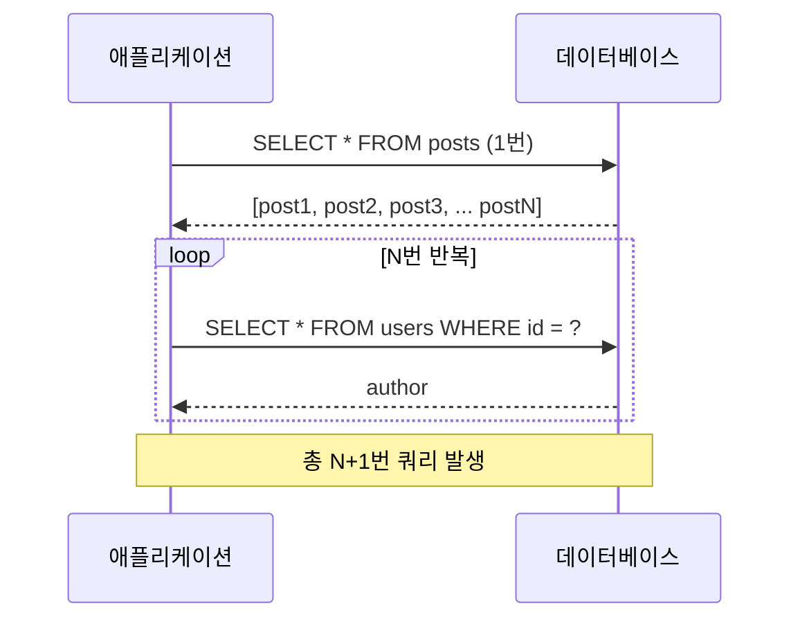
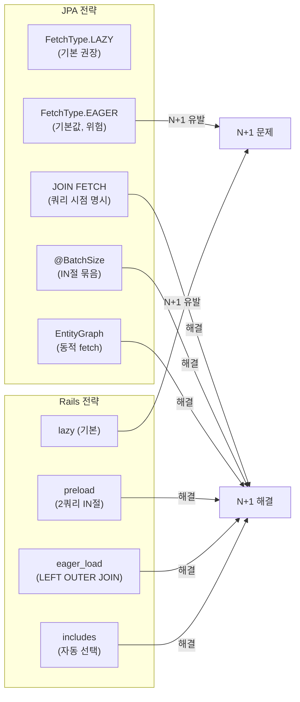

## 정의

JPA 와 Rails 는 둘 다 "eager" 라는 용어를 ORM 의 연관 로딩 전략에 사용한다. **이름은 비슷하지만 의미는 정반대**.

## N+1 문제란

N+1 문제는 연관 객체를 지연 로딩(lazy loading)할 때 발생하는 성능 패턴이다. 부모 목록 1회 쿼리 후, 각 부모의 연관 객체를 N번 추가 쿼리하는 구조다.



N=100 이면 101번 쿼리. N=1000 이면 1001번 쿼리. ORM의 편리함이 성능 문제의 원인이 된다.

- **JPA `FetchType.EAGER`**: 매핑 선언 시점에 영구 설정. 그 entity 를 조회할 때마다 항상 자동으로 함께 로드. 끄는 게 권장.
- **Rails `eager_load`**: 쿼리 시점에 옵트인. 그 쿼리에서만 JOIN 으로 함께 로드. 권장 패턴.

이름이 같아 혼동하기 쉬워 별도 페이지로 정리한다.

## 로딩 전략 비교 시각화



## 1줄 비교

| 측면 | JPA `EAGER` | Rails `eager_load` |
|---|---|---|
| 선언 위치 | Entity 매핑 (`@ManyToOne(fetch=EAGER)`) | Query 호출 (`.eager_load(:assoc)`) |
| 적용 범위 | 그 entity 의 모든 조회 | 그 쿼리만 |
| 변경 가능성 | 코드 수정 + 재배포 | 쿼리마다 |
| 권장 사용 | **거의 항상 비권장** | **권장 (또는 includes)** |
| 기본값 | `@ManyToOne` 은 EAGER (위험) | 명시 안 함 (lazy) |
| 실행 방식 | 즉시 SELECT (별도 또는 JOIN) | LEFT OUTER JOIN 단일 쿼리 |

## JPA EAGER 의 의미

```java
@Entity
class Post {
    @ManyToOne(fetch = FetchType.EAGER)   // ← 기본값 (위험)
    @JoinColumn(name = "author_id")
    User author;
}

List<Post> posts = em.createQuery("SELECT p FROM Post p", Post.class).getResultList();
// → posts SELECT 1번 + 각 post 의 author SELECT N번 = N+1
// 또는 Hibernate 의 batch fetch 가 켜있으면 IN 절로 일부 묶임
```

**"Post 가 어디서 조회되든 author 도 함께 로드"**. 매핑이 영구. 끄려면 코드 수정.

위험:
- N+1 폭탄
- 깊은 그래프 (Post → Comment → User → Profile) 가 의도치 않게 전부 로드
- 끌 수 없음 (LAZY 로 매핑 변경 후 재배포 필요)

규칙: **모든 연관 `LAZY` 선언**, 쿼리마다 필요한 것만 fetch join / EntityGraph / @BatchSize 로 명시. [[spring-jpa-fetch-type]] 참고.

## Rails eager_load 의 의미

```ruby
class Post < ApplicationRecord
  belongs_to :author, class_name: 'User'
end

# 기본 (lazy)
posts = Post.all
posts.each { |p| puts p.author.name }   # N+1

# eager_load 옵트인
posts = Post.eager_load(:author)
# → 1쿼리: SELECT p.*, u.* FROM posts LEFT OUTER JOIN users ON ...
posts.each { |p| puts p.author.name }   # 추가 쿼리 없음
```

**"이 쿼리 한 번만 author 도 함께"**. 쿼리 시점 결정. 다음 쿼리는 lazy.

권장 패턴: **연관은 lazy by default, 필요할 때만 `includes`/`preload`/`eager_load`** 명시. [[rails-query-optimization]] 참고.

## 정확한 매핑

JPA 와 Rails 의 개념적 대응:

| Rails 메서드 | 해당 JPA 패턴 | 발생 쿼리 |
|---|---|---|
| `preload(:assoc)` | `@BatchSize` 또는 `JOIN FETCH` 안 쓰는 explicit 2-쿼리 | 2 쿼리 (부모 + 자식 IN) |
| `eager_load(:assoc)` | `JOIN FETCH p.assoc` JPQL | 1 쿼리 (LEFT OUTER JOIN) |
| `includes(:assoc)` | (없음) | preload 또는 eager_load 자동 |
| `references(:assoc)` | (없음, JPQL 의 JOIN FETCH 와 유사) | eager_load 강제 |

JPA 의 `FetchType.EAGER` 는 Rails 에 **직접적 대응 없음**. 굳이 비유하면 association 정의에 `eager_load(:assoc)` 를 default scope 로 박아두는 것 (안티패턴).

## Rails 의 "EAGER" 라는 단어

Rails 문서 / 커뮤니티에서 "eager loading" 은 일반적으로 `includes` / `preload` / `eager_load` 셋을 통칭. "eager 로 가져온다" = "lazy 안 하고 미리 가져온다" 의미.

JPA 의 EAGER 는 fetch **type** = 영구 매핑 속성. 다른 개념.

## 권장 패턴 비교

```java
// JPA: lazy + 쿼리마다 명시
@Entity
class Post {
    @ManyToOne(fetch = FetchType.LAZY)
    User author;
}

@Query("SELECT p FROM Post p JOIN FETCH p.author")
List<Post> findAllWithAuthor();
```

```ruby
# Rails: 기본 lazy + 쿼리마다 명시
class Post < ApplicationRecord
  belongs_to :author, class_name: 'User'
end

def self.with_author
  includes(:author)
end
```

두 ORM 모두 **lazy by default + 쿼리 시점에 fetch 선택** 이 best practice. JPA 가 기본을 EAGER 로 잘못 정한 게 함정.

## N+1 디버깅 도구

| 항목 | JPA / Hibernate | Rails |
|---|---|---|
| 로그 | `org.hibernate.SQL=DEBUG` | `ActiveRecord::Base.logger` |
| 정적 분석 | Hypersistence Utils | bullet gem |
| 자동 감지 | (수동) | `strict_loading` (Rails 6.1+) |
| Profiler | p6spy, datasource-proxy | rack-mini-profiler |
| 인덱스 검사 | Hibernate Statistics | EXPLAIN ANALYZE |

`bullet` gem 처럼 자동 N+1 알림 도구가 JPA 진영엔 약함. 직접 통합 테스트에서 Statement count 측정.

## JPA: EntityGraph (동적 Fetch 전략)

`@NamedEntityGraph` 또는 동적 EntityGraph로 쿼리별 fetch 전략을 지정한다:

```java
// 정적 선언
@Entity
@NamedEntityGraph(
  name = "Post.withAuthor",
  attributeNodes = @NamedAttributeNode("author")
)
class Post {
  @ManyToOne(fetch = FetchType.LAZY)
  User author;

  @OneToMany(fetch = FetchType.LAZY)
  List<Comment> comments;
}

// 사용
EntityGraph graph = em.getEntityGraph("Post.withAuthor");
Map<String, Object> hints = Map.of("jakarta.persistence.fetchgraph", graph);
List<Post> posts = em.createQuery("SELECT p FROM Post p", Post.class)
  .setHint("jakarta.persistence.fetchgraph", graph)
  .getResultList();
```

Spring Data JPA에서:

```java
@Repository
public interface PostRepository extends JpaRepository<Post, Long> {

  @EntityGraph(attributePaths = {"author"})
  List<Post> findAll();

  @EntityGraph(attributePaths = {"author", "comments"})
  Optional<Post> findById(Long id);
}
```

EntityGraph 타입:
- `FETCH`: 명시한 필드는 EAGER, 나머지는 LAZY
- `LOAD`: 명시한 필드는 EAGER, 나머지는 매핑 기본값 유지

## JPA: @BatchSize (N+1 완화)

`@BatchSize`는 N+1을 완전히 없애지는 않지만, N번 쿼리를 IN절 묶음으로 줄인다:

```java
@Entity
class Post {
  @OneToMany
  @BatchSize(size = 25)
  List<Comment> comments;
}
```

`SELECT * FROM comments WHERE post_id IN (1, 2, ..., 25)` 형태로 25개씩 묶어서 조회. N=100 이면 100번 → 4번으로 감소.

전역 배치 크기 설정 (Hibernate):

```yaml
# application.yml
spring:
  jpa:
    properties:
      hibernate.default_batch_fetch_size: 100
```

## Rails: includes / preload / eager_load 선택 기준

세 메서드는 동작 방식이 다르다:

```ruby
# preload: 항상 2번 쿼리 (부모 SELECT + IN절 자식 SELECT)
Post.preload(:author)
# → SELECT * FROM posts
# → SELECT * FROM users WHERE id IN (1, 2, 3, ...)

# eager_load: 항상 JOIN 1번 쿼리
Post.eager_load(:author)
# → SELECT posts.*, users.* FROM posts
#     LEFT OUTER JOIN users ON posts.author_id = users.id

# includes: Rails가 상황에 따라 preload 또는 eager_load 자동 선택
Post.includes(:author)
# where 조건에 연관 테이블 컬럼 사용 시 → eager_load
# 그 외 → preload
Post.includes(:author).where('users.active = ?', true).references(:author)
# → eager_load 강제
```

중첩 연관 로딩:

```ruby
# posts → author → profile 까지 한번에
Post.includes(author: :profile)

# 여러 연관 동시에
Post.includes(:author, :comments, :tags)

# 3단계 중첩
Post.includes(comments: { author: :profile })
```

Rails `strict_loading` (6.1+):

```ruby
# 모델에서 lazy loading 완전 차단 (개발/테스트 환경에서 N+1 조기 발견)
class ApplicationRecord < ActiveRecord::Base
  self.strict_loading_by_default = true
end

# 특정 쿼리에만 적용
Post.strict_loading.all
```

## 함정 비교

### JPA 함정

1. **`@ManyToOne` 기본 EAGER**: 명시적으로 LAZY 안 하면 위험
2. **`@OneToOne` 양방향 LAZY 안 됨** (proxy 못 만듦): bytecode enhancement 또는 `optional=false`
3. **컬렉션 fetch join + Pageable = in-memory paging**: OOM 위험
4. **OSIV** (Open Session In View) 가 LAZY 함정 가림: 운영에선 끄기 권장 `spring.jpa.open-in-view=false`

### Rails 함정

1. **`find_by + includes` 일부 버전에서 includes 무시**: `.where().first` 패턴 권장
2. **`uniq`/`distinct` + includes** 의 row count 미묘함
3. **`select` 시 FK 누락**: `select(:name).includes(:school)` 깨짐
4. **polymorphic** 은 JOIN 불가, preload 강제

## 작은 결과 / 큰 결과의 전략

| 결과 크기 | JPA 권장 | Rails 권장 |
|---|---|---|
| 부모 < 10 | JOIN FETCH | eager_load |
| 부모 < 1000, 자식 비대 | 2 쿼리 (`@BatchSize`) | preload |
| Pageable | EntityGraph + slice (collection 제외) | includes + paging |
| 깊은 nested | 단계별 explicit fetch | preload 단계 분리 |

## 정리

| 질문 | 답 |
|---|---|
| JPA EAGER 와 Rails eager_load 가 같은 뜻인가? | **아니다.** 이름만 같다. |
| JPA EAGER 사용 권장하나? | **아니다.** 모든 연관 LAZY. |
| Rails eager_load 사용 권장하나? | **그렇다.** lazy default + 쿼리마다 명시. |
| 둘 다 N+1 해결책인가? | Rails eager_load 는 명백한 해결책. JPA EAGER 는 종종 N+1 의 원인. |

이름이 미묘하게 같아서 "EAGER 면 빠른 것" 으로 단순화하지 말 것. 두 ORM 의 정반대 권장 사항을 기억.

## 쿼리 로그로 N+1 확인

### JPA / Hibernate

```yaml
# application.yml
logging:
  level:
    org.hibernate.SQL: DEBUG
    org.hibernate.type.descriptor.sql.BasicBinder: TRACE
```

```java
// p6spy로 실제 파라미터까지 확인
// pom.xml: p6spy 의존성 추가 후
// spy.properties: appender=com.p6spy.engine.spy.appender.Slf4JLogger
```

### Rails

```ruby
# config/environments/development.rb
config.log_level = :debug  # SQL 쿼리 전부 출력

# bullet gem: N+1 자동 감지 (개발 환경)
# Gemfile
gem 'bullet', group: :development

# config/environments/development.rb
config.after_initialize do
  Bullet.enable = true
  Bullet.alert = true
  Bullet.rails_logger = true
end
```

bullet gem이 N+1을 감지하면 로그에:
```
USE eager loading detected
  Post => [:author]
  Add to your query: .includes([:author])
```

## 전략 선택 요약

| 상황 | JPA 선택 | Rails 선택 |
|:---|:---|:---|
| 부모 < 10개 + 연관 1개 | `JOIN FETCH` | `eager_load` |
| 부모 수백 개 + 연관 1개 | `@BatchSize` 또는 `JOIN FETCH` | `preload` 또는 `includes` |
| 연관 컬럼으로 WHERE 필터링 | `JOIN FETCH` + JPQL where | `eager_load` + `where` |
| 페이지네이션 + 연관 | `EntityGraph` (컬렉션 제외) | `includes` (컬렉션 주의) |
| 다단계 중첩 | 단계별 쿼리 + `@BatchSize` | `preload` 단계 분리 |
| 개발 중 N+1 조기 감지 | Hibernate Statistics / p6spy | bullet gem + `strict_loading` |

## 관련 위키

- [[spring-jpa-fetch-type]]
- [[rails-query-optimization]]
- [[rails-activerecord-associations]]
- [[spring-data-jpa]]
- [[spring-jpa-persistence-context]]
