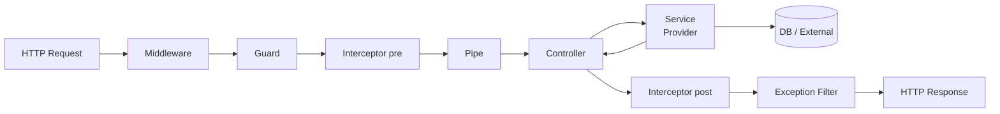

## 정의

**NestJS** 는 Kamil Myśliwiec 이 2017년 발표한 **Node.js 서버측 프레임워크** 입니다. TypeScript first, Angular 에서 영감받은 **모듈 + DI + 데코레이터** 아키텍처. **Express** (기본) 또는 **Fastify** 를 HTTP 어댑터로 사용하며, REST/GraphQL/WebSocket/gRPC/Microservice 를 하나의 프로그래밍 모델로 커버합니다.

2025년 현재 **NestJS 11** 이 stable (Node 20 minimum, better logging, microservices status, etc).

## 왜 NestJS 인가

### 1. TypeScript 그대로

TypeScript 를 처음부터 상정. 데코레이터, 타입 추론, IDE 지원 최상급.

### 2. 예측 가능한 구조

Angular 스타일. 새 팀원이 어디에 무엇이 있는지 즉시 파악.

- **Module**: 기능 그룹
- **Controller**: HTTP 라우트
- **Service (Provider)**: 비즈니스 로직
- **DTO / Schema**: 데이터 전송 객체
- **Guard / Interceptor / Pipe / Filter**: 요청 lifecycle 훅

### 3. Dependency Injection

Class-based DI. Constructor injection. 테스트 편의성 극대화.

### 4. 방대한 통합

TypeORM, Prisma, Mongoose, GraphQL (Apollo), Swagger, Passport, Bull, Kafka, gRPC, Redis, Elasticsearch, WebSocket, SSE.

### 5. Microservice

같은 코드로 REST + Microservice (Kafka, NATS, RabbitMQ, TCP, gRPC).

## 빠른 시작

```bash
npm i -g @nestjs/cli
nest new myapp
cd myapp
npm run start:dev
```

기본 구조:

```
myapp/
├── src/
│   ├── main.ts          # 진입점 (bootstrap)
│   ├── app.module.ts    # root module
│   ├── app.controller.ts
│   └── app.service.ts
├── test/
│   └── app.e2e-spec.ts
├── tsconfig.json
├── nest-cli.json
└── package.json
```

### main.ts

```typescript
import { NestFactory } from '@nestjs/core';
import { AppModule } from './app.module';

async function bootstrap() {
  const app = await NestFactory.create(AppModule);
  app.enableCors();
  await app.listen(3000);
}
bootstrap();
```

### app.module.ts

```typescript
import { Module } from '@nestjs/common';
import { AppController } from './app.controller';
import { AppService } from './app.service';

@Module({
  imports: [],
  controllers: [AppController],
  providers: [AppService],
})
export class AppModule {}
```

### app.controller.ts

```typescript
import { Controller, Get } from '@nestjs/common';
import { AppService } from './app.service';

@Controller()
export class AppController {
  constructor(private readonly appService: AppService) {}

  @Get()
  getHello(): string {
    return this.appService.getHello();
  }
}
```

### app.service.ts

```typescript
import { Injectable } from '@nestjs/common';

@Injectable()
export class AppService {
  getHello(): string {
    return 'Hello World!';
  }
}
```

## 아키텍처 요약



## 핵심 개념

| 개념 | 역할 | 자세히 |
|:---|:---|:---|
| **[[nestjs-modules|Module]]** | 기능 그룹, DI scope | `@Module()` |
| **[[nestjs-controllers|Controller]]** | HTTP 라우팅 | `@Controller`, `@Get`, `@Post` |
| **[[nestjs-providers|Provider]]** | Injectable class (Service, Repository, Factory) | `@Injectable()` |
| **[[nestjs-guards|Guard]]** | 인증/인가 | `@UseGuards()`, `canActivate` |
| **[[nestjs-interceptors|Interceptor]]** | Cross-cutting (logging, cache, transform) | `@UseInterceptors()`, `intercept` |
| **[[nestjs-pipes|Pipe]]** | 검증, 변환 | `@UsePipes()`, ValidationPipe |
| **[[nestjs-middleware|Middleware]]** | Express-style middleware | `configure(consumer)` |
| **[[nestjs-exception-filters|Exception Filter]]** | 예외 처리 | `@Catch()`, ExceptionFilter |

## Request Lifecycle 순서

1. **Middleware**: Express/Fastify 미들웨어. `req` 만 접근.
2. **Guard**: `canActivate(context)`. false 면 즉시 401/403.
3. **Interceptor (before)**: `intercept(context, next)` 상반부.
4. **Pipe**: 파라미터 검증/변환 (DTO 로 형변환).
5. **Controller method**: 실제 라우트 핸들러.
6. **Interceptor (after)**: `map(...)` 로 응답 변환.
7. **Exception filter**: 어떤 계층이든 예외 발생 시.

## HTTP Adapter

- **Express** (`@nestjs/platform-express`, 기본): Express 4/5 호환
- **Fastify** (`@nestjs/platform-fastify`): 더 빠름, TypeBox / AJV 스키마

```typescript
const app = await NestFactory.create<NestFastifyApplication>(
  AppModule,
  new FastifyAdapter(),
);
```

Interface 만 다르고 대부분의 NestJS 코드는 그대로.

## DTO + Validation

```typescript
import { IsEmail, IsInt, Min } from 'class-validator';

export class CreateUserDto {
  @IsEmail()
  email: string;

  @IsInt()
  @Min(18)
  age: number;
}
```

```typescript
@Post()
create(@Body() dto: CreateUserDto) {
  // dto 는 이미 validated + typed
}
```

`ValidationPipe` 를 global 로 등록하면 모든 DTO 자동 검증. 자세한 것은 [[nestjs-pipes|Pipes]] 참조.

## Swagger / OpenAPI

```bash
npm i @nestjs/swagger swagger-ui-express
```

```typescript
// main.ts
import { SwaggerModule, DocumentBuilder } from '@nestjs/swagger';

const config = new DocumentBuilder()
  .setTitle('My API')
  .setDescription('...')
  .setVersion('1.0')
  .addBearerAuth()
  .build();

const doc = SwaggerModule.createDocument(app, config);
SwaggerModule.setup('api', app, doc);
```

`@ApiProperty()` 데코레이터로 DTO 문서화. `http://localhost:3000/api` 에 Swagger UI.

## CLI

```bash
nest g mo users         # module
nest g co users         # controller
nest g s users          # service
nest g res users        # resource (module + controller + service + DTO + entity)

nest g guard auth
nest g interceptor logging
nest g pipe validate
nest g filter http-exception

nest build
nest start --watch
```

## NestJS 11 주요 변경

- **Node 20 minimum**: Node 18 EOL
- **JSON Logger**: `nest.useLogger(new ConsoleLogger({ json: true }))`
- **개선된 Logger**: 더 나은 formatting, maps/sets 지원
- **Microservices**: `status()`, `unwrap()`, `on()` 메서드 (transporter 상태)
- **NATS**: queue-per-handler 지원
- **WebDAV** HTTP method 지원
- **`@Inject()` type narrowing**: TypeScript 개선
- **ParseDatePipe**: 새 pipe
- **`plainToClass` deprecated -> `plainToInstance`**

## 프로젝트 구조 (실전)

```
src/
├── main.ts
├── app.module.ts
├── config/
│   ├── database.config.ts
│   ├── app.config.ts
│   └── validation.schema.ts
├── common/
│   ├── decorators/
│   ├── filters/
│   ├── guards/
│   ├── interceptors/
│   ├── pipes/
│   └── middleware/
├── modules/
│   ├── users/
│   │   ├── users.module.ts
│   │   ├── users.controller.ts
│   │   ├── users.service.ts
│   │   ├── users.repository.ts    # 또는 Prisma/TypeORM
│   │   ├── dto/
│   │   │   ├── create-user.dto.ts
│   │   │   └── update-user.dto.ts
│   │   ├── entities/
│   │   │   └── user.entity.ts
│   │   └── users.controller.spec.ts
│   ├── auth/
│   │   ├── auth.module.ts
│   │   ├── strategies/
│   │   └── guards/
│   └── health/
└── shared/
```

## 실전 조합 (스택)

| 카테고리 | 관용 선택 |
|:---|:---|
| **HTTP** | Fastify (성능) 또는 Express |
| **DB** | Prisma (모던) 또는 TypeORM (성숙) 또는 Drizzle |
| **인증** | Passport + JWT, 또는 자체 JWT strategy |
| **Validation** | class-validator + class-transformer, 또는 Zod |
| **Config** | `@nestjs/config` + Joi schema |
| **Logging** | Pino (`nestjs-pino`) 또는 built-in JSON logger |
| **Testing** | Jest (내장) + Supertest |
| **Task Queue** | Bull / BullMQ (`@nestjs/bull`) |
| **Cache** | Redis (`@nestjs/cache-manager`) |
| **Docs** | `@nestjs/swagger` |
| **Monitoring** | OpenTelemetry (`@opentelemetry/instrumentation-nestjs-core`) |

## 함정

> [!WARNING]
> **DI 순환 참조**. Module A imports B, B imports A. `forwardRef(() => ModuleB)` 로 해결하지만 근본 refactoring 이 나음.

> [!CAUTION]
> **Global module 남용**. `@Global()` 는 어디서든 provider 접근 가능. 편해 보이지만 의존성 추적 어려움.

> [!WARNING]
> **`class-validator` 는 런타임 필요**. Nest 는 TypeScript 를 컴파일하고 나서도 metadata 필요. `reflect-metadata` import 필수 (main.ts 상단).

> [!IMPORTANT]
> **Fastify 는 Express 미들웨어와 호환 X**. 이관 시 미들웨어/plugin 재작성.

> [!CAUTION]
> **`useFactory` DI 는 async 가능**. 하지만 초기화 순서 이해 필요. Circular deps 조심.

## 관련 위키

- [[nestjs-modules|NestJS Modules]] - 기능 그룹
- [[nestjs-controllers|NestJS Controllers]]
- [[nestjs-providers|NestJS Providers & DI]]
- [[nestjs-guards|NestJS Guards]] - 인증/인가
- [[nestjs-interceptors|NestJS Interceptors]]
- [[nestjs-pipes|NestJS Pipes]] - 검증/변환
- [[nestjs-middleware|NestJS Middleware]]
- [[nestjs-exception-filters|NestJS Exception Filters]]
- [[nestjs-testing|NestJS Testing]]
- [[nestjs-database|NestJS Database]]
- [[nestjs-config|NestJS Config]]
- [[nestjs-microservices|NestJS Microservices]]
- [[nestjs-deployment|NestJS Deployment]]
- [[typescript|TypeScript]]
- [[ts-decorators|TypeScript Decorators]]
- [[koajs|Koa.js]] - 대비 프레임워크
- [[fastapi|FastAPI]] - Python 대비
