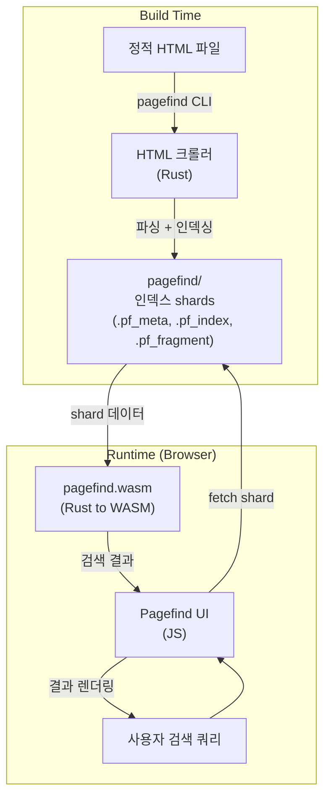

## 정의

**Pagefind** 는 정적 사이트 (SSG) 용 클라이언트 사이드 전문 검색 엔진. 빌드 후 **정적 인덱스** 생성, 브라우저에서 WASM + fetch 로 검색. CloudCannon 이 Rust 로 개발하고 오픈소스로 공개.

서버 없이 완전한 전문 검색 (full-text search) 을 정적 호스팅 환경에서 구현할 수 있다.

## 아키텍처



핵심 설계:
- **빌드 시**: Rust CLI 가 HTML 을 파싱해 단어 단위 인덱스(shard) 생성
- **런타임**: WASM 모듈이 브라우저에서 실행, 필요한 shard 만 lazy fetch
- **서버 불필요**: CDN 또는 S3 같은 정적 호스팅으로 충분

## 특징

| 특징 | 설명 |
|:---|:---|
| **서버리스** | JS + WASM + 정적 파일만으로 동작 |
| **인덱스 크기** | 40MB HTML → 약 300KB 인덱스 (gzip 전) |
| **다국어** | 언어 자동 감지, stemming 지원 |
| **Stemming** | Snowball 알고리즘 (영어/한국어 등) |
| **필터** | `data-pagefind-filter` 속성으로 카테고리 필터 |
| **하이라이팅** | 검색어 하이라이트 + 주변 문맥 excerpt |
| **Lazy loading** | 검색어 첫 글자 입력 시 첫 shard 만 fetch |
| **오프라인** | Service Worker 와 조합 시 오프라인 검색 가능 |

## 인덱스 구조

```
dist/
  pagefind/
    pagefind.js          # JS API
    pagefind.wasm        # Rust WASM 모듈
    pagefind-ui.js       # 기본 UI 컴포넌트
    pagefind-ui.css
    pagefind-entry.json  # 메타 정보
    index/
      en/
        pagefind.pf_meta     # 언어별 메타
        pagefind.pf_index_0  # 단어 인덱스 shard 0
        pagefind.pf_index_1  # shard 1 ...
    fragment/
      en/
        *.pf_fragment    # 페이지별 본문 excerpt
```

검색어가 `"rag"` 이면 `"r"` 로 시작하는 shard 만 fetch → 불필요한 네트워크 요청 최소화.

## Astro 통합

### astro-pagefind 패키지 사용 (권장)

```bash
npm i -D astro-pagefind
```

```js
// astro.config.mjs
import { defineConfig } from 'astro/config';
import pagefind from 'astro-pagefind';

export default defineConfig({
    integrations: [pagefind()],
    build: {
        format: 'directory',    // pagefind 는 /path/index.html 구조 필요
    },
});
```

```astro
---
// src/components/Search.astro
import { PagefindSearch } from 'astro-pagefind/components';
---

<PagefindSearch
    id="search"
    className="pagefind-ui"
    uiOptions={{ showImages: false, excerptLength: 15 }}
/>
```

### 수동 통합 (빌드 후 CLI)

```json
// package.json
{
    "scripts": {
        "build": "astro build && npx pagefind --site dist"
    }
}
```

빌드 결과물에 `pagefind/` 디렉토리가 생성된다.

## Hugo 통합

```yaml
# config.yaml
params:
  pagefind: true
```

```html
<!-- layouts/partials/pagefind.html -->
<link href="/pagefind/pagefind-ui.css" rel="stylesheet" />
<script src="/pagefind/pagefind-ui.js" type="text/javascript"></script>
<div id="search"></div>
<script>
    window.addEventListener('DOMContentLoaded', () => {
        new PagefindUI({ element: '#search', showSubResults: true });
    });
</script>
```

```bash
# Makefile / build script
hugo && npx pagefind --site public
```

Hugo 는 `public/` 이 출력 폴더. 빌드 후 pagefind CLI 를 `public/` 에 실행.

## JavaScript API (직접 제어)

```js
// 기본 검색
const pagefind = await import('/pagefind/pagefind.js');
await pagefind.init();

const search = await pagefind.search('django');
console.log(search.results.length);   // 매칭 수

// 결과 상세 데이터 로드
for (const result of search.results.slice(0, 5)) {
    const data = await result.data();
    console.log(data.url);        // /wiki/django/
    console.log(data.title);      // 페이지 제목
    console.log(data.excerpt);    // 하이라이트 포함 발췌
    console.log(data.word_count); // 단어 수
    console.log(data.filters);    // 필터 값 (category 등)
}

// 필터 적용
const filtered = await pagefind.search('orm', {
    filters: { category: 'django' }
});
```

```js
// 디바운스 패턴
let timer;
inputEl.addEventListener('input', (e) => {
    clearTimeout(timer);
    timer = setTimeout(async () => {
        const results = await pagefind.search(e.target.value);
        renderResults(results);
    }, 300);
});
```

## 필터링

HTML 에 `data-pagefind-filter` 속성 추가:

```html
<!-- 카테고리 필터 -->
<article data-pagefind-filter="category:blog">...</article>
<article data-pagefind-filter="category:wiki">...</article>

<!-- 태그 필터 (여러 값) -->
<span data-pagefind-filter="tag[data-value]" data-value="python"></span>
<span data-pagefind-filter="tag[data-value]" data-value="django"></span>

<!-- 날짜 필터 -->
<time data-pagefind-filter="year[datetime]" datetime="2026-07-15"></time>
```

```js
// 여러 필터 조합
const results = await pagefind.search('queryset', {
    filters: {
        category: 'django',
        tag: ['orm', 'python']
    }
});
```

## 검색 대상 커스터마이징

```html
<!-- 특정 영역만 인덱싱 -->
<main data-pagefind-body>
    <h1>제목</h1>
    <article>본문...</article>
</main>

<!-- 특정 영역 인덱싱 제외 -->
<nav data-pagefind-ignore>...</nav>
<aside data-pagefind-ignore="all">
    <!-- 이 안의 모든 요소 제외 -->
</aside>

<!-- 메타 정보 추가 -->
<meta data-pagefind-meta="title" content="[Django] ORM 기본" />
<meta data-pagefind-meta="image" content="/thumbnails/django-orm.png" />
```

## 커스텀 UI

기본 UI 를 쓰지 않고 직접 구현:

```html
<input type="search" id="my-search" placeholder="검색..." />
<ul id="results"></ul>

<script type="module">
    const pagefind = await import('/pagefind/pagefind.js');

    document.getElementById('my-search').addEventListener('input', async (e) => {
        const query = e.target.value.trim();
        if (!query) return;

        const search = await pagefind.search(query);
        const items = await Promise.all(
            search.results.slice(0, 10).map(r => r.data())
        );

        document.getElementById('results').innerHTML = items
            .map(item => `
                <li>
                    <a href="${item.url}">${item.title}</a>
                    <p>${item.excerpt}</p>
                </li>
            `)
            .join('');
    });
</script>
```

## Pagefind vs 대안

| | Pagefind | Lunr.js | DocSearch (Algolia) | Fuse.js |
|:---|:---|:---|:---|:---|
| 서버 필요 | X | X | X (Algolia 외부) | X |
| 인덱스 위치 | 정적 파일 | JS 번들 | Algolia 서버 | 런타임 생성 |
| 인덱스 크기 | 작음 (shard) | 큼 (전체 번들) | 외부 | 없음 (메모리) |
| 언어 지원 | 자동 감지 | 수동 설정 | 자동 | 없음 |
| 대용량 사이트 | O (shard) | X (번들 한계) | O | X |
| 무료 | O | O | 오픈소스 한정 O | O |
| 검색 품질 | 높음 (WASM) | 중간 | 높음 | 퍼지 검색 |
| 빌드 단계 필요 | O | X | O (크롤링) | X |
| 적합 | SSG 전용 검색 | 소규모 앱 | 문서 사이트 | 클라이언트 필터 |

## 인덱스 크기 예시

| 사이트 규모 | HTML 총 크기 | Pagefind 인덱스 | 초기 fetch |
|:---|:---|:---|:---|
| 소형 (50 페이지) | 2MB | ~15KB | 첫 shard 만 |
| 중형 (500 페이지) | 20MB | ~150KB | 첫 shard 만 |
| 대형 (5,000 페이지) | 200MB | ~1.5MB | 첫 shard 만 |

실제 사용자는 쿼리 시 해당하는 shard 만 fetch 하므로 대형 사이트도 초기 로딩 부담이 작다.

## 함정

> [!WARNING]
> **`build.format: 'directory'` 필수 (Astro)**. `build.format: 'file'` 이면 `/path.html` 로 생성되어 pagefind 가 URL 을 `/path.html` 로 인덱싱. `'directory'` 로 해야 `/path/` 로 인덱싱됨.

> [!IMPORTANT]
> **개발 서버에서는 동작 안 함**. pagefind 는 빌드 후 `pagefind/` 디렉토리가 있어야 한다. `astro dev` 에서는 인덱스가 없으므로 검색 불가. 로컬 테스트는 `astro build && astro preview`.

> [!CAUTION]
> **SPA 라우팅과 충돌**. Pagefind 는 정적 HTML 인덱싱 기반이므로 클라이언트 사이드 렌더링(CSR) 콘텐츠는 인덱싱 안 됨. SSR/SSG 콘텐츠만 검색 가능.

> [!WARNING]
> **한국어 stemming 미지원**. 영어는 Snowball stemming(run/runs/running 동일 처리)이 있지만, 한국어는 형태소 분석 없이 단순 문자열 매칭. 짧은 검색어보다 완전한 단어로 검색할 때 적중률이 높다.

## 관련 위키

- [[astro|Astro]] - Pagefind 와 가장 자주 통합되는 SSG
