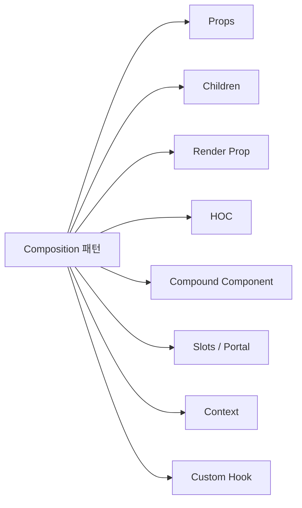
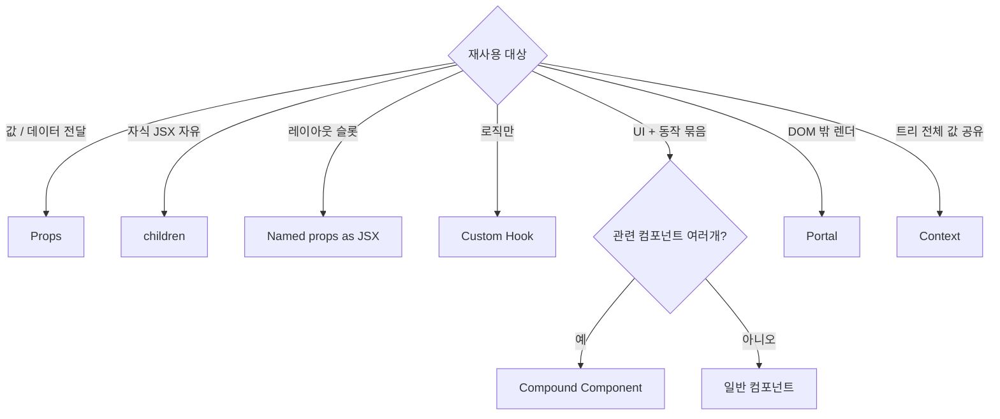
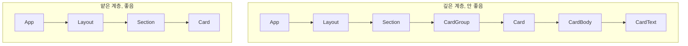

## 정의

**Component Composition** 은 *작은 컴포넌트를 조합* 해 *큰 UI 를 만드는 React 의 핵심 빌드 블록*. 객체지향의 *상속 (inheritance)* 대신 *Composition* 이 *React 의 정통*.

> [!IMPORTANT]
> React 의 공식 입장은 명확하다: ***"Composition over Inheritance"***. *컴포넌트 상속 (`extends Modal`)* 같은 패턴은 *처음부터 권장하지 않는다*. 모든 재사용은 *props / children / Hook / Composition* 으로.

## Stateless vs Stateful

```anim:stateless-vs-stateful
{}
```

> 위 애니메이션은 stateless / stateful 시스템의 일반 직관. React 도 *상태 없는 컴포넌트 (presentational)* 와 *상태 있는 컴포넌트 (container)* 의 분리가 *대규모 코드 정리의 기본*.

```jsx
// Stateless (presentational)
function Card({ title, body }) {
  return (
    <div className="card">
      <h2>{title}</h2>
      <p>{body}</p>
    </div>
  );
}

// Stateful (container)
function CardWithLike({ id }) {
  const [liked, setLiked] = useState(false);
  return (
    <Card title="Hello" body={liked ? '❤️' : 'Like?'}>
      <button onClick={() => setLiked(!liked)}>Toggle</button>
    </Card>
  );
}
```

## 패턴 카탈로그



| 패턴 | 의도 | 가장 잘 어울리는 곳 |
|---|---|---|
| Props | 값 전달 | 가장 기본 |
| Children | 임의 JSX 임베드 | Card, Layout, Modal |
| Render Prop | 자식 *렌더 함수* | 데이터 + UI 분리 (옛 패턴) |
| HOC | 컴포넌트 *감싸기* | 인증, 권한, 로깅 (옛 패턴) |
| Compound Component | *짝 컴포넌트* (`Tabs.Tab`) | Tabs, Select, Disclosure |
| Slot | 특정 *지정 영역* 에 임베드 | Layout, Drawer |
| Portal | DOM 트리 *밖* 으로 렌더 | Modal, Tooltip, Toast |
| Context | 트리 전체에 *값 공유* | Theme, Auth, i18n |
| Custom Hook | *동작* 만 추출 | API fetch, 폼 상태 |

## 1. Props: 가장 기본

```jsx
function Avatar({ src, size = 'md', alt }) {
  return ;
}

<Avatar src="..." alt="koa" size="lg" />
```

> [!NOTE]
> React 19+ 에서는 `ref` 도 *그냥 prop*. `forwardRef` 불필요. 기본 props 의 *지위* 가 더 강력해졌다.

## 2. Children: 임의 JSX 임베드

```jsx
function Card({ title, children }) {
  return (
    <div className="card">
      <h2>{title}</h2>
      <div className="card-body">{children}</div>
    </div>
  );
}

<Card title="Hello">
  <p>Anything I want.</p>
  <button>Click me</button>
</Card>
```

> *"내가 디자인한 슬롯에 너가 무엇을 넣을지 결정해"*. *컴포지션의 가장 강력한 한 줄*.

### 다중 children: 명명 slot

```jsx
function Layout({ header, sidebar, children, footer }) {
  return (
    <div className="layout">
      <header>{header}</header>
      <aside>{sidebar}</aside>
      <main>{children}</main>
      <footer>{footer}</footer>
    </div>
  );
}

<Layout
  header={<Nav />}
  sidebar={<Sidebar />}
  footer={<Footer />}
>
  <Article />
</Layout>
```

## 3. Render Prop (옛 패턴)

자식이 *렌더 함수*. 부모가 *데이터* 를 만들고 자식이 *UI* 를 결정.

```jsx
<MouseTracker>
  {({ x, y }) => <div>Mouse at ({x}, {y})</div>}
</MouseTracker>

function MouseTracker({ children }) {
  const [pos, setPos] = useState({ x: 0, y: 0 });
  useEffect(() => {
    const handler = (e) => setPos({ x: e.clientX, y: e.clientY });
    window.addEventListener('mousemove', handler);
    return () => window.removeEventListener('mousemove', handler);
  }, []);
  return children(pos);
}
```

> [!CAUTION]
> Render Prop 는 *Hook 이전 시대의 패턴*. 현재는 *custom Hook (`useMouse`)* 이 *더 깔끔*. 새 코드에서는 *피하는 게* 표준.

```jsx
// 같은 의도, 현대적 형태
function useMouse() {
  const [pos, setPos] = useState({ x: 0, y: 0 });
  useEffect(() => { /* same */ }, []);
  return pos;
}

function Tracker() {
  const { x, y } = useMouse();
  return <div>Mouse at ({x}, {y})</div>;
}
```

## 4. HOC (Higher Order Component) (옛 패턴)

컴포넌트를 *함수에 넣고 새 컴포넌트* 를 받는다.

```jsx
function withAuth(Component) {
  return function AuthGuarded(props) {
    const user = useUser();
    if (!user) return <Login />;
    return <Component {...props} user={user} />;
  };
}

const ProtectedPage = withAuth(Page);
```

> [!CAUTION]
> HOC 도 *Hook 이전의 패턴*. 현대적 대안:
> - 인증 가드 → *Route 레벨* 또는 *layout 컴포넌트*
> - 데이터 주입 → *Hook 또는 Context*
> - prop 추가 → *Composition + Hook*

## 5. Compound Component: 짝 컴포넌트

부모와 *지정된 자식들* 이 *암묵적 계약*. 사용자가 *자식의 배치만* 결정.

```jsx
<Tabs defaultValue="profile">
  <Tabs.List>
    <Tabs.Trigger value="profile">Profile</Tabs.Trigger>
    <Tabs.Trigger value="settings">Settings</Tabs.Trigger>
  </Tabs.List>
  <Tabs.Panel value="profile"><Profile /></Tabs.Panel>
  <Tabs.Panel value="settings"><Settings /></Tabs.Panel>
</Tabs>
```

```jsx
// 구현 (Context 로 짝 묶기)
const TabsContext = createContext(null);

function Tabs({ defaultValue, children }) {
  const [active, setActive] = useState(defaultValue);
  return (
    <TabsContext value={{ active, setActive }}>
      {children}
    </TabsContext>
  );
}

Tabs.List = ({ children }) => <div className="tabs-list">{children}</div>;
Tabs.Trigger = ({ value, children }) => {
  const { active, setActive } = use(TabsContext);
  return (
    <button data-active={active === value} onClick={() => setActive(value)}>
      {children}
    </button>
  );
};
Tabs.Panel = ({ value, children }) => {
  const { active } = use(TabsContext);
  return active === value ? <div>{children}</div> : null;
};
```

> [!TIP]
> 라이브러리 (Radix, Reach UI, Headless UI, shadcn/ui) 가 *모두* 이 패턴을 사용. *flexible + 타입 안전 + 자기 documentation*. 모던 React 의 *주력 패턴*.

## 6. Slot / Portal

```jsx
// 트리 안의 *지정 위치* 에 임베드
function Modal({ children }) {
  return createPortal(
    <div className="modal-backdrop">
      <div className="modal-content">{children}</div>
    </div>,
    document.body          // ← DOM 트리 *밖* 의 <body> 로
  );
}
```

> [!IMPORTANT]
> *Portal 은 DOM 트리는 다르지만 React 트리는 같다*. *Context 가 portal 자식까지 전파*. *event bubbling 도 React 트리 따라 흐름*.

## 7. Context: 트리 전체에 값 공유

```jsx
const ThemeContext = createContext('light');

function App() {
  const [theme, setTheme] = useState('light');
  return (
    <ThemeContext value={theme}>   // ← React 19+ <Context.Provider> 줄임
      <Layout>
        <Article />
      </Layout>
    </ThemeContext>
  );
}

function Article() {
  const theme = use(ThemeContext);   // React 19 의 use() API
  return <article className={theme}>...</article>;
}
```

> [!CAUTION]
> Context 는 *상위 값이 바뀌면 *Context 를 읽는 모든 자손이 재렌더**. *자주 변하는 값* 을 Context 에 두면 *성능 사고* 의 원인. *theme / auth* 처럼 *드물게 변하는 값* 에만.

## 8. Custom Hook: 로직만 추출

UI 가 없는 *재사용 가능한 동작*. *Composition 의 비-시각적 형태*.

```jsx
function useFetch(url) {
  const [data, setData] = useState(null);
  const [loading, setLoading] = useState(true);
  const [error, setError] = useState(null);

  useEffect(() => {
    let alive = true;
    fetch(url)
      .then(r => r.json())
      .then(d => alive && setData(d))
      .catch(e => alive && setError(e))
      .finally(() => alive && setLoading(false));
    return () => { alive = false; };
  }, [url]);

  return { data, loading, error };
}

function UserCard({ id }) {
  const { data: user, loading, error } = useFetch(`/api/users/${id}`);
  if (loading) return <Skeleton />;
  if (error) return <Error err={error} />;
  return <Card>{user.name}</Card>;
}
```

> *Custom Hook 의 이름* 은 *`use` 로 시작*. ESLint 가 *Hook 규칙 (최상위 호출, 컴포넌트 내부) 을 강제*.

## 패턴 선택 가이드



## Inheritance 가 *왜 안 좋은가*

```jsx
// 안티패턴
class Modal extends BaseModal {
  // BaseModal 의 protected method 를 호출?
  // 부모-자식의 의미적 결합이 *코드를 강하게 묶음*
}

// 정통: composition
function Modal({ title, children }) {
  return <BaseModal title={title}>{children}</BaseModal>;
}
```

| 항목 | Inheritance | Composition |
|---|---|---|
| 부모-자식 결합도 | *강함* | *약함* (props 만) |
| 테스트 단위 | *상속 체인 전체* | *조립 단위* 별 |
| 재사용 단위 | *클래스* | *컴포넌트 + Hook* |
| 변경 영향 범위 | *모든 자식* | *해당 인스턴스* |

> *React 의 모든 공식 문서가 inheritance 를 권장하지 않는다*. *예외가 거의 없는* 원칙.

## 컴포넌트 계층의 *얕음*



> 계층이 *깊으면* prop drilling 이 *고통*. *Composition + children + Context* 로 *얕게 유지*.

## 19+ 의 새 기능들과 composition

| React 19+ 기능 | composition 에 미친 영향 |
|---|---|
| `ref` as prop | `forwardRef` 의 *상속 같은 wrapping* 사라짐 |
| Server Components | *서버 데이터 + 클라이언트 UI* 의 *깔끔한 분리* |
| `use()` API | *Promise / Context* 의 *조건부 사용* 가능 |
| `<Activity>` | *상태 보존 + effect 분리* 의 새 컴포지션 단위 |
| Document Metadata | `<title>`, `<meta>` 가 *컴포넌트 내부에서* 동작 |

## 흔한 함정

> [!WARNING]
> 1. **HOC 남용** = 디버깅 hell (트리에 `withX(withY(withZ(Component)))`).
> 2. **Render Prop 남용** = nested function 의 무한 들여쓰기. Custom Hook 으로.
> 3. **Context 의 *모든 값을 한 곳* 에** = 자주 변하는 값이 *모든 자식 재렌더*. *분리된 Context* 로.
> 4. ***부모가 자식의 내부 state 를 직접 조작*** = ref + imperative handle. *피해야* 한다. *state lift up* 또는 *event 전달*.
> 5. **Compound Component 의 *암묵 계약*** = 잘못된 자식이 들어오면 *조용히 깨짐*. *Context 사용 + 자식 검증*.

## 김신certificate의 현장 메모

- *Compound Component* 가 *모던 React 의 가장 강력한 무기*. Radix / Headless UI 가 모두 이 패턴 → *Tailwind + Compound* 가 *오늘날의 표준 디자인 시스템 빌드 블록*.
- *Custom Hook 의 *시그니처* 가 컴포넌트보다 더 신중* 해야 한다. *반환 모양 (object vs tuple)*, *의존성 입력 방식*, *에러 처리 일관성* 이 *팀 전체* 의 사용성을 결정.
- *Children 만으로도 거의 모든 합성* 이 가능. *팀에 *children 으로 끝낼 수 있는 곳에 HOC / render prop 도입 금지* 라는 규칙* 만 있으면 *복잡도 폭증을 막을 수* 있다.
- **Context 의 읽기 / 쓰기 분리** (`useTheme` / `useThemeUpdate`) 가 *자주 변하는 값의 성능 사고* 를 막는 *간단한 패턴*. 별도 라이브러리 없이 *Context 두 개*.

## 관련 위키

- [[React]] (19.x 전반)
- [[React useEffect]] (effect 도 composition 단위)
- [[React useMemo useCallback]] (composition + memo)
- [[React Lifecycle]] (mount / Activity / RSC)
- [[React Compiler]] (자동 memo 시대의 composition)
- [[SPA Architecture]] (얕은 계층과 라우팅)

## 참고

- 공식: [Passing Props](https://react.dev/learn/passing-props-to-a-component), [Children](https://react.dev/learn/passing-data-deeply-with-context)
- 레거시 (참고): [Composition vs Inheritance](https://legacy.reactjs.org/docs/composition-vs-inheritance.html)
- Compound: [Kent C. Dodds](https://kentcdodds.com/blog/compound-components-with-react-hooks)
