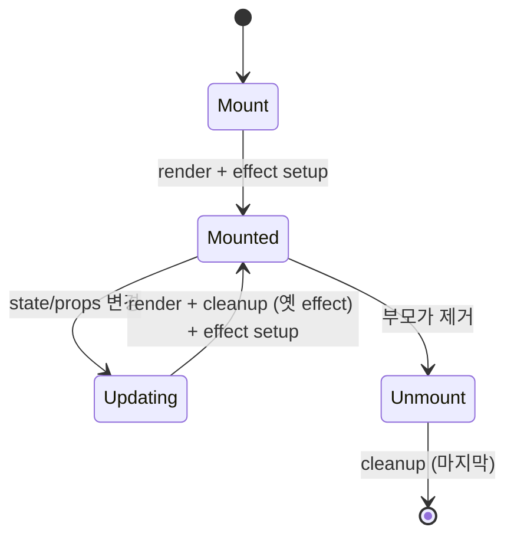
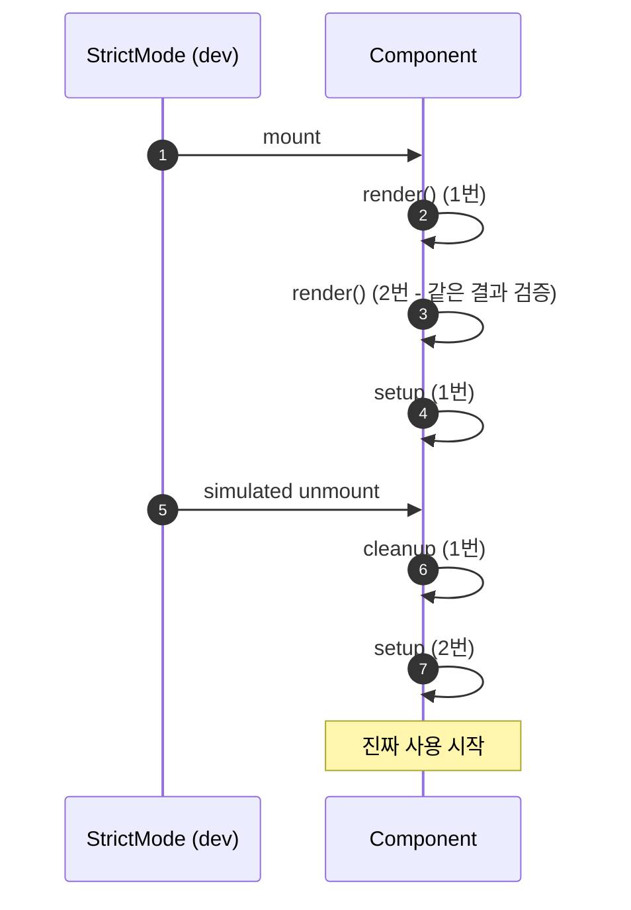
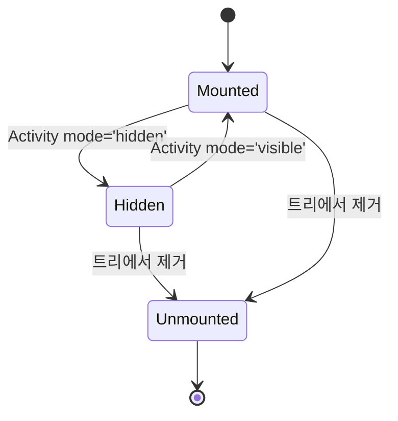
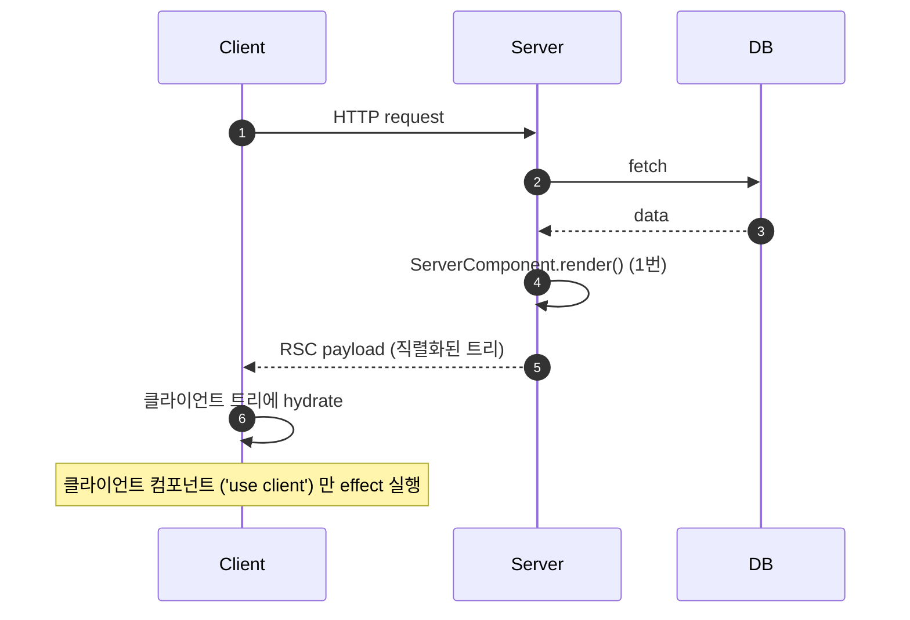
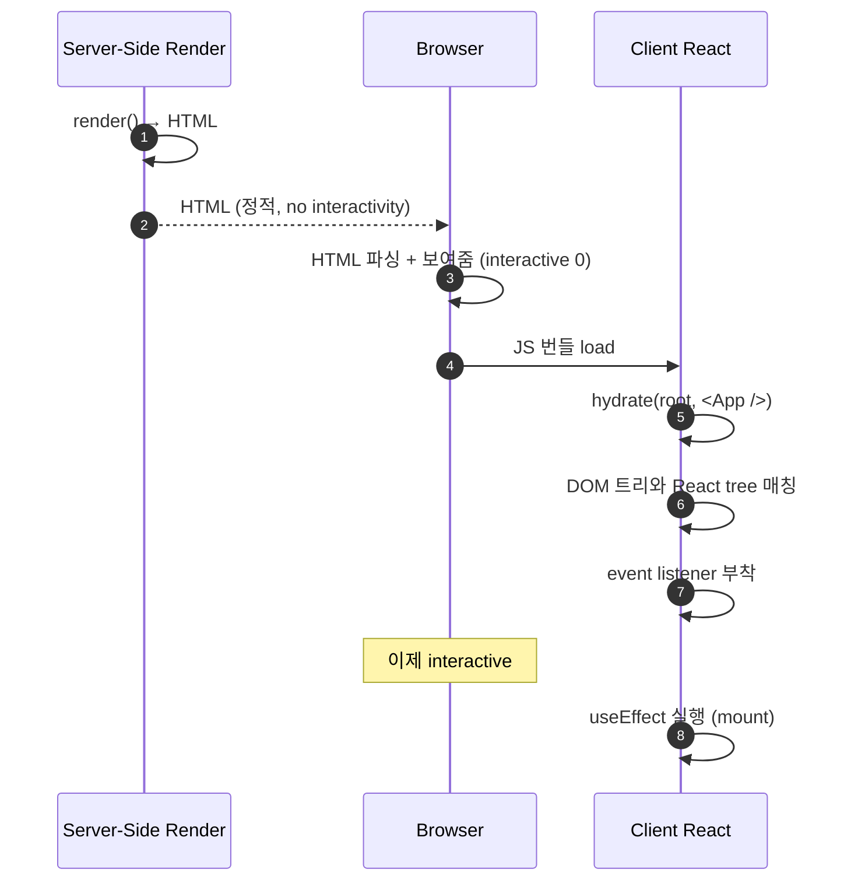
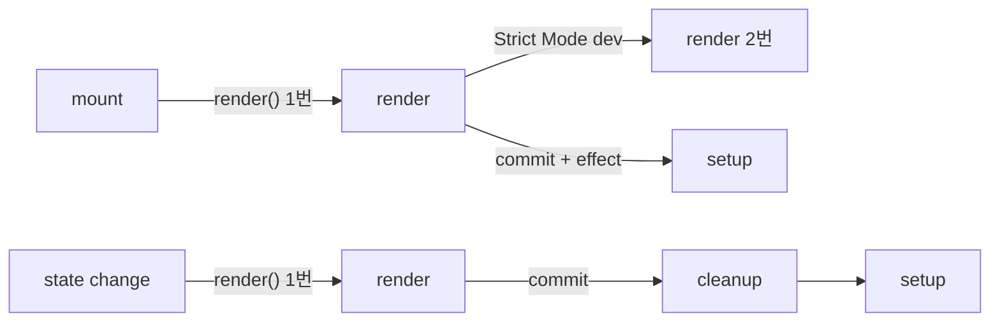

## 정의

**React Lifecycle** 은 *컴포넌트의 생성 → 갱신 → 제거* 의 흐름. 함수 컴포넌트에서는 *클래스의 lifecycle method 가 사라지고* *render + effect + cleanup* 의 조합으로 대체된다.

> [!IMPORTANT]
> 함수 컴포넌트 시대의 멘탈 모델: ***"라이프사이클" 이 아니라 "동기화의 한 사이클"*. *render* (UI 계산) + *effect* (외부 시스템 동기화) + *cleanup* (정리). 이 3 단계가 *mount / update / unmount* 시점마다 *다른 조합* 으로 일어난다.

## 일반 라이프사이클의 직관

```anim:spring-bean-lifecycle-phases
{}
```

> Spring Bean 의 라이프사이클 직관. React 도 *생성 → 의존성/props 주입 → 초기화 콜백 (effect setup) → 사용 → 소멸 콜백 (cleanup) → 제거* 의 거의 같은 흐름.

## 함수 컴포넌트의 3 단계



### 1. Mount

```
1. constructor 같은 *초기 state 설정* (useState, useReducer 초기값)
2. render() = JSX 반환
3. DOM 에 commit
4. useLayoutEffect 실행 (동기)
5. paint
6. useEffect 실행 (비동기)
```

### 2. Update

```
1. state / props 변경 트리거
2. render() = 새 JSX 계산 (Reconciliation)
3. DOM diff 후 commit
4. useLayoutEffect cleanup → 새 useLayoutEffect
5. paint
6. useEffect cleanup → 새 useEffect
```

### 3. Unmount

```
1. 부모 트리에서 제거 결정
2. useEffect cleanup 호출 (마지막)
3. useLayoutEffect cleanup 호출
4. DOM 제거
```

> [!NOTE]
> Cleanup 은 *옛 effect 를 지우고 새 effect 를 시작하기 직전*. *언마운트 시점* 만의 일이 아니다. 모든 *update* 시 *cleanup + setup* 이 *짝* 으로 일어난다.

## 클래스 vs 함수 컴포넌트 매핑

| 클래스 (legacy) | 함수 (현재) |
|---|---|
| `constructor` | `useState`, `useReducer` 초기값 |
| `componentDidMount` | `useEffect(() => {}, [])` |
| `componentDidUpdate` | `useEffect(() => {}, [deps])` |
| `componentWillUnmount` | cleanup 함수 `return () => {}` |
| `shouldComponentUpdate` | `React.memo` 의 비교 함수 |
| `getDerivedStateFromProps` | *없음* (props 로부터 유도 = render 중 계산) |
| `getSnapshotBeforeUpdate` | `useLayoutEffect` cleanup 의 *직전 측정* |
| `componentDidCatch` | `ErrorBoundary` (여전히 클래스 필요) |

> [!CAUTION]
> *ErrorBoundary* 는 *2026 시점에도 여전히 클래스 컴포넌트 필요*. `componentDidCatch` 와 `getDerivedStateFromError` 가 *함수 API 로 옮겨지지 않았다*.

## Strict Mode 의 double invoke

React 18+ 의 개발 모드에서 *render + effect 가 2 번 실행* 된다. *cleanup 의 정합성 검증* 도구.



### 무엇이 잡히는가

- **순수하지 않은 render**: 두 번 호출에서 *다른 결과* 가 나오면 *Side effect in render* 위반.
- **불완전한 cleanup**: setup 에서 *전역 카운터 ++*, cleanup 에서 *--* 안 하면 *2 가 누적*.
- **stale closure 오용**: 첫 render 의 closure 가 두 번째에서 *예상과 다르게 동작*.

### Production 에서는?

```jsx
<StrictMode>
  <App />
</StrictMode>
```

→ 개발 모드 *only*. 프로덕션 번들에서는 *single invoke*. 즉 *개발 시 잡지 못한 버그가 프로덕션에서 발현될 수 있다*. *Strict Mode 의 모든 경고를 진지하게* 받아들이는 게 *원칙*.

## React 19.2 의 `<Activity>` 모드

`<Activity mode="hidden | visible">` 가 lifecycle 의 *4번째 상태* 를 추가한다.



| 상태 | render | effect | DOM |
|---|---|---|---|
| `Mounted` (visible) | 일반 | mounted | live |
| `Hidden` | *유지* | *cleanup* (unmount 처럼) | *유지 (display:none)* |
| `Unmounted` | 없음 | cleanup | 제거 |

```jsx
<Activity mode={isVisible ? 'visible' : 'hidden'}>
  <Page />
</Activity>
```

> [!TIP]
> *탭 전환 / 라우터* 에서 *상태 보존이 필요* 하지만 *effect 는 멈춰야* 할 때. 옛 코드에서는 *직접 보관하다가 다시 mount* 하는 *복잡한 패턴* 이 *Activity 한 줄* 로 대체.

## Server Components (RSC) 의 lifecycle

`'use server'` 가 박힌 서버 컴포넌트는 *서버에서 1번 render*, *결과만 클라이언트로*. *클라이언트에서 effect 없음*.



### CSR / SSR / SSG / RSC 모드 비교

```anim:spa-rendering-modes
{}
```

> 4 가지 렌더링 모드의 시각. *각 모드별 lifecycle 의 위치* 가 어떻게 다른지 직관.

## Hydration: 서버 HTML 과 클라이언트의 합체



### Hydration mismatch

서버 render 결과와 클라이언트 첫 render 결과가 *다르면* 에러:

```jsx
// ❌ 서버와 클라이언트가 다른 시간
function Now() {
  return <div>{new Date().toISOString()}</div>;
}

// ✅ 서버 render 결과 그대로 사용, 클라이언트만 갱신
function Now() {
  const [now, setNow] = useState(null);
  useEffect(() => setNow(new Date()), []);
  return <div>{now?.toISOString() ?? '...'}</div>;
}
```

## Browser 렌더링 vs React 렌더링

```anim:browser-anatomy
{}
```

> 브라우저 자체의 *DOM → Layout → Paint → Composite* 흐름. React 의 render → commit → effect 가 *어디에 끼는지* 의 큰 그림.

## 흔한 함정

> [!WARNING]
> 1. **render 에서 사이드 이펙트** = `useEffect` 로 옮기거나 *이벤트 핸들러* 로. render 는 *순수해야* 한다 (StrictMode 가 강제로 검증).
> 2. **setState 가 즉시 반영되지 않음** = 같은 render 사이클 안에서는 *옛 값*. *batched* update.
> 3. **Concurrent rendering 의 *interrupted render*** = render 가 *중간에 버려질 수 있다*. *render 안에서 외부 state 변경 금지*.
> 4. **Strict Mode 의 *double invoke 를 production 으로 오해*** = 개발 도구. 프로덕션에서는 일어나지 않는다. 그러나 *그 경고를 무시하면* 다른 버그.

## 함수 컴포넌트의 *호출 횟수* 헷갈림



| 시점 | render 호출 | effect setup | effect cleanup |
|---|---|---|---|
| 첫 mount (prod) | 1번 | 1번 | 0 |
| 첫 mount (StrictMode dev) | 2번 | 2번 (1번 + 시뮬레이션 cleanup + 1번) | 1번 |
| 상태 변경 | 1번 | 1번 (deps 변경 시) | 1번 (deps 변경 시) |
| unmount | 0 | 0 | 1번 (마지막) |

## 컴포넌트 *수명* 추적

```jsx
function Component() {
  const mountCount = useRef(0);
  const renderCount = useRef(0);

  renderCount.current += 1;

  useEffect(() => {
    mountCount.current += 1;
    console.log(`mounted: ${mountCount.current} times`);
    return () => console.log('unmounted');
  }, []);

  console.log(`rendered: ${renderCount.current} times`);
}
```

> 개발 시 *얼마나 자주 mount / re-render* 되는지 측정. *prop 변경 → re-render* 와 *key 변경 → unmount + mount* 의 *큰 차이* 를 직관으로.

## Key prop 의 lifecycle 영향

```jsx
// 같은 위치, key 같음 → React 가 *재사용* (update)
<Component key="a" prop={x} />
<Component key="a" prop={y} />

// 같은 위치, key 다름 → *unmount + remount* (state 리셋)
<Component key={userId} prop={x} />
```

> [!IMPORTANT]
> *key 가 바뀌면* React 는 *완전히 새 컴포넌트* 로 본다. *state 가 모두 리셋*. *prop 변경 시 state reset* 패턴은 *useEffect 보다 key* 가 정석.

## 19.2 Activity + Strict Mode + RSC: 정리

| 도구 | 도입 | 목적 |
|---|---|---|
| Strict Mode | 16.3 | cleanup 검증 (double invoke 18+) |
| Server Components | 18 / 19 정식 | 서버에서만 render (effect 없음) |
| Concurrent Rendering | 18 | render 중단/재시작 |
| Activity | 19.2 | hidden / visible 의 4번째 상태 |
| useEffectEvent | 19.2 | effect dep 분리 |

## 김신건의 현장 메모

- 함수 컴포넌트 시대에 *componentDidMount* 라는 표현을 *팀에서 쓰지 않도록* 정리한 게 *멘탈 모델 교체에 도움*. *"mount effect" / "update effect" / "cleanup"* 의 *함수 시대 어휘* 로.
- *Strict Mode 켠 직후* 가장 자주 본 버그: *전역 store 구독* 의 *cleanup 누락*. 두 번 setup → *구독 2 개* → *알림 2 번*. Strict Mode 가 *없었으면* 프로덕션에서 *알 수 없는 중복*.
- *Activity* 가 도입된 뒤 *탭 전환의 state 보존* 이 *완전히 다른 패턴*. 옛 *별도 store 에 입력값 복제* 같은 *모종의 패턴* 이 *Activity 한 줄* 로 대체.
- *Hydration mismatch* 의 *가장 자주 본 원인* 은 *Math.random()* 또는 *Date.now()*. SSR 와 클라이언트 첫 render 사이의 시간차. *시간 의존 값은 effect 안* 에서.

## 관련 위키

- [[React]] (19.x 전반)
- [[React useEffect]] (lifecycle 의 핵심 표현)
- [[React useMemo useCallback]] (render 비용 줄이기)
- [[React Component Composition]] (lifecycle 단순화)
- [[SPA Architecture]] (CSR vs SSR vs SSG vs RSC)

## 참고

- 공식: [useEffect](https://react.dev/reference/react/useEffect), [Strict Mode](https://react.dev/reference/react/StrictMode), [Activity](https://react.dev/reference/react/Activity)
- Class legacy: [Component](https://react.dev/reference/react/Component)
