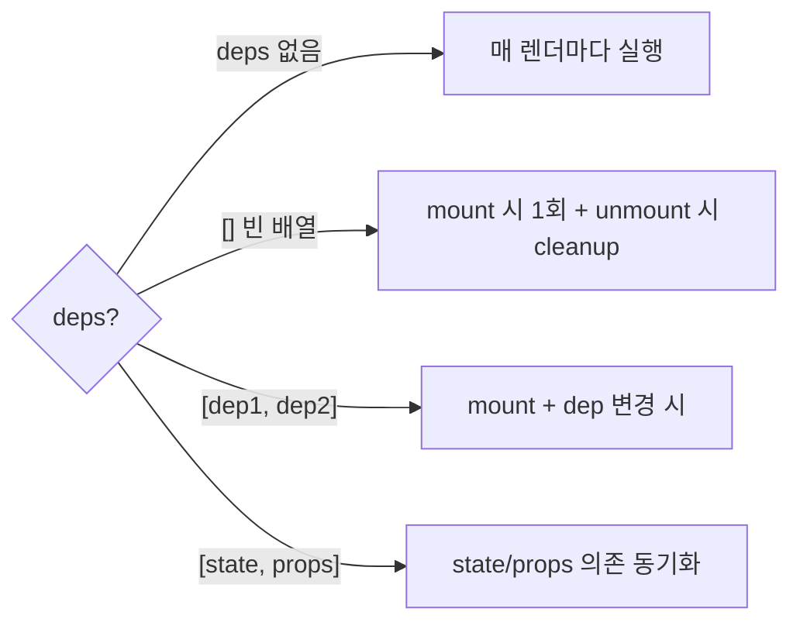
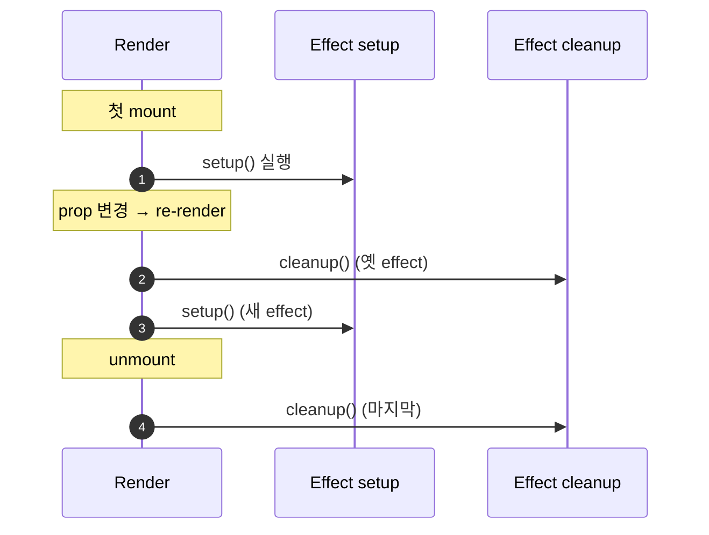
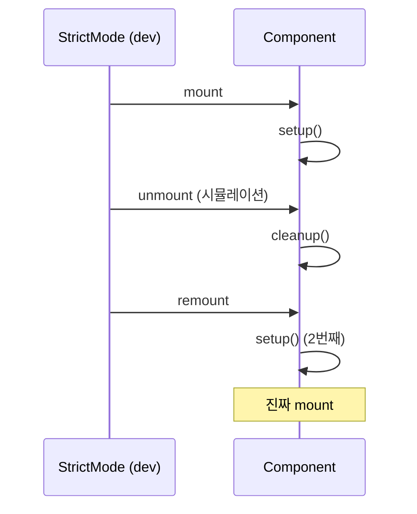
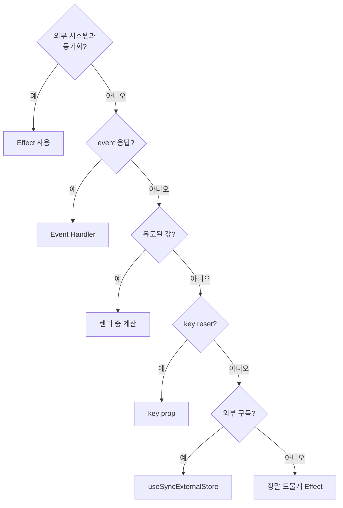
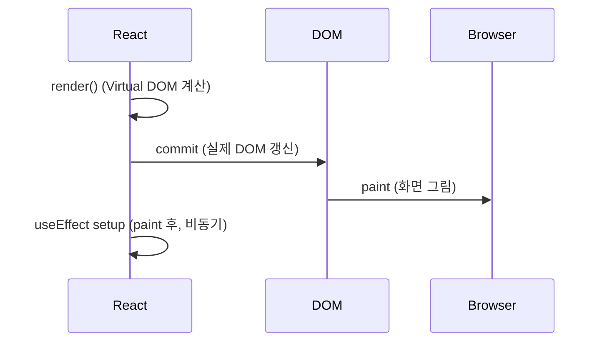
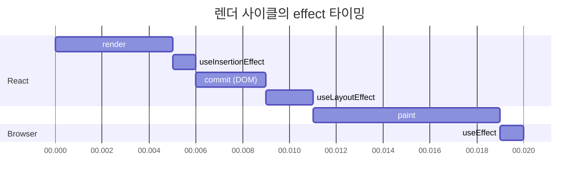

## 정의

**`useEffect(setup, deps?)`** 는 *컴포넌트의 렌더 결과* 와 *외부 시스템* 을 *동기화* 하는 hook.

- *외부 시스템*: 브라우저 DOM, WebSocket, 구독, 타이머, 외부 라이브러리 (D3, Mapbox 등), 외부 store.
- *동기화*: "*렌더가 끝났을 때 외부 상태도 이 컴포넌트 상태와 맞아야* 한다" 라는 규칙 적용.

> [!IMPORTANT]
> useEffect 의 *공식 멘탈 모델은 "동기화"*. *생명주기 이벤트* 가 아니다. *왜 이 effect 가 살아 있어야 하는지* 를 *외부 시스템 관점* 에서 설명할 수 있어야 한다.

### 라이프사이클의 직관

```anim:spring-bean-lifecycle-phases
{}
```

> 위 애니메이션은 Spring Bean 의 라이프사이클이지만 *컴포넌트 라이프사이클의 일반 직관* 을 정확히 보여준다. *생성 → 의존성 주입 → init 콜백 → 사용 → destroy*. React 도 *mount → effect → re-render (deps 변경시) → cleanup → unmount* 의 유사 흐름.

## 가장 단순한 형태

```jsx
useEffect(() => {
  // setup: 렌더 후 동작
  const conn = createConnection(url);
  conn.connect();
  return () => {
    // cleanup: 다음 effect 전에, 그리고 unmount 시
    conn.disconnect();
  };
}, [url]);   // dep: 이 값들이 변하면 cleanup + setup 다시
```

## 4가지 패턴



| deps | 의미 | 흔한 사용 |
|---|---|---|
| `useEffect(fn)` | *매 렌더* | 거의 *피해야* 한다 |
| `useEffect(fn, [])` | *mount 1회* | 구독, 초기 fetch, 외부 라이브러리 init |
| `useEffect(fn, [a, b])` | a, b 변경 시 | 검색 query 변경 → 새 fetch |
| `useEffect(fn, [state])` | state 동기화 | 라우터, 외부 store |

## Cleanup: *왜 이렇게 동작하는가*



> [!IMPORTANT]
> Cleanup 은 *setup 의 거울*. *setup 에서 시작한 모든 것* 을 *cleanup 이 멈춰야* 한다. 그래야 *다음 setup* 이 *깨끗한 상태* 에서 시작.

### Cleanup 시각화

```anim:abort-controller
{}
```

> 위는 *AbortController* 의 동작 직관. effect 의 cleanup 에서 *진행 중인 비동기* 를 abort 하는 표준 패턴.

```jsx
useEffect(() => {
  const ac = new AbortController();
  fetch(`/api/users/${id}`, { signal: ac.signal })
    .then(r => r.json())
    .then(setUser)
    .catch(err => {
      if (err.name !== 'AbortError') throw err;
    });
  return () => ac.abort();   // 새 id 로 바뀌면 옛 요청 취소
}, [id]);
```

## Strict Mode 의 double invoke

React 18+ 의 development 모드에서 effect 가 *2 번 실행* 된다. *cleanup 을 제대로 짰는지* 강제로 검사하는 도구.



> [!CAUTION]
> *cleanup 이 비대칭이면* 두 번째 setup 후 *불일치 상태*. 예: setup 에서 *전역 카운터 ++*, cleanup 에서 *--* 안 하면 *2 가 남는다*. *StrictMode 의 의도가 정확히 이런 버그를 잡는 것*.

## "Effect 가 *필요 없는*" 패턴

[You Might Not Need an Effect](https://react.dev/learn/you-might-not-need-an-effect) 의 핵심:

### 1. 다른 state 로부터 *유도된 값* → useMemo (또는 그냥 계산)

```jsx
// ❌ Effect
const [fullName, setFullName] = useState('');
useEffect(() => {
  setFullName(firstName + ' ' + lastName);
}, [firstName, lastName]);

// ✅ 렌더 중 계산
const fullName = firstName + ' ' + lastName;
```

### 2. *event 응답 로직* → event handler

```jsx
// ❌ Effect
useEffect(() => {
  if (submitted) {
    post('/api/cart', cart);
    setSubmitted(false);
  }
}, [submitted]);

// ✅ handler
function handleSubmit() {
  post('/api/cart', cart);
}
```

### 3. *상위 prop 변경 시 state reset* → key prop

```jsx
// ❌ Effect
useEffect(() => {
  setComment('');
}, [userId]);

// ✅ key reset
<Profile key={userId} userId={userId} />
```

### 4. *외부 store 구독* → useSyncExternalStore

```jsx
// ❌ Effect + 직접 구독
useEffect(() => {
  const unsubscribe = store.subscribe(setData);
  return unsubscribe;
}, []);

// ✅ useSyncExternalStore
const data = useSyncExternalStore(store.subscribe, store.getSnapshot);
```

## 진짜 Effect 가 필요한 경우



*진짜 Effect 사용처*:

- WebSocket / SSE 연결
- 외부 라이브러리 (D3, Mapbox, Chart.js) instance 의 attach/detach
- 브라우저 이벤트 listener (`window.scroll`, `resize`)
- 타이머 (`setInterval`, `setTimeout`)
- `document.title` 같은 *외부 mutation* (단, React 19 의 *Document Metadata* 도 고려)

## `useEffectEvent` (React 19.2)

Effect 안에서 *최신 prop/state* 를 *의존성 없이* 읽고 싶을 때.

문제:

```jsx
function ChatRoom({ roomId, theme }) {
  useEffect(() => {
    const conn = createConnection(serverUrl, roomId);
    conn.on('connected', () => {
      showNotification('Connected!', theme);   // ❌ theme 가 dep 에 없으면 stale
    });
    conn.connect();
    return () => conn.disconnect();
  }, [roomId, theme]);   // theme 도 넣으면 *theme 바뀔 때마다 재연결*
}
```

해결 (React 19.2+):

```jsx
function ChatRoom({ roomId, theme }) {
  const onConnected = useEffectEvent(() => {
    // 항상 *최신 theme* 사용. dep array 에 들어가지 *않는다*.
    showNotification('Connected!', theme);
  });

  useEffect(() => {
    const conn = createConnection(serverUrl, roomId);
    conn.on('connected', () => onConnected());
    conn.connect();
    return () => conn.disconnect();
  }, [roomId]);   // ✅ theme 는 dep 가 아니다
}
```

> [!TIP]
> `useEffectEvent` 는 *남용하면 안 된다*. *"이건 이벤트인데 effect 안에서 발생한다"* 라는 *드문 케이스* 만. 일반 함수를 *dep 에서 빼려고 wrap* 하는 건 *반패턴*.

## Effect 의 타이밍



### `useEffect` vs `useLayoutEffect` vs `useInsertionEffect`

| Hook | 타이밍 | 사용 |
|---|---|---|
| `useEffect` | *paint 후* | 대부분의 동기화 |
| `useLayoutEffect` | *DOM mutation 후, paint 전* (동기) | *측정 + 즉시 mutation* (예: tooltip 위치) |
| `useInsertionEffect` | *DOM mutation 전* | *CSS-in-JS 라이브러리 전용* |



> [!CAUTION]
> `useLayoutEffect` 는 *동기적으로 paint 를 막는다*. 비싼 작업 (큰 DOM 측정 등) 을 넣으면 *애니메이션 끊김*. *반드시 필요한 경우 (FOUC 방지, 즉시 위치 조정) 만* 사용.

## 흔한 함정

### 1. Race condition (오래된 응답이 새 응답 덮음)

```jsx
// ❌ id 가 빠르게 변하면 옛 응답이 마지막에 도착
useEffect(() => {
  fetch(`/api/users/${id}`).then(r => r.json()).then(setUser);
}, [id]);

// ✅ cleanup 플래그 또는 AbortController
useEffect(() => {
  let alive = true;
  fetch(`/api/users/${id}`).then(r => r.json()).then(u => {
    if (alive) setUser(u);
  });
  return () => { alive = false; };
}, [id]);
```

### 2. 무한 루프 (effect 안에서 setState)

```jsx
// ❌ 무한 루프
useEffect(() => {
  setUser({ ...user, lastSeen: Date.now() });
}, [user]);   // user 가 deps 에 있고 effect 가 user 변경
```

→ *유도된 값이면 렌더 중 계산*. *외부 시스템 동기화* 라면 *어떤 조건* 으로 막을지 명시.

### 3. Stale closure

```jsx
useEffect(() => {
  const id = setInterval(() => {
    console.log(count);   // 처음 mount 시점의 count 만 영원히
  }, 1000);
  return () => clearInterval(id);
}, []);
```

→ deps 에 *count* 추가, 또는 *useEffectEvent / setState 함수형 갱신* 으로.

### 4. 의존성을 *수동으로 빠뜨림*

```jsx
useEffect(() => {
  fetchPosts(query);
  // eslint-disable-next-line   ❌
}, []);
```

→ *해결의 시작이 아니라 끝* 이다. 의존성이 *진짜 필요 없음* 을 증명하거나, *useEffectEvent* 또는 *useRef* 로 의도 명시.

## Event Loop 와의 관계

```anim:event-loop-basic
{}
```

```anim:microtask-queue-detail
{}
```

> useEffect 는 *paint 후 마이크로태스크 큐* 에서 실행. 위 두 애니메이션은 *언제 어떤 작업이 실행되는지* 의 일반 직관. *effect cleanup 과 setup* 의 *순서* 가 *왜 그렇게 정해졌는지* 의 배경.

## React 19.2 의 변화

| 기능 | 의미 |
|---|---|
| `useEffectEvent` 정식 | dep array 분리 |
| `<Activity>` 의 `hidden` 모드 | effect *unmount* 시뮬레이션 (배경 렌더) |
| ESLint 새 규칙 | `set-state-in-effect`, `refs` 등 *effect 안의 흔한 버그* 자동 검출 |
| React Compiler 1.0 | *effect 안의 reference* 자동 memoize → dep array stable |

## 김신건의 현장 메모

- *Effect 의 80% 는 *필요 없는* 경우*. 첫 코드 리뷰 라운드에서 "이거 진짜 외부 시스템과 동기화 인가?" 를 물어보면 거의 *반 이상* 이 *제거됨*.
- *AbortController* 가 *fetch + effect* 의 *기본 패턴*. 옛 axios.cancel 같은 *라이브러리별 API* 보다 *web 표준* 이 깔끔.
- `useEffectEvent` 는 *알림 전송 / 로깅* 같은 *side effect 하나만* 분리할 때 가장 빛난다. *비즈니스 로직* 을 wrap 하는 용도로 *남용하면* 추후 디버깅이 더 어렵다.
- *React Compiler 1.0* 이 잡힌 뒤 *useEffect 의 의존성 누락 버그* 가 *컴파일 타임에 잡힘*. *런타임 버그가 빌드 에러로* 옮겨감.

## 관련 위키

- [[React]] (19.x 전반)
- [[React Compiler]] (자동 memoization 과 effect 의 dep 안정화)
- [[React useMemo useCallback]] (memoization 의 동반)
- [[React Lifecycle]] (mount / unmount / strict mode)
- [[React Component Composition]] (effect 가 *왜 안 필요한* 컴포지션 패턴)
- [[JS Async Await]] (effect 안의 비동기)

## 참고

- 공식: [useEffect](https://react.dev/reference/react/useEffect)
- 멘탈 모델: [Synchronizing with Effects](https://react.dev/learn/synchronizing-with-effects)
- 안 쓰는 패턴: [You Might Not Need an Effect](https://react.dev/learn/you-might-not-need-an-effect)
