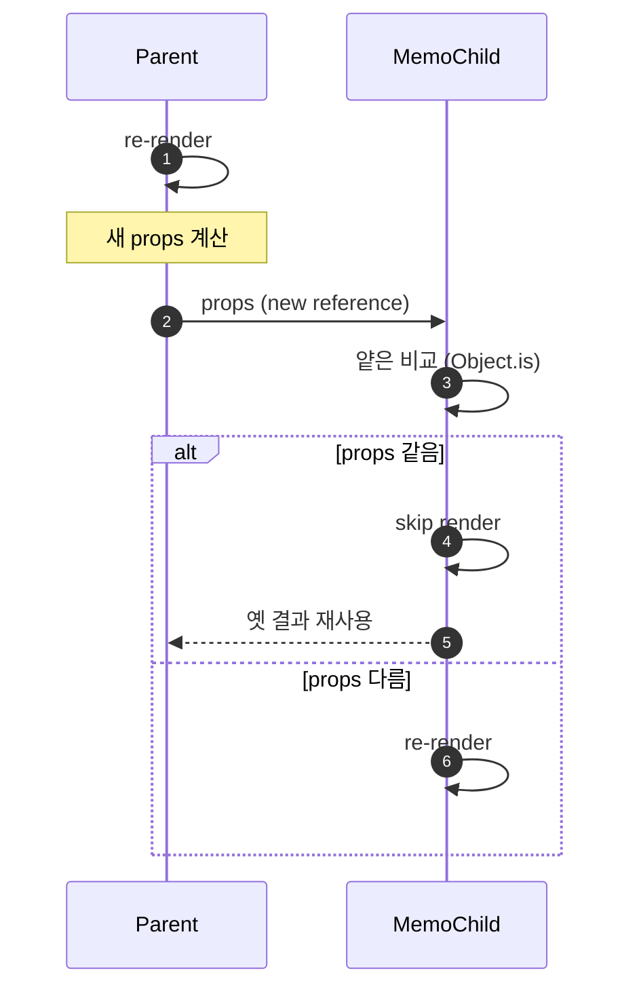
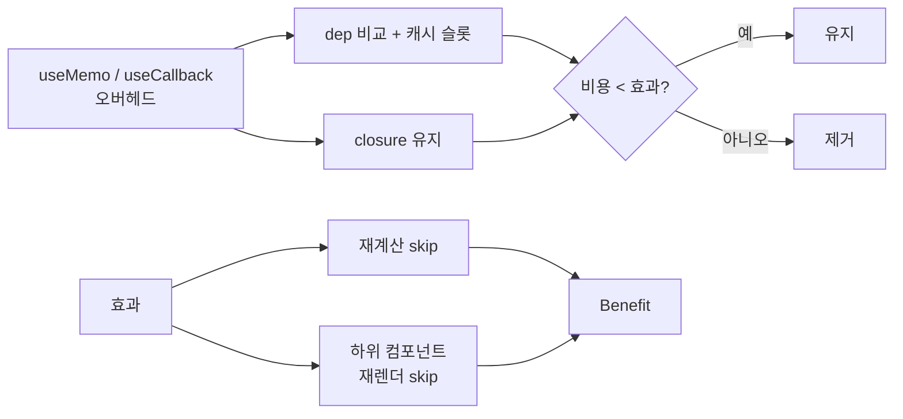
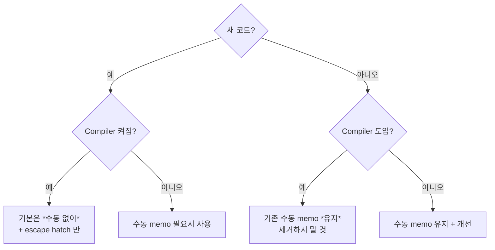

## 정의

세 가지 도구는 *동일한 목표 (불필요한 재계산 / 재생성 / 재렌더 방지)* 를 *서로 다른 위치* 에서 잡는다.

- **`useMemo(fn, deps)`**: *값* 의 메모이제이션. deps 가 같으면 *같은 값* 반환.
- **`useCallback(fn, deps)`**: *함수* 의 메모이제이션. deps 가 같으면 *같은 함수 reference*.
- **`React.memo(Component)`**: *컴포넌트* 의 메모이제이션. props 의 *얕은 비교* 가 같으면 *재렌더 skip*.

> [!IMPORTANT]
> React Compiler 1.0 (2025-10-07) 이후로 *대부분의 새 코드* 는 이 세 가지를 *수동으로 쓰지 않는다*. *컴파일러가 자동으로* 최적 memoization 을 박는다. 이 페이지는 *왜 / 언제 / 어떻게 수동으로 쓰는지* 와 *Compiler 시대의 escape hatch* 를 정리.

## 자동 시대 (React Compiler 1.0+)

기본 사고는 *"손 안 댄다"*. 컴파일러가 *조건부 return 이후* 까지 memoize 가능. 사람이 직접 작성한 *조잡한 useMemo* 보다 *정밀*.

```jsx
// React Compiler 가 켜진 환경
function UserList({ users, query }) {
  // 컴파일러가 자동으로 filter 결과를 memoize
  const filtered = users.filter(u => u.name.includes(query));

  // 컴파일러가 자동으로 onClick 을 stable reference 로
  const onClick = (id) => navigate(`/users/${id}`);

  return filtered.map(u => <Item key={u.id} user={u} onClick={onClick} />);
}
```

자세한 컴파일러 동작은 [[React Compiler]] 참고.

## 그래도 수동이 *필요한* 4 경우

### 1. Effect 의 dep 로 *stable reference* 보장

```jsx
// 외부 라이브러리에 객체를 넘기는데, 매 렌더 새 객체면 effect 재실행
const config = useMemo(() => ({ url, headers }), [url, headers]);

useEffect(() => {
  client.subscribe(config);
  return () => client.unsubscribe(config);
}, [config]);
```

React Compiler 도 *값이 effect dep 에 쓰이면* 알아서 stable 화. 하지만 *명시적 의도* 가 필요할 때.

### 2. 외부 라이브러리에 *동일 reference* 약속

```jsx
// 어떤 라이브러리가 "callback 이 바뀌면 재구독" 하는 경우
const onMessage = useCallback((msg) => {
  console.log(msg, user.name);
}, [user.name]);

useExternalSubscription(onMessage);   // 라이브러리가 reference 비교
```

### 3. 매우 비싼 계산의 *명시적 캐시*

```jsx
// O(n²) 알고리즘 같은 비싼 계산
const layout = useMemo(() => {
  return expensiveLayoutCompute(items);   // 100ms+
}, [items]);
```

컴파일러도 자동 memoize 하지만, *의도* (이건 비싸니까 절대 다시 안 하길 바람) 를 *코드로* 표현.

### 4. 기존 코드의 *변경 위험 최소화*

기존 `useMemo` 가 박혀 있고 *광범위한 영향* 이 의심되면 *제거하지 말고 유지*. 컴파일러 출력이 *미세하게 달라질 수 있음*.

> [!CAUTION]
> 기존 코드의 `useMemo` 를 *컴파일러 도입했다고 일괄 제거* 하면 *동작 변경* 가능. *새 코드에서만 안 쓰는* 게 안전.

## 직관: closure 와 메모이제이션

`useCallback` 이 잡는 *closure* 의 동작 직관:

```anim:closure-scope-chain
{}
```

```anim:closure-gc-survival
{}
```

> Closure 는 *함수가 자기 외부 변수 reference* 를 *잡고 살아남게* 한다. `useCallback` 이 같은 reference 를 유지한다는 건 *closure 안에 잡힌 변수가 stale* 일 수 있다는 의미. dep 가 *정확히 필요*.

## referential equality

React 가 *재렌더가 필요한지* 판단하는 기준:

```js
Object.is(prevProp, nextProp)   // 얕은 비교, 객체는 reference 비교
```

```jsx
function Parent() {
  return <Child config={{ theme: 'dark' }} />;
  // 매 렌더 새 객체 → memo 컴포넌트도 매번 재렌더
}

function Parent() {
  const config = useMemo(() => ({ theme: 'dark' }), []);
  return <Child config={config} />;
  // 같은 reference → memo 컴포넌트는 skip
}
```

> [!NOTE]
> `Object.is(a, b)` 는 `===` 와 거의 같지만 `NaN === NaN` (false) / `0 === -0` (true) 의 *두 가지 경계 다르다*. React 의 의도는 *"의미적 동등"* 에 가까움.

## React.memo 의 메커니즘



### 함정: function prop

```jsx
function Parent() {
  return <MemoChild onClick={() => doX()} />;
  // 매 렌더 *새 함수* → MemoChild 매번 재렌더
}

function Parent() {
  const onClick = useCallback(() => doX(), []);
  return <MemoChild onClick={onClick} />;
  // ✅ stable reference
}
```

> *React.memo + 함수 prop* 은 *useCallback 짝* 이 거의 필수. *짝 없이* memo 만 박으면 *효과 없음 + 비교 비용만 추가*.

## 진짜 효과가 있는가? (렌더 횟수 직관)

같은 컴포넌트 트리, *memoize 사용 여부* 별 *재렌더 횟수* 의 직관:

<ChartJs
  client:visible
  type="bar"
  title="100 자식 컴포넌트, 부모 1회 갱신 시 자식 재렌더 수"
  caption="Compiler 켜져 있으면 *수동 없이도* 거의 0. 수동 memo 의 *정성 비용* 은 줄어드는 방향."
  height="280px"
  data={{
    labels: ['Compiler off + memo 없음', 'Compiler off + React.memo', 'Compiler off + memo + useCallback', 'Compiler on'],
    datasets: [
      {
        label: '자식 재렌더 수',
        data: [100, 100, 0, 0],
        backgroundColor: ['#ef4444', '#f59e0b', '#3b82f6', '#22c55e'],
      },
    ],
  }}
  options={{
    scales: { y: { title: { display: true, text: '재렌더 수' }, beginAtZero: true } },
    plugins: { legend: { display: false } },
  }}
/>

> [!TIP]
> "*React.memo 만 박았는데 왜 효과 없냐*" 의 가장 흔한 원인이 *함수 prop 의 매번 새 reference*. memo + useCallback 짝이 *동작 조건*.

## 비용 분석



| 상황 | 효과 |
|---|---|
| 매우 간단한 계산 (3 줄) | *오버헤드가 더 큼*. 제거. |
| 가벼운 함수 + memo 없는 자식 | *효과 없음*. 제거. |
| 비싼 계산 + memo 있는 자식 | *효과 큼*. 유지. |
| effect dep 의 stable 보장 | *효과 명확*. 유지. |
| React Compiler on | 거의 *모든 경우* 자동. 새 코드에서 *생략*. |

## 의존성 배열의 흔한 함정

### 1. 객체 / 배열 리터럴을 *deps 안에*

```jsx
// ❌ 매 렌더 새 객체 → useMemo 가 매 렌더 다시
const result = useMemo(() => compute(opts), [{ a, b }]);

// ✅ 평탄화
const result = useMemo(() => compute(opts), [a, b]);
```

### 2. *함수 자체* 를 dep 로

```jsx
function Parent({ onSelect }) {
  // onSelect 가 매번 새 reference 라면 무의미
  const handler = useCallback(() => onSelect(id), [onSelect, id]);
}
```

→ *부모가 useCallback* 으로 stable 보장 필요. 또는 *useEffectEvent* 로 분리.

### 3. *모든 것을 dep* 에 넣기

```jsx
const handler = useCallback(() => {
  doX(a, b, c, d, e, f);
}, [a, b, c, d, e, f]);
```

→ *deps 가 매번 변하면* useCallback *효과 없음*. *그냥 일반 함수* 와 동일. *진짜 stable 한 일부* 만 dep 에 두거나, *useEffectEvent* 로 분리.

## React Compiler 와의 협업

Compiler 가 잡는 것:

- 모든 *값* / *함수* 의 자동 memoization
- *조건부 return 이후* 까지 cover
- *조잡한 useMemo* 보다 *정밀*

Compiler 가 *못 잡는* 것 (수동 도구 필요):

- *외부 라이브러리* 가 dep 로 받는 객체
- *effect 의 dep* 명시 stability (자주 잡지만 *항상* 은 아님)
- *극도로 비싼 계산* 의 *명시적 캐시* 의도

> [!IMPORTANT]
> Compiler 시대에 `useMemo` / `useCallback` 는 *없어지는 게 아니라 escape hatch* 가 된다. *기본 도구가 컴파일러*, *세밀 제어가 수동*.

## 새 코드 / 기존 코드 가이드



## 깊이: dep 비교 알고리즘

React 의 useMemo / useCallback dep 비교:

```js
// 의사 코드
function depsAreEqual(prev, next) {
  if (prev.length !== next.length) return false;
  for (let i = 0; i < prev.length; i++) {
    if (!Object.is(prev[i], next[i])) return false;
  }
  return true;
}
```

*얕은 비교*. 객체 안의 *내용 비교가 아니다*. *reference 만*. 그래서 *dep 에 객체* 면 *매번 다르다고 인식*.

## 흔한 함정

> [!WARNING]
> 1. ***항상 모든 곳에 useMemo*** = *오버헤드만 추가, 이득 없음*. 측정 후 결정.
> 2. **`useMemo` 의 *사이드 이펙트*** = 안에 setState, console.log 등 *순수 함수가 아니면* StrictMode 에서 *두 번 호출* 시 문제 발생.
> 3. **`React.memo` 만 박고 *함수 prop useCallback 없음*** = 효과 없음.
> 4. **`useMemo` 의 *추적* 누락** = 컴파일러는 *eslint-plugin-react-hooks* 로 dep 누락 잡는다. *eslint 출력 무시 금지*.

## 김신건의 현장 메모

- 기존 *수동 memoization 이 깔린 코드베이스* 에 *React Compiler* 도입 시: *기존 코드는 그대로 두고* *새 코드에서만 수동 생략*. 동작이 다를 수 있는 영역을 *최소화*.
- *useMemo 가 *정말 필요한지* 측정* 의 가장 빠른 방법: *React DevTools Profiler* 에서 *해당 컴포넌트의 commit 횟수* 를 보고 *memo 추가 전후 비교*. *눈에 보이지 않는 효과* 를 *수치로 결정*.
- *useCallback + 외부 라이브러리* 조합에서 가장 자주 부딪힌 함정: *라이브러리가 *내부적으로 deps 비교* 안 하면* useCallback 의 의미가 *전혀 없다*. 라이브러리 코드를 *확인*.
- *서버 컴포넌트 (RSC)* 에서는 *useMemo / useCallback 자체가 불가*. *클라이언트 컴포넌트* (`'use client'`) 안에서만 *유효*.

## 관련 위키

- [[React]] (19.x 전반)
- [[React Compiler]] (자동 memoization 의 시대)
- [[React useEffect]] (effect dep stability 와의 관계)
- [[React Lifecycle]] (mount / re-render / unmount)
- [[React Component Composition]] (composition 으로 *memo 가 필요 없는* 구조)
- [[JS Closure]] (useCallback 의 internal)

## 참고

- 공식: [useMemo](https://react.dev/reference/react/useMemo), [useCallback](https://react.dev/reference/react/useCallback), [memo](https://react.dev/reference/react/memo)
- React Compiler: [블로그](https://react.dev/blog/2025/10/07/react-compiler-1)
