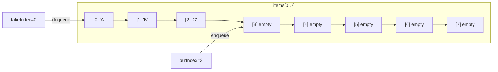
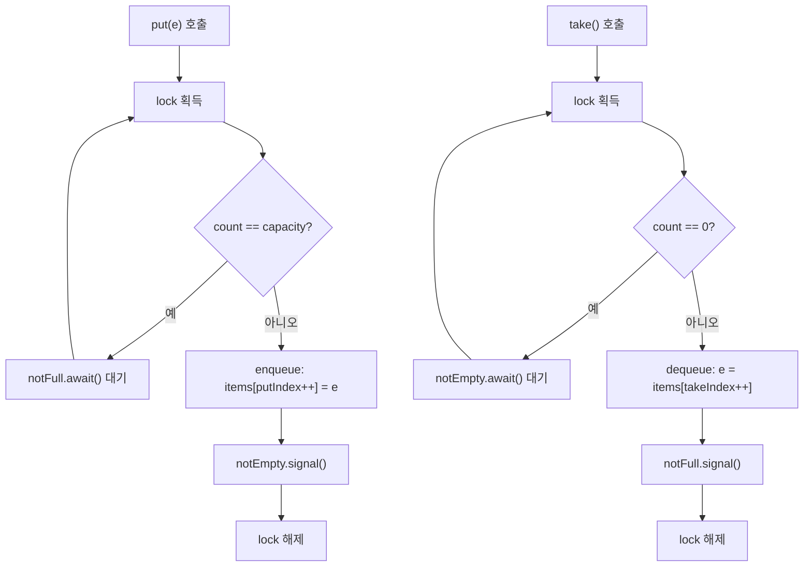

## 정의

**`java.util.concurrent.ArrayBlockingQueue<E>`** 는 **고정 크기 원형 배열** 기반의 [[java-blocking-queue|BlockingQueue]]. 생성 시 capacity 를 지정해야 하고 그 이상 늘어나지 않는다.

내부에 **단일 [[java-reentrant-lock|ReentrantLock]]** 을 사용 (head/tail 공유). 동시 throughput 은 [[java-linkedblockingqueue|LinkedBlockingQueue]] 보다 낮을 수 있지만 메모리 사용량이 예측 가능하고 GC 압력이 작다.

## 사용 상황

- **백프레셔(backpressure)** 가 필요한 생산자-소비자 패턴: 큐가 가득 차면 생산자가 자동으로 block
- **메모리 한도** 가 명확히 정해진 경우: 슬롯 수 = capacity 로 미리 확정
- **공정성(fairness)** 이 중요한 상황: `new ArrayBlockingQueue<>(n, true)` 로 FIFO 보장
- 작은 capacity (수십~수백): [[java-linkedblockingqueue|LinkedBlockingQueue]] 대비 GC 압력 절감

## 내부 구조

```java
public class ArrayBlockingQueue<E> ... {
    final Object[] items;          // 원형 배열
    int takeIndex;                  // head
    int putIndex;                   // tail (next slot)
    int count;
    final ReentrantLock lock;
    private final Condition notEmpty;
    private final Condition notFull;
}
```

`notEmpty`, `notFull` 두 [[java-reentrant-lock|ReentrantLock]] `Condition` 을 사용. take 가 비어 있으면 notEmpty 에서 대기, put 이 가득 차면 notFull 에서 대기.

## 시각화: 원형 배열 순환



take 은 `takeIndex` 위치에서 꺼내고, put 은 `putIndex` 위치에 넣는다. 두 포인터 모두 `capacity` 로 wrap-around.

## 동작 흐름



## 핵심 메서드 정리

| 메서드 | 동작 | 예외 / 반환 |
|:---|:---|:---|
| `put(e)` | 블록 (가득 차면 대기) | `InterruptedException` |
| `take()` | 블록 (비어 있으면 대기) | `InterruptedException` |
| `offer(e)` | 즉시 시도, 실패 시 false | 예외 없음 |
| `offer(e, t, u)` | 타임아웃 대기 | `InterruptedException` |
| `poll()` | 즉시 시도, 비어 있으면 null | 예외 없음 |
| `poll(t, u)` | 타임아웃 대기 | `InterruptedException` |
| `peek()` | head 확인 (꺼내지 않음) | null 가능 |

```java
BlockingQueue<String> q = new ArrayBlockingQueue<>(4);

// 타임아웃 offer: 100ms 안에 못 넣으면 false
boolean ok = q.offer("item", 100, TimeUnit.MILLISECONDS);

// 타임아웃 poll: 200ms 안에 못 꺼내면 null
String val = q.poll(200, TimeUnit.MILLISECONDS);
```

## 복잡도

| 작업 | 시간 |
|:---|:---:|
| `put`, `take` | O(1) |
| `offer`, `poll`, `peek` | O(1) |
| `contains`, `remove(Object)` | O(n) |
| 순회 | O(n), weakly consistent |

## 실전 코드: bounded 생산자-소비자

```java
// Java 17+ : record for immutability
record Task(String name, int priority) {}

BlockingQueue<Task> queue = new ArrayBlockingQueue<>(100);

// 생산자: 큐가 가득 차면 자동 block -> backpressure
Thread producer = Thread.ofVirtual().start(() -> {
    try {
        for (int i = 0; i < 1000; i++) {
            queue.put(new Task("task-" + i, i % 5));
        }
        queue.put(new Task("POISON", -1));   // 종료 신호
    } catch (InterruptedException e) {
        Thread.currentThread().interrupt();
    }
});

// 소비자: 비어 있으면 자동 block
Thread consumer = Thread.ofVirtual().start(() -> {
    try {
        while (true) {
            Task t = queue.take();
            if (t.priority() < 0) break;     // POISON 감지
            process(t);
        }
    } catch (InterruptedException e) {
        Thread.currentThread().interrupt();
    }
});
```

## 공정성 옵션

```java
// fair=true: FIFO 순서로 lock 경쟁 (writer starvation 방지)
BlockingQueue<String> fair = new ArrayBlockingQueue<>(50, true);
```

> [!IMPORTANT]
> 공정 모드는 처리량이 크게 떨어진다. starvation 이 실제 문제로 관찰된 경우에만 활성화.

## ArrayBlockingQueue vs LinkedBlockingQueue

| 항목 | ArrayBlockingQueue | [[java-linkedblockingqueue|LinkedBlockingQueue]] |
|:---|:---|:---|
| 크기 | **항상 bounded** | optionally bounded |
| 백킹 | 원형 배열 | linked list |
| 락 | **단일** ReentrantLock | takeLock + putLock 분리 |
| 동시 throughput | 낮음 (락 경합) | 높음 |
| 메모리 / 원소 | 슬롯 1개 | 노드 객체 1개 |
| GC 압력 | 작음 (배열 고정) | 큼 (노드 생성/소멸) |
| 공정성 옵션 | ✓ | ✗ |

> [!IMPORTANT]
> 메모리 예측이 중요한 환경, 또는 capacity 가 작은 경우 ArrayBlockingQueue 가 자연스럽다. 대량 throughput 이 필요하면 LinkedBlockingQueue.

## 함정

### 1. capacity 를 너무 크게 잡기

capacity 를 과도하게 크게 잡으면 backpressure 효과가 사라진다. 생산자가 한없이 쌓을 수 있어 OOM 으로 이어질 수 있다. 적절한 capacity 는 소비자의 처리 속도 × 수용 가능한 지연 으로 추정.

### 2. `offer()` 결과 무시

```java
queue.offer(item);   // ❌ 큐가 가득 찬 경우 false 반환, 데이터 유실
if (!queue.offer(item)) {
    log.warn("큐 포화: {}", item);   // ✓ 처리해야 함
}
```

### 3. `contains()` / `remove(Object)` 는 O(n)

선형 탐색이다. 빈번하게 호출하면 성능 저하. 존재 여부 빠른 조회가 필요하면 별도 `Set` 유지.

> [!WARNING]
> 순회 도중 큐를 수정하면 `ConcurrentModificationException` 이 아니라 **weakly consistent** 보장으로 일부 원소가 보이거나 안 보일 수 있다.

## Thread Pool 연동: 작업 큐로 활용

`ThreadPoolExecutor` 는 생성자에 `BlockingQueue<Runnable>` 을 받는다. ArrayBlockingQueue 를 주면 큐가 가득 찰 때 RejectedExecutionHandler 가 호출된다.

```java
// 최대 4스레드, 큐 최대 20개, 초과 시 호출자 스레드에서 실행
ThreadPoolExecutor executor = new ThreadPoolExecutor(
    2,                                            // corePoolSize
    4,                                            // maxPoolSize
    60, TimeUnit.SECONDS,                         // keepAliveTime
    new ArrayBlockingQueue<>(20),                 // bounded queue
    new ThreadPoolExecutor.CallerRunsPolicy()     // reject policy
);

executor.submit(() -> process(task));
// 큐 가득 + 스레드 maxPoolSize 도달 시:
//   CallerRunsPolicy -> 제출한 스레드가 직접 실행 (자연스러운 backpressure)
```

## 멀티 Producer-Consumer 패턴

```java
// Java 21 virtual threads + ArrayBlockingQueue
int CAPACITY = 50;
BlockingQueue<String> queue = new ArrayBlockingQueue<>(CAPACITY);
String POISON = "__DONE__";

// 3개 생산자
for (int i = 0; i < 3; i++) {
    final int pid = i;
    Thread.ofVirtual().start(() -> {
        try {
            for (int j = 0; j < 100; j++) {
                queue.put("P" + pid + "-" + j);
            }
        } catch (InterruptedException e) {
            Thread.currentThread().interrupt();
        }
    });
}

// 2개 소비자 + poison pill 종료
for (int i = 0; i < 2; i++) {
    Thread.ofVirtual().start(() -> {
        try {
            while (true) {
                String item = queue.take();
                if (POISON.equals(item)) {
                    queue.put(POISON);   // 남은 소비자에게 전달
                    break;
                }
                process(item);
            }
        } catch (InterruptedException e) {
            Thread.currentThread().interrupt();
        }
    });
}

// 생산자 종료 후 poison 투입
queue.put(POISON);
```

## 관련 위키

- [[java-blocking-queue|BlockingQueue]]
- [[java-linkedblockingqueue|LinkedBlockingQueue]]
- [[java-priorityblockingqueue|PriorityBlockingQueue]]
- [[java-synchronousqueue|SynchronousQueue]]
- [[java-reentrant-lock|ReentrantLock]]
- [[java-delayqueue|DelayQueue]]
- [[java-semaphore|Semaphore]]
