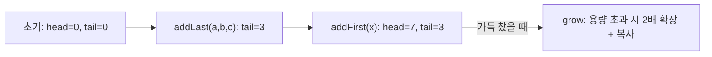

## 정의

**`java.util.ArrayDeque<E>`** 는 **원형 배열 (circular buffer)** 기반의 [[Deque]] 구현. JDK 1.6 도입.

`Stack` 으로 쓰면 `java.util.Stack` 보다 빠르고, `Queue` 로 쓰면 [[LinkedList]] 보다 빠르다. **Stack / Queue / Deque 가 필요할 때 거의 항상 첫 번째 선택**.

## 사용 상황

| 상황 | 권장 |
|:---|:---|
| LIFO 스택 (재귀 대신 반복 DFS) | `push` / `pop` |
| FIFO 큐 (BFS, 작업 처리) | `offer` / `poll` |
| 양방향 삽입/삭제 (슬라이딩 윈도우) | `offerFirst` / `pollLast` |
| 괄호/수식 파싱 | 스택으로 활용 |
| 단조 덱 (Monotone Deque) | 슬라이딩 윈도우 최댓값 |

null 이 필요하거나 인덱스 기반 접근이 필요하면 [[LinkedList]] 또는 [[ArrayList]].

## 시각화

```anim:java-arraydeque-circular
{}
```

## 원형 배열 동작



`head` 와 `tail` 은 같은 방향으로 이동하되, 끝에 도달하면 0 으로 되돌아온다.
인덱스 계산: `(head - 1 + length) % length` (addFirst), `tail % length` (addLast).

## 내부 구조

```java
public class ArrayDeque<E> extends AbstractCollection<E>
    implements Deque<E>, Cloneable, Serializable {

    transient Object[] elements;       // 백킹 배열
    transient int head;                // head 인덱스
    transient int tail;                // tail 인덱스 (next slot)
}
```

```text
초기 (size 8):  [_ _ _ _ _ _ _ _]
                 ↑head=tail=0

addLast: a, b, c
        [a b c _ _ _ _ _]
         ↑head    ↑tail=3

addFirst: x
        [a b c _ _ _ _ x]
                        ↑head=7  tail=3

수정된 인덱스 = (i + length) % length
```

가득 차면 배열 크기를 2 배로 grow 하고 원소를 새 배열로 복사.

## 복잡도

| 작업 | 시간 |
|:---|:---:|
| `addFirst`, `addLast` | **amortized O(1)** |
| `removeFirst`, `removeLast` | **O(1)** |
| `peek*`, `getFirst`, `getLast` | O(1) |
| `contains`, `remove(Object)` | O(n) |
| 임의 인덱스 접근 | 불가 (List 가 아니므로) |

`amortized` 인 이유는 가득 찼을 때 2 배 grow + copy 비용 때문. 평균은 O(1).

## LinkedList vs ArrayDeque

| 항목 | LinkedList | ArrayDeque |
|:---|:---|:---|
| 백킹 | linked nodes | 원형 배열 |
| 메모리 / 원소 | 노드 헤더 + 두 포인터 (~32B) | 슬롯 1 개 (4-8B) |
| 캐시 친화 | ✗ | ✓ |
| addFirst / addLast | O(1) | amortized O(1) |
| null 허용 | ✓ | ✗ |
| List 가능 | ✓ (인덱스 O(n)) | ✗ |
| Deque 가능 | ✓ | ✓ |
| 실측 속도 | 느림 | **빠름** |

null 거부와 List 미구현이 단점이지만, 그 외에는 모든 면에서 [[LinkedList]] 보다 우월.

## Stack 사용 예

```java
Deque<Integer> stack = new ArrayDeque<>();
stack.push(1);              // head 쪽에 push
stack.push(2);
stack.push(3);
stack.peek();               // 3
stack.pop();                // 3

// DFS: 재귀 대신 반복으로
Deque<Integer> dfs = new ArrayDeque<>();
dfs.push(startNode);
while (!dfs.isEmpty()) {
    int node = dfs.pop();
    for (int next : graph[node]) {
        if (!visited[next]) {
            visited[next] = true;
            dfs.push(next);
        }
    }
}
```

`Deque<E> stack = new ArrayDeque<>()` 패턴이 [[Vector]] 기반 `Stack<E>` 보다 두세 배 빠르다.

## Queue 사용 예 (BFS)

```java
Queue<Integer> bfs = new ArrayDeque<>();
bfs.offer(startNode);
visited[startNode] = true;

while (!bfs.isEmpty()) {
    int node = bfs.poll();
    for (int next : graph[node]) {
        if (!visited[next]) {
            visited[next] = true;
            bfs.offer(next);
        }
    }
}
```

## Deque 사용 예: 슬라이딩 윈도우 최댓값

```java
// 크기 k 의 슬라이딩 윈도우에서 최댓값 배열 구하기 (단조 감소 덱)
int[] nums = {1, 3, -1, -3, 5, 3, 6, 7};
int k = 3;
int[] result = new int[nums.length - k + 1];

Deque<Integer> dq = new ArrayDeque<>();  // 인덱스 저장 (단조 감소)
for (int i = 0; i < nums.length; i++) {
    // 윈도우 범위 벗어난 front 제거
    if (!dq.isEmpty() && dq.peekFirst() < i - k + 1) {
        dq.pollFirst();
    }
    // 현재 원소보다 작은 rear 제거 (단조 유지)
    while (!dq.isEmpty() && nums[dq.peekLast()] <= nums[i]) {
        dq.pollLast();
    }
    dq.offerLast(i);
    if (i >= k - 1) {
        result[i - k + 1] = nums[dq.peekFirst()];
    }
}
// result: [3, 3, 5, 5, 6, 7]  O(n) 시간
```

## Deque 인터페이스 주요 API

| 조작 | head (앞) | tail (뒤) |
|:---|:---|:---|
| 추가 | `addFirst(e)` / `offerFirst(e)` | `addLast(e)` / `offerLast(e)` |
| 제거 (예외) | `removeFirst()` | `removeLast()` |
| 제거 (null) | `pollFirst()` | `pollLast()` |
| 조회 (예외) | `getFirst()` | `getLast()` |
| 조회 (null) | `peekFirst()` | `peekLast()` |

스택 메서드 `push` / `pop` / `peek` 은 각각 `addFirst` / `removeFirst` / `peekFirst` 의 alias.
큐 메서드 `offer` / `poll` / `peek` 은 `addLast` / `removeFirst` / `peekFirst` 의 alias.

## 괄호 검사 (스택 활용 예)

```java
boolean isBalanced(String s) {
    Deque<Character> stack = new ArrayDeque<>();
    for (char c : s.toCharArray()) {
        if (c == '(' || c == '[' || c == '{') {
            stack.push(c);
        } else if (c == ')' || c == ']' || c == '}') {
            if (stack.isEmpty()) return false;
            char top = stack.pop();
            if ((c == ')' && top != '(') ||
                (c == ']' && top != '[') ||
                (c == '}' && top != '{')) return false;
        }
    }
    return stack.isEmpty();
}
```

## 함정

### 1. null 비허용

```java
Deque<String> dq = new ArrayDeque<>();
dq.add(null);    // NullPointerException
```

이유: `poll` / `peek` 이 null 을 "비어 있음" 신호로 쓰는 의미와 충돌.

### 2. thread-safe 가 아님

[[ConcurrentLinkedDeque]] 또는 `LinkedBlockingDeque` 사용.

### 3. iterator 는 [[fail-fast iterator]]

순회 중 수정 시 CME.

### 4. push/pop vs offer/poll 혼용 주의

```java
Deque<Integer> dq = new ArrayDeque<>();
dq.push(1); dq.push(2); dq.push(3);  // 스택: [3, 2, 1] (head 쪽)
dq.poll();    // 3 (스택 top)
dq.offer(4);  // tail 쪽에 추가: [2, 1, 4]
```

> [!WARNING]
> `push` 는 head 쪽에 넣고 (`addFirst`), `offer` 는 tail 쪽에 넣는다 (`addLast`). 스택과 큐를 혼용하면 원소 순서가 뒤섞인다. 한 Deque 를 스택 또는 큐 **하나의 역할** 로만 쓴다.

## 참고

- [[Queue]]
- [[Deque]]
- [[LinkedList]]
- [[ConcurrentLinkedDeque]]
- [[fail-fast iterator]]
- [[ArrayList]]
- [[Vector]]
