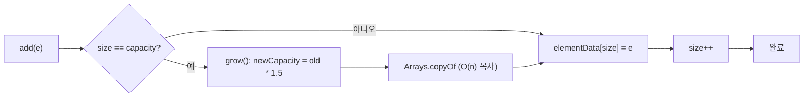

## 정의

**`java.util.ArrayList`** 는 **동적 배열 (dynamic array)** 로 구현된 [[List]]. 내부적으로 `Object[]` 를 들고 다니며, 용량이 부족해지면 새 배열로 옮긴다.

Java 의 가장 흔한 컬렉션 구현체. 인덱스 기반 접근이 압도적으로 빠르고, 캐시 친화적이라 LinkedList 보다 실측이 빠른 경우가 대부분이다.

## 시각화

```anim:java-arraylist-ops
{}
```

## 내부 구조

```java
public class ArrayList<E> extends AbstractList<E> implements List<E>, ... {
    transient Object[] elementData;   // 백킹 배열
    private int size;                 // 실제 원소 수
    private static final int DEFAULT_CAPACITY = 10;
}
```

세 개의 핵심 변수.

- **`elementData`**: 실제 데이터가 들어있는 배열. 길이가 곧 capacity.
- **`size`**: 사용 중인 슬롯 수. `size <= elementData.length` 가 항상 성립.
- **`DEFAULT_CAPACITY`**: 첫 add 시 할당되는 초기 크기 (10).

### 빈 ArrayList 의 lazy 초기화

```java
List<Integer> list = new ArrayList<>();  // elementData = {}, 빈 배열
list.add(1);                              // 이 순간 처음으로 길이 10 배열 할당
```

`new ArrayList<>()` 만 호출했을 때는 실제 배열을 만들지 않는다. 첫 add 에서 비로소 길이 10 의 배열이 잡힌다. **메모리 절약을 위한 lazy 전략.**

## 용량 확장 (`grow()`)

`size == elementData.length` 인 상태에서 add 가 호출되면 새 배열을 만들고 옮긴다.

```java
private Object[] grow(int minCapacity) {
    int oldCapacity = elementData.length;
    int newCapacity = ArraysSupport.newLength(
        oldCapacity,
        minCapacity - oldCapacity,    // 최소 증가량
        oldCapacity >> 1              // 선호 증가량 = 50%
    );
    return elementData = Arrays.copyOf(elementData, newCapacity);
}
```

**기본 정책: 1.5 배** (`oldCapacity + oldCapacity >> 1`). 즉 10 → 15 → 22 → 33 → 49 → 73 → ...

> [!IMPORTANT]
> 미리 크기를 알면 **`new ArrayList<>(initialCapacity)`** 로 생성. 매 `grow()` 마다 `Arrays.copyOf` (= O(n) 복사) 가 발생하므로, 큰 데이터를 채울 때 차이가 크다.

## 배열 확장 흐름



`grow()` 는 amortized O(1) 을 보장하기 위해 **1.5배** 씩 늘린다. 매번 정확히 1씩 늘리면 n 번 add 에 O(n^2) 비용이 발생하지만, 1.5배 전략은 O(n) 총 복사 비용으로 수렴한다.

## 주요 연산 비용

| 메서드 | 시간 복잡도 | 설명 |
|:---|:---:|:---|
| `get(int i)` | **O(1)** | `elementData[i]` 직접 접근 |
| `set(int i, E e)` | **O(1)** | 인덱스 자리만 교체 |
| `add(E e)` | **amortized O(1)** | size 슬롯에 대입, capacity 부족하면 1.5x 확장 |
| `add(int i, E e)` | **O(n)** | i 이후 원소를 모두 한 칸씩 오른쪽으로 shift |
| `remove(int i)` | **O(n)** | i 이후 원소를 모두 왼쪽으로 shift |
| `remove(Object o)` | **O(n)** | indexOf 검색 + shift |
| `contains(Object o)` | **O(n)** | 선형 검색 |
| `indexOf(Object o)` | **O(n)** | 선형 검색 |
| `size()`, `isEmpty()` | **O(1)** | size 필드 |

### amortized O(1) 의 의미

매 add 가 O(1) 이 아니라 **평균적으로** O(1) 이라는 뜻. n 개 원소를 추가하는 비용을 따져보면:

```text
용량 확장 비용 합 = 1 + 1.5 + 2.25 + ... ≈ 3n (등비급수 합 ≤ n / (1-1.5/2.25) ≈ 3n)
총 비용 = n (단순 대입) + 3n (확장) ≈ 4n
평균 = O(1)
```

## ensureCapacity 와 addAll 최적화

대량 데이터를 추가하기 전에 미리 용량을 확보하면 `grow()` 호출 횟수를 줄일 수 있다.

```java
List<String> list = new ArrayList<>();
list.ensureCapacity(100_000);   // 한 번에 100,000 슬롯 확보

for (int i = 0; i < 100_000; i++) {
    list.add("item" + i);       // grow() 호출 없음
}
```

`addAll(Collection)` 은 내부적으로 `toArray()` 후 `System.arraycopy` 를 한 번만 호출한다. 루프로 `add()` 를 반복하는 것보다 빠르다.

```java
List<String> dest = new ArrayList<>(src.size());
dest.addAll(src);   // System.arraycopy 1회 = O(n) 단순 복사
```

## iterator 의 modCount 메커니즘

`ArrayList` 는 `AbstractList.modCount` 필드로 구조적 변경 횟수를 추적한다.

```java
// ArrayList 내부 (단순화)
public boolean add(E e) {
    modCount++;          // 구조 변경 시 증가
    elementData[size++] = e;
    return true;
}

// Itr (내부 iterator 클래스)
int expectedModCount = modCount;   // iterator 생성 시 스냅샷

public E next() {
    if (modCount != expectedModCount)
        throw new ConcurrentModificationException();
    return (E) elementData[cursor++];
}
```

`modCount != expectedModCount` 이면 즉시 [[ConcurrentModificationException]]. 단일 스레드에서도 순회 중 `add`/`remove` 를 호출하면 발생한다.

```java
// 순회 중 안전한 제거: iterator.remove() 사용
Iterator<String> it = list.iterator();
while (it.hasNext()) {
    if (it.next().startsWith("x")) {
        it.remove();   // modCount 동기화, CME 없음
    }
}

// Java 8+: removeIf
list.removeIf(s -> s.startsWith("x"));
```

## 함정

### 1. `remove(int)` vs `remove(Object)` 모호성

`List<Integer>` 에 대해서는 둘이 다른 의미.

```java
List<Integer> list = new ArrayList<>(List.of(10, 20, 30));
list.remove(1);                  // 인덱스 1 의 원소 제거 → [10, 30]
list.remove(Integer.valueOf(1)); // 값 1 을 찾아서 제거 → 변화 없음 (1 이 없음)
```

오토박싱이 위 둘을 헷갈리게 만든다. 명시적으로 `Integer.valueOf(x)` 를 권장.

### 2. [[fail-fast iterator]]

```java
List<Integer> list = new ArrayList<>(List.of(1, 2, 3));
for (Integer x : list) {
    list.add(4);  // ConcurrentModificationException
}
```

iterator 의 `expectedModCount` 가 `ArrayList.modCount` 와 다르면 즉시 예외. 단일 스레드여도 발생.

### 3. `subList()` 는 뷰일 뿐

```java
List<Integer> list = new ArrayList<>(List.of(1, 2, 3, 4, 5));
List<Integer> sub = list.subList(1, 4);  // [2, 3, 4]
sub.set(0, 99);                          // sub = [99, 3, 4]
// list 는?
System.out.println(list);                // [1, 99, 3, 4, 5] ← 원본도 바뀐다
```

독립 사본이 필요하면 `new ArrayList<>(sub)`.

### 4. thread-safe 가 아니다

여러 스레드가 동시에 수정하면 데이터 손상, 무한 루프, `ArrayIndexOutOfBoundsException` 가 발생할 수 있다. 동시성이 필요하면 [[CopyOnWriteArrayList]] 또는 `Collections.synchronizedList`.

### 5. 대용량 후 trimToSize 미호출

```java
ArrayList<Integer> list = new ArrayList<>(1_000_000);
// 데이터 채운 후 대부분 제거
list.subList(100, 1_000_000).clear();
// elementData 는 여전히 1,000,000 슬롯 점유
list.trimToSize();   // elementData = new Object[100]
```

## 메모리 사용량

- 객체 헤더 (~16B) + `Object[]` 참조 (4-8B) + `size` (4B) + `modCount` (4B) → 약 32-40B
- **`elementData`**: capacity 만큼의 참조 슬롯 (4-8B × capacity)
- 비어있는 슬롯 `(capacity - size)` 도 메모리 차지. `trimToSize()` 로 회수 가능.

```java
ArrayList<Integer> list = new ArrayList<>(1000);
list.add(1); list.add(2);  // 998 슬롯이 null 로 낭비됨
list.trimToSize();          // elementData = new Object[2]
```

## Vector 와의 비교

[[Vector]] 는 `ArrayList` 의 레거시 전신. 모든 메서드에 `synchronized` 가 붙어 있다.

| 항목 | ArrayList | Vector |
|:---|:---|:---|
| 동기화 | ✗ | ✓ (메서드별 synchronized) |
| 확장 정책 | 1.5배 | 2배 (기본) |
| 도입 | JDK 1.2 | JDK 1.0 (legacy) |
| 성능 | 빠름 | 느림 (락 오버헤드) |
| 권장 | ✓ | ✗ (레거시) |

`Vector` 의 synchronized 는 **메서드 단위** 락이라 복합 연산 (check-then-act) 의 원자성을 보장하지 않는다. 동시성이 필요하면 [[CopyOnWriteArrayList]] 또는 `Collections.synchronizedList(new ArrayList<>())` 를 사용하되, 후자도 복합 연산은 외부 동기화 필요.

## 직렬화

`elementData` 는 `transient` 로 선언돼 기본 직렬화에서 제외된다. 대신 `writeObject` / `readObject` 를 직접 구현해 **실제 원소만** 직렬화한다.

```java
// ArrayList 내부 (단순화)
private void writeObject(ObjectOutputStream s) throws IOException {
    s.defaultWriteObject();
    s.writeInt(size);
    for (int i = 0; i < size; i++)
        s.writeObject(elementData[i]);   // capacity 가 아닌 size 만큼만
}
```

이 덕분에 capacity 가 1000 이어도 size 가 2 라면 직렬화 크기는 2 원소 분량.

## 언제 ArrayList 가 답인가

- **인덱스 접근이 자주 일어남** (랜덤 read)
- **끝에 추가가 대부분** (스택, 누적 버퍼)
- **이미 정렬돼서 보관**, 이진 탐색 (`Collections.binarySearch`)
- **단일 스레드 또는 외부 동기화**

## 언제 다른 구현이 더 나은가

- **앞/중간 삽입·삭제가 빈번 + 인덱스 접근 거의 없음** → [[LinkedList]] (드물게)
- **수정이 거의 없는 공유 데이터** → [[CopyOnWriteArrayList]]
- **불변** → `List.of(...)` / `List.copyOf(...)`

## 실전 패턴

### 빌더 패턴 (누적 후 불변 변환)

```java
// Java 17+
List<String> builder = new ArrayList<>();
builder.add("a");
builder.add("b");
builder.add("c");
List<String> immutable = List.copyOf(builder);   // 불변 뷰
```

### 배치 처리 (청크 분할)

```java
<T> List<List<T>> partition(List<T> list, int size) {
    List<List<T>> result = new ArrayList<>();
    for (int i = 0; i < list.size(); i += size) {
        result.add(new ArrayList<>(list.subList(i, Math.min(i + size, list.size()))));
    }
    return result;
}
```

### 정렬 후 이진 탐색

```java
List<Integer> sorted = new ArrayList<>(data);
Collections.sort(sorted);                          // TimSort, O(n log n)
int idx = Collections.binarySearch(sorted, 42);   // O(log n)
```

## 관련 위키

- [[Object]]
- [[Iterable]]
- [[Collection]]
- [[List]]
- [[LinkedList]]
- [[Vector]]
- [[CopyOnWriteArrayList]]
- [[fail-fast iterator]]
- [[ConcurrentModificationException]]
- Joshua Bloch, *Effective Java* (3rd ed.), Item 28
