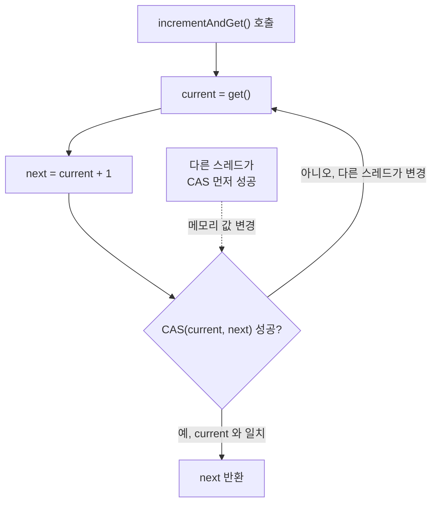

## 정의

**`java.util.concurrent.atomic.AtomicInteger`** 는 **lock-free 로 원자성을 보장** 하는 `int` 래퍼. 내부적으로 **CAS (Compare-And-Swap)** 를 사용해 락 없이 atomic 한 read-modify-write 를 수행.

`volatile int i; i++;` 가 thread-safe 가 아닌 이유 (read + increment + write 세 단계) 를 해결한다. JDK 1.5 (Java SE 5.0) 에 `java.util.concurrent.atomic` 패키지와 함께 도입.

## 사용 상황

| 상황 | 예시 |
|:---|:---|
| 공유 카운터 | 요청 수, 오류 수 등 멀티스레드 집계 |
| 시퀀스 생성 | unique ID, 트랜잭션 번호 |
| 상태 전이 | 단일 int 로 표현 가능한 상태 머신 |
| 락 없는 flag | 초기화 완료 여부 (0/1) |

단, **여러 변수 간의 복합 불변식** (예: 잔액 + 거래 이력의 일관성) 은 AtomicInteger 하나로 보장 불가. 이때는 [[ReentrantLock]] 또는 `synchronized`.

## 시각화

```anim:java-atomic-cas
{}
```

## 핵심 메서드

```java
AtomicInteger a = new AtomicInteger(0);

// 기본 읽기/쓰기
a.get();                           // 현재 값 (volatile read)
a.set(10);                         // 값 설정 (volatile write)
a.lazySet(10);                     // 비동기 설정 (정렬 보장 없음, GC용)

// 원자 증감
a.incrementAndGet();               // ++a, atomic
a.getAndIncrement();               // a++, 증가 전 값 반환
a.decrementAndGet();               // --a
a.getAndDecrement();               // a--, 감소 전 값 반환
a.addAndGet(5);                    // a += 5, 새 값 반환
a.getAndAdd(5);                    // a += 5, 이전 값 반환

// CAS
a.compareAndSet(10, 99);           // 현재 10 이면 99 로, 성공 여부 반환
// Java 9+
a.compareAndExchange(10, 99);      // 현재 값 반환 (성공하면 old, 실패하면 current)

// Java 8+: 람다 기반
a.updateAndGet(x -> x * 2);       // f(현재값) 으로 갱신, 새 값 반환
a.getAndUpdate(x -> x * 2);       // f(현재값) 으로 갱신, 이전 값 반환
a.accumulateAndGet(3, Integer::sum);   // 누산기 함수 적용
a.getAndAccumulate(3, Integer::sum);
```

## CAS 원리

```java
public final int incrementAndGet() {
    while (true) {
        int current = get();
        int next = current + 1;
        if (compareAndSet(current, next))   // current 와 일치하면 next 로
            return next;
        // 일치하지 않으면 다른 스레드가 바꾼 것, 재시도
    }
}
```

CPU 명령어 (`LOCK CMPXCHG` on x86) 한 번으로 "비교 후 일치하면 교체" 를 atomic 하게 수행. 락 acquire/release 비용보다 훨씬 작다.

## CAS 루프 흐름



경합이 적을 때는 한 번에 성공. 경합이 많을수록 재시도 루프가 길어진다.

## volatile vs synchronized vs AtomicInteger

| 옵션 | 가시성 | atomic read-modify-write | 락 비용 |
|:---|:---:|:---:|:---:|
| `int i;` | ✗ | ✗ | 없음 |
| `volatile int i;` | ✓ | ✗ (`i++` 안 됨) | 없음 |
| `synchronized` | ✓ | ✓ | 중간 |
| `AtomicInteger` | ✓ | ✓ (CAS) | 매우 작음 (저경합) |

> [!IMPORTANT]
> **단일 변수의 atomic 갱신만 필요하면 AtomicInteger 가 거의 항상 최선.** 여러 변수 간 invariant 보호가 필요하면 [[ReentrantLock]] 또는 `synchronized`.

## 고경합에서의 문제: LongAdder

CAS 는 저경합에서 빠르다. 하지만 **수십 스레드가 같은 AtomicInteger 에 동시 증가** 하면 CAS 실패가 폭주, 성능이 락보다 떨어질 수 있다.

이때 [[LongAdder]] 가 해법. 내부적으로 여러 Cell 에 분산 누적 후 `sum()` 으로 합산. 최종 값이 필요한 시점에만 집계하는 카운터에 최적이다.

```java
// 고경합 카운터: LongAdder 권장
LongAdder counter = new LongAdder();
counter.increment();         // 분산 Cell 에 누적
long total = counter.sum();  // 필요할 때 합산

// vs AtomicLong: 고경합 시 CAS 폭주
AtomicLong atomicCounter = new AtomicLong();
atomicCounter.incrementAndGet();
```

## 사용 예

### 카운터

```java
class RequestCounter {
    private final AtomicInteger total = new AtomicInteger();
    private final AtomicInteger errors = new AtomicInteger();

    public void onRequest()  { total.incrementAndGet(); }
    public void onError()    { errors.incrementAndGet(); }
    public int count()       { return total.get(); }
    public int errorCount()  { return errors.get(); }
    public double errorRate() {
        int t = total.get();
        return t == 0 ? 0.0 : (double) errors.get() / t;
    }
}
```

### 시퀀스 생성

```java
// Java 17+
class IdGenerator {
    private final AtomicInteger seq = new AtomicInteger(0);

    public int nextId() {
        return seq.incrementAndGet();
    }
}
```

### 상태 전이 (CAS)

```java
// Java 17+ 상태 머신 예
sealed interface State permits State.Ready, State.Running, State.Done {}

class Task {
    private static final int READY   = 0;
    private static final int RUNNING = 1;
    private static final int DONE    = 2;

    private final AtomicInteger state = new AtomicInteger(READY);

    public boolean tryStart() {
        return state.compareAndSet(READY, RUNNING);
    }

    public boolean tryFinish() {
        return state.compareAndSet(RUNNING, DONE);
    }

    public boolean isDone() {
        return state.get() == DONE;
    }
}
```

`compareAndSet` 으로 상태 전이를 atomic 하게 수행. 두 스레드가 동시에 `tryStart()` 를 호출해도 하나만 성공.

### Java 9+ compareAndExchange

```java
// compareAndSet: boolean 반환
boolean updated = a.compareAndSet(expected, newVal);

// compareAndExchange: 현재 실제 값 반환 (loop-free CAS 에 편리)
int witness = a.compareAndExchange(expected, newVal);
if (witness == expected) {
    // 성공
} else {
    // 실패, witness 가 실제 현재 값
}
```

## ABA 문제

CAS 의 알려진 한계. A → B → A 로 변한 값을 "안 바뀜" 으로 잘못 판단할 수 있다.

```java
// 1. T1 이 값 A 를 읽음
int v = a.get();   // v = A
// 2. T2 가 A -> B -> A 로 변경
// 3. T1 의 CAS(A, x) 성공, 하지만 이 사이에 두 번 바뀐 사실 모름
```

**정수 단순 증감** 에서는 ABA 가 문제 되지 않는다. ABA 는 **포인터 기반 자료구조** (Lock-free linked list 등) 에서 위험. 해법: `AtomicStampedReference` 가 stamp (버전) 도 같이 비교.

```java
AtomicStampedReference<String> ref =
    new AtomicStampedReference<>("A", 0);

int[] stampHolder = new int[1];
String val = ref.get(stampHolder);
int stamp = stampHolder[0];

// stamp 도 함께 비교
ref.compareAndSet(val, "B", stamp, stamp + 1);
```

## 다른 Atomic 타입

| 타입 | 용도 |
|:---|:---|
| **AtomicInteger** | int 원자 갱신 |
| **AtomicLong** | long |
| **AtomicBoolean** | boolean |
| **[[AtomicReference]]** | 임의 객체 참조 |
| **AtomicIntegerArray** | int 배열 원소 원자 갱신 |
| **AtomicLongArray** | long 배열 |
| **AtomicReferenceArray** | 객체 배열 |
| **[[LongAdder]]** | 고경합 누적 카운터 |
| **DoubleAdder** | double 누적 |
| **LongAccumulator** | 람다 기반 누산기 |

## 함정

### 1. compound 연산은 atomic 하지 않다

```java
AtomicInteger a = new AtomicInteger(0);

// 두 연산 사이에 다른 스레드 개입 가능
if (a.get() < 10) {
    a.incrementAndGet();   // get 과 increment 사이에 다른 스레드가 변경 가능
}

// 올바름: updateAndGet 으로 원자적으로
a.updateAndGet(v -> v < 10 ? v + 1 : v);
```

### 2. int 오버플로 시 조용히 음수로 전환

```java
AtomicInteger max = new AtomicInteger(Integer.MAX_VALUE);
max.incrementAndGet();   // Integer.MIN_VALUE 로 wrap-around
```

long 이 필요하면 `AtomicLong`, 또는 오버플로 불가라면 guard 조건 추가.

### 3. lazySet 은 가시성 보장 없음

```java
a.lazySet(1);   // volatile write 가 아님, 다른 스레드가 보지 못할 수 있음
```

보통 GC 용도 (null 로 레퍼런스 해제) 나 단일 Writer 특수 케이스에만 사용.

## 관련 위키

- [[volatile]]
- [[ReentrantLock]]
- [[AtomicReference]]
- [[LongAdder]]
- Brian Goetz, *Java Concurrency in Practice*, §15 Atomic Variables and Nonblocking Synchronization
