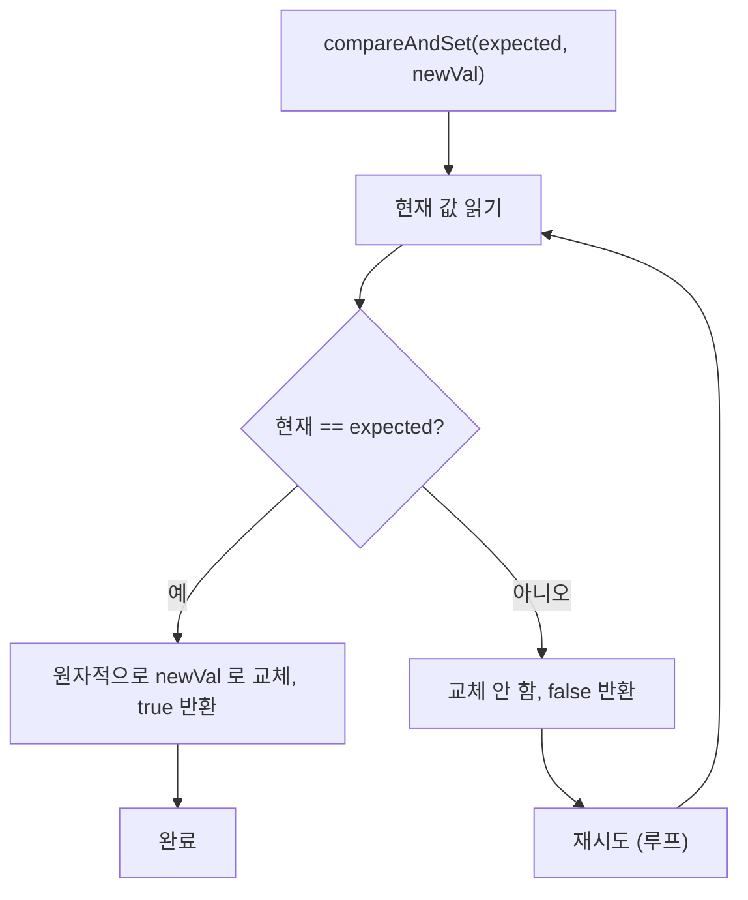
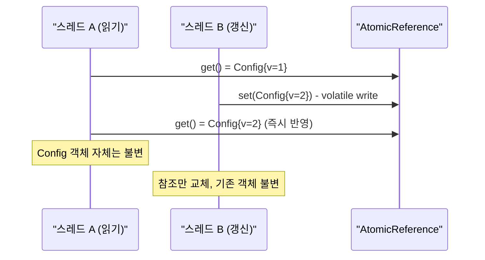

## 정의

**`java.util.concurrent.atomic.AtomicReference<V>`** 는 **객체 참조를 atomic 하게 갱신** 하는 래퍼. `volatile` 참조 + CAS (Compare-And-Swap) 의 결합.

[[AtomicInteger]] 의 객체 버전. 불변 객체 패턴, 상태 머신, lock-free 자료구조의 빌딩 블록.

JDK 1.5 도입. `java.util.concurrent.atomic` 패키지.

## 언제 쓰나

- **불변 객체 원자적 교체**: 설정 객체, 스냅샷 등을 락 없이 교체
- **상태 머신**: 상태 전이를 CAS 로 원자적으로 처리
- **lock-free 자료구조**: 노드 포인터를 CAS 로 갱신
- **단일 객체 캐시**: 최신 값을 여러 스레드가 읽고 하나의 스레드가 갱신
- **초기화 경쟁 방지**: `compareAndSet` 으로 한 번만 초기화 보장

## 시각화: CAS 동작



## 시각화: 불변 객체 교체 패턴



## 핵심 메서드

```java
AtomicReference<Config> ref = new AtomicReference<>(initialConfig);

// 현재 참조 읽기 (volatile read)
Config current = ref.get();

// 단순 설정 (volatile write)
ref.set(newConfig);

// CAS: expected 와 같으면 newVal 로 교체, 성공 시 true
boolean success = ref.compareAndSet(expected, newVal);

// 이전 값 반환 + 새 값으로 설정
Config old = ref.getAndSet(newConfig);

// 람다로 갱신 (CAS 루프 내장, 실패 시 자동 재시도)
Config updated = ref.updateAndGet(c -> c.withVersion(c.version() + 1));

// 인자와 현재 값을 결합해 갱신
ref.accumulateAndGet(delta, (cur, d) -> cur.merge(d));
```

## 가장 흔한 패턴: 불변 객체 교체

```java
import java.util.concurrent.atomic.AtomicReference;
import java.util.function.UnaryOperator;

// Config 는 불변 record
record Config(String host, int port, int timeout) {
    Config withTimeout(int newTimeout) {
        return new Config(host, port, newTimeout);
    }
}

class ConfigHolder {
    private final AtomicReference<Config> ref =
        new AtomicReference<>(new Config("localhost", 8080, 30));

    // lock-free 읽기
    public Config get() {
        return ref.get();
    }

    // 단순 교체 (volatile write)
    public void reload(Config newConfig) {
        ref.set(newConfig);
    }

    // CAS 루프로 안전한 갱신
    public void updateTimeout(int newTimeout) {
        ref.updateAndGet(c -> c.withTimeout(newTimeout));
    }
}
```

`Config` 가 **불변** 이면 한 번 참조한 객체는 변하지 않는다. 새 설정으로 교체할 때 참조만 atomic 하게 바꾸면 안전.

## 내부 구현: VarHandle 기반

```java
public class AtomicReference<V> implements Serializable {
    private static final VarHandle VALUE;

    static {
        try {
            VALUE = MethodHandles.lookup()
                .findVarHandle(AtomicReference.class, "value", Object.class);
        } catch (ReflectiveOperationException e) {
            throw new ExceptionInInitializerError(e);
        }
    }

    private volatile V value;   // volatile: 가시성 보장

    public final boolean compareAndSet(V expectedValue, V newValue) {
        return VALUE.compareAndSet(this, expectedValue, newValue);
        // 내부적으로 CPU 의 CAS 명령어 (x86: CMPXCHG) 사용
    }

    public final V updateAndGet(UnaryOperator<V> updateFunction) {
        V prev = get(), next = null;
        for (boolean haveNext = false;;) {
            if (!haveNext)
                next = updateFunction.apply(prev);
            if (weakCompareAndSetVolatile(prev, next))
                return next;
            haveNext = (prev == (prev = get()));
        }
    }
}
```

- `volatile V value`: JMM 가시성 보장. 한 스레드의 쓰기가 다른 스레드에 즉시 보임.
- `compareAndSet`: CPU 의 CAS 명령어로 원자적 비교-교체. 락 없음.
- `updateAndGet`: CAS 루프. 실패하면 최신 값으로 재시도.

## 사용 사례

### 1. lock-free 단일 객체 swap

```java
private final AtomicReference<Snapshot> snapshot = new AtomicReference<>();

// Writer (단일 스레드 또는 드물게)
snapshot.set(takeSnapshot());

// Reader (여러 스레드, lock-free)
Snapshot s = snapshot.get();
process(s);
```

### 2. 상태 머신

```java
import java.util.concurrent.atomic.AtomicReference;

enum State { READY, RUNNING, STOPPED }

class Service {
    private final AtomicReference<State> state =
        new AtomicReference<>(State.READY);

    // READY -> RUNNING 전이 (한 스레드만 성공)
    public boolean start() {
        return state.compareAndSet(State.READY, State.RUNNING);
    }

    // RUNNING -> STOPPED 전이
    public boolean stop() {
        return state.compareAndSet(State.RUNNING, State.STOPPED);
    }

    public State getState() {
        return state.get();
    }
}
```

### 3. lock-free 자료구조의 노드 포인터

```java
class Node<E> {
    final E value;
    final AtomicReference<Node<E>> next;

    Node(E value) {
        this.value = value;
        this.next = new AtomicReference<>(null);
    }
}

// ConcurrentLinkedQueue 의 내부 패턴
```

[[ConcurrentLinkedQueue]] 의 internal pattern.

## Java 17+ 실전: 초기화 경쟁 방지

```java
import java.util.concurrent.atomic.AtomicReference;

// 비용이 큰 객체를 한 번만 초기화 (lazy init)
class ExpensiveResource {
    private final AtomicReference<Resource> ref = new AtomicReference<>();

    Resource get() {
        Resource existing = ref.get();
        if (existing != null) return existing;

        // 여러 스레드가 동시에 도달할 수 있음
        Resource created = new Resource();   // 비용이 큰 생성
        if (ref.compareAndSet(null, created)) {
            return created;   // 이 스레드가 초기화 성공
        } else {
            created.close();  // 다른 스레드가 먼저 초기화 → 버림
            return ref.get();
        }
    }
}
```

## Java 17+ 실전: 설정 핫 리로드

```java
import java.util.concurrent.atomic.AtomicReference;
import java.util.concurrent.*;

record AppConfig(
    String dbUrl,
    int maxConnections,
    Duration timeout
) {}

class ConfigManager {
    private final AtomicReference<AppConfig> config;
    private final ScheduledExecutorService scheduler =
        Executors.newSingleThreadScheduledExecutor();

    ConfigManager(AppConfig initial) {
        this.config = new AtomicReference<>(initial);
        // 30초마다 설정 리로드
        scheduler.scheduleAtFixedRate(this::reload, 30, 30, TimeUnit.SECONDS);
    }

    // 여러 스레드에서 lock-free 읽기
    public AppConfig current() {
        return config.get();
    }

    private void reload() {
        try {
            AppConfig newConfig = loadFromFile();
            AppConfig old = config.getAndSet(newConfig);
            System.out.println("Config reloaded: " + old + " -> " + newConfig);
        } catch (Exception e) {
            System.err.println("Config reload failed: " + e.getMessage());
        }
    }
}
```

## ABA 문제와 해법

CAS 의 고전적 문제: A -> B -> A 로 변경됐을 때 CAS 가 변경을 감지 못함.

```java
// ABA 시나리오
// 1. 스레드 A: ref.get() = "A"
// 2. 스레드 B: ref.set("B"), ref.set("A")  (A -> B -> A)
// 3. 스레드 A: ref.compareAndSet("A", "C") 성공 (변경 감지 못함)
```

해법:

- **`AtomicStampedReference<V>`**: stamp (int 버전) 추가

```java
import java.util.concurrent.atomic.AtomicStampedReference;

AtomicStampedReference<String> ref =
    new AtomicStampedReference<>("A", 0);

int[] stampHolder = new int[1];
String current = ref.get(stampHolder);   // current="A", stamp=0

// stamp 도 함께 비교 → ABA 감지
boolean success = ref.compareAndSet(
    current, "C",
    stampHolder[0], stampHolder[0] + 1   // stamp 증가
);
```

- **`AtomicMarkableReference<V>`**: boolean mark 추가 (삭제 표시 등)

```java
import java.util.concurrent.atomic.AtomicMarkableReference;

AtomicMarkableReference<Node> ref =
    new AtomicMarkableReference<>(node, false);

// 논리적 삭제 표시
ref.compareAndSet(node, node, false, true);   // mark = true (삭제됨)
```

## AtomicReference vs volatile vs synchronized

| 항목 | `volatile` | `AtomicReference` | `synchronized` |
|:---|:---:|:---:|:---:|
| 가시성 | ✓ | ✓ | ✓ |
| 원자적 복합 연산 | ✗ | ✓ (CAS) | ✓ |
| 락 | 없음 | 없음 (CAS) | 있음 |
| 성능 | 가장 빠름 | 빠름 | 느림 (경합 시) |
| 용도 | 단순 읽기/쓰기 | CAS 필요 | 복잡한 임계 구역 |

## 함정

### 1. updateAndGet 의 람다는 순수 함수여야 함

```java
// 위험: 람다에 부작용 (side effect) 있으면 재시도 시 중복 실행
ref.updateAndGet(c -> {
    log.info("updating");   // CAS 실패 시 여러 번 실행될 수 있음
    return c.withVersion(c.version() + 1);
});

// 올바름: 순수 함수만 사용
ref.updateAndGet(c -> c.withVersion(c.version() + 1));
```

### 2. 가변 객체를 AtomicReference 에 넣으면 의미 없음

```java
// 위험: 참조는 atomic 하게 교체되지만 객체 내부는 보호 안 됨
AtomicReference<List<String>> ref = new AtomicReference<>(new ArrayList<>());
ref.get().add("item");   // 비원자적! 다른 스레드와 경쟁
```

**불변 객체** 를 AtomicReference 에 넣어야 의미가 있다.

### 3. compareAndSet 실패 루프 없이 사용

```java
// 위험: 실패 시 처리 없음
ref.compareAndSet(old, newVal);   // 실패해도 모름

// 올바름: 성공 여부 확인 또는 updateAndGet 사용
if (!ref.compareAndSet(old, newVal)) {
    // 실패 처리
}
// 또는
ref.updateAndGet(v -> computeNew(v));   // 자동 재시도
```

## 관련 위키

- [[AtomicInteger]]
- [[volatile]]
- [[ConcurrentLinkedQueue]]
- [[CopyOnWriteArrayList]]
- [[Collection]]
- [[Object]]
