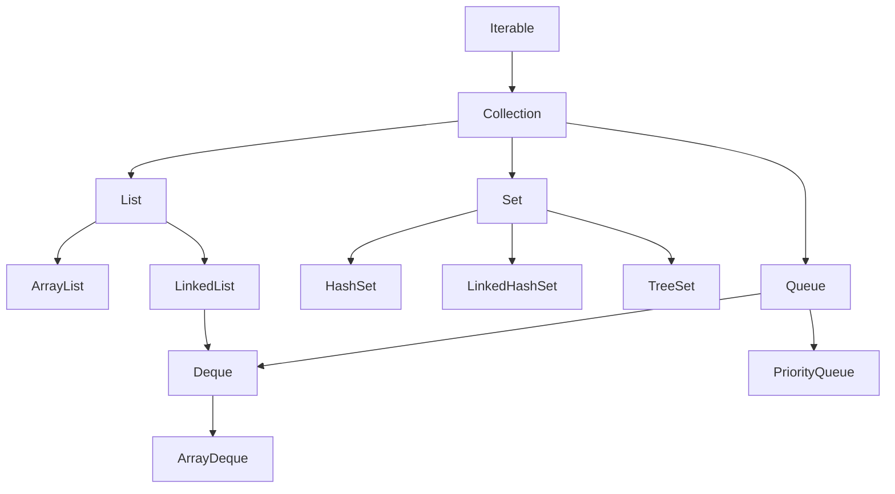

## 정의

**`java.util.Collection<E>`** 는 **그룹으로 묶인 객체들을 표현하는 최상위 인터페이스**. JCF (Java Collections Framework) 의 입구이자, [[List]] / `Set` / `Queue` / `Deque` 모두 이를 확장한다.

`Collection` 자체는 직접 인스턴스화하지 않는다. **하위 인터페이스의 구현체** ([[ArrayList]], `HashSet`, `LinkedList` 등) 만이 실제 객체가 된다.

상속 관계:

```text
Iterable<E>
  └─ Collection<E>
       ├─ List<E>     → ArrayList, LinkedList, Vector, CopyOnWriteArrayList
       ├─ Set<E>      → HashSet, LinkedHashSet, TreeSet, CopyOnWriteArraySet
       ├─ Queue<E>    → PriorityQueue, ArrayDeque, ConcurrentLinkedQueue
       │   └─ Deque<E> → ArrayDeque, LinkedList, ConcurrentLinkedDeque
       └─ (Map 은 Collection 이 아니다, 별도 계층)
```

> [!IMPORTANT]
> **`Map` 은 `Collection` 의 자식이 아니다.** key-value pair 의 모음이라 일반적인 element 모음과 의미가 달라 별도 계층. `Map.entrySet()` / `Map.keySet()` / `Map.values()` 가 `Set`/`Collection` 을 반환해 다리를 놓는다.

## JCF 계층 구조



`Map` 은 이 계층에 속하지 않는다. `Map<K,V>` 하위에 `HashMap`, `TreeMap`, `LinkedHashMap`, `ConcurrentHashMap` 등이 위치한다.

## 핵심 메서드 그룹

### 추가/삭제

- `add(E e)`: 원소 추가, 추가 됐으면 true (Set 이 이미 갖고 있으면 false)
- `remove(Object o)`: 첫 매칭 원소 제거
- `addAll(Collection)`, `removeAll(Collection)`, `retainAll(Collection)`
- `clear()`: 모두 삭제

### 조회

- `contains(Object o)`: 포함 여부
- `containsAll(Collection)`: 모두 포함하는지
- `size()`, `isEmpty()`
- `iterator()`: 순회용 ([[Iterable]] 에서 상속)
- `stream()`, `parallelStream()`: Java 8+ Stream API 입구

### 배열 변환

- `toArray()`: `Object[]` 반환
- `toArray(T[] a)`: 지정 타입 배열 반환
- `toArray(IntFunction<T[]> generator)`: Java 11+, 더 명확

```java
Collection<String> c = List.of("a", "b", "c");

Object[] arr1 = c.toArray();                // Object[]
String[] arr2 = c.toArray(new String[0]);    // String[] (관행: 빈 배열 전달)
String[] arr3 = c.toArray(String[]::new);    // String[] (Java 11+ 권장)
```

## Collection 의 약속과 한계

`Collection` 인터페이스 자체는 **순서, 중복 허용, 동기화** 에 대한 약속이 없다.

| 특성 | Collection | List | Set | Queue |
|:---|:---:|:---:|:---:|:---:|
| 순서 보장 | ✗ | ✓ (인덱스) | 구현 의존 | ✓ (FIFO 등) |
| 중복 허용 | ✗ | ✓ | ✗ | 구현 의존 |
| `get(int)` | ✗ | ✓ | ✗ | ✗ |

따라서 코드에서 변수 타입을 `Collection<E>` 로 받으면 **인덱스 접근, 정렬, 중복 검사 같은 가정을 못 한다**. 함수 매개변수에서 일부러 약한 약속만 쓸 때 유용.

## 자주 쓰이는 구현 한눈에

| 구현 | 하위 인터페이스 | 특징 |
|:---|:---|:---|
| **[[ArrayList]]** | List | 가장 흔한 기본 |
| **[[LinkedList]]** | List, Deque | 양방향 연결 리스트 |
| **[[Vector]]** | List | 레거시 synchronized |
| **[[CopyOnWriteArrayList]]** | List | 읽기 多, 쓰기 少 |
| `HashSet` | Set | 해시 기반, 순서 없음 |
| `LinkedHashSet` | Set | 삽입 순서 유지 |
| `TreeSet` | Set | 정렬 (Comparable / Comparator) |
| `PriorityQueue` | Queue | 힙 기반 |
| `ArrayDeque` | Queue, Deque | 배열 기반 deque (스택보다 빠름) |
| `ConcurrentLinkedQueue` | Queue | 동시성 lock-free |

## Map 은 별도 계층

```text
Map<K,V>
  ├─ HashMap, LinkedHashMap, TreeMap
  ├─ Hashtable (legacy)
  ├─ ConcurrentHashMap
  └─ EnumMap, IdentityHashMap, WeakHashMap
```

`Map` 은 `Collection` 을 extends 하지 않는다. 다만 다음 메서드로 view 를 제공.

```java
Map<String, Integer> map = ...;
Set<String> keys = map.keySet();              // key 만 Set
Collection<Integer> values = map.values();    // value 모음
Set<Map.Entry<String, Integer>> entries = map.entrySet();  // 쌍
```

이 view 들을 통해 `Collection` 인터페이스와 호환된다.

## 컬렉션 view 와 변경 전파

`Map.keySet()`, `subList()`, `Arrays.asList()` 등은 **view** 를 반환. view 에 대한 변경이 원본에 전파된다.

```java
Map<String, Integer> map = new HashMap<>(Map.of("a", 1, "b", 2));
Set<String> keys = map.keySet();
keys.remove("a");                // ← map 에서도 "a" 삭제

List<Integer> view = list.subList(1, 3);
view.set(0, 99);                 // ← list[1] = 99
```

> [!CAUTION]
> view 의 추가/삭제는 원본에 영향을 준다. 독립 사본이 필요하면 `new ArrayList<>(view)`, `new HashSet<>(keys)` 등으로 명시적 복사.

## 불변 컬렉션 (Java 9+)

`List.of()`, `Set.of()`, `Map.of()` 가 추가됐다. 반환되는 컬렉션은:

- **immutable**: add/remove/clear 호출 시 `UnsupportedOperationException`
- **null 거부**: null 원소를 넣으면 `NullPointerException`
- **구조 공유 없음**: 안전한 공유 가능

```java
List<Integer> primes = List.of(2, 3, 5, 7);
Set<String> langs = Set.of("Java", "Kotlin", "Scala");
Map<String, Integer> ages = Map.of("Alice", 30, "Bob", 25);
```

기존 `Collections.unmodifiableList(...)` 보다 권장.

## 동기화 (synchronized) 래퍼

`Collections.synchronizedXxx(...)` 가 모든 메서드를 `synchronized` 로 감싼 래퍼를 반환.

```java
List<Integer> safe = Collections.synchronizedList(new ArrayList<>());
Map<String, Integer> safeMap = Collections.synchronizedMap(new HashMap<>());
Set<Integer> safeSet = Collections.synchronizedSet(new HashSet<>());
```

[[Vector]] 와 비슷한 메서드별 락 패턴. 복합 연산은 외부 동기화 필요.

```java
synchronized (safe) {            // ← 외부 동기화 필수
    for (Integer x : safe) {     // 순회도 락 안에서
        ...
    }
}
```

진짜 동시성에는 [[CopyOnWriteArrayList]], [[ConcurrentHashMap]] 등 동시성 컬렉션 권장.

## Collection 의 함정 정리

### 1. `Collection.removeAll(c)` 비용

```java
list.removeAll(otherList);   // O(n × m), otherList 가 List 면 contains 가 O(m)
list.removeAll(otherSet);    // O(n), Set 의 contains 가 O(1)
```

`removeAll` 의 매개변수는 contains() 가 빠른 컬렉션을 넘기는 게 좋다.

### 2. `Collection.equals` 는 List/Set 별로 다르다

```java
List<Integer> a = List.of(1, 2);
Set<Integer> b = Set.of(1, 2);
a.equals(b);   // false! List.equals 와 Set.equals 의 의미가 다름
```

`Collection` 자체는 `equals` 의미를 명세하지 않음. 하위 인터페이스가 정의.

### 3. raw type 금지

```java
// ❌ Java 5 이전 스타일
Collection c = new ArrayList();
c.add("hello");
c.add(42);     // 컴파일은 됨, 런타임에 ClassCastException

// ✓ generic
Collection<String> c = new ArrayList<>();
```

## 올바른 구현 선택 가이드

| 필요 | 권장 구현 | 이유 |
|:---|:---|:---|
| 인덱스 접근, 순차 탐색 | [[ArrayList]] | 배열 기반, 캐시 친화 |
| 앞뒤 삽입/삭제 | [[LinkedList]] | 양방향 연결 리스트 |
| 중복 없는 집합, 순서 불필요 | `HashSet` | O(1) contains |
| 중복 없는 집합, 삽입 순서 유지 | `LinkedHashSet` | 해시 + 이중 연결 |
| 중복 없는 집합, 정렬 순서 | [[TreeSet]] | Red-Black Tree, O(log n) |
| 우선순위 큐 | [[PriorityQueue]] | Min-heap, O(log n) poll |
| 스택 + 큐 겸용 | [[ArrayDeque]] | 배열 기반 Deque |
| 동시성, 읽기 多 쓰기 少 | [[CopyOnWriteArrayList]] | COW 전략 |
| 동시성, 균형 읽기/쓰기 | [[ConcurrentLinkedQueue]] | lock-free CAS |

> [!TIP]
> 스택이 필요할 때 레거시 `Stack` 클래스 대신 `ArrayDeque` 를 쓰는 것이 공식 권장. `ArrayDeque.push()` / `pop()` 이 스택 시맨틱을 제공하며 synchronized 오버헤드가 없다.

## 반복(iteration) 패턴

### for-each (가장 흔함)

```java
Collection<String> c = List.of("a", "b", "c");
for (String s : c) {
    System.out.println(s);
}
```

### iterator 직접

```java
Iterator<String> it = c.iterator();
while (it.hasNext()) {
    String s = it.next();
    if (shouldRemove(s)) it.remove();   // ← 순회 중 안전한 삭제
}
```

`for-each` 순회 중 컬렉션의 `remove()` 를 직접 호출하면 [[fail-fast iterator]] 가 `ConcurrentModificationException` 을 던진다. `Iterator.remove()` 만이 순회 중 삭제에 안전하다.

### stream

```java
List<String> result = c.stream()
    .filter(s -> s.startsWith("a"))
    .map(String::toUpperCase)
    .collect(Collectors.toList());
```

`parallelStream()` 으로 병렬화 가능. 순서 보장이 필요하면 `forEachOrdered()` 또는 `Collectors.toList()` (순서 보장) 를 사용한다.

### removeIf (Java 8+)

```java
c.removeIf(s -> s.isEmpty());    // iterator.remove() 를 내부적으로 사용
```

외부에서 iterator 를 직접 다루는 것보다 간결하다.

## 참고

- [[Object]]
- [[Iterable]]
- [[List]]
- [[ArrayList]]
- [[LinkedList]]
- [[Vector]]
- [[CopyOnWriteArrayList]]
- [[fail-fast iterator]]
- Joshua Bloch, *Effective Java* (3rd ed.), Items 28-31 (배열보다 리스트, 한정적 와일드카드 등)
