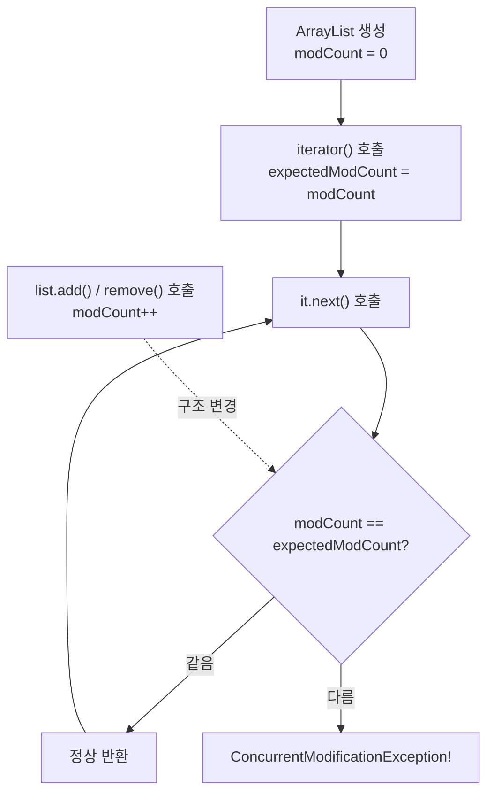
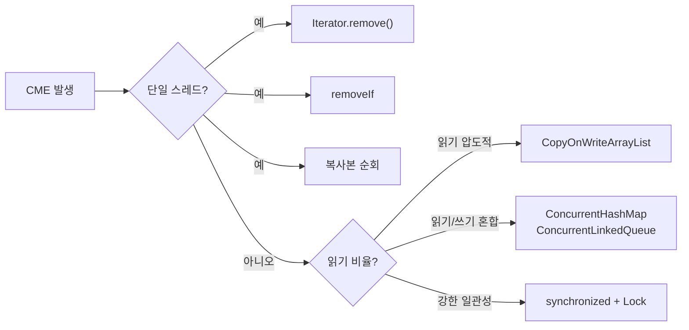

## 정의

**`java.util.ConcurrentModificationException`** (CME) 는 [[java-fail-fast-iterator|fail-fast iterator]] 가 **컬렉션의 구조 변경을 탐지했을 때** 던지는 unchecked 예외 (`RuntimeException`).

이름과 달리 **반드시 동시성 (멀티스레드) 문제일 때만 발생하는 것이 아니다.** 단일 스레드에서도 자기 자신을 잘못 수정하면 발생한다.

`java.util` 의 거의 모든 컬렉션 ([[java-arraylist|ArrayList]], [[java-linkedlist|LinkedList]], [[java-vector|Vector]], `HashMap`, `TreeMap`, `HashSet`, `TreeSet`) 의 iterator 가 던질 수 있다.

## 가장 흔한 두 시나리오

### 1. 순회 중 자기 수정 (단일 스레드)

```java
List<Integer> list = new ArrayList<>(List.of(1, 2, 3, 4, 5));

for (Integer x : list) {           // iterator 사용
    if (x % 2 == 0) {
        list.remove(x);            // ❌ CME 던짐
    }
}
```

`for-each` 는 내부적으로 `iterator()` 를 호출. 그 iterator 가 만들어진 뒤 `list.remove()` 가 `modCount` 를 증가시킨다. 다음 `it.next()` 에서 검사 실패 → CME.

### 2. 멀티스레드 동시 수정

```java
List<Integer> shared = new ArrayList<>();
// Thread A
for (Integer x : shared) { /* 읽기 */ }
// Thread B (동시 실행)
shared.add(99);  // <- Thread A 의 다음 next() 에서 CME
```

이 경우 CME 는 best-effort 신호. CME 가 안 나도 안전한 것은 아니다 (더 무서운 silent corruption 가능).

## modCount 메커니즘

CME 는 `modCount` 라는 내부 카운터로 감지된다.



| 필드 | 위치 | 역할 |
|---|---|---|
| `modCount` | `AbstractList` | 컬렉션이 구조 변경될 때마다 증가 |
| `expectedModCount` | `Itr` (inner class) | iterator 생성 시 복사한 스냅샷 |

`modCount != expectedModCount` 이면 즉시 CME. 이 방식은 정확성을 **보장하지 않고** 최선을 다해 감지 (best-effort detection) 한다. JVM spec 상 CME 가 반드시 던져진다는 보장이 없다.

## 메시지에 없는 정보

CME 의 메시지에는 **누가 수정했는지** 가 적혀 있지 않다.

```
Exception in thread "main" java.util.ConcurrentModificationException
    at java.base/java.util.ArrayList$Itr.checkForComodification(ArrayList.java:1095)
    at java.base/java.util.ArrayList$Itr.next(ArrayList.java:1049)
    at MyApp.main(MyApp.java:23)
```

`Itr.next()` 가 trigger 일 뿐, 진짜 원인은 **그 사이에 일어난 다른 어딘가의 수정**. 디버깅을 위해서는:

1. **iterator 와 같은 스택 위쪽 코드** 부터 살핀다. 같은 메서드 안에 add/remove 가 있는지.
2. **공유 컬렉션이라면 다른 스레드의 호출** 을 추적한다. 보통 lambda, async, scheduled task.
3. **`ArrayList` 등에 디버거를 걸어 `modCount` 변화를 추적** 한다.

## 해결 패턴

### `Iterator.remove()` 사용

```java
Iterator<Integer> it = list.iterator();
while (it.hasNext()) {
    Integer x = it.next();
    if (x % 2 == 0) {
        it.remove();   // ✓ iterator 가 expectedModCount 도 함께 갱신
    }
}
```

`Iterator.remove()` 는 컬렉션의 `remove()` 를 호출한 뒤 `expectedModCount = modCount` 로 동기화한다. 그래서 CME 가 발생하지 않는다.

### `removeIf` 사용 (Java 8+)

```java
list.removeIf(x -> x % 2 == 0);
```

내부적으로 `Iterator.remove()` 와 같은 안전한 방식. 더 짧고 명확.

### 복사본 순회

```java
for (Integer x : new ArrayList<>(list)) {   // 복사본 순회
    if (x % 2 == 0) {
        list.remove(x);                     // ✓ 원본은 수정
    }
}
```

복사 비용을 감수하는 대신 가장 단순한 해결.

### 동시성 컬렉션 사용

진짜 멀티스레드 환경이라면 fail-fast 컬렉션 자체를 피한다.

```java
// 읽기 많음, 쓰기 적음
List<Integer> list = new CopyOnWriteArrayList<>();

// 키-값
Map<String, Integer> map = new ConcurrentHashMap<>();

// 큐
Queue<Task> q = new ConcurrentLinkedQueue<>();
```

이들은 CME 를 던지지 않으면서 동시 수정/순회를 지원한다.

## 해결 패턴 비교



## 잡으면 안 된다

```java
// ❌ 안 좋은 패턴
try {
    for (Integer x : list) {
        if (cond) list.remove(x);
    }
} catch (ConcurrentModificationException e) {
    // 무시
}
```

이 catch 는 **버그를 숨길 뿐**. iterator 가 일관성 없는 상태로 더 진행하지 않은 것은 다행이지만, 그래도 "왜 동시 수정이 일어났는가" 라는 진짜 문제는 그대로다.

> [!IMPORTANT]
> **CME 는 잡지 말고 고쳐라.** "왜 이게 던져졌는가" 라는 질문에서 출발해 코드의 동시성 가정을 다시 본다. CME 가 사라지도록 위의 해결 패턴 중 하나를 적용.

## 자주 만나는 추가 사례

### `Stream.forEach` 도 동일

```java
list.stream().forEach(x -> {
    if (cond) list.remove(x);  // ❌ CME
});
```

내부적으로 iterator 사용. 같은 함정.

### `HashMap` 순회 중 `put`

```java
Map<String, Integer> map = new HashMap<>();
for (var entry : map.entrySet()) {
    map.put("new", 1);   // ❌ CME (key 가 새로 추가되면 구조 변경)
}
```

값만 바꾸는 것 (`entry.setValue(...)`) 은 OK.

### nested loop

```java
for (Integer a : listA) {
    for (Integer b : listB) {
        if (cond) listA.remove(a);  // ❌ outer 의 CME
    }
}
```

자주 놓치는 케이스, outer loop 에 영향.

### Map.compute 로 안전하게 값 갱신

`HashMap` 의 값만 변경할 때는 순회 대신 `compute` / `merge` 를 쓴다.

```java
// ❌ 순회 중 put
for (var entry : scores.entrySet()) {
    scores.put(entry.getKey(), entry.getValue() + 1);
}

// ✓ compute 사용 (구조 변경 없음)
scores.replaceAll((k, v) -> v + 1);

// ✓ 또는 merge
scores.merge("Alice", 1, Integer::sum);
```

## 테스트 방법

CME 는 best-effort 이므로 단위 테스트에서 재현이 불안정할 수 있다. 다음 방법 활용:

```java
@Test
void shouldThrowCMEWhenModifiedDuringIteration() {
    List<Integer> list = new ArrayList<>(List.of(1, 2, 3));
    assertThrows(ConcurrentModificationException.class, () -> {
        for (Integer x : list) {
            list.remove(x);
        }
    });
}
```

멀티스레드 CME 는 `CyclicBarrier` / `CountDownLatch` 로 타이밍을 맞춰 재현한다.

## 참고

- [[java-fail-fast-iterator|fail-fast iterator]]
- [[java-arraylist|ArrayList]]
- [[java-linkedlist|LinkedList]]
- [[java-vector|Vector]]
- [[java-copyonwritearraylist|CopyOnWriteArrayList]]
- [[java-concurrent-hashmap|ConcurrentHashMap]]
- Brian Goetz, *Java Concurrency in Practice*, §5.1.2
