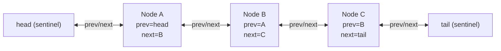
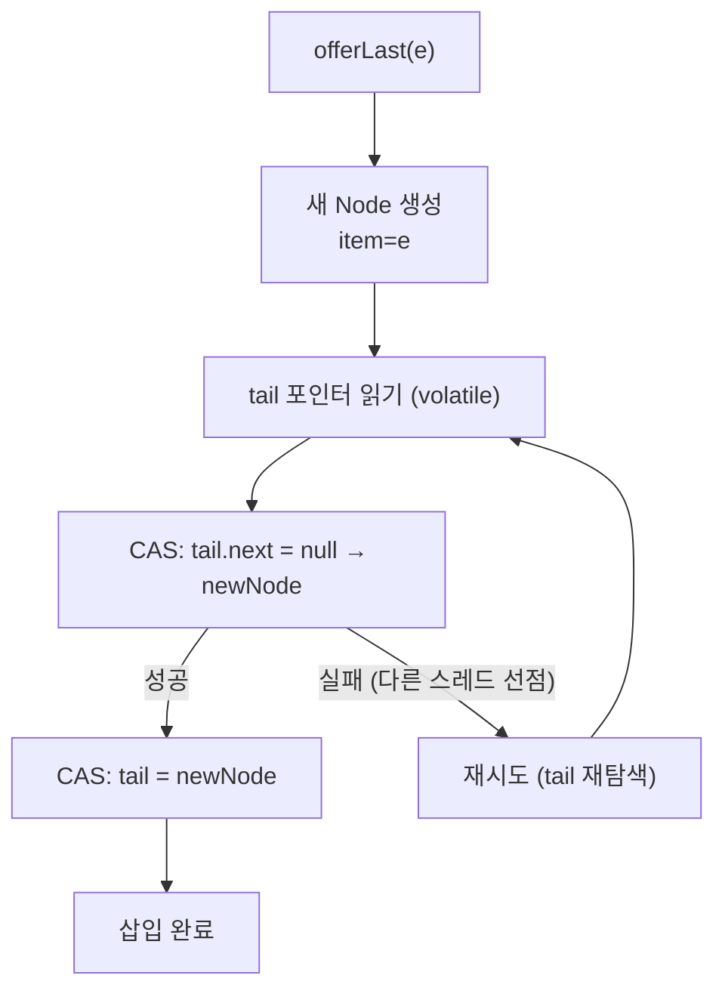

## 정의

**`java.util.concurrent.ConcurrentLinkedDeque<E>`** 는 **lock-free** [[Deque]]. [[ConcurrentLinkedQueue]] 의 양방향 버전. JDK 1.7 추가.

양 끝 모두에서 add/remove 가 가능하며, 모든 연산이 **CAS (Compare-And-Swap)** 기반이라 락 없이 동시성을 보장한다. 내부적으로 이중 연결 리스트를 사용한다.

## 언제 쓰나

- **양 끝에서 동시 작업** 이 일어나는 큐 (예: work-stealing 스레드 풀에서 tail 에 push, head 에서 steal)
- **stack + queue 혼용** 이 필요한 동시성 시나리오
- 블로킹 없이 non-blocking 처리를 우선해야 하는 경우
- `LinkedBlockingDeque` 의 전역 락이 병목이 될 때

## 시각화: 이중 연결 리스트 구조



각 노드는 `prev`, `next` 포인터를 `volatile`로 보유. CAS 로 포인터를 원자적으로 교체한다.

## 시각화: CAS 기반 offerLast 흐름



`CAS` 실패 시 루프를 돌며 재시도. 대기(waiting) 없이 **non-blocking 진행**.

## 내부 구조

```java
public class ConcurrentLinkedDeque<E> extends AbstractCollection<E>
        implements Deque<E>, Serializable {

    // 이중 연결 리스트 노드
    static final class Node<E> {
        volatile Node<E> prev;
        volatile E item;          // null = 삭제된(dead) 노드
        volatile Node<E> next;
    }

    // sentinel 노드 (head/tail 는 실제 데이터 아님)
    private transient volatile Node<E> head;
    private transient volatile Node<E> tail;
}
```

- **item = null 노드**: 논리적 삭제 표시. GC 가 회수하기 전 물리 제거를 미루는 **lazy deletion**.
- **head/tail 는 sentinel**: 경쟁 조건 단순화를 위해 실제 데이터를 담지 않는 dummy 노드.

## 복잡도

| 작업 | 시간 | 동시성 |
|:---|:---:|:---|
| `addFirst`, `addLast`, `offerFirst`, `offerLast` | amortized O(1) | lock-free |
| `pollFirst`, `pollLast`, `removeFirst`, `removeLast` | amortized O(1) | lock-free |
| `peekFirst`, `peekLast` | O(1) | volatile read |
| `size` | **O(n)**, 부정확 | 약함 |
| `contains`, `remove(Object)` | O(n) | lock-free 순회 |
| iterator | O(n) | weakly consistent |

> [!IMPORTANT]
> `size()` 는 **O(n)** 이며 값이 정확하지 않을 수 있다. 동시 수정 중에는 일관된 스냅샷 없이 순회하기 때문. 크기 확인보다 `isEmpty()` 를 선호할 것.

## 사용법

```java
import java.util.concurrent.ConcurrentLinkedDeque;

ConcurrentLinkedDeque<String> deque = new ConcurrentLinkedDeque<>();

// 양 끝 삽입
deque.offerFirst("A");     // 앞에 추가
deque.offerLast("B");      // 뒤에 추가
deque.offerFirst("C");     // 앞에 추가 → [C, A, B]

// 양 끝 제거
String head = deque.pollFirst();   // "C"
String tail = deque.pollLast();    // "B"

// 들여다보기 (제거 안 함)
String peek = deque.peekFirst();   // "A"
```

## Java 17+ 실전: Work-Stealing 패턴

```java
import java.util.concurrent.*;

// 각 스레드가 자신의 작업 deque 를 보유
// tail 에서 자신의 작업 push/pop, head 에서 다른 스레드가 steal
class WorkStealingExample {
    // 워커당 deque
    private final ConcurrentLinkedDeque<Runnable>[] queues;
    private final int nWorkers;

    @SuppressWarnings("unchecked")
    WorkStealingExample(int n) {
        this.nWorkers = n;
        this.queues = new ConcurrentLinkedDeque[n];
        for (int i = 0; i < n; i++) queues[i] = new ConcurrentLinkedDeque<>();
    }

    void submitTask(int workerId, Runnable task) {
        queues[workerId].offerLast(task);   // 자신의 deque tail 에 push
    }

    Runnable nextTask(int workerId) {
        // 자신의 deque tail 에서 먼저 pop
        Runnable task = queues[workerId].pollLast();
        if (task != null) return task;

        // 없으면 다른 스레드 deque head 에서 steal
        for (int i = 0; i < nWorkers; i++) {
            if (i == workerId) continue;
            task = queues[i].pollFirst();   // steal
            if (task != null) return task;
        }
        return null;
    }
}
```

> [!TIP]
> Java 의 `ForkJoinPool` 은 이와 유사한 work-stealing 알고리즘을 내부에서 사용한다. 직접 구현보다 `ForkJoinPool` 을 쓰는 것이 대부분의 경우 더 적합하다.

## Java 17+ 실전: 멀티스레드 로그 버퍼

```java
import java.util.concurrent.ConcurrentLinkedDeque;
import java.util.List;
import java.util.ArrayList;

// 링 버퍼 패턴: 최근 N 개 로그만 유지
class RecentLogBuffer {
    private final ConcurrentLinkedDeque<String> logs = new ConcurrentLinkedDeque<>();
    private final int maxSize;

    RecentLogBuffer(int maxSize) { this.maxSize = maxSize; }

    void append(String entry) {
        logs.offerLast(entry);
        // 초과 시 앞에서 제거
        while (logs.size() > maxSize) {
            logs.pollFirst();
        }
    }

    List<String> snapshot() {
        return new ArrayList<>(logs);   // weakly consistent
    }
}
```

## LinkedBlockingDeque 와 비교

| 항목 | ConcurrentLinkedDeque | LinkedBlockingDeque |
|:---|:---:|:---:|
| 동시성 방식 | lock-free (CAS) | ReentrantLock |
| Blocking 지원 | ✗ (non-blocking) | ✓ (`putFirst`, `takeFirst`) |
| 용량 제한 | 없음 (unbounded) | 선택적 (bounded/unbounded) |
| `size()` 정확도 | 부정확 | 정확 (락 안에서 카운트) |
| GC 부담 | lazy deletion 으로 다소 높음 | 즉각 연결 해제 |
| 적합 상황 | non-blocking 우선 | producer-consumer blocking |

## ConcurrentLinkedQueue 와의 선택

단방향 FIFO 로 충분하다면 `ConcurrentLinkedQueue` 가 더 단순하고 오버헤드가 낮다. **양쪽 끝 연산이 모두 필요할 때만** Deque 를 선택.

| 시나리오 | 권장 |
|:---|:---|
| FIFO 만 필요 | [[ConcurrentLinkedQueue]] |
| 양 끝 add/remove | ConcurrentLinkedDeque |
| Producer-Consumer (blocking 허용) | [[BlockingQueue]] 구현체 |
| Work-stealing 패턴 직접 구현 | ConcurrentLinkedDeque |
| ForkJoin 계열 병렬 처리 | `ForkJoinPool` 내장 사용 |

## 함정

### 1. size() 는 선형 시간

```java
if (deque.size() > 0) {          // O(n), 다른 스레드가 수정 중이면 오차 발생
    deque.pollFirst();
}

// 올바른 패턴
String item = deque.pollFirst();   // null 반환 여부로 비어 있는지 판단
if (item != null) { ... }
```

### 2. iterator 는 약한 일관성 (weakly consistent)

순회 중 다른 스레드가 추가/삭제해도 `ConcurrentModificationException` 을 던지지 않는다. 대신 **순회 시작 당시의 상태를 일부 반영** 하거나 안 할 수도 있다.

### 3. null 삽입 불가

```java
deque.offerLast(null);   // NullPointerException
```

내부적으로 `item == null` 이 삭제된 노드의 표시이므로 null 은 허용하지 않는다.

### 4. 무한 루프 위험 (remove 중 retry)

매우 높은 경합 환경에서 CAS 재시도가 오래 걸릴 수 있다. 극단적 경합에서는 `LinkedBlockingDeque` 의 락 기반 방식이 오히려 공정성(fairness) 을 보장할 수 있다.

## 관련 위키

- [[Deque]]
- [[Queue]]
- [[ConcurrentLinkedQueue]]
- [[BlockingQueue]]
- [[Collection]]
- [[Iterable]]
- [[Object]]
