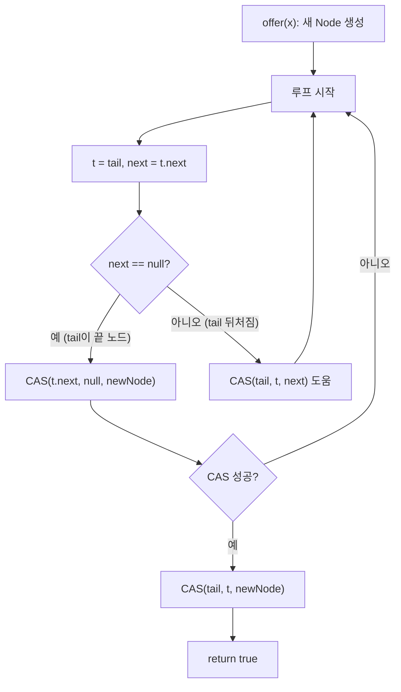

## 정의

**`java.util.concurrent.ConcurrentLinkedQueue<E>`** 는 **lock-free** 로 구현된 unbounded thread-safe [[Queue]]. Michael & Scott 의 non-blocking queue 알고리즘 (1996) 기반.

[[BlockingQueue]] 가 아닌 단순 큐. 큐가 비어 있으면 `poll()` 이 즉시 `null` 반환 (block 하지 않음).

## 시각화

```anim:java-concurrentlinkedqueue-ms
{}
```

## 내부 구조

```java
public class ConcurrentLinkedQueue<E> ... {
    private transient volatile Node<E> head;
    private transient volatile Node<E> tail;

    static final class Node<E> {
        volatile E item;
        volatile Node<E> next;
    }
}
```

`head`, `tail`, `item`, `next` 모두 `volatile`. 모든 갱신이 [[volatile]] write/CAS 로 수행돼 lock-free.

## offer 의 흐름 (Michael & Scott)

```text
offer(x):
  newNode = Node(x)
  loop:
    t = tail
    next = t.next
    if (next == null) {
      // tail 의 next 가 비어있음, 여기에 CAS
      if (CAS(t.next, null, newNode)) {
        CAS(tail, t, newNode)         // tail 이동 (best-effort)
        return
      }
    } else {
      // 다른 스레드가 추가했지만 tail 이 아직 안 옮겨짐
      CAS(tail, t, next)               // 도와서 tail 이동
    }
```

핵심: **tail 이동이 best-effort**, 즉 다른 스레드가 도와서 옮길 수 있다. 따라서 어떤 스레드든 큐의 일관성을 유지.

## poll 의 흐름

```text
poll():
  loop:
    h = head
    next = h.next
    if (next == null) return null     // 비어 있음
    if (CAS(head, h, next)) {
      e = next.item
      next.item = null                // GC 친화
      return e
    }
```

## offer / poll CAS 흐름



`tail` 갱신이 즉시 성공하지 않아도 된다. 다음 `offer()` 를 호출하는 스레드가 `tail` 을 대신 갱신한다. 이 **협력적 tail 이동** 이 MS 알고리즘의 핵심 통찰.

## 복잡도

| 작업 | 시간 | 동시성 |
|:---|:---:|:---|
| `offer(e)` | amortized O(1) | lock-free, CAS 재시도 |
| `poll()` | amortized O(1) | lock-free, CAS 재시도 |
| `peek()` | O(1) | volatile read |
| `size()` | **O(n)** | 약함, 정확하지 않을 수 있음 |
| `contains` | O(n) | 약함 |
| 순회 | O(n) | weakly consistent |

> [!IMPORTANT]
> **`size()` 가 O(n) 이고 부정확하다.** 동시 수정 중에는 정확한 카운트 보장 안 됨. 정확한 개수가 필요하면 외부 카운터.

## BlockingQueue 와의 차이

| 항목 | ConcurrentLinkedQueue | [[BlockingQueue]] (LinkedBlockingQueue 등) |
|:---|:---|:---|
| 비어 있을 때 poll | **즉시 null** | (take 는) block |
| 가득 차 있을 때 offer | (unbounded 라 발생 X) | (put 은) block |
| 락 | lock-free (CAS) | ReentrantLock |
| 백프레셔 | ✗ (unbounded) | ✓ |
| 메모리 보호 | ✗ (OOM 가능) | ✓ (bounded 설정 가능) |

생산자-소비자 같은 패턴에는 **[[BlockingQueue]] 가 보통 더 적합**. CLQ 는 polling 기반 처리, 비어 있을 때 다른 일 하는 패턴에 적합.

## 사용 예

### 작업 큐 (polling)

```java
Queue<Task> queue = new ConcurrentLinkedQueue<>();

// Producer
queue.offer(new Task());

// Consumer (polling)
while (running) {
    Task t = queue.poll();
    if (t == null) {
        Thread.sleep(10);    // 잠시 쉬고 다시
        continue;
    }
    process(t);
}
```

비어 있을 때 즉시 반환되므로 polling 으로 직접 backoff 가능.

## 세 가지 큐 비교

| 항목 | ConcurrentLinkedQueue | [[ArrayBlockingQueue]] | [[LinkedBlockingQueue]] |
|:---|:---|:---|:---|
| 내부 구조 | 연결 리스트 (lock-free) | 원형 배열 (1 lock) | 연결 리스트 (2 lock) |
| 용량 | unbounded | bounded (필수) | bounded or unbounded |
| 블로킹 | ✗ | ✓ (put/take) | ✓ (put/take) |
| GC 압력 | 높음 (노드 생성) | 낮음 (배열 재사용) | 중간 |
| 생산자/소비자 패턴 | polling 전용 | ✓ | ✓ |
| 고처리량 offer/poll | 우수 (경합 적을 때) | 보통 | 우수 |

`ArrayBlockingQueue` 는 고정 용량이지만 배열 재사용으로 GC 부담 최소. `LinkedBlockingQueue` 는 head/tail 별도 락으로 생산자-소비자 분리.

## iterator 는 weakly consistent

`ConcurrentLinkedQueue` 의 iterator 는 `ConcurrentModificationException` 을 던지지 않는다. 순회 시작 시점의 스냅샷이 아니라 **lazy snapshot** 방식.

```java
Queue<String> queue = new ConcurrentLinkedQueue<>(List.of("a", "b", "c"));
Iterator<String> it = queue.iterator();

queue.offer("d");   // 순회 중 추가
queue.poll();       // 순회 중 제거

while (it.hasNext()) {
    System.out.println(it.next());   // "a" 는 보일 수도, 안 보일 수도 있음
}
```

순회 중 일관된 view 가 필요하면 별도 동기화 또는 `new ArrayList<>(queue)` 스냅샷.

## ABA 문제와 GC

**ABA 문제**: `head` 가 A 였다가 B 로 바뀌었다가 다시 A 로 돌아왔을 때, CAS(`head`, A, ...) 가 잘못 성공하는 문제.

`ConcurrentLinkedQueue` 는 **Java GC 가 ABA 를 자동 방지**한다. GC 환경에서는 이미 제거된 노드 객체가 재사용될 수 없으므로 (동일 참조 = 동일 객체 보장), ABA 가 발생하지 않는다. C/C++ 의 lock-free 구현에서 필요한 version tagging, hazard pointer 가 불필요.

## JMM: CAS 와 happens-before

`Unsafe.compareAndSetReference` (혹은 `VarHandle.compareAndSet`) 는 **volatile write** 와 동등한 메모리 펜스를 제공한다.

- `offer()` 로 삽입한 데이터는 해당 CAS 이전에 쓴 모든 값과 happens-before 관계
- `poll()` 로 꺼낸 스레드는 삽입 스레드가 offer 이전에 쓴 모든 값을 볼 수 있음
- 명시적 `synchronized` 나 `volatile` 없이도 **안전한 데이터 전달** 가능

## 실전 패턴

### 이벤트 버스 (단방향 파이프라인)

```java
// Java 17+ record + sealed interface
sealed interface Event permits TaskEvent, ShutdownEvent {}
record TaskEvent(String payload) implements Event {}
record ShutdownEvent() implements Event {}

ConcurrentLinkedQueue<Event> bus = new ConcurrentLinkedQueue<>();

// Producer
bus.offer(new TaskEvent("data"));

// Consumer (별도 스레드)
void consume() {
    while (true) {
        Event e = bus.poll();
        switch (e) {
            case null -> Thread.onSpinWait();         // backoff
            case ShutdownEvent se -> { return; }
            case TaskEvent te -> process(te.payload());
        }
    }
}
```

### 비차단 재시도 로직

```java
ConcurrentLinkedQueue<Result> results = new ConcurrentLinkedQueue<>();

// 여러 스레드가 동시에 결과 적재
threads.forEach(t -> t.start());

// 메인 스레드는 block 없이 폴링
long deadline = System.nanoTime() + TimeUnit.SECONDS.toNanos(10);
while (results.size() < EXPECTED && System.nanoTime() < deadline) {
    Result r = results.poll();
    if (r != null) aggregate(r);
    else Thread.onSpinWait();   // CPU 낭비 최소화 spin hint
}
```

## 함정

### 1. `size()` 를 조건으로 쓰면 안 됨

```java
if (queue.size() > 100) {    // O(n) + 부정확
    throttle();
}
```

`size()` 는 O(n) 탐색이고 동시 수정 중에는 부정확. 별도 `AtomicInteger` 카운터 유지 권장.

### 2. unbounded 로 인한 OOM

생산자가 소비자보다 훨씬 빠르면 큐가 무한히 커진다. 메모리 보호가 필요하면 `LinkedBlockingQueue(capacity)` 등 bounded queue 로 전환.

### 3. 높은 경합 시 CAS 재시도 비용

여러 스레드가 동시에 head/tail 을 CAS 하면 실패 재시도가 늘어 throughput 이 떨어진다. 경합이 극심한 경우 `LinkedTransferQueue` 또는 패딩으로 false sharing 제거를 고려.

### 4. 순회 중 `remove()` 는 O(n)

```java
queue.remove(element);    // 선형 탐색 후 CAS 제거 - O(n)
```

큐 내부에서 특정 원소를 제거하는 연산은 O(n) 비용. 빈번하다면 다른 자료구조를 고려.

## 관련 위키

- [[Object]]
- [[Iterable]]
- [[Collection]]
- [[Queue]]
- [[ConcurrentLinkedDeque]]
- [[BlockingQueue]]
- [[ArrayBlockingQueue]]
- [[LinkedBlockingQueue]]
- [[volatile]]
- [[Non-Blocking]]
- Maged M. Michael & Michael L. Scott, "Simple, Fast, and Practical Non-Blocking and Blocking Concurrent Queue Algorithms" (PODC 1996)
