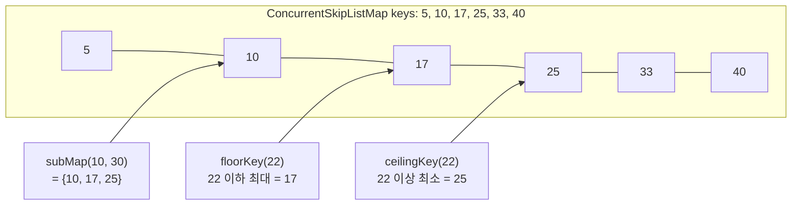

## 정의

**`java.util.concurrent.ConcurrentSkipListMap<K,V>`** 는 **Skip List** 기반의 thread-safe 정렬 [[Map]]. [[TreeMap]] 의 동시성 버전.

[[ConcurrentHashMap]] 과의 결정적 차이: **정렬 순서를 유지** + `ConcurrentNavigableMap` 인터페이스 구현 (`floor`, `ceiling`, `subMap` 등).

Skip List 는 평균 O(log n) 의 균형 트리 대체 자료구조. 락 없이 동시 수정이 가능한 알고리즘이 잘 알려져 있어 동시성 구현에 적합.

JDK 1.6 도입.

## 언제 쓰나

- **정렬 + 동시성**: 여러 스레드가 동시에 읽고 쓰면서 정렬 순서가 필요할 때
- **Range 쿼리 + 동시성**: `subMap`, `headMap`, `tailMap` 으로 범위 조회가 필요할 때
- **시간순 이벤트 로그**: 타임스탬프 기준 정렬, 최근 N 초 이벤트 조회
- **계단식 요금/등급 룩업**: `floorEntry` 로 구간 매핑
- **리더보드**: 점수 기준 정렬, 상위 N 명 조회

## 시각화: Skip List 구조

```mermaid
flowchart TD
    subgraph "Level 3 (sparse)"
        H3["head"] --> N25_3["25"] --> T3["null"]
    end
    subgraph "Level 2"
        H2["head"] --> N10_2["10"] --> N25_2["25"] --> N40_2["40"] --> T2["null"]
    end
    subgraph "Level 1"
        H1["head"] --> N5_1["5"] --> N10_1["10"] --> N17_1["17"] --> N25_1["25"] --> N40_1["40"] --> T1["null"]
    end
    subgraph "Level 0 (base)"
        H0["head"] --> N5_0["5"] --> N10_0["10"] --> N17_0["17"] --> N25_0["25"] --> N33_0["33"] --> N40_0["40"] --> T0["null"]
    end
```



- 각 노드가 확률적으로 여러 레벨에 포함 (1/2 확률로 한 레벨씩 위로)
- 상위 레벨은 "스킵 인덱스" 처럼 작용해 O(log n) 검색
- 새 노드 삽입 시 동전 던지듯 레벨 결정

## 시각화: floor/ceiling/subMap 동작



## 핵심 NavigableMap 메서드

```java
import java.util.concurrent.ConcurrentSkipListMap;
import java.util.concurrent.ConcurrentNavigableMap;

ConcurrentSkipListMap<Integer, String> map = new ConcurrentSkipListMap<>();
map.put(10, "ten");
map.put(25, "twenty-five");
map.put(40, "forty");
map.put(5, "five");

// 경계값 조회
map.firstKey();              // 5 (최솟값)
map.lastKey();               // 40 (최댓값)

// 인접 키 탐색
map.floorKey(22);            // 10 (22 이하 최대)
map.ceilingKey(22);          // 25 (22 이상 최소)
map.lowerKey(25);            // 10 (25 미만 최대)
map.higherKey(25);           // 40 (25 초과 최소)

// 범위 view (live view, 동시 수정 반영)
ConcurrentNavigableMap<Integer, String> sub = map.subMap(10, true, 30, false);
ConcurrentNavigableMap<Integer, String> head = map.headMap(25, false);
ConcurrentNavigableMap<Integer, String> tail = map.tailMap(25, true);

// 역순 view
ConcurrentNavigableMap<Integer, String> desc = map.descendingMap();
```

## 내부 구현: lock-free CAS

```java
// 단순화된 내부 구조
class ConcurrentSkipListMap<K,V> {
    // 각 노드는 여러 레벨의 next 포인터를 가짐
    static final class Node<K,V> {
        final K key;
        volatile Object value;   // volatile: 가시성 보장
        volatile Node<K,V> next; // CAS 대상
    }

    static final class Index<K,V> {
        final Node<K,V> node;
        final Index<K,V> down;   // 아래 레벨
        volatile Index<K,V> right; // CAS 대상
    }
}
```

- **삽입**: CAS 로 노드를 base level 에 추가 후, 확률적으로 상위 레벨 인덱스 추가
- **삭제**: 논리적 삭제 (value 를 null 로 CAS) 후 물리적 제거
- **검색**: 상위 레벨부터 내려오며 스킵, 락 없음

## 복잡도

| 작업 | 평균 | 최악 |
|:---|:---:|:---:|
| `get`, `put`, `remove` | **O(log n)** | O(n) (매우 드뭄) |
| `firstKey`, `lastKey` | O(1) | O(1) |
| `floorKey`, `ceilingKey` | O(log n) | O(n) |
| `subMap` (view 생성) | O(log n) | O(n) |
| 순회 | O(n) | O(n) |
| `size()` | **O(n)** | O(n) |

> [!WARNING]
> `size()` 는 O(n) 이다. 크기를 자주 확인해야 한다면 별도 `AtomicInteger` 카운터를 유지하는 것이 낫다.

## 스레드 안전성

- **완전 lock-free**: 읽기/쓰기 모두 CAS 기반. 락 없음.
- **weakly consistent iterator**: 순회 중 다른 스레드가 수정해도 [[ConcurrentModificationException]] 없음. 단, 수정 내용이 반영될 수도 있고 안 될 수도 있음.
- **원자적 복합 연산**: `putIfAbsent`, `replace`, `remove(key, value)` 모두 원자적.

```java
ConcurrentSkipListMap<String, Integer> scores = new ConcurrentSkipListMap<>();

// 원자적 복합 연산
scores.putIfAbsent("alice", 100);
scores.replace("alice", 100, 150);   // CAS: 100 이면 150 으로
scores.merge("alice", 10, Integer::sum);   // 없으면 10, 있으면 합산
```

## Java 17+ 실전: 시간순 이벤트 로그

```java
import java.util.concurrent.*;
import java.time.Instant;

record Event(String type, String payload) {}

class EventLog {
    private final ConcurrentSkipListMap<Instant, Event> log =
        new ConcurrentSkipListMap<>();

    // 여러 스레드에서 동시에 이벤트 추가
    void record(Event event) {
        log.put(Instant.now(), event);
    }

    // 최근 N 초 이벤트 조회 (live view)
    ConcurrentNavigableMap<Instant, Event> recent(int seconds) {
        return log.tailMap(Instant.now().minusSeconds(seconds));
    }

    // 특정 시간 범위 이벤트
    ConcurrentNavigableMap<Instant, Event> between(Instant from, Instant to) {
        return log.subMap(from, true, to, true);
    }

    // 오래된 이벤트 정리
    void evictBefore(Instant cutoff) {
        log.headMap(cutoff).clear();
    }
}
```

## Java 17+ 실전: 계단식 요금 룩업

```java
import java.util.concurrent.*;

// 동시성 환경에서 계단식 요금 조회
// 0원 이상: 0%, 1000원 이상: 5%, 5000원 이상: 10%, 10000원 이상: 15%
class PricingTable {
    private final ConcurrentSkipListMap<Integer, Integer> table =
        new ConcurrentSkipListMap<>();

    PricingTable() {
        table.put(0,     0);
        table.put(1000,  5);
        table.put(5000,  10);
        table.put(10000, 15);
    }

    int getDiscountRate(int amount) {
        var entry = table.floorEntry(amount);
        return entry != null ? entry.getValue() : 0;
    }

    // 동적으로 요금 구간 추가/수정 (thread-safe)
    void updateRate(int threshold, int rate) {
        table.put(threshold, rate);
    }
}
```

## Java 17+ 실전: 동시성 리더보드

```java
import java.util.concurrent.*;

// 점수 기준 정렬 리더보드 (여러 스레드에서 동시 업데이트)
class Leaderboard {
    // key: 점수 (내림차순), value: 플레이어 이름
    private final ConcurrentSkipListMap<Integer, String> board =
        new ConcurrentSkipListMap<>(java.util.Comparator.reverseOrder());

    void updateScore(String player, int score) {
        // 기존 점수 제거 후 새 점수 추가 (단순화)
        board.put(score, player);
    }

    // 상위 N 명 조회
    List<Map.Entry<Integer, String>> topN(int n) {
        return board.entrySet().stream()
            .limit(n)
            .toList();
    }

    // 특정 점수 이상 플레이어
    ConcurrentNavigableMap<Integer, String> aboveScore(int minScore) {
        return board.headMap(minScore, true);   // 내림차순이므로 headMap
    }
}
```

## ConcurrentHashMap vs ConcurrentSkipListMap

| 항목 | [[ConcurrentHashMap]] | ConcurrentSkipListMap |
|:---|:---:|:---:|
| `get`/`put` 시간 | **O(1) 평균** | O(log n) |
| 순서 | 없음 | **정렬** |
| Range 쿼리 | ✗ | ✓ (`subMap` 등) |
| `floor`/`ceiling` | ✗ | ✓ |
| `size()` | O(1) | **O(n)** |
| 동시성 메커니즘 | CAS + 버킷 sync | lock-free skip list |
| null key/value | ✗ | ✗ |

순서가 중요하지 않으면 [[ConcurrentHashMap]], 정렬/범위 쿼리가 필요하면 ConcurrentSkipListMap.

## 함정

### 1. size() 는 O(n)

```java
// 위험: 루프 안에서 size() 반복 호출
while (map.size() > 0) {   // 매번 O(n) 순회
    map.pollFirstEntry();
}

// 올바름: isEmpty() 사용 (O(1))
while (!map.isEmpty()) {
    map.pollFirstEntry();
}
```

### 2. null key/value 불허

```java
ConcurrentSkipListMap<String, Integer> map = new ConcurrentSkipListMap<>();
map.put(null, 1);    // NullPointerException
map.put("a", null);  // NullPointerException
```

### 3. subMap view 는 live view

```java
ConcurrentNavigableMap<Integer, String> sub = map.subMap(10, 30);
// sub 를 통한 수정은 원본 map 에 반영됨
sub.put(20, "twenty");   // map 에도 추가됨
sub.put(50, "fifty");    // IllegalArgumentException (범위 밖)
```

### 4. weakly consistent iterator

```java
// 순회 중 다른 스레드가 추가한 원소가 보일 수도, 안 보일 수도 있음
for (Map.Entry<Integer, String> e : map.entrySet()) {
    // 다른 스레드가 map.put(99, "x") 해도 CME 없음
    // 단, 99 가 이 순회에서 보일지는 보장 안 됨
}
```

## 관련 위키

- [[Map]]
- [[TreeMap]]
- [[ConcurrentHashMap]]
- [[ConcurrentSkipListSet]]
- [[Collection]]
- [[Iterable]]
- [[Object]]
