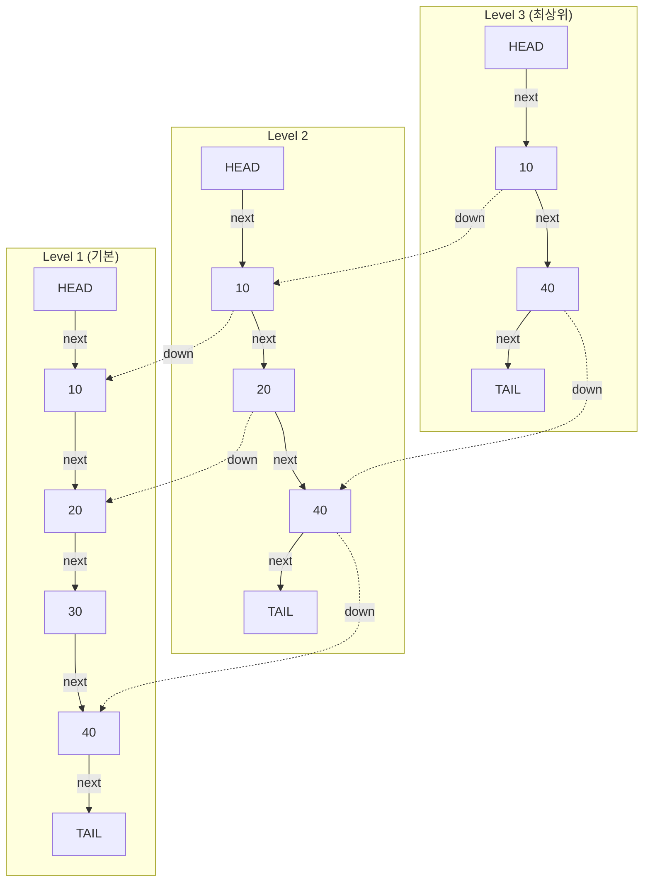
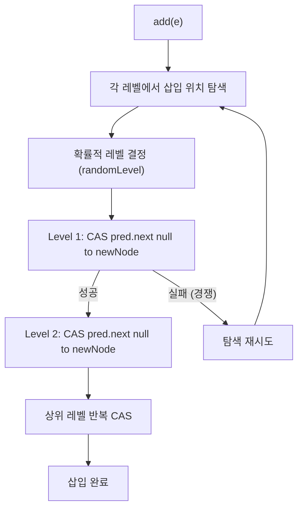

## 정의

**`java.util.concurrent.ConcurrentSkipListSet<E>`** 는 [[ConcurrentSkipListMap]] 을 백킹으로 사용하는 **정렬된 thread-safe [[Set]]**. `NavigableSet` 인터페이스를 구현하며 [[TreeSet]] 의 동시성 버전에 해당한다.

- JDK 1.6 추가
- 내부는 **skip list** (확률적 자료구조) 기반, lock-free 동시성 보장
- `floor`, `ceiling`, `subSet`, `headSet`, `tailSet` 등 범위 쿼리 제공

## 언제 쓰나

- **정렬 순서를 유지하면서 여러 스레드가 동시에 add/remove** 해야 할 때
- **range 쿼리** (e.g., "특정 타임스탬프 범위의 이벤트") 가 동시성 환경에서 필요할 때
- `TreeSet` + 외부 동기화 (`Collections.synchronizedSortedSet`) 의 전역 락이 병목일 때
- 정렬 순서가 필요 없다면 [[ConcurrentHashMap]] 의 `keySet()` 이 더 빠름

## 시각화: Skip List 구조



- **상위 레벨**: 큰 폭으로 건너뛰며 탐색 가속
- **삽입 시**: 확률적으로 레벨을 결정 (`p = 0.5` 면 레벨 k 까지 올라갈 확률 ≈ 0.5^k)
- **탐색**: O(log n) 기대 시간, 레벨을 타고 내려가며 이진 탐색과 유사하게 동작

## 시각화: 동시성 add 흐름 (CAS)



각 레벨의 연결을 CAS 로 원자적으로 교체. 전역 락 없이 세밀한 단위로 경합을 처리한다.

## 복잡도

[[ConcurrentSkipListMap]] 의 성질을 그대로 상속.

| 작업 | 기대 시간 | 최악 |
|:---|:---:|:---:|
| `add`, `remove`, `contains` | O(log n) | O(n) (이론적 최악) |
| `first`, `last`, `floor`, `ceiling` | O(log n) | O(log n) |
| `subSet`, `headSet`, `tailSet` | O(log n) view | - |
| `size` | **O(n)**, 부정확 | - |
| iterator 순회 | O(n), 정렬 순서 | - |

> [!IMPORTANT]
> `size()` 는 **O(n)** 이며 동시 수정 중에는 부정확할 수 있다. 크기 기반 판단보다 `isEmpty()` 또는 `pollFirst()` 반환값으로 판단할 것.

## 핵심 NavigableSet 메서드

```java
import java.util.concurrent.ConcurrentSkipListSet;
import java.util.NavigableSet;

NavigableSet<Integer> set = new ConcurrentSkipListSet<>();
set.add(10); set.add(20); set.add(30); set.add(40);

set.first();             // 10 (최솟값)
set.last();              // 40 (최댓값)

set.floor(25);           // 20 (25 이하 최댓값)
set.ceiling(25);         // 30 (25 이상 최솟값)
set.lower(20);           // 10 (20 미만 최댓값)
set.higher(20);          // 30 (20 초과 최솟값)

set.subSet(10, 30);      // [10, 30) = {10, 20}
set.headSet(30);         // < 30 = {10, 20}
set.tailSet(20);         // >= 20 = {20, 30, 40}

set.pollFirst();         // 10 제거 후 반환 (원자적)
set.pollLast();          // 40 제거 후 반환 (원자적)

NavigableSet<Integer> desc = set.descendingSet();  // 역순 view
```

## Java 17+ 실전: 타임스탬프 기반 이벤트 버퍼

```java
import java.util.concurrent.ConcurrentSkipListSet;
import java.util.Comparator;
import java.time.Instant;

// 이벤트: 타임스탬프 기준 정렬
record Event(Instant ts, String payload) implements Comparable<Event> {
    @Override
    public int compareTo(Event other) {
        int cmp = ts.compareTo(other.ts);
        return cmp != 0 ? cmp : payload.compareTo(other.payload);
    }
}

class EventBuffer {
    private final ConcurrentSkipListSet<Event> buffer = new ConcurrentSkipListSet<>();

    void publish(Event e) {
        buffer.add(e);
    }

    // 특정 시간 이전 이벤트 처리 후 제거
    void drainBefore(Instant cutoff) {
        Event sentinel = new Event(cutoff, "");
        NavigableSet<Event> expired = buffer.headSet(sentinel, false);
        // weakly consistent iterator - 동시 수정 안전
        expired.forEach(e -> {
            if (buffer.remove(e)) {
                process(e);
            }
        });
    }

    private void process(Event e) { /* 처리 로직 */ }
}
```

## Java 17+ 실전: 동시성 순위표 (Leaderboard)

```java
import java.util.concurrent.ConcurrentSkipListSet;
import java.util.Comparator;

record Score(String player, int value) {}

class Leaderboard {
    // 내림차순 (높은 점수 먼저), 동점이면 이름순
    private final ConcurrentSkipListSet<Score> board = new ConcurrentSkipListSet<>(
        Comparator.comparingInt(Score::value).reversed()
                  .thenComparing(Score::player)
    );

    void update(Score score) {
        // 동일 플레이어 기존 점수 제거 후 새 점수 삽입
        board.removeIf(s -> s.player().equals(score.player()));
        board.add(score);
    }

    // 상위 N 명
    java.util.List<Score> topN(int n) {
        java.util.List<Score> result = new java.util.ArrayList<>();
        var it = board.iterator();
        for (int i = 0; i < n && it.hasNext(); i++) result.add(it.next());
        return result;
    }
}
```

## TreeSet vs ConcurrentSkipListSet

| 항목 | TreeSet | ConcurrentSkipListSet |
|:---|:---:|:---:|
| 내부 구조 | Red-Black Tree | Skip List |
| Thread-safe | ✗ | ✓ (lock-free) |
| 동시성 방식 | 없음 (외부 동기화 필요) | CAS per node |
| `add/remove/contains` | O(log n) | O(log n) |
| `size()` 비용 | O(1) | O(n) |
| 정렬 | ✓ (자연 순서 또는 Comparator) | ✓ |
| Range view | ✓ (`subSet` 등) | ✓ |
| null 허용 | ✗ | ✗ |
| 적합 상황 | 단일 스레드 | 멀티스레드 동시 정렬 필요 |

## HashSet / TreeSet / ConcurrentSkipListSet 한눈에

| 항목 | HashSet | TreeSet | ConcurrentSkipListSet |
|:---|:---:|:---:|:---:|
| 시간 | O(1) 평균 | O(log n) | O(log n) |
| 정렬 | ✗ | ✓ | ✓ |
| Thread-safe | ✗ | ✗ | ✓ |
| Range 쿼리 | ✗ | ✓ | ✓ |
| Comparator 지원 | ✗ | ✓ | ✓ |
| null 허용 | ✓ | ✗ | ✗ |

## 함정

### 1. size() 비용과 부정확성

```java
// 잘못: 빈 여부 확인에 size() 사용
if (set.size() == 0) { ... }   // O(n) + 부정확

// 올바름
if (set.isEmpty()) { ... }        // O(1) 에 가까움
```

### 2. null 삽입 불가

```java
set.add(null);   // NullPointerException
```

skip list 내부에서 `null` 이 특별한 sentinel 의미를 가지기 때문.

### 3. Comparator 는 일관성 있어야 함

`Comparator` 가 `equals` 와 일치하지 않으면 `Set` 계약 위반. 동일한 원소를 두 번 추가하거나 `contains` 가 잘못 동작할 수 있다.

```java
// 위험: value 만으로 비교하면 player 가 다른 동점 Score 가 하나로 취급됨
Comparator.comparingInt(Score::value)   // 잘못된 예
```

### 4. view 의 일관성

`subSet`, `headSet`, `tailSet` 반환값은 **live view**. 원본 set 변경이 즉시 반영된다. Weakly consistent 이지만 range 범위 밖 삽입은 예외를 던진다.

```java
NavigableSet<Integer> sub = set.subSet(10, 30);
sub.add(5);   // IllegalArgumentException (범위 밖)
```

## 관련 위키

- [[Set]]
- [[TreeSet]]
- [[ConcurrentSkipListMap]]
- [[ConcurrentHashMap]]
- [[Collection]]
- [[Iterable]]
- [[Object]]
