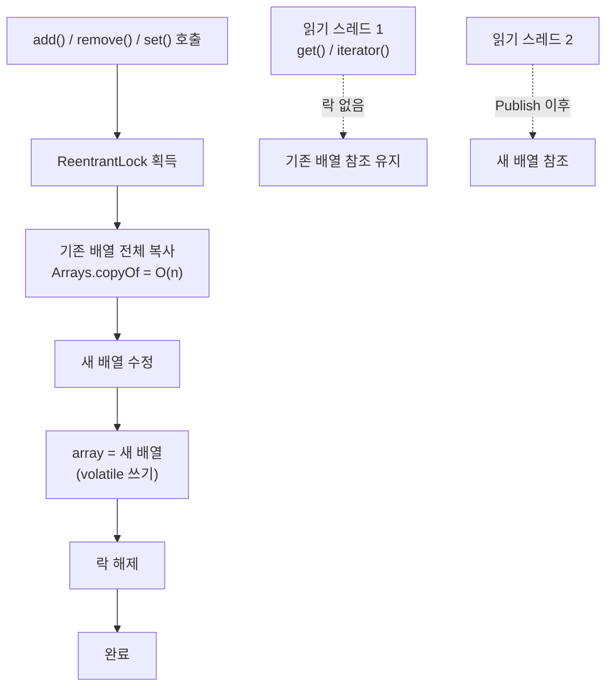
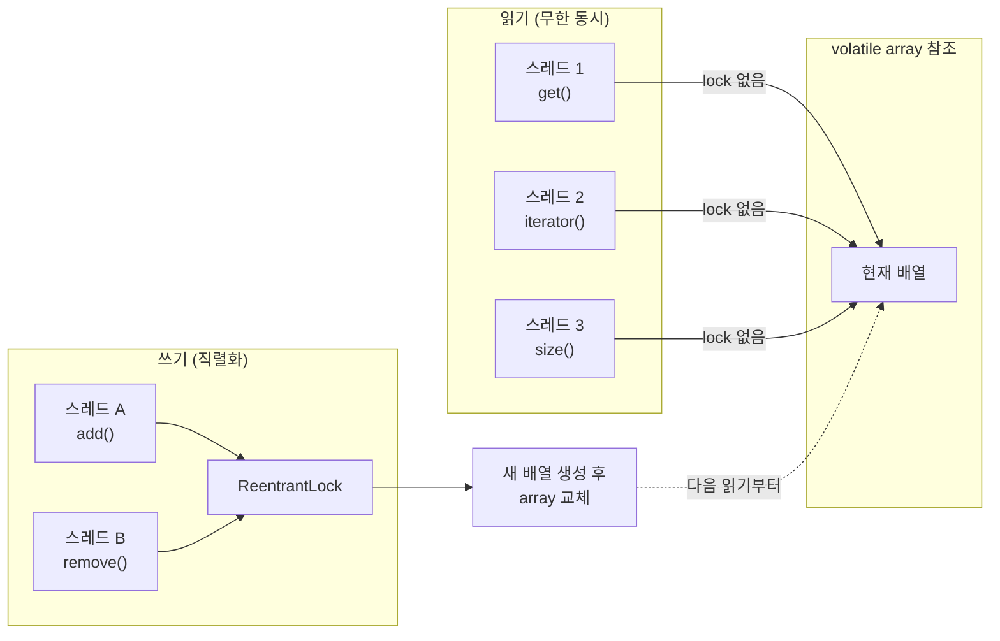

## 정의

**`java.util.concurrent.CopyOnWriteArrayList`** 는 **쓰기 시 배열 전체를 복사** 하는 thread-safe [[List]] 구현. **읽기에는 lock 이 전혀 없고**, 쓰기에는 `ReentrantLock` 으로 직렬화한다.

`java.util.concurrent` (JSR-166) 의 컬렉션. **읽기 압도적 다, 쓰기 거의 없음** 인 시나리오 (예: 이벤트 리스너 목록, 옵저버 패턴, 설정 캐시) 에 가장 적합.

## 사용 상황

| 패턴 | 이유 |
|:---|:---|
| 이벤트 리스너 목록 | 리스너 등록/해제 드묾, 이벤트 발화 빈번 |
| 옵저버 패턴 구독자 목록 | subscribe/unsubscribe 드묾, notify 빈번 |
| 설정 캐시 | 변경 드묾, 읽기 매우 빈번 |
| 순회 중 수정이 필요한 경우 | CME 없이 안전한 순회 보장 |

**쓰기가 잦거나 컬렉션이 크면 절대 사용 금지.** 쓰기마다 O(n) 배열 복사가 발생한다.

## 시각화

```anim:java-cow-arraylist
{}
```

## 내부 구조

```java
public class CopyOnWriteArrayList<E>
    implements List<E>, RandomAccess, Cloneable, java.io.Serializable {

    final transient ReentrantLock lock = new ReentrantLock();
    private transient volatile Object[] array;

    final Object[] getArray() { return array; }
    final void setArray(Object[] a) { array = a; }
}
```

핵심 두 가지.

- **`array` 는 `volatile`**: 한 스레드의 `setArray()` 가 다른 스레드의 `getArray()` 에 즉시 보인다. 별도 락 없이 새 배열 참조가 publish 된다.
- **`lock` 은 쓰기 직렬화용**: 동시에 두 쓰기가 진행되지 않도록만 보장. 읽기에는 관여하지 않는다.

## 읽기: lock 없이

```java
public E get(int index) {
    return elementAt(getArray(), index);
}
```

`getArray()` 로 현재 배열 참조를 한 번 읽고, 그 배열의 인덱스 자리를 반환한다. **lock 도, 동기화 블록도 없다.**

스레드가 100 개라도 모두 자기 CPU 의 캐시로 `volatile` 읽기 1 번을 수행할 뿐. 사실상 [[ArrayList]] 만큼 빠르다.

## 쓰기: 전체 복사

```java
public boolean add(E e) {
    final ReentrantLock lock = this.lock;
    lock.lock();
    try {
        Object[] elements = getArray();
        int len = elements.length;
        Object[] newElements = Arrays.copyOf(elements, len + 1);  // O(n) 복사
        newElements[len] = e;
        setArray(newElements);   // volatile 쓰기로 publish
        return true;
    } finally {
        lock.unlock();
    }
}
```

- **락 획득**: 다른 쓰기를 막는다 (읽기는 그대로 진행 가능)
- **`Arrays.copyOf`**: **전체 배열을 통째로 복사**. O(n) 비용.
- **수정**: 새 배열에 원소 추가
- **`setArray`**: 새 배열 참조로 교체. 이 한 순간에 모든 후속 읽기가 새 배열을 보게 된다.

`remove`, `set` 도 같은 패턴. 모든 쓰기가 **O(n) 복사** 를 동반한다.

## Copy-On-Write 쓰기 흐름



읽기 스레드는 쓰기와 완전히 분리되어 실행된다. `Publish` 시점 이전에 배열을 읽은 스레드는 기존 배열을, 이후는 새 배열을 본다.

## 주요 연산 비용

| 메서드 | 시간 | 락 | 비고 |
|:---|:---:|:---:|:---|
| `get(int i)` | O(1) | 없음 | volatile read 1 번 |
| `size()` | O(1) | 없음 | |
| `iterator()` | O(1) | 없음 | snapshot 반환 |
| `add(E)` | **O(n)** | 쓰기 락 | 배열 전체 복사 |
| `add(int i, E)` | **O(n)** | 쓰기 락 | 복사 + shift |
| `remove(int i)` | **O(n)** | 쓰기 락 | 복사 + shift |
| `set(int i, E)` | **O(n)** | 쓰기 락 | 한 자리만 바뀌어도 복사 |
| `addAll(Collection)` | **O(n + m)** | 쓰기 락 한 번 | 묶어서 처리 |

> [!TIP]
> 여러 원소를 한 번에 추가할 때는 `addAll(...)` 을 쓰자. 각각 `add` 하면 n 회의 전체 복사가 발생하지만, `addAll` 은 한 번의 복사로 끝난다.

## Snapshot Iterator

`CopyOnWriteArrayList` 의 iterator 는 생성 시점의 배열 참조를 그대로 들고 다닌다.

```java
List<String> list = new CopyOnWriteArrayList<>(List.of("A", "B", "C"));

Iterator<String> it = list.iterator();
list.add("D");                      // 새 배열로 교체됨
while (it.hasNext()) {
    System.out.println(it.next());  // A, B, C 만 출력 (D 는 보이지 않음)
}
```

장점:
- **`ConcurrentModificationException` 없음**: 순회 중 다른 스레드가 수정해도 안전
- **순회 중 수정 자유**: 수정 내용은 다음 `iterator()` 부터 반영

단점:
- **`it.remove()`, `it.set(E)`, `it.add(E)` 모두 `UnsupportedOperationException`**: iterator 는 read-only

## 실전 패턴: 이벤트 리스너

```java
// Java 17+
public class EventBus<T> {
    private final CopyOnWriteArrayList<Consumer<T>> listeners =
        new CopyOnWriteArrayList<>();

    public void subscribe(Consumer<T> listener) {
        listeners.add(listener);       // 드물게 호출, O(n) 복사 OK
    }

    public void unsubscribe(Consumer<T> listener) {
        listeners.remove(listener);    // 드물게 호출
    }

    public void publish(T event) {
        // 발화는 빈번, lock 없이 빠르게 순회
        for (Consumer<T> listener : listeners) {
            listener.accept(event);
        }
    }
}
```

`publish` 호출 도중 `unsubscribe` 가 와도 CME 없이 안전하게 처리된다. `unsubscribe` 는 새 배열을 만들어 교체하고, 현재 진행 중인 `publish` 는 기존 배열 스냅샷을 계속 사용.

## 실전 패턴: 옵저버

```java
public class Config {
    private volatile String value = "default";
    private final CopyOnWriteArrayList<Runnable> changeListeners =
        new CopyOnWriteArrayList<>();

    public void addChangeListener(Runnable listener) {
        changeListeners.add(listener);
    }

    public void update(String newValue) {
        this.value = newValue;
        // 변경 이벤트 발화 (순회 중 리스너 추가/제거 안전)
        changeListeners.forEach(Runnable::run);
    }

    public String get() { return value; }
}
```

## 읽기/쓰기 분리 모델



## 메모리 관점

쓰기가 일어날 때마다 **두 배열이 동시에 존재** 한다 (기존 + 새것). GC 가 기존 배열을 회수할 때까지는 메모리 2 배 사용.

또한 진행 중인 iterator 가 기존 배열을 참조하고 있다면 그것도 살아 있어야 한다. 긴 iterator 가 많은 환경에서는 메모리 사용량이 더 늘어날 수 있다.

```java
// 1000 개 원소 리스트에 매초 100 번 add:
// 매초 100 회 복사 = 100_000 개 원소 복사/초 = 잠재적 GC 부담
// 이런 워크로드에서는 CopyOnWriteArrayList 금지
```

> [!IMPORTANT]
> 1000 개 원소 리스트에 매초 100 번 `add` 한다면 CoW 는 **매초 100,000 회 배열 복사 = 10MB+ 메모리 트래픽**. 이런 워크로드에서는 사용 금지.

## 언제 CopyOnWriteArrayList 가 답인가

**읽기 >> 쓰기** 시나리오에서 최적이다.

| 패턴 | 적합도 |
|:---|:---:|
| 이벤트 리스너 목록 (등록 드물고 발화 잦음) | 최적 |
| 옵저버 패턴 구독자 목록 | 최적 |
| 설정 / 메타데이터 캐시 (변경 드묾) | 최적 |
| 읽기 위주의 작은 리스트 | 적합 |
| 쓰기 빈도 적당, 컬렉션이 작음 | 주의 |
| 쓰기 빈도 높음 / 컬렉션 큼 | 부적합 |

## 다른 동시성 List 와의 비교

| 옵션 | 읽기 | 쓰기 | 메모리 | iterator |
|:---|:---:|:---:|:---:|:---|
| **CopyOnWriteArrayList** | lock-free | O(n) 복사 | 쓰기 시 2x | snapshot, CME 없음 |
| **`Collections.synchronizedList(arraylist)`** | 락 | 락 | 동일 | 외부 동기화 필요, fail-fast |
| **[[Vector]]** | 락 | 락 | 동일 | 외부 동기화 필요, fail-fast |
| **`ConcurrentLinkedDeque`** | lock-free | lock-free | 노드 오버헤드 | weakly consistent |

## 함정

### 1. iterator 로 수정 시도

```java
Iterator<String> it = list.iterator();
it.remove();   // UnsupportedOperationException
```

CoW iterator 는 read-only. 수정하려면 `list.remove(...)` 를 직접 호출.

### 2. 쓰기 루프에서의 비용

```java
// 매우 느림: n 회 전체 복사
for (String item : newItems) {
    list.add(item);   // 매번 O(n) 복사
}

// 올바름: 한 번만 복사
list.addAll(newItems);
```

### 3. 배열이 교체되는 타이밍 오해

```java
Iterator<String> it = list.iterator();  // 스냅샷 생성
list.add("X");                           // 새 배열로 교체
// it 는 여전히 이전 배열을 본다
// "X" 는 이 iterator 로 볼 수 없음
```

현재 상태가 필요하면 `list.iterator()` 를 다시 호출해야 한다.

### 4. 크기 기반 최신성

```java
int size = list.size();   // snapshot 시점의 크기
for (int i = 0; i < size; i++) {
    list.get(i);          // 다른 스레드가 remove 했으면 AIOOBE 가능
}

// 올바름: for-each (내부 배열을 고정해 순회)
for (String s : list) { ... }
```

## 관련 위키

- [[Object]]
- [[Iterable]]
- [[Collection]]
- [[List]]
- [[ArrayList]]
- [[Vector]]
- [[ConcurrentHashMap]]
- [[volatile]]
- [[ReentrantLock]]
- [[fail-fast iterator]]
- Brian Goetz, *Java Concurrency in Practice*, §5.2 Copy-on-Write Collections
