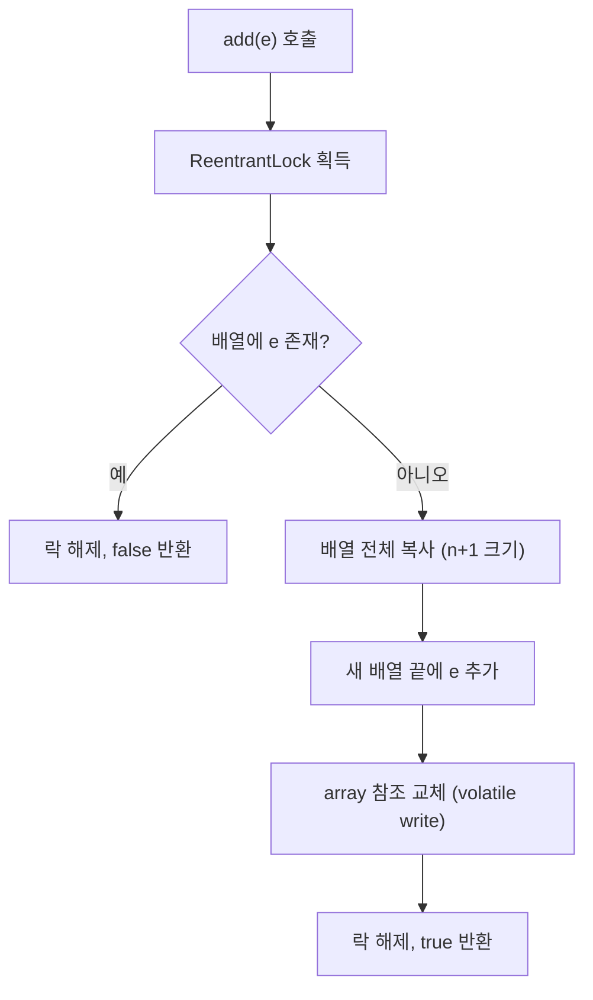
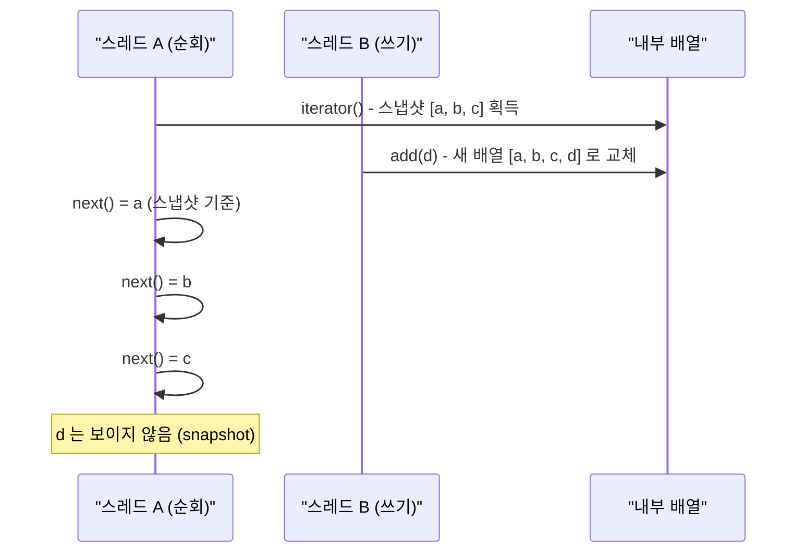

## 정의

**`java.util.concurrent.CopyOnWriteArraySet<E>`** 는 [[CopyOnWriteArrayList]] 를 백킹으로 사용하는 thread-safe [[Set]]. 중복 검사를 위해 매 `add` 마다 선형 검색 (O(n)) 을 수행한다.

[[CopyOnWriteArrayList]] 의 모든 특성을 물려받는다.

- **읽기 lock-free**: `contains`, `iterator` 는 락 없이 동작
- **쓰기 시 전체 복사**: `add`, `remove` 는 내부 배열 전체를 복사한 뒤 교체
- **snapshot iterator**: iterator 생성 시점의 배열 스냅샷을 순회, 이후 변경 반영 안 됨

## 언제 쓰나

- **이벤트 리스너 집합**: 리스너 등록/해제는 드물고, 이벤트 발생 시 전체 순회가 잦을 때
- **옵저버 패턴 구독자 목록**: 구독자 변경보다 알림 발송이 훨씬 많을 때
- **설정/메타데이터 집합**: 애플리케이션 시작 시 한 번 구성, 이후 읽기만
- **원소 수가 수십 이하**: O(n) add 비용이 허용되는 소규모 집합

> [!CAUTION]
> 원소 수가 많거나 쓰기가 빈번하면 **절대 사용하지 말 것**. `add` 가 O(n) + 전체 배열 복사이므로 n 이 커질수록 GC 압박과 지연이 급증한다.

## 시각화: 쓰기 시 복사 흐름



읽기 스레드는 `array` 참조를 `volatile` 로 읽으므로 락 없이 항상 일관된 스냅샷을 본다.

## 시각화: snapshot iterator 동작



## 내부 구조

```java
public class CopyOnWriteArraySet<E> extends AbstractSet<E>
        implements Serializable {

    private final CopyOnWriteArrayList<E> al;

    public CopyOnWriteArraySet() {
        al = new CopyOnWriteArrayList<>();
    }

    public boolean add(E e) {
        return al.addIfAbsent(e);   // 선형 검색 후 없으면 추가
    }

    public boolean contains(Object o) {
        return al.contains(o);      // lock-free 선형 검색
    }

    public boolean remove(Object o) {
        return al.remove(o);        // 락 + 복사
    }

    public Iterator<E> iterator() {
        return al.iterator();       // snapshot iterator
    }
}
```

`CopyOnWriteArrayList.addIfAbsent(e)` 핵심 로직:

```java
// CopyOnWriteArrayList (단순화)
public boolean addIfAbsent(E e) {
    Object[] snapshot = getArray();
    // 스냅샷에 이미 있으면 락 없이 false 반환 (fast path)
    return indexOf(e, snapshot, 0, snapshot.length) < 0
        && addIfAbsent(e, snapshot);
}

private boolean addIfAbsent(E e, Object[] snapshot) {
    final ReentrantLock lock = this.lock;
    lock.lock();
    try {
        Object[] current = getArray();
        int len = current.length;
        if (snapshot != current) {
            // 락 획득 사이에 다른 스레드가 변경 → 재검사
            int common = Math.min(snapshot.length, len);
            for (int i = 0; i < common; i++)
                if (current[i] != snapshot[i] && eq(e, current[i]))
                    return false;
            if (indexOf(e, current, common, len) >= 0)
                return false;
        }
        Object[] newElements = Arrays.copyOf(current, len + 1);
        newElements[len] = e;
        setArray(newElements);   // volatile write
        return true;
    } finally {
        lock.unlock();
    }
}
```

## 복잡도

| 작업 | 시간 | 비고 |
|:---|:---:|:---|
| `add(e)` | **O(n)** | 선형 검색 + 전체 배열 복사 |
| `contains(o)` | O(n) | 선형 검색 (락 없음) |
| `remove(o)` | O(n) | 선형 검색 + 전체 배열 복사 |
| `size()` | O(1) | 배열 길이 |
| 순회 (`iterator`) | O(n) | snapshot 순회 |

## 스레드 안전성

- **읽기 (`contains`, `iterator`, `size`)**: 완전 lock-free. `volatile` 배열 참조를 읽기만 하므로 여러 스레드가 동시에 읽어도 안전.
- **쓰기 (`add`, `remove`)**: `ReentrantLock` 으로 직렬화. 동시에 두 스레드가 `add` 를 호출하면 하나씩 순서대로 처리.
- **iterator 는 [[fail-fast iterator]] 가 아님**: 생성 시점 스냅샷을 순회하므로 순회 중 다른 스레드가 `add`/`remove` 해도 [[ConcurrentModificationException]] 이 발생하지 않는다.

```java
CopyOnWriteArraySet<String> listeners = new CopyOnWriteArraySet<>();

// 순회 중 안전하게 수정 가능 (다른 스레드에서)
for (String listener : listeners) {
    notify(listener);
    // 다른 스레드가 listeners.add("new") 해도 이 순회에는 영향 없음
}
```

## Java 17+ 실전: 이벤트 리스너 관리

```java
import java.util.concurrent.CopyOnWriteArraySet;
import java.util.function.Consumer;

sealed interface AppEvent permits UserLoginEvent, DataChangedEvent {}
record UserLoginEvent(String userId) implements AppEvent {}
record DataChangedEvent(String entity, long id) implements AppEvent {}

class EventBus {
    private final CopyOnWriteArraySet<Consumer<AppEvent>> listeners =
        new CopyOnWriteArraySet<>();

    // 리스너 등록/해제는 드물게 발생
    public void subscribe(Consumer<AppEvent> listener) {
        listeners.add(listener);
    }

    public void unsubscribe(Consumer<AppEvent> listener) {
        listeners.remove(listener);
    }

    // 이벤트 발행은 자주 발생, 순회 중 리스너 변경 안전
    public void publish(AppEvent event) {
        for (Consumer<AppEvent> listener : listeners) {
            try {
                listener.accept(event);
            } catch (Exception e) {
                // 한 리스너 실패가 다른 리스너에 영향 없도록
                System.err.println("Listener error: " + e.getMessage());
            }
        }
    }
}
```

## Java 17+ 실전: 옵저버 패턴

```java
import java.util.concurrent.CopyOnWriteArraySet;

interface StockObserver {
    void onPriceChange(String ticker, double price);
}

class StockTicker {
    private final String ticker;
    private final CopyOnWriteArraySet<StockObserver> observers =
        new CopyOnWriteArraySet<>();
    private volatile double price;

    StockTicker(String ticker) { this.ticker = ticker; }

    public void addObserver(StockObserver o) { observers.add(o); }
    public void removeObserver(StockObserver o) { observers.remove(o); }

    public void updatePrice(double newPrice) {
        this.price = newPrice;
        // 순회 중 observer 추가/제거 가능 (snapshot 순회)
        observers.forEach(o -> o.onPriceChange(ticker, newPrice));
    }
}
```

## 동시성 Set 비교

| 옵션 | `add` | `contains` | `iterator` | 정렬 |
|:---|:---|:---|:---|:---:|
| **CopyOnWriteArraySet** | O(n) + 복사 | O(n) lock-free | snapshot | 삽입 순서 |
| `ConcurrentHashMap.newKeySet()` | O(1) avg | O(1) avg | weakly consistent | ✗ |
| `Collections.synchronizedSet(HashSet)` | O(1) + 락 | O(1) + 락 | fail-fast (외부 동기화 필요) | ✗ |
| [[ConcurrentSkipListSet]] | O(log n) | O(log n) | weakly consistent | 정렬 |

## 함정

### 1. 대용량 집합에 사용

```java
// 위험: 원소가 수천 개면 add 마다 수천 개 배열 복사
CopyOnWriteArraySet<String> bigSet = new CopyOnWriteArraySet<>();
for (int i = 0; i < 10_000; i++) {
    bigSet.add("item" + i);   // 매번 O(n) 검색 + O(n) 복사 → 총 O(n^2)
}

// 올바름: 대용량은 ConcurrentHashMap.newKeySet()
Set<String> bigConcurrent = ConcurrentHashMap.newKeySet();
```

### 2. iterator 결과가 최신이 아닐 수 있음

```java
CopyOnWriteArraySet<String> set = new CopyOnWriteArraySet<>();
set.add("a");
Iterator<String> it = set.iterator();   // 스냅샷: ["a"]
set.add("b");                           // 다른 스레드에서 추가
it.next();   // "a" (스냅샷 기준, "b" 는 보이지 않음)
```

snapshot iterator 는 **약한 일관성 (weakly consistent)** 을 제공한다. 최신 상태가 필요하면 `contains()` 를 직접 호출.

### 3. iterator.remove() 미지원

```java
Iterator<String> it = set.iterator();
it.next();
it.remove();   // UnsupportedOperationException
```

순회 중 제거는 `set.remove(element)` 를 직접 호출해야 한다.

### 4. equals 기반 중복 검사

`add` 시 `equals` 로 중복 판단. `equals`/`hashCode` 를 올바르게 구현하지 않은 객체는 중복이 허용될 수 있다.

```java
// 위험: equals/hashCode 미구현 클래스
class Tag {
    String name;
    Tag(String name) { this.name = name; }
    // equals, hashCode 없음 → 참조 동등성으로 비교
}

CopyOnWriteArraySet<Tag> tags = new CopyOnWriteArraySet<>();
tags.add(new Tag("java"));
tags.add(new Tag("java"));   // 다른 객체 참조 → 중복 허용됨
tags.size();   // 2 (기대: 1)
```

## 관련 위키

- [[Set]]
- [[CopyOnWriteArrayList]]
- [[ConcurrentHashMap]]
- [[ConcurrentSkipListSet]]
- [[Collection]]
- [[Iterable]]
- [[Object]]
- [[fail-fast iterator]]
- [[ConcurrentModificationException]]
