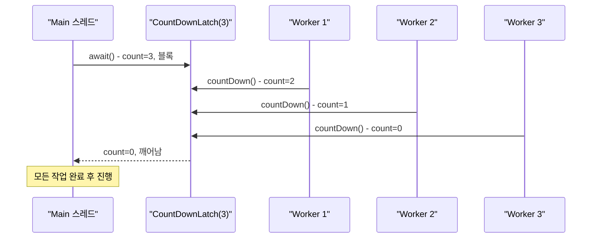
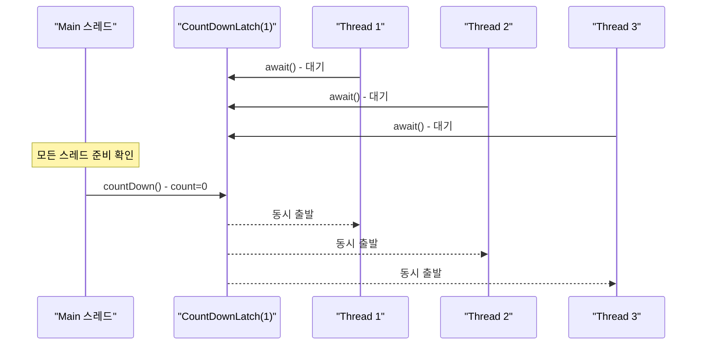

## 정의

**`java.util.concurrent.CountDownLatch`** 는 **한 스레드 또는 여러 스레드가 다른 스레드들의 작업 완료를 기다리는** 일회용 synchronizer.

`N` 으로 초기화하고, 각 worker 가 작업 후 `countDown()` 호출. waiter 는 `await()` 로 count 가 0 이 될 때까지 [[Blocking]]. **0 이 되면 다시 1 로 돌릴 수 없음**, 일회용.

JDK 1.5 도입. `AbstractQueuedSynchronizer` (AQS) 를 기반으로 구현된다.

## 언제 쓰나

- **N 개 작업 완료 대기**: main 스레드가 병렬 작업 전체가 끝날 때까지 기다릴 때
- **시작 신호 (start gate)**: 여러 스레드를 동시에 출발시킬 때 (부하 테스트 등)
- **초기화 완료 대기**: 서비스 시작 전 의존 컴포넌트가 모두 준비될 때까지 대기
- **일회성 이벤트**: 재사용이 필요 없는 단순 동기화 지점

> [!IMPORTANT]
> 재사용이 필요하면 [[CyclicBarrier]] 또는 [[Phaser]] 를 사용. CountDownLatch 는 count 가 0 이 된 후 재설정 불가.

## 시각화: N 개 작업 완료 대기



## 시각화: 시작 신호 (start gate)



## 핵심 메서드

```java
CountDownLatch latch = new CountDownLatch(N);

latch.countDown();                      // count - 1 (0 이하로 내려가지 않음)
latch.await();                          // count == 0 될 때까지 block
boolean done = latch.await(5, TimeUnit.SECONDS);  // timeout 있는 대기
latch.getCount();                       // 현재 count (참고용, 동기화 목적 사용 금지)
```

## 가장 흔한 두 패턴

### 1. main 스레드가 N 개 작업 완료 대기

```java
import java.util.concurrent.*;

int N = 5;
ExecutorService pool = Executors.newFixedThreadPool(N);
CountDownLatch done = new CountDownLatch(N);

for (int i = 0; i < N; i++) {
    final int taskId = i;
    pool.submit(() -> {
        try {
            doWork(taskId);
        } finally {
            done.countDown();   // 반드시 finally: 예외 발생해도 countDown 보장
        }
    });
}

done.await();   // 모든 작업 끝날 때까지 block
pool.shutdown();
System.out.println("all done");
```

### 2. 시작 신호 (start gate)

```java
import java.util.concurrent.*;

int N = 10;
CountDownLatch startGate = new CountDownLatch(1);
CountDownLatch endGate = new CountDownLatch(N);

for (int i = 0; i < N; i++) {
    Thread.ofVirtual().start(() -> {
        try {
            startGate.await();   // start 신호 대기
            run();
        } catch (InterruptedException e) {
            Thread.currentThread().interrupt();
        } finally {
            endGate.countDown();
        }
    });
}

// 모든 스레드가 준비됐을 때 동시 출발
startGate.countDown();
endGate.await();   // 모든 스레드 완료 대기
```

부하 테스트 도구 (JMeter, Gatling 의 ramp-up) 와 비슷한 패턴.

## 내부 구현: AQS 기반

`CountDownLatch` 는 `AbstractQueuedSynchronizer` (AQS) 의 공유 모드를 사용한다.

```java
public class CountDownLatch {
    private static final class Sync extends AbstractQueuedSynchronizer {
        Sync(int count) {
            setState(count);   // AQS state = count
        }

        // tryAcquireShared: state == 0 이면 통과 (1), 아니면 대기 (-1)
        protected int tryAcquireShared(int acquires) {
            return (getState() == 0) ? 1 : -1;
        }

        // tryReleaseShared: CAS 로 state - 1, 0 이 되면 true (대기자 깨움)
        protected boolean tryReleaseShared(int releases) {
            for (;;) {
                int c = getState();
                if (c == 0) return false;
                int nextc = c - 1;
                if (compareAndSetState(c, nextc))
                    return nextc == 0;
            }
        }
    }

    private final Sync sync;

    public CountDownLatch(int count) {
        this.sync = new Sync(count);
    }

    public void await() throws InterruptedException {
        sync.acquireSharedInterruptibly(1);
    }

    public void countDown() {
        sync.releaseShared(1);
    }
}
```

- `countDown()`: CAS 로 state 를 1 감소. 0 이 되면 AQS 대기 큐의 모든 스레드를 깨운다.
- `await()`: state 가 0 이 아니면 AQS 대기 큐에 진입해 park.
- **count 가 0 이 된 후 추가 `countDown()` 은 무시** (state 가 이미 0).

## 성능과 스레드 안전성

- `countDown()`: CAS 연산 하나. 락 없음. 매우 빠름.
- `await()`: state 가 0 이면 즉시 반환 (락 없음). 0 이 아니면 `LockSupport.park()` 로 블록.
- **여러 스레드가 동시에 `countDown()` 해도 안전**: CAS 루프로 직렬화.
- **여러 스레드가 동시에 `await()` 해도 안전**: count 가 0 이 되면 모두 동시에 깨어남.

## Java 17+ 실전: 서비스 초기화 대기

```java
import java.util.concurrent.*;

// 여러 서비스가 모두 준비될 때까지 대기
class ServiceOrchestrator {
    private final CountDownLatch ready;
    private final List<String> errors = new CopyOnWriteArrayList<>();

    ServiceOrchestrator(int serviceCount) {
        this.ready = new CountDownLatch(serviceCount);
    }

    void registerService(String name, Callable<Void> initializer) {
        Thread.ofVirtual().start(() -> {
            try {
                initializer.call();
                System.out.println(name + " ready");
            } catch (Exception e) {
                errors.add(name + ": " + e.getMessage());
            } finally {
                ready.countDown();   // 성공/실패 모두 countDown
            }
        });
    }

    boolean awaitReady(long timeout, TimeUnit unit) throws InterruptedException {
        boolean allDone = ready.await(timeout, unit);
        if (!errors.isEmpty()) {
            throw new IllegalStateException("Init errors: " + errors);
        }
        return allDone;
    }
}
```

## Java 17+ 실전: 병렬 데이터 수집

```java
import java.util.concurrent.*;
import java.util.concurrent.atomic.*;

// 여러 소스에서 병렬로 데이터 수집 후 집계
record FetchResult(String source, List<String> data) {}

List<FetchResult> parallelFetch(List<String> sources) throws InterruptedException {
    CountDownLatch latch = new CountDownLatch(sources.size());
    List<FetchResult> results = new CopyOnWriteArrayList<>();

    for (String source : sources) {
        Thread.ofVirtual().start(() -> {
            try {
                List<String> data = fetchFrom(source);
                results.add(new FetchResult(source, data));
            } catch (Exception e) {
                results.add(new FetchResult(source, List.of()));
            } finally {
                latch.countDown();
            }
        });
    }

    latch.await(30, TimeUnit.SECONDS);
    return List.copyOf(results);
}
```

## CountDownLatch vs CyclicBarrier vs Phaser

| 항목 | CountDownLatch | [[CyclicBarrier]] | [[Phaser]] |
|:---|:---|:---|:---|
| 사용 횟수 | **일회용** | 재사용 가능 | 재사용 가능 |
| 누가 기다리는가 | 한 명 또는 여러 명 | 모두가 서로 기다림 | 동적 참여자 |
| 도착 콜백 | 없음 | barrier action | onAdvance() |
| 참여자 수 | 고정 | 고정 | **동적 변경 가능** |
| reset | 불가 | `reset()` 가능 | 자동 |
| 복잡도 | 단순 | 중간 | 복잡 |

CountDownLatch 는 비대칭 (1 -> N 또는 N -> 1), CyclicBarrier 는 대칭 (N -> N 만남).

## 함정

### 1. 0 이후 다시 못 쓴다

```java
CountDownLatch latch = new CountDownLatch(1);
latch.countDown();   // count = 0
// latch 재사용 불가. 새 CountDownLatch 생성 필요
// 재사용이 필요하면 CyclicBarrier 또는 Phaser 사용
```

### 2. countDown 빠뜨리면 영원히 block

```java
// 위험: 예외 발생 시 countDown 미호출
pool.submit(() -> {
    doWork();           // 예외 발생 가능
    done.countDown();   // 예외 발생 시 실행 안 됨 → main 영원히 대기
});

// 올바름: finally 에서 countDown
pool.submit(() -> {
    try {
        doWork();
    } finally {
        done.countDown();   // 항상 실행
    }
});
```

### 3. timeout 없는 await 는 위험

```java
// 위험: worker 가 영원히 끝나지 않으면 main 도 영원히 대기
latch.await();

// 올바름: timeout 지정
boolean completed = latch.await(30, TimeUnit.SECONDS);
if (!completed) {
    // 타임아웃 처리
    throw new TimeoutException("작업이 30초 내에 완료되지 않음");
}
```

### 4. getCount() 로 동기화 판단 금지

```java
// 위험: getCount() 는 스냅샷, 확인 후 상태가 바뀔 수 있음
if (latch.getCount() == 0) {
    // 이 시점에 count 가 다시 0 이 아닐 수 있음 (실제로는 불가하지만 패턴 자체가 위험)
    proceed();
}

// 올바름: await() 사용
latch.await();
proceed();
```

## 관련 위키

- [[CyclicBarrier]]
- [[Semaphore]]
- [[Phaser]]
- [[Blocking]]
- [[BlockingQueue]]
- [[ReentrantLock]]
- [[Collection]]
